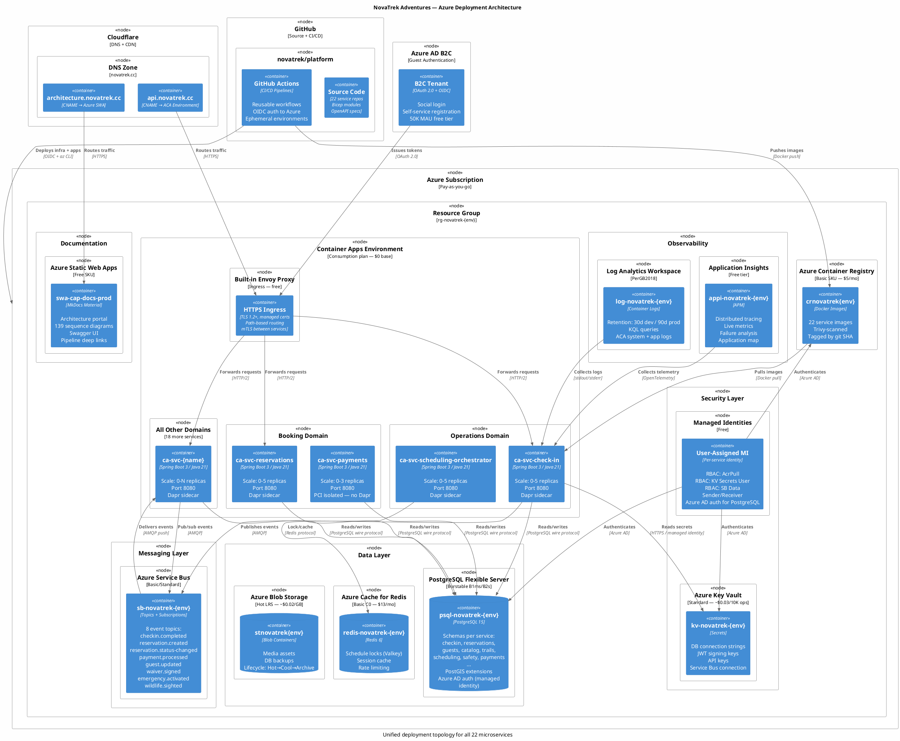

# NovaTrek Adventures — Azure Implementation Plan

> **Goal**: Build out the entire NovaTrek Adventures microservices platform in Azure, as documented in the [architecture portal](https://architecture.novatrek.cc), using the cheapest possible approach with full IaC, ephemeral environments, and deep linking from every architecture artifact to its live implementation.

**Date**: 2026-03-10
**Status**: Draft

---

## Table of Contents

1. [Logical Deployment Diagram](#logical-deployment-diagram)
2. [Guiding Principles](#guiding-principles)
3. [Cost Strategy — Zero When Idle](#cost-strategy--zero-when-idle)
4. [Azure Service Selection](#azure-service-selection)
5. [Environment Strategy](#environment-strategy)
6. [Infrastructure as Code — Bicep Architecture](#infrastructure-as-code--bicep-architecture)
7. [Configuration Management](#configuration-management)
8. [CI/CD Pipeline Architecture](#cicd-pipeline-architecture)
9. [Infrastructure Pipelines](#infrastructure-pipelines)
10. [Incremental Delivery Plan](#incremental-delivery-plan)
11. [Pipeline Deep Linking in the Architecture Portal](#pipeline-deep-linking-in-the-architecture-portal)
12. [Observability and Diagnostics](#observability-and-diagnostics)
13. [Security Baseline](#security-baseline)
14. [Disaster Recovery and Backup](#disaster-recovery-and-backup)
15. [Best Practices Checklist](#best-practices-checklist)
16. [Cost Projections](#cost-projections)
17. [Appendix: Quick Reference Commands](#appendix-quick-reference-commands)

---

## 1. Logical Deployment Diagram

This diagram shows the single, unified Azure deployment topology that applies to **every microservice** in the NovaTrek platform. All 22 services follow this exact same pattern — no special snowflakes.



### What This Diagram Shows

| Layer | Azure Service | Purpose | Cost When Idle |
|-------|--------------|---------|----------------|
| **DNS + CDN** | Cloudflare | Domain routing, DDoS protection | $0 |
| **Compute** | Azure Container Apps (Consumption) | All 22 microservices, scale-to-zero | $0 |
| **Ingress** | Built-in Envoy (ACA) | HTTPS termination, path routing, mTLS | $0 |
| **Database** | PostgreSQL Flexible Server | All service schemas colocated (dev) or split (prod) | $12.41/mo (B1ms) |
| **Cache** | Azure Cache for Redis | Schedule locks, session cache | $13.14/mo (C0) |
| **Messaging** | Azure Service Bus | 8 event topics (AsyncAPI-defined) | $0.05/100K ops |
| **Secrets** | Azure Key Vault | Connection strings, JWT keys, API keys | ~$0 |
| **Identity** | Managed Identities + Azure AD B2C | Zero-password auth everywhere | $0 |
| **Storage** | Azure Blob Storage | Media, backups | ~$0.02/GB |
| **Observability** | Log Analytics + Application Insights | Logs, traces, metrics, dashboards | ~$2/GB ingested |
| **Docs** | Azure Static Web Apps | Architecture portal with pipeline links | $0 (Free SKU) |
| **CI/CD** | GitHub Actions | Build, test, scan, deploy | Free tier (2000 min/mo) |
| **Registry** | Azure Container Registry | Docker image storage + scanning | $5/mo (Basic) |

### Key Design Decisions Visible in the Diagram

1. **Single ACA Environment** — all services share one Container Apps Environment (one Envoy, one Log Analytics sink). No per-service infrastructure overhead.
2. **Schema-per-service, not server-per-service** — in dev, all schemas live in one PostgreSQL instance. In prod, critical services (check-in, reservations, payments) get dedicated instances.
3. **Managed Identity everywhere** — the arrows from MI to Key Vault, PostgreSQL, ACR, and Service Bus are all Azure AD-authenticated. Zero passwords.
4. **PCI isolation** — svc-payments runs without a Dapr sidecar and uses a dedicated schema with immutable audit trail.
5. **Event-driven via Service Bus** — the 8 AsyncAPI-defined events flow through Service Bus topics. Producers publish, consumers subscribe. Dead-letter queues handle failures.
6. **GitHub OIDC** — GitHub Actions authenticates to Azure via Workload Identity Federation. No service principal secrets stored in GitHub.

---

## 2. Guiding Principles

| Principle | Rationale |
|-----------|-----------|
| **Pay nothing when idle** | Every workload must be spinnable to zero replicas or pausable when not in use |
| **Bicep-only IaC** | No portal clicks, no imperative scripts — every resource is declared in Bicep and versioned in Git |
| **One command to stand up, one to tear down** | Any environment (dev, staging, ephemeral) must be deployable/destroyable in a single `az deployment` call |
| **Incremental delivery** | Ship one microservice at a time — each increment is independently deployable and testable |
| **Architecture site is the control plane** | Every microservice page, event page, and capability page links to its CI pipeline, CD pipeline, infrastructure module, and live endpoint |
| **Branch-per-environment** | Feature branches get their own isolated ephemeral environment; merge to `main` promotes to production |
| **Secure by default** | Managed identities everywhere, no connection strings in code, Key Vault for all secrets |

---

## 3. Cost Strategy — Zero When Idle

### Why Azure Container Apps (ACA) Over AKS

| Factor | Azure Container Apps | AKS |
|--------|---------------------|-----|
| **Idle cost** | **$0** — scale to zero natively | ~$70/mo minimum (system node pool always on) |
| **Managed control plane** | Included (free) | $0.10/hr ($73/mo) per cluster |
| **Minimum commitment** | None — pay per vCPU-second and GiB-second | 1 node always running |
| **Built-in Dapr** | Yes — sidecar injection with zero config | Manual Helm install |
| **Built-in KEDA** | Yes — autoscale triggers included | Manual install |
| **Ingress** | Built-in Envoy (free) | Requires NGINX/App Gateway ($$$) |
| **TLS certificates** | Free managed certs | cert-manager + Let's Encrypt (manual) |
| **Verdict** | **Use this** for NovaTrek | Overkill for PoC/startup phase |

### Scale-to-Zero Configuration

Every Container App is configured with:

```bicep
properties: {
  configuration: {
    activeRevisionsMode: 'Single'
    ingress: {
      external: true
      targetPort: 8080
      transport: 'auto'
    }
  }
  template: {
    scale: {
      minReplicas: 0   // <-- CRITICAL: zero when idle
      maxReplicas: 3    // burst capacity
      rules: [
        {
          name: 'http-scaling'
          http: {
            metadata: {
              concurrentRequests: '50'
            }
          }
        }
      ]
    }
  }
}
```

**Result**: If no HTTP traffic arrives for ~5 minutes, the container scales to 0 replicas. You pay $0. First request cold-starts in ~2-5 seconds.

### Database Cost Control

| Strategy | Implementation |
|----------|---------------|
| **Azure Database for PostgreSQL — Flexible Server** | Burstable B1ms ($12.41/mo) — cheapest tier that supports extensions |
| **Auto-pause** (dev/ephemeral only) | Not natively supported — use scheduled `az postgres flexible-server stop/start` in GitHub Actions |
| **Single server for dev** | All 22 microservice schemas colocated in one Flexible Server instance (separate schemas, not separate servers) |
| **Separate servers for prod** | Critical services get dedicated instances; low-traffic services share |

### Full Teardown for Non-Production

```bash
# Destroy an entire ephemeral environment in one command
az group delete --name rg-novatrek-pr-${PR_NUMBER} --yes --no-wait

# Stop dev databases on Friday evening
az postgres flexible-server stop --resource-group rg-novatrek-dev --name psql-novatrek-dev

# Start dev databases on Monday morning
az postgres flexible-server start --resource-group rg-novatrek-dev --name psql-novatrek-dev
```

---

## 4. Azure Service Selection

### Compute and Networking

| Component | Azure Service | SKU/Tier | Monthly Cost (Idle) | Why |
|-----------|--------------|----------|--------------------|----|
| **Microservices** (22) | Azure Container Apps | Consumption | **$0** (scale to zero) | Cheapest serverless containers, native Dapr/KEDA |
| **Container App Environment** | ACA Environment | Consumption | **$0** (no minimum) | Shared Envoy ingress, Log Analytics |
| **Container Registry** | Azure Container Registry | Basic | **$5/mo** | Store Docker images, vulnerability scanning |
| **API Gateway** | Azure Container Apps built-in ingress | Included | **$0** | Path-based routing, mTLS, rate limiting |
| **DNS** | Cloudflare (existing) | Free | **$0** | Already configured for novatrek.cc |
| **TLS** | ACA managed certificates | Free | **$0** | Auto-provisioned per custom domain |
| **Architecture Portal** | Azure Static Web Apps | Free | **$0** | Already deployed |

### Data Layer

| Component | Azure Service | SKU/Tier | Monthly Cost | Why |
|-----------|--------------|----------|-------------|----|
| **Primary Database** (shared dev) | Azure Database for PostgreSQL — Flexible Server | Burstable B1ms (1 vCore, 2 GiB) | **$12.41/mo** | PostGIS extension, all schemas colocated |
| **Primary Database** (prod, critical) | PostgreSQL Flexible Server | Burstable B2s (2 vCore, 4 GiB) | **$49.64/mo** | svc-check-in, svc-reservations, svc-payments |
| **Primary Database** (prod, standard) | PostgreSQL Flexible Server (shared) | Burstable B1ms | **$12.41/mo** | All other services share |
| **Cache** (svc-scheduling-orchestrator) | Azure Cache for Redis | Basic C0 (250 MB) | **$13.14/mo** | Schedule lock cache (Valkey-compatible) |
| **Cache** (prod, if needed) | Azure Cache for Redis | Basic C1 (1 GB) | **$40.15/mo** | Larger cache for production loads |
| **Storage** (media, backups) | Azure Blob Storage | Hot LRS | **~$0.02/GB/mo** | svc-media-gallery assets, DB backups |

### Messaging

| Component | Azure Service | SKU/Tier | Monthly Cost | Why |
|-----------|--------------|----------|-------------|----|
| **Event Bus** | Azure Service Bus | Basic | **$0.05/100K operations** | AsyncAPI events (7 event types), queues + topics |
| **Event Bus** (prod) | Azure Service Bus | Standard | **$10/mo + usage** | Topics/subscriptions, dead-letter, sessions |

### Identity and Security

| Component | Azure Service | SKU/Tier | Monthly Cost | Why |
|-----------|--------------|----------|-------------|----|
| **Secrets** | Azure Key Vault | Standard | **$0.03/10K operations** | Connection strings, JWT secrets, API keys |
| **Identity** | Managed Identities | Free | **$0** | No credentials in code — pod identity for all services |
| **Auth** (guest-facing) | Azure AD B2C | Free tier (50K MAU) | **$0** | Guest authentication, social login |

### Estimated Monthly Costs

| Environment | Estimated Monthly Cost |
|-------------|----------------------|
| **Development** (everything idle except DB) | **~$25-30** |
| **Production** (low traffic, scale-to-zero) | **~$80-120** |
| **Ephemeral** (PR environment, <24h lifespan) | **~$0.50-2.00** per PR |
| **Everything stopped** (databases paused, zero traffic) | **~$5** (ACR only) |

---

## 5. Environment Strategy

### Environment Types

| Environment | Resource Group | Purpose | Lifecycle | Databases |
|-------------|---------------|---------|-----------|-----------|
| **Production** | `rg-novatrek-prod` | Live workloads | Permanent | Dedicated + shared PostgreSQL |
| **Development** | `rg-novatrek-dev` | Integration testing, daily development | Permanent (stoppable) | Single shared PostgreSQL |
| **Ephemeral** | `rg-novatrek-pr-{number}` | PR-based preview environments | Created on PR open, destroyed on merge/close | In-memory or shared dev DB |
| **Load Test** | `rg-novatrek-loadtest` | Performance validation | Created on-demand, destroyed after test | Mirrors prod topology |

### Ephemeral Environment Lifecycle

```
PR Opened → GitHub Actions
  ├── az group create rg-novatrek-pr-{number}
  ├── az deployment group create (Bicep: full stack)
  ├── Run database migrations (Flyway)
  ├── Deploy affected services
  ├── Post PR comment with live URLs
  └── Run smoke tests

PR Merged/Closed → GitHub Actions
  ├── az group delete rg-novatrek-pr-{number} --yes --no-wait
  └── Clean up ACR images tagged with PR number
```

**Cost**: Resource group deletion is instant and recursive — removes all resources. No orphaned resources, no lingering charges.

### Environment Parity

All environments use the same Bicep modules with different parameter files:

```
infra/
├── main.bicep                          # Root orchestrator
├── modules/
│   ├── container-apps-env.bicep        # ACA environment + Log Analytics
│   ├── container-app.bicep             # Generic microservice template
│   ├── postgresql.bicep                # PostgreSQL Flexible Server
│   ├── service-bus.bicep               # Azure Service Bus
│   ├── redis.bicep                     # Azure Cache for Redis
│   ├── key-vault.bicep                 # Azure Key Vault
│   ├── container-registry.bicep        # Azure Container Registry
│   ├── storage-account.bicep           # Blob storage
│   ├── static-web-app.bicep            # SWA (portal)
│   └── monitoring.bicep                # Log Analytics + Application Insights
├── parameters/
│   ├── prod.bicepparam                 # Production parameters
│   ├── dev.bicepparam                  # Development parameters
│   └── ephemeral.bicepparam            # Ephemeral (PR) parameters
├── environments/
│   ├── prod.env.bicep                  # Prod-specific composition
│   ├── dev.env.bicep                   # Dev-specific composition
│   └── ephemeral.env.bicep             # Ephemeral composition (minimal)
└── deploy.sh                           # One-command deploy/teardown
```

---

## 6. Infrastructure as Code — Bicep Architecture

### Bicep Best Practices

#### Module Composition Pattern

Each Azure resource type has its own reusable module. The root `main.bicep` composes them:

```bicep
// main.bicep — composes all modules for a given environment
targetScope = 'resourceGroup'

@description('Environment identifier')
@allowed(['prod', 'dev', 'ephemeral'])
param environment string

@description('Azure region')
param location string = resourceGroup().location

@description('Services to deploy (incremental delivery)')
param servicesToDeploy array = []

// ---------------------------------------------------------------------------
// Shared Infrastructure
// ---------------------------------------------------------------------------

module acr 'modules/container-registry.bicep' = {
  name: 'deploy-acr'
  params: {
    name: 'crnovatrek${environment}'
    location: location
    sku: environment == 'prod' ? 'Basic' : 'Basic'
  }
}

module acaEnv 'modules/container-apps-env.bicep' = {
  name: 'deploy-aca-env'
  params: {
    name: 'cae-novatrek-${environment}'
    location: location
    logRetentionDays: environment == 'prod' ? 90 : 30
  }
}

module keyVault 'modules/key-vault.bicep' = {
  name: 'deploy-kv'
  params: {
    name: 'kv-novatrek-${environment}'
    location: location
  }
}

module postgresql 'modules/postgresql.bicep' = {
  name: 'deploy-psql'
  params: {
    name: 'psql-novatrek-${environment}'
    location: location
    skuName: environment == 'prod' ? 'Standard_B2s' : 'Standard_B1ms'
    storageSizeGB: environment == 'prod' ? 64 : 32
    databases: [for svc in servicesToDeploy: svc]
  }
}

module serviceBus 'modules/service-bus.bicep' = {
  name: 'deploy-sb'
  params: {
    name: 'sb-novatrek-${environment}'
    location: location
    sku: environment == 'prod' ? 'Standard' : 'Basic'
    topics: [
      'novatrek.operations.checkin.completed'
      'novatrek.booking.reservation.created'
      'novatrek.booking.reservation.status-changed'
      'novatrek.support.payment.processed'
      'novatrek.identity.guest.updated'
      'novatrek.safety.waiver.signed'
      'novatrek.safety.emergency.activated'
      'novatrek.operations.wildlife.sighted'
    ]
  }
}

// ---------------------------------------------------------------------------
// Microservices (conditionally deployed based on servicesToDeploy)
// ---------------------------------------------------------------------------

module services 'modules/container-app.bicep' = [for svc in servicesToDeploy: {
  name: 'deploy-${svc}'
  params: {
    name: svc
    location: location
    environmentId: acaEnv.outputs.environmentId
    registryServer: acr.outputs.loginServer
    image: '${acr.outputs.loginServer}/${svc}:latest'
    minReplicas: 0
    maxReplicas: environment == 'prod' ? 5 : 2
    env: [
      { name: 'SPRING_PROFILES_ACTIVE', value: environment }
      { name: 'DATABASE_HOST', secretRef: 'db-host' }
      { name: 'DATABASE_NAME', value: replace(svc, '-', '_') }
      { name: 'SERVICE_BUS_CONNECTION', secretRef: 'sb-connection' }
    ]
    keyVaultName: keyVault.outputs.name
    targetPort: 8080
  }
}]
```

#### Module Design Rules

| Rule | Example |
|------|---------|
| Every module takes `name`, `location`, and `tags` | Consistent resource naming |
| Outputs expose only what consumers need | `output id string = resource.id` not entire resource |
| Use `@secure()` for all secrets | Never embed secrets in parameter files |
| Use `existing` keyword for cross-module references | `resource kv 'Microsoft.KeyVault/vaults@...' existing = { name: kvName }` |
| Tag everything with `environment`, `service`, `managedBy: 'bicep'` | Cost allocation, automation detection |
| Use `uniqueString(resourceGroup().id)` for globally unique names | ACR, Key Vault, Storage Account |

#### Naming Conventions

| Resource Type | Pattern | Example |
|---------------|---------|---------|
| Resource Group | `rg-novatrek-{env}` | `rg-novatrek-prod` |
| Container Apps Env | `cae-novatrek-{env}` | `cae-novatrek-dev` |
| Container App | `ca-{service-name}` | `ca-svc-check-in` |
| PostgreSQL | `psql-novatrek-{env}` | `psql-novatrek-prod` |
| Redis | `redis-novatrek-{env}` | `redis-novatrek-dev` |
| Key Vault | `kv-novatrek-{env}` | `kv-novatrek-prod` |
| Container Registry | `crnovatrek{env}` | `crnovatrekprod` |
| Service Bus | `sb-novatrek-{env}` | `sb-novatrek-prod` |
| Storage Account | `stnovatrek{env}` | `stnovatrekprod` |
| Static Web App | `swa-cap-{purpose}-{env}` | `swa-cap-docs-prod` |
| Log Analytics | `log-novatrek-{env}` | `log-novatrek-prod` |
| App Insights | `appi-novatrek-{env}` | `appi-novatrek-prod` |

#### What-If Previews (Mandatory Before Deploy)

Every infrastructure deployment MUST run `what-if` first:

```bash
az deployment group what-if \
  --resource-group rg-novatrek-${ENV} \
  --template-file infra/main.bicep \
  --parameters infra/parameters/${ENV}.bicepparam
```

This shows exactly what will be created, modified, or deleted — no surprises.

---

## 7. Configuration Management

### Configuration Hierarchy

```
Configuration Sources (highest priority wins):
  1. Azure Key Vault secrets        ← connection strings, JWT secrets, API keys
  2. Container App environment vars ← injected by Bicep at deploy time
  3. Spring Boot application-{env}.yaml ← environment-specific config
  4. Spring Boot application.yaml   ← shared defaults
  5. Architecture metadata YAML     ← adventure categories, capability mappings
```

### Key Vault Integration Pattern

No connection strings or secrets in code, config files, or environment variables:

```bicep
// Container App references Key Vault secrets via managed identity
module svcCheckIn 'modules/container-app.bicep' = {
  params: {
    secrets: [
      {
        name: 'db-host'
        keyVaultUrl: '${keyVault.outputs.vaultUri}secrets/psql-host'
        identity: managedIdentity.outputs.id
      }
      {
        name: 'sb-connection'
        keyVaultUrl: '${keyVault.outputs.vaultUri}secrets/sb-connection-string'
        identity: managedIdentity.outputs.id
      }
    ]
  }
}
```

### Spring Boot Profile Strategy

```yaml
# application.yaml — shared defaults
spring:
  application:
    name: svc-check-in
  datasource:
    driver-class-name: org.postgresql.Driver
  jpa:
    hibernate:
      ddl-auto: validate  # Never auto-create in any environment
    properties:
      hibernate:
        default_schema: checkin

---
# application-dev.yaml
spring:
  config:
    activate:
      on-profile: dev
  datasource:
    url: jdbc:postgresql://${DATABASE_HOST}:5432/novatrek_dev
    
logging:
  level:
    com.novatrek: DEBUG

---
# application-prod.yaml
spring:
  config:
    activate:
      on-profile: prod
  datasource:
    url: jdbc:postgresql://${DATABASE_HOST}:5432/novatrek_prod
    hikari:
      maximum-pool-size: 20
      minimum-idle: 5

logging:
  level:
    com.novatrek: INFO
```

### Configuration-Driven Adventure Classification (ADR-004)

Adventure category → check-in pattern mapping lives in YAML, not code:

```yaml
# config/adventure-classification.yaml (deployed as ConfigMap)
adventure_categories:
  hiking_easy:
    pattern: 1  # Basic self-check-in
    safety_level: low
  rock_climbing:
    pattern: 3  # Full Service
    safety_level: high
  # Unknown categories default to Pattern 3 (ADR-005)
  _default:
    pattern: 3
    safety_level: high
```

### Environment-Specific Overrides

| Setting | Dev | Prod | Ephemeral |
|---------|-----|------|-----------|
| `minReplicas` | 0 | 0 (cost savings) or 1 (critical services) | 0 |
| `maxReplicas` | 2 | 5 | 1 |
| DB connection pool (min/max) | 2/10 | 5/40 | 1/5 |
| Log retention | 30 days | 90 days | 7 days |
| DB backup | None | Continuous WAL + daily | None |
| Redis | Shared dev instance | Dedicated per service group | Skip (in-memory) |
| Service Bus | Basic tier | Standard tier | Basic tier |

---

## 8. CI/CD Pipeline Architecture

### Pipeline Types

```
.github/workflows/
├── infra-deploy.yml              # Infrastructure pipeline (Bicep)
├── infra-teardown.yml            # Environment teardown (manual trigger)
├── service-ci.yml                # Reusable CI workflow (build, test, scan)
├── service-cd.yml                # Reusable CD workflow (deploy to ACA)
├── service-{name}.yml            # Per-service orchestrator (calls CI + CD)
├── ephemeral-env.yml             # PR-based ephemeral environments
├── db-migrate.yml                # Database migration pipeline (Flyway)
├── docs-deploy.yml               # Architecture portal deploy (existing)
├── validate-solution.yml         # Solution design validation (existing)
├── nightly-stop-dev.yml          # Cost control: stop dev databases at night
├── nightly-start-dev.yml         # Cost control: start dev databases in morning
└── load-test.yml                 # On-demand load testing
```

### Reusable CI Workflow (service-ci.yml)

```yaml
# .github/workflows/service-ci.yml — called by each per-service workflow
name: "Service CI (Reusable)"

on:
  workflow_call:
    inputs:
      service-name:
        required: true
        type: string
      java-version:
        required: false
        type: string
        default: '21'
    outputs:
      image-tag:
        description: "Docker image tag"
        value: ${{ jobs.build.outputs.image-tag }}

jobs:
  build:
    runs-on: ubuntu-latest
    outputs:
      image-tag: ${{ steps.meta.outputs.tags }}
    steps:
      - uses: actions/checkout@v4

      - name: Set up Java
        uses: actions/setup-java@v4
        with:
          distribution: 'temurin'
          java-version: ${{ inputs.java-version }}
          cache: 'gradle'

      - name: Build and test
        working-directory: services/${{ inputs.service-name }}
        run: ./gradlew build test

      - name: Run OWASP dependency check
        working-directory: services/${{ inputs.service-name }}
        run: ./gradlew dependencyCheckAnalyze

      - name: Build Docker image
        id: meta
        run: |
          TAG="${{ github.sha }}"
          IMAGE="${{ secrets.ACR_LOGIN_SERVER }}/${{ inputs.service-name }}:${TAG}"
          docker build -t ${IMAGE} services/${{ inputs.service-name }}
          echo "tags=${IMAGE}" >> $GITHUB_OUTPUT

      - name: Push to ACR
        run: |
          az acr login --name ${{ secrets.ACR_NAME }}
          docker push ${{ steps.meta.outputs.tags }}

      - name: Run Trivy vulnerability scan
        uses: aquasecurity/trivy-action@master
        with:
          image-ref: ${{ steps.meta.outputs.tags }}
          exit-code: '1'
          severity: 'CRITICAL,HIGH'
```

### Reusable CD Workflow (service-cd.yml)

```yaml
# .github/workflows/service-cd.yml — deploy a service to Azure Container Apps
name: "Service CD (Reusable)"

on:
  workflow_call:
    inputs:
      service-name:
        required: true
        type: string
      environment:
        required: true
        type: string
      image-tag:
        required: true
        type: string

jobs:
  deploy:
    runs-on: ubuntu-latest
    environment: ${{ inputs.environment }}
    steps:
      - uses: actions/checkout@v4

      - name: Azure Login
        uses: azure/login@v2
        with:
          creds: ${{ secrets.AZURE_CREDENTIALS }}

      - name: Deploy to Container Apps
        run: |
          az containerapp update \
            --name ca-${{ inputs.service-name }} \
            --resource-group rg-novatrek-${{ inputs.environment }} \
            --image ${{ inputs.image-tag }} \
            --set-env-vars "SPRING_PROFILES_ACTIVE=${{ inputs.environment }}"

      - name: Verify deployment health
        run: |
          FQDN=$(az containerapp show \
            --name ca-${{ inputs.service-name }} \
            --resource-group rg-novatrek-${{ inputs.environment }} \
            --query "properties.configuration.ingress.fqdn" -o tsv)
          
          for i in {1..30}; do
            STATUS=$(curl -s -o /dev/null -w "%{http_code}" "https://${FQDN}/actuator/health" || true)
            if [ "$STATUS" = "200" ]; then
              echo "Service healthy"
              exit 0
            fi
            echo "Waiting for health check... (attempt $i/30)"
            sleep 10
          done
          echo "Health check failed after 5 minutes"
          exit 1
```

### Per-Service Orchestrator Example

```yaml
# .github/workflows/service-svc-check-in.yml
name: "svc-check-in"

on:
  push:
    branches: [main]
    paths:
      - 'services/svc-check-in/**'
      - 'config/adventure-classification.yaml'
  pull_request:
    paths:
      - 'services/svc-check-in/**'

jobs:
  ci:
    uses: ./.github/workflows/service-ci.yml
    with:
      service-name: svc-check-in
    secrets: inherit

  cd-dev:
    needs: ci
    if: github.ref == 'refs/heads/main'
    uses: ./.github/workflows/service-cd.yml
    with:
      service-name: svc-check-in
      environment: dev
      image-tag: ${{ needs.ci.outputs.image-tag }}
    secrets: inherit

  cd-prod:
    needs: cd-dev
    if: github.ref == 'refs/heads/main'
    uses: ./.github/workflows/service-cd.yml
    with:
      service-name: svc-check-in
      environment: prod
      image-tag: ${{ needs.ci.outputs.image-tag }}
    secrets: inherit
```

### Database Migration Pipeline

```yaml
# .github/workflows/db-migrate.yml
name: "Database Migrations (Flyway)"

on:
  workflow_call:
    inputs:
      service-name:
        required: true
        type: string
      environment:
        required: true
        type: string

jobs:
  migrate:
    runs-on: ubuntu-latest
    environment: ${{ inputs.environment }}
    steps:
      - uses: actions/checkout@v4

      - name: Run Flyway migrations
        uses: flyway/flyway-action@master
        with:
          url: jdbc:postgresql://${{ secrets.DB_HOST }}:5432/${{ secrets.DB_NAME }}
          user: ${{ secrets.DB_USER }}
          password: ${{ secrets.DB_PASSWORD }}
          locations: filesystem:services/${{ inputs.service-name }}/src/main/resources/db/migration
```

### Cost Control Pipelines

```yaml
# .github/workflows/nightly-stop-dev.yml — Stop dev resources at 8 PM UTC
name: "Nightly Stop Dev"

on:
  schedule:
    - cron: '0 20 * * 1-5'  # 8 PM UTC weekdays
  workflow_dispatch:         # Manual trigger

jobs:
  stop:
    runs-on: ubuntu-latest
    steps:
      - name: Azure Login
        uses: azure/login@v2
        with:
          creds: ${{ secrets.AZURE_CREDENTIALS }}

      - name: Stop PostgreSQL
        run: |
          az postgres flexible-server stop \
            --resource-group rg-novatrek-dev \
            --name psql-novatrek-dev

      - name: Scale services to zero
        run: |
          for APP in $(az containerapp list -g rg-novatrek-dev --query "[].name" -o tsv); do
            az containerapp update -n $APP -g rg-novatrek-dev \
              --min-replicas 0 --max-replicas 0
          done
```

```yaml
# .github/workflows/nightly-start-dev.yml — Start dev resources at 7 AM UTC
name: "Nightly Start Dev"

on:
  schedule:
    - cron: '0 13 * * 1-5'  # 1 PM UTC = 8 AM EST weekdays
  workflow_dispatch:

jobs:
  start:
    runs-on: ubuntu-latest
    steps:
      - name: Azure Login
        uses: azure/login@v2
        with:
          creds: ${{ secrets.AZURE_CREDENTIALS }}

      - name: Start PostgreSQL
        run: |
          az postgres flexible-server start \
            --resource-group rg-novatrek-dev \
            --name psql-novatrek-dev

      - name: Restore service scaling
        run: |
          for APP in $(az containerapp list -g rg-novatrek-dev --query "[].name" -o tsv); do
            az containerapp update -n $APP -g rg-novatrek-dev \
              --min-replicas 0 --max-replicas 2
          done
```

---

## 9. Infrastructure Pipelines

### Infrastructure Deployment Pipeline

```yaml
# .github/workflows/infra-deploy.yml
name: "Infrastructure Deploy"

on:
  push:
    branches: [main]
    paths:
      - 'infra/**'
  pull_request:
    paths:
      - 'infra/**'
  workflow_dispatch:
    inputs:
      environment:
        description: 'Target environment'
        required: true
        type: choice
        options: [dev, prod]

jobs:
  validate:
    runs-on: ubuntu-latest
    steps:
      - uses: actions/checkout@v4

      - name: Azure Login
        uses: azure/login@v2
        with:
          creds: ${{ secrets.AZURE_CREDENTIALS }}

      - name: Lint Bicep
        run: az bicep build --file infra/main.bicep --stdout > /dev/null

      - name: What-If Preview
        run: |
          ENV=${{ inputs.environment || 'dev' }}
          az deployment group what-if \
            --resource-group rg-novatrek-${ENV} \
            --template-file infra/main.bicep \
            --parameters infra/parameters/${ENV}.bicepparam

  deploy:
    needs: validate
    if: github.ref == 'refs/heads/main' || github.event_name == 'workflow_dispatch'
    runs-on: ubuntu-latest
    environment: ${{ inputs.environment || 'dev' }}
    steps:
      - uses: actions/checkout@v4

      - name: Azure Login
        uses: azure/login@v2
        with:
          creds: ${{ secrets.AZURE_CREDENTIALS }}

      - name: Deploy Infrastructure
        run: |
          ENV=${{ inputs.environment || 'dev' }}
          az deployment group create \
            --resource-group rg-novatrek-${ENV} \
            --template-file infra/main.bicep \
            --parameters infra/parameters/${ENV}.bicepparam \
            --name "deploy-$(date +%Y%m%d-%H%M%S)"
```

### Ephemeral Environment Pipeline

```yaml
# .github/workflows/ephemeral-env.yml
name: "Ephemeral Environment"

on:
  pull_request:
    types: [opened, synchronize, reopened, closed]
    paths:
      - 'services/**'
      - 'infra/**'

jobs:
  deploy-ephemeral:
    if: github.event.action != 'closed'
    runs-on: ubuntu-latest
    steps:
      - uses: actions/checkout@v4

      - name: Azure Login
        uses: azure/login@v2
        with:
          creds: ${{ secrets.AZURE_CREDENTIALS }}

      - name: Create ephemeral resource group
        run: |
          az group create \
            --name rg-novatrek-pr-${{ github.event.pull_request.number }} \
            --location eastus2 \
            --tags "pr=${{ github.event.pull_request.number }}" "ephemeral=true"

      - name: Deploy minimal infrastructure
        run: |
          az deployment group create \
            --resource-group rg-novatrek-pr-${{ github.event.pull_request.number }} \
            --template-file infra/main.bicep \
            --parameters infra/parameters/ephemeral.bicepparam \
            --parameters environment=pr-${{ github.event.pull_request.number }}

      - name: Post PR comment with URLs
        uses: actions/github-script@v7
        with:
          script: |
            const prNum = context.payload.pull_request.number;
            const body = `## Ephemeral Environment Deployed
            
            | Service | URL |
            |---------|-----|
            | API Gateway | \`https://cae-novatrek-pr-${prNum}.eastus2.azurecontainerapps.io\` |
            | Portal | PR staging via Azure Static Web Apps |
            
            This environment will be automatically destroyed when this PR is closed.`;
            
            github.rest.issues.createComment({
              ...context.repo,
              issue_number: prNum,
              body
            });

  teardown-ephemeral:
    if: github.event.action == 'closed'
    runs-on: ubuntu-latest
    steps:
      - name: Azure Login
        uses: azure/login@v2
        with:
          creds: ${{ secrets.AZURE_CREDENTIALS }}

      - name: Destroy ephemeral environment
        run: |
          az group delete \
            --name rg-novatrek-pr-${{ github.event.pull_request.number }} \
            --yes --no-wait
```

### Infrastructure Teardown Pipeline (Manual)

```yaml
# .github/workflows/infra-teardown.yml
name: "Infrastructure Teardown"

on:
  workflow_dispatch:
    inputs:
      environment:
        description: 'Environment to tear down'
        required: true
        type: choice
        options: [dev, ephemeral-all]
      confirmation:
        description: 'Type DESTROY to confirm'
        required: true
        type: string

jobs:
  teardown:
    if: inputs.confirmation == 'DESTROY'
    runs-on: ubuntu-latest
    steps:
      - name: Azure Login
        uses: azure/login@v2
        with:
          creds: ${{ secrets.AZURE_CREDENTIALS }}

      - name: Teardown dev
        if: inputs.environment == 'dev'
        run: az group delete --name rg-novatrek-dev --yes --no-wait

      - name: Teardown all ephemeral
        if: inputs.environment == 'ephemeral-all'
        run: |
          for RG in $(az group list --query "[?tags.ephemeral=='true'].name" -o tsv); do
            echo "Deleting $RG..."
            az group delete --name $RG --yes --no-wait
          done
```

---

## 10. Incremental Delivery Plan

### Delivery Waves

Each wave is a self-contained deployable increment. Services within a wave can be delivered in any order, but wave dependencies must be respected.

#### Wave 0 — Foundation (Prerequisites)

**Scope**: Shared infrastructure only — no microservices yet.

| Deliverable | Bicep Module | Pipeline |
|-------------|-------------|----------|
| Resource Groups (prod, dev) | `deploy.sh` | `infra-deploy.yml` |
| Container Apps Environment | `modules/container-apps-env.bicep` | `infra-deploy.yml` |
| Container Registry | `modules/container-registry.bicep` | `infra-deploy.yml` |
| PostgreSQL Flexible Server | `modules/postgresql.bicep` | `infra-deploy.yml` |
| Key Vault | `modules/key-vault.bicep` | `infra-deploy.yml` |
| Log Analytics + App Insights | `modules/monitoring.bicep` | `infra-deploy.yml` |
| Azure Service Bus | `modules/service-bus.bicep` | `infra-deploy.yml` |
| CI/CD reusable workflows | `service-ci.yml`, `service-cd.yml` | Committed to main |
| Nightly start/stop pipelines | `nightly-stop-dev.yml`, `nightly-start-dev.yml` | Committed to main |
| Ephemeral environment pipeline | `ephemeral-env.yml` | Committed to main |
| Database migration pipeline | `db-migrate.yml` | Committed to main |

**Done when**: `az containerapp env show -n cae-novatrek-dev` returns successfully.

#### Wave 1 — Guest Identity and Product Catalog (Core Data)

These services have no upstream dependencies — they provide data to everything else.

| Service | Domain | Data Store | Key Endpoints | Event |
|---------|--------|-----------|---------------|-------|
| **svc-guest-profiles** | Guest Identity | PostgreSQL (`guests` schema, AES-256 PII encryption) | CRUD guests, certifications, medical info | GuestProfileUpdated |
| **svc-trip-catalog** | Product Catalog | PostgreSQL (`catalog` schema, full-text search) | CRUD trips, pricing, availability | — |
| **svc-trail-management** | Product Catalog | PostGIS (`trails` schema, spatial indexes) | CRUD trails, waypoints, condition reports | — |

**Validation**: Can browse adventure catalog and create guest profiles via Swagger UI.

#### Wave 2 — Booking and Payments (Transaction Core)

| Service | Domain | Data Store | Key Endpoints | Event |
|---------|--------|-----------|---------------|-------|
| **svc-reservations** | Booking | PostgreSQL (`reservations` schema, partitioned) | Create/modify/cancel bookings | ReservationCreated, ReservationStatusChanged |
| **svc-payments** | Support | PostgreSQL (`payments` schema, PCI scope, immutable audit) | Authorize, capture, refund | PaymentProcessed |
| **svc-notifications** | Support | — (stateless, calls external APIs) | Send email/SMS/push | — |

**Validation**: Can create a reservation, process payment, and receive confirmation notification.

#### Wave 3 — Day-of-Adventure Operations (Check-In Flow)

| Service | Domain | Data Store | Key Endpoints | Event |
|---------|--------|-----------|---------------|-------|
| **svc-check-in** | Operations | PostgreSQL (`checkin` schema, optimistic locking) | Check-in, wristband assignment, gear verification | CheckinCompleted |
| **svc-scheduling-orchestrator** | Operations | PostgreSQL + Valkey (`scheduling` schema) | Schedule creation, conflict resolution, guide assignment | — |
| **svc-gear-inventory** | Logistics | PostgreSQL | Equipment checkout, return, maintenance | — |
| **svc-safety-compliance** | Safety | PostgreSQL (`safety` schema, 7-year retention) | Waivers, incidents, inspections | WaiverSigned |

**Validation**: Complete end-to-end check-in flow — reservation lookup → waiver verification → gear assignment → wristband → confirmation.

#### Wave 4 — Guide and Transport Operations

| Service | Domain | Data Store | Key Endpoints | Event |
|---------|--------|-----------|---------------|-------|
| **svc-guide-management** | Guide Mgmt | PostgreSQL | Guide roster, certifications, availability | — |
| **svc-transport-logistics** | Logistics | PostgreSQL | Vehicle dispatch, route optimization | — |
| **svc-location-services** | Support | PostgreSQL + PostGIS | Geocoding, geofencing, capacity tracking | — |

**Validation**: Schedule a trip with guide assignment and transport logistics.

#### Wave 5 — Analytics, Loyalty, and Media

| Service | Domain | Data Store | Key Endpoints | Event |
|---------|--------|-----------|---------------|-------|
| **svc-analytics** | Support | PostgreSQL (read replicas) | Dashboards, operational reporting | — |
| **svc-loyalty-rewards** | Support | PostgreSQL | Member balance, tier management, rewards | — |
| **svc-media-gallery** | Support | PostgreSQL + Blob Storage | Photo/video upload, sharing | — |

**Validation**: View operational analytics dashboard; accrue and redeem loyalty points.

#### Wave 6 — External Integrations and Specialized Services

| Service | Domain | Data Store | Key Endpoints | Event |
|---------|--------|-----------|---------------|-------|
| **svc-partner-integrations** | External | PostgreSQL | OTA booking ingestion, channel sync | — |
| **svc-weather** | Support | PostgreSQL | Weather conditions, severe weather alerts | — |
| **svc-inventory-procurement** | Support | PostgreSQL | Purchase orders, vendor management | — |
| **svc-emergency-response** | Safety | PostgreSQL | Emergency protocols, rescue dispatch | EmergencyActivated |
| **svc-wildlife-tracking** | Safety | PostgreSQL | Wildlife monitoring, trail alerts | WildlifeSighting |

**Validation**: End-to-end partner booking flow; weather alerts triggering schedule adjustments.

#### Wave 7 — New Capabilities (Ticket-Driven)

| Service | Ticket | Status | Capability |
|---------|--------|--------|------------|
| **svc-reviews** | NTK-10008 | New | CAP-1.7: Guest reviews and ratings |
| **svc-adventure-tracking** | NTK-10006 | Planned | CAP-2.3: Real-time adventure tracking |
| **svc-referral-engine** | NTK-10007 | Planned | CAP-5.3: Loyalty referral program |
| **svc-campaign-management** | NTK-10007 | Planned | CAP-5.3: Marketing campaigns |

**Validation**: Per-ticket acceptance criteria from solution designs.

### Delivery Tracking

Each service progresses through these stages (tracked in `architecture/metadata/delivery-status.yaml`):

```yaml
# architecture/metadata/delivery-status.yaml
services:
  svc-check-in:
    wave: 3
    stages:
      bicep-module: completed     # infra/modules/container-app.bicep parameterized
      db-schema: completed        # Flyway migrations created
      ci-pipeline: completed      # .github/workflows/service-svc-check-in.yml
      cd-pipeline: completed      # Reusable CD workflow configured
      deployed-dev: completed     # Running in rg-novatrek-dev
      smoke-tested: completed     # Health check + basic API test passing
      deployed-prod: not-started  # Awaiting Wave 3 completion
    links:
      ci-pipeline: https://github.com/novatrek/platform/actions/workflows/service-svc-check-in.yml
      cd-pipeline: https://github.com/novatrek/platform/actions/workflows/service-cd.yml
      infra-module: infra/modules/container-app.bicep
      openapi-spec: architecture/specs/svc-check-in.yaml
      portal-page: https://architecture.novatrek.cc/microservices/svc-check-in/
```

---

## 11. Pipeline Deep Linking in the Architecture Portal

### Link Strategy

Every page in the architecture portal should provide one-click access to the relevant pipeline, code, and infrastructure. Links are organized by context:

#### Microservice Pages — Pipeline Links Section

Each of the 19 microservice pages (e.g., `portal/docs/microservices/svc-check-in.md`) gets a new **Pipelines and Infrastructure** section:

```markdown
## Pipelines and Infrastructure

| Resource | Link |
|----------|------|
| CI Pipeline | [Build & Test](https://github.com/{org}/{repo}/actions/workflows/service-svc-check-in.yml) |
| CD Pipeline (Dev) | [Deploy to Dev](https://github.com/{org}/{repo}/actions/workflows/service-cd.yml) |
| CD Pipeline (Prod) | [Deploy to Prod](https://github.com/{org}/{repo}/actions/workflows/service-cd.yml) |
| Infrastructure Module | [Bicep Module](https://github.com/{org}/{repo}/blob/main/infra/modules/container-app.bicep) |
| Database Migrations | [Flyway Scripts](https://github.com/{org}/{repo}/tree/main/services/svc-check-in/src/main/resources/db/migration) |
| Dockerfile | [Container Build](https://github.com/{org}/{repo}/blob/main/services/svc-check-in/Dockerfile) |
| OpenAPI Spec | [svc-check-in.yaml](https://architecture.novatrek.cc/specs/svc-check-in.yaml) |
| Swagger UI | [Try it out](https://architecture.novatrek.cc/services/api/svc-check-in/) |
| Source Code | [GitHub](https://github.com/{org}/{repo}/tree/main/services/svc-check-in) |
| Azure Portal | [Container App](https://portal.azure.com/#@/resource/subscriptions/{sub}/resourceGroups/rg-novatrek-prod/providers/Microsoft.App/containerApps/ca-svc-check-in) |
| Container Logs | [Log Analytics](https://portal.azure.com/#@/resource/subscriptions/{sub}/resourceGroups/rg-novatrek-prod/providers/Microsoft.OperationalInsights/workspaces/log-novatrek-prod/logs) |
```

#### Portal Home Page — Global Pipeline Links

The portal home page (`portal/docs/index.md`) gets an **Operations** section:

```markdown
## Operations

| Pipeline | Purpose | Link |
|----------|---------|------|
| Infrastructure Deploy | Provision/update Azure resources | [Run](https://github.com/{org}/{repo}/actions/workflows/infra-deploy.yml) |
| Infrastructure Teardown | Destroy non-prod environments | [Run](https://github.com/{org}/{repo}/actions/workflows/infra-teardown.yml) |
| Architecture Portal Deploy | Build and publish this site | [Run](https://github.com/{org}/{repo}/actions/workflows/docs-deploy.yml) |
| Nightly Stop Dev | Pause dev resources at night | [Run](https://github.com/{org}/{repo}/actions/workflows/nightly-stop-dev.yml) |
| Nightly Start Dev | Resume dev resources in morning | [Run](https://github.com/{org}/{repo}/actions/workflows/nightly-start-dev.yml) |
| Ephemeral Environments | PR-based preview environments | [View](https://github.com/{org}/{repo}/actions/workflows/ephemeral-env.yml) |
| Database Migrations | Run Flyway migrations | [Run](https://github.com/{org}/{repo}/actions/workflows/db-migrate.yml) |
| Solution Validation | Validate architecture solutions | [View](https://github.com/{org}/{repo}/actions/workflows/validate-solution.yml) |
| Confluence Drift Check | Monitor Confluence mirror | [View](https://github.com/{org}/{repo}/actions/workflows/confluence-drift-check.yml) |
```

#### Event Pages — Pipeline Links

Each event page in `portal/docs/events/` links to the producing and consuming services' pipelines:

```markdown
## Integration Pipelines

| Producer/Consumer | CI Pipeline | CD Pipeline |
|-------------------|-------------|-------------|
| **svc-check-in** (producer) | [Build](https://github.com/.../.../actions/workflows/service-svc-check-in.yml) | [Deploy](https://github.com/.../.../actions/workflows/service-cd.yml) |
| **svc-analytics** (consumer) | [Build](https://github.com/.../.../actions/workflows/service-svc-analytics.yml) | [Deploy](https://github.com/.../.../actions/workflows/service-cd.yml) |
| **svc-notifications** (consumer) | [Build](https://github.com/.../.../actions/workflows/service-svc-notifications.yml) | [Deploy](https://github.com/.../.../actions/workflows/service-cd.yml) |
```

#### Capability Pages — Delivery Status

Each capability page links to the services that implement it and their deployment status:

```markdown
## Delivery Status

| Service | Wave | CI | CD | Status |
|---------|------|----|----|--------|
| svc-check-in | 3 | [pipeline](link) | [pipeline](link) | Deployed to Dev |
| svc-guest-profiles | 1 | [pipeline](link) | [pipeline](link) | Deployed to Prod |
```

#### Solution Pages — Implementation Links

Each solution design page links to:
- The PR that implements it
- The services affected (with their CI/CD pipelines)
- The ADRs referenced
- The Bicep modules touched

#### Generator Enhancement

The `portal/scripts/generate-microservice-pages.py` script should be enhanced to automatically inject pipeline links based on a central registry:

```yaml
# architecture/metadata/pipeline-registry.yaml
repository:
  org: novatrek
  repo: platform
  base_url: https://github.com/novatrek/platform

pipelines:
  global:
    infra-deploy:
      workflow: infra-deploy.yml
      description: Provision/update Azure resources
    infra-teardown:
      workflow: infra-teardown.yml
      description: Destroy non-prod environments
    docs-deploy:
      workflow: docs-deploy.yml
      description: Build and publish architecture portal
    ephemeral-env:
      workflow: ephemeral-env.yml
      description: PR-based preview environments
    db-migrate:
      workflow: db-migrate.yml
      description: Database migrations (Flyway)
    nightly-stop-dev:
      workflow: nightly-stop-dev.yml
      description: Stop dev resources at night
    nightly-start-dev:
      workflow: nightly-start-dev.yml
      description: Start dev resources in morning

  per-service:
    ci-workflow-pattern: "service-{service-name}.yml"
    cd-workflow: "service-cd.yml"
    source-path-pattern: "services/{service-name}"
    dockerfile-pattern: "services/{service-name}/Dockerfile"
    migration-path-pattern: "services/{service-name}/src/main/resources/db/migration"
    infra-module: "infra/modules/container-app.bicep"

azure:
  subscription_id: "{subscription-id}"
  resource_groups:
    prod: rg-novatrek-prod
    dev: rg-novatrek-dev
  container_app_pattern: "ca-{service-name}"
  log_analytics:
    prod: log-novatrek-prod
    dev: log-novatrek-dev
```

The generator reads this registry and injects pipeline/infrastructure links into every generated page — no manual maintenance required.

---

## 12. Observability and Diagnostics

### Centralized Logging

```bicep
// modules/monitoring.bicep
resource logAnalytics 'Microsoft.OperationalInsights/workspaces@2023-09-01' = {
  name: 'log-novatrek-${environment}'
  location: location
  properties: {
    sku: { name: 'PerGB2018' }
    retentionInDays: environment == 'prod' ? 90 : 30
  }
}

resource appInsights 'Microsoft.Insights/components@2020-02-02' = {
  name: 'appi-novatrek-${environment}'
  location: location
  kind: 'web'
  properties: {
    Application_Type: 'web'
    WorkspaceResourceId: logAnalytics.id
  }
}
```

### Per-Service Health Endpoints

Every Spring Boot service exposes:

| Endpoint | Purpose |
|----------|---------|
| `/actuator/health` | Liveness and readiness probes |
| `/actuator/info` | Build version, git commit, environment |
| `/actuator/metrics` | Micrometer metrics (JVM, HTTP, custom) |
| `/actuator/prometheus` | Prometheus-format metrics (if needed) |

### Container Apps Probes

```bicep
// In container-app module
probes: [
  {
    type: 'Liveness'
    httpGet: {
      path: '/actuator/health/liveness'
      port: 8080
    }
    initialDelaySeconds: 30
    periodSeconds: 10
  }
  {
    type: 'Readiness'
    httpGet: {
      path: '/actuator/health/readiness'
      port: 8080
    }
    initialDelaySeconds: 15
    periodSeconds: 5
  }
]
```

### Dashboard Links in Portal

The portal home page links to:
- Azure Monitor dashboard (all services at a glance)
- Log Analytics workspace (query service logs)
- Application Insights live metrics (real-time telemetry)

---

## 13. Security Baseline

### Identity — No Passwords Anywhere

| Component | Auth Method |
|-----------|-------------|
| Container App → PostgreSQL | Managed Identity (Azure AD auth for PostgreSQL) |
| Container App → Service Bus | Managed Identity (RBAC: Azure Service Bus Data Sender/Receiver) |
| Container App → Key Vault | Managed Identity (RBAC: Key Vault Secrets User) |
| Container App → ACR | Managed Identity (RBAC: AcrPull) |
| GitHub Actions → Azure | Workload Identity Federation (OIDC — no service principal secrets) |
| Guest → API | Azure AD B2C tokens (OAuth 2.0 + OIDC) |
| Kiosk → API | Session-scoped JWT (ADR-009, 30-minute expiry) |

### GitHub OIDC (No Secrets for CI/CD)

```bicep
// Workload Identity Federation — GitHub Actions authenticates without secrets
resource federatedCredential 'Microsoft.ManagedIdentity/userAssignedIdentities/federatedIdentityCredentials@2023-01-31' = {
  name: 'github-actions-${environment}'
  parent: deploymentIdentity
  properties: {
    issuer: 'https://token.actions.githubusercontent.com'
    subject: 'repo:novatrek/platform:environment:${environment}'
    audiences: ['api://AzureADTokenExchange']
  }
}
```

### Network Security

| Layer | Control |
|-------|---------|
| **Container Apps ingress** | HTTPS-only, TLS 1.2+ |
| **Internal traffic** | mTLS between Container Apps (built-in) |
| **Database** | Private endpoint or VNet integration (prod only) |
| **Key Vault** | Network ACLs restrict to Container Apps subnet |

### PCI Scope Isolation (svc-payments)

- Separate Container App with no Dapr sidecar — minimizes attack surface
- Dedicated database schema with immutable audit trail
- No card data in logs (enforced by log sanitization middleware)
- Regular dependency scanning via Trivy + OWASP Dependency Check

### GDPR Compliance (svc-guest-profiles)

- PII encrypted at rest (AES-256) at application level in addition to Azure TDE
- Soft delete with 90-day retention before physical purge
- Data export API for Subject Access Requests
- Audit trail for all PII access

---

## 14. Disaster Recovery and Backup

### PostgreSQL Backup Strategy

| Environment | Backup Type | Retention | RPO |
|-------------|-------------|-----------|-----|
| Production | Continuous WAL archiving + daily base backup | 35 days | ~5 minutes |
| Development | Weekly snapshot | 7 days | 1 week |
| Ephemeral | None | N/A | N/A |

### Recovery Procedure

```bash
# Point-in-time restore for prod
az postgres flexible-server restore \
  --resource-group rg-novatrek-prod \
  --name psql-novatrek-prod-restored \
  --source-server psql-novatrek-prod \
  --restore-time "2026-03-10T14:00:00Z"
```

### Multi-Region Strategy (Future)

For Phase 2, if high availability is required:
- Active-passive with Azure Traffic Manager
- PostgreSQL read replicas in secondary region
- Service Bus geo-disaster recovery pairing

Not needed for PoC — single region (eastus2) is sufficient.

---

## 15. Best Practices Checklist

Additional best practices beyond what's covered in the sections above.

### API Contract Governance

| Practice | Implementation |
|----------|----------------|
| **OpenAPI as single source of truth** | All 22 service specs live in `architecture/specs/`. Code generators and tests consume them — spec leads, code follows |
| **Breaking change detection** | CI runs `openapi-diff` on every PR that touches a spec file. Breaking changes block merge until reviewed |
| **Contract-first development** | New endpoints are spec'd in OpenAPI YAML before any Java code is written. PR must include both spec change and implementation |
| **Spec versioning** | Every spec carries `info.version` (semver). Major bumps require ADR. Portal generators display the version on each service page |
| **Consumer-driven contract tests** | Downstream services define Pact contracts. Provider CI validates those contracts before deploy |

### Database Migration Discipline

| Practice | Implementation |
|----------|----------------|
| **Forward-only migrations** | Flyway with `flyway.cleanDisabled=true` in all environments. Never drop + recreate |
| **Backward-compatible schema changes** | New columns must be nullable or have defaults. Drop old columns only after all consumers are updated (two-phase migration) |
| **Migration naming convention** | `V{version}__{description}.sql` — e.g., `V3__add_wristband_rfid_column.sql` |
| **No DDL in application code** | `hibernate.ddl-auto=validate` everywhere — Hibernate validates the schema but never modifies it |
| **Migration dry-run in CI** | Every PR runs `flyway validate` against a disposable PostgreSQL container to catch errors before merge |
| **Data migrations as separate scripts** | Schema changes (DDL) and data backfills (DML) are separate versioned migration files — never mixed |

### Container Image Hygiene

| Practice | Implementation |
|----------|----------------|
| **Immutable tags** | Images tagged by git SHA, never `:latest` in production. Same SHA = same binary |
| **Multi-stage builds** | Build stage uses JDK; runtime stage uses JRE distroless image — smaller attack surface, faster cold starts |
| **Vulnerability scanning gate** | Trivy runs in CI. CRITICAL or HIGH CVEs block the pipeline. Weekly scheduled scans catch newly disclosed vulnerabilities |
| **Image pruning** | ACR purge task retains last 10 tags per service. Older images auto-deleted to avoid storage cost creep |
| **Base image pinning** | Dockerfile pins exact base image digest, not just tag. Renovate bot PRs base image updates weekly |

### Dependency Management

| Practice | Implementation |
|----------|----------------|
| **Automated dependency updates** | Renovate or Dependabot configured per service. PRs auto-created weekly for patch/minor updates |
| **OWASP Dependency Check** | Gradle plugin runs in CI on every build. Known CVEs in transitive dependencies fail the build |
| **Lock files committed** | `gradle.lockfile` committed to Git for reproducible builds |
| **Spring Boot BOM alignment** | All services pin to the same Spring Boot BOM version. Cross-service version drift causes subtle incompatibilities |

### Resilience Patterns

| Practice | Implementation |
|----------|----------------|
| **Circuit breakers** | Resilience4j on all cross-service HTTP calls. Open after 5 failures in 60 seconds. Half-open retry after 30 seconds |
| **Timeouts everywhere** | HTTP client timeout: 5s connect, 30s read. No indefinite waits. Database query timeout: 30s |
| **Retry with jitter** | Exponential backoff (1s, 2s, 4s) with random jitter (+/- 500ms) on transient failures. Max 3 retries |
| **Bulkhead isolation** | Separate thread pools for calls to different downstream services. One slow service does not starve others |
| **Dead-letter queues** | Every Service Bus subscription has a dead-letter queue. Failed messages go there after 3 delivery attempts. Alerts fire on DLQ depth > 0 |
| **Graceful degradation** | If svc-weather is down, svc-check-in proceeds without weather data (logged as warning, not error). Non-critical dependencies must not block critical flows |
| **Health check cascading** | `/actuator/health` reports DOWN only for critical dependencies. Non-critical dependencies report DEGRADED |

### Testing Strategy

| Level | Scope | Tool | When |
|-------|-------|------|------|
| **Unit tests** | Single class/method | JUnit 5 + Mockito | Every build |
| **Integration tests** | Service + database | Testcontainers (PostgreSQL) | Every build |
| **Contract tests** | API producer/consumer | Pact | Every PR |
| **Smoke tests** | Deployed service health | curl + assertions | Post-deploy |
| **End-to-end tests** | Multi-service flows | Playwright or REST Assured | Nightly on dev |
| **Load tests** | Performance baselines | k6 or Locust | On-demand (pre-release) |
| **Chaos tests** | Failure injection | Azure Chaos Studio | Quarterly on dev |

### Secrets Rotation

| Practice | Implementation |
|----------|----------------|
| **Automated rotation** | Key Vault auto-rotates PostgreSQL passwords every 90 days. Container Apps pick up new secrets on next revision deploy |
| **Zero-downtime rotation** | Support two active passwords during rotation window. Old password valid for 24 hours after rotation |
| **No hardcoded secrets** | Pre-commit hook scans for patterns like passwords, tokens. `detect-secrets` baseline committed to repo |
| **Audit trail** | Key Vault diagnostic logs capture every secret read/write. Alerts on unexpected access patterns |

### Tagging and Resource Organization

| Tag | Purpose | Example |
|-----|---------|---------|
| `environment` | Cost allocation per env | `prod`, `dev`, `pr-42` |
| `service` | Cost allocation per microservice | `svc-check-in` |
| `domain` | Group by business domain | `operations`, `booking` |
| `wave` | Delivery wave tracking | `wave-1`, `wave-3` |
| `managedBy` | Detect manual portal changes | `bicep` |
| `ephemeral` | Auto-cleanup targets | `true` / absent |
| `costCenter` | Finance reporting | `engineering` |

All tags are set in Bicep `defaultTags` and inherited by every resource. Azure Policy denies resource creation without required tags.

### Git Workflow and Branch Protection

| Practice | Implementation |
|----------|----------------|
| **Trunk-based development** | Short-lived feature branches, merge to `main` via PR. No long-lived `develop` branch |
| **Branch protection on main** | Require: CI passing, 1 approval, no force push, linear history (squash merge) |
| **Conventional commits** | Commit messages follow `type: description` format (`feat:`, `fix:`, `infra:`, `docs:`) for changelog generation |
| **Solution branch convention** | Architecture work uses `solution/NTK-XXXXX-slug` branches per copilot-instructions |
| **PR template** | Checklist includes: tests passing, spec updated, migration backward-compatible, no secrets in diff |

### Operational Runbooks

For each microservice, maintain a runbook in the architecture portal covering:

- **How to deploy**: Link to CI/CD pipeline + manual override commands
- **How to rollback**: `az containerapp revision activate --revision {previous-revision}`
- **How to check health**: Actuator endpoint URLs per environment
- **How to read logs**: Log Analytics KQL query templates for common issues
- **How to scale manually**: `az containerapp update --min-replicas N --max-replicas M`
- **Common failure modes**: Known error patterns and their resolution steps
- **On-call escalation**: Which team owns the service, contact channels

Runbooks are generated from `architecture/metadata/delivery-status.yaml` and published to the portal alongside each microservice page.

---

## 16. Cost Projections

### Monthly Cost Estimates by Phase

| Phase | Resources | Estimated Monthly Cost |
|-------|-----------|----------------------|
| **Wave 0** (Foundation only) | ACA Env + ACR + PostgreSQL B1ms + Key Vault + Service Bus Basic + Log Analytics | **~$30** |
| **Wave 0 + Wave 1** (3 services) | + 3 Container Apps (scale-to-zero) | **~$32** (services free when idle) |
| **Wave 0–3** (10 services) | + 7 more Container Apps + Redis C0 | **~$45** |
| **Full platform** (22 services) | All services deployed | **~$55** (idle) to **~$120** (light traffic) |
| **Production load** | B2s PostgreSQL + Standard SB + Redis C1 | **~$150-200** |

### Cost Optimization Checklist

- [ ] All Container Apps have `minReplicas: 0`
- [ ] Dev PostgreSQL stops at night (nightly-stop-dev pipeline)
- [ ] Ephemeral environments auto-destroy on PR close
- [ ] ACR Basic tier (not Standard)
- [ ] Service Bus Basic tier for dev (Standard for prod only)
- [ ] Log Analytics retention: 30 days dev, 90 days prod
- [ ] Blob Storage lifecycle policy: move to Cool after 30 days, Archive after 90
- [ ] No dedicated load balancers — use ACA built-in Envoy
- [ ] No AKS — Container Apps Consumption plan instead
- [ ] Weekly review of Azure Cost Management alerts

### Azure Cost Alerts

```bicep
// Budget alert in main.bicep
resource budget 'Microsoft.Consumption/budgets@2023-11-01' = {
  name: 'budget-novatrek-${environment}'
  properties: {
    category: 'Cost'
    amount: environment == 'prod' ? 200 : 50
    timeGrain: 'Monthly'
    timePeriod: {
      startDate: '2026-04-01'
    }
    notifications: {
      actual80: {
        enabled: true
        operator: 'GreaterThanOrEqualTo'
        threshold: 80
        contactEmails: ['architect@novatrek.example.com']
      }
      actual100: {
        enabled: true
        operator: 'GreaterThanOrEqualTo'
        threshold: 100
        contactEmails: ['architect@novatrek.example.com']
      }
    }
  }
}
```

---

## 17. Appendix: Quick Reference Commands

### Environment Lifecycle

```bash
# Stand up everything from scratch
./infra/deploy.sh dev

# Tear down a dev environment completely
az group delete --name rg-novatrek-dev --yes --no-wait

# Stop dev to save money (keep data)
az postgres flexible-server stop -g rg-novatrek-dev -n psql-novatrek-dev

# Resume dev
az postgres flexible-server start -g rg-novatrek-dev -n psql-novatrek-dev

# Deploy a single service
az containerapp update -n ca-svc-check-in -g rg-novatrek-dev \
  --image crnovatrekdev.azurecr.io/svc-check-in:$(git rev-parse --short HEAD)

# Check service health
curl https://ca-svc-check-in.cae-novatrek-dev.eastus2.azurecontainerapps.io/actuator/health

# View service logs
az containerapp logs show -n ca-svc-check-in -g rg-novatrek-dev --follow
```

### Infrastructure Inspection

```bash
# What-if preview before deploying
az deployment group what-if -g rg-novatrek-dev -f infra/main.bicep -p infra/parameters/dev.bicepparam

# List all Container Apps in an environment
az containerapp list -g rg-novatrek-dev -o table

# Check which services are running (replica count > 0)
az containerapp list -g rg-novatrek-dev --query "[].{name:name, replicas:properties.runningStatus.replicas}" -o table

# View deployment history
az deployment group list -g rg-novatrek-dev -o table

# Cost analysis for current month
az consumption usage list -g rg-novatrek-dev --start-date 2026-03-01 --end-date 2026-03-31 -o table
```

### Database Operations

```bash
# Connect to dev database
az postgres flexible-server connect -n psql-novatrek-dev -g rg-novatrek-dev -u adminuser -d novatrek_dev --interactive

# Run Flyway migrations for a service
flyway -url=jdbc:postgresql://psql-novatrek-dev.postgres.database.azure.com:5432/novatrek_dev \
  -schemas=checkin \
  -locations=filesystem:services/svc-check-in/src/main/resources/db/migration \
  migrate

# List all schemas
az postgres flexible-server execute -n psql-novatrek-dev -g rg-novatrek-dev -u adminuser -d novatrek_dev \
  -q "SELECT schema_name FROM information_schema.schemata WHERE schema_name NOT LIKE 'pg_%'"
```

### Container Registry

```bash
# Login to ACR
az acr login --name crnovatrekdev

# Build and push a service image
docker build -t crnovatrekdev.azurecr.io/svc-check-in:latest services/svc-check-in/
docker push crnovatrekdev.azurecr.io/svc-check-in:latest

# List images
az acr repository list --name crnovatrekdev -o table

# Clean up old images (keep last 5 tags per service)
az acr run --registry crnovatrekdev --cmd "acr purge --filter 'svc-check-in:.*' --keep 5 --ago 30d" /dev/null
```

---

## Summary

This plan delivers the full NovaTrek Adventures platform documented in the architecture portal using:

- **Azure Container Apps** for all 22 microservices (scale-to-zero = $0 when idle)
- **PostgreSQL Flexible Server** for all data stores (burstable B1ms = $12.41/mo)
- **Azure Service Bus** for all 7 domain events
- **Bicep IaC** for every resource — no portal clicks, full Git history
- **7 delivery waves** — ship incrementally, validate each wave independently
- **Ephemeral PR environments** — created on PR open, destroyed on merge
- **Nightly cost control** — dev databases auto-stop at night, auto-start in morning
- **Pipeline links everywhere** — every microservice page, event page, and capability page in the architecture portal links to its CI/CD pipeline, Bicep module, source code, and live Azure resource
- **Full teardown in one command** — `az group delete` removes everything instantly
- **Estimated cost**: ~$30/mo foundation, ~$55/mo full platform idle, ~$150/mo production traffic
