# Presentations as Code — A First-Class EaC Pillar (Blueprint)

> **BLUEPRINT DOCUMENT.** This is the portable definition of Pillar N — Presentations as Code
> (PrC). It describes a pattern applicable to any software architecture practice. References to
> NovaTrek Adventures services and files are synthetic exemplar data used to validate the pattern,
> not corporate information. See [Synthetic Exemplar Status](#synthetic-exemplar-status) for
> details.

**Status**: This is Pillar N of the Everything as Code framework — see
[EaC Framework](EVERYTHING-AS-CODE-FRAMEWORK.md).

---

## Why Presentations Belong in EaC

Architecture presentations — high-level design decks, solution walkthroughs, ADR summaries, and
strategy briefings — are the primary medium through which architectural decisions are communicated
to decision-making audiences. In many practices, these presentations are created in graphical slide
authoring tools that produce binary or proprietary formats.

This creates a structural gap between the architecture's source of truth (versioned,
machine-readable artifacts) and the artifacts used to communicate it (unversioned, tool-locked,
AI-opaque files).

When an ADR is superseded, the presentation that explained that ADR to the steering committee does
not automatically update. When a service endpoint changes, the HLD deck that described it to the
program board remains as it was. Presentations drift silently from the architecture they describe,
and there is no mechanism to detect the drift.

Presentations as Code closes this gap:

| Property | Requirement |
|----------|-------------|
| Versionability | Slide content is plain text; every change is a diff; every version is recoverable |
| Notation compliance | Diagrams inside slides use the same notation as the architecture artifacts they reference (PlantUML, Mermaid) |
| AI accessibility | An AI agent can read, summarize, and propose updates to a Markdown slide deck; it cannot meaningfully process a binary slide file |
| CI rendering | Slides are rendered to HTML or PDF by CI; no manual export step required |
| Traceability | Slide content cites ADR IDs, capability IDs, and ticket IDs — links are clickable in rendered output |
| Review parity | A slide deck change goes through the same PR review workflow as any other architecture artifact |

The last three properties are the ones most often absent in practices that use graphical tools.
When a presentation is authored in a proprietary tool, its content is invisible to CI, opaque to
AI, and absent from the PR review record. A presentation that describes an architectural decision
is as architecturally significant as the ADR that documented it — it warrants the same treatment.

---

## The Critical Distinction: Presentations vs Documentation (Pillar M)

Pillar N (Presentations as Code) is frequently conflated with Pillar M (Documentation as Code).
They address different audiences and serve different purposes.

**Documentation as Code** (Pillar M) targets reference audiences:

- Purpose: persistent, searchable, structured reference material for practitioners
- Structure: hierarchical pages, cross-linked, indexed, expected to stay current
- Navigation: non-linear — readers navigate to the section they need
- Lifecycle: maintained continuously; treated as stale when content falls behind the system

**Presentations as Code** (Pillar N) targets decision audiences:

- Purpose: narrative, opinionated communication of a specific design or decision to a specific
  audience at a specific point in time
- Structure: sequential slides, speaker-notes-driven, designed to be walked through in order
- Navigation: linear — the author controls the sequence
- Lifecycle: authored for a specific occasion; archived as a permanent record after delivery; not
  expected to be kept perpetually current

Both use Markdown as source format and a CI pipeline for rendering. The difference is in the
rendering theme (presentation layout vs. reference layout), the artifact structure (sequential
slides vs. nested pages), and the governance lifecycle (archive on delivery vs. keep current).

The disambiguation matters for governance: a Documentation as Code page that describes a service
endpoint is expected to be updated when the endpoint changes. A Presentations as Code slide deck
that was delivered to the architecture review board six months ago is expected to be archived — a
record of what was presented then, not a living document.

---

## Presentation Scope

Not all slide decks belong under Presentations as Code. The scope is limited to presentations
that are architecturally significant — that is, presentations whose content would be cited or
referenced in future architectural decisions.

**In scope:**

| Presentation Type | Rationale for EaC Treatment |
|-------------------|------------------------------|
| High-level design (HLD) decks | Record the accepted design for a solution; cited in ADRs and impact assessments |
| Architecture review board submissions | Formal record of what was proposed and what was decided at a review gate |
| ADR walkthrough decks | Explain the reasoning behind a decision to a broader audience |
| Onboarding architecture briefings | Define the baseline architectural understanding new practitioners receive |
| Strategy and roadmap briefings | Record the architectural direction committed to at a point in time |

**Out of scope:**

- Informal working sessions and whiteboard walkthroughs
- Vendor demo replays and externally authored presentations
- Ad-hoc meeting agendas with no architectural content
- Personal reference notes in slide format

The governance boundary is enforced by the presentation manifest — only presentations with a
manifest registered in the `presentations/` directory are treated as governed artifacts.

---

## The Presentation Manifest Schema

Each governed presentation is registered via a YAML manifest that declares the presentation, its
source files, its audience, its delivery status, and its cross-references to other architecture
artifacts.

### presentations/{id}/manifest.yaml

```yaml
# presentations/HLD-001/manifest.yaml

$schema: "../../schemas/presentation-manifest.schema.json"

presentation_id: HLD-001
title: Check-in Service High-Level Design
version: 1.2.0
status: delivered  # draft | review | delivered | archived
type: hld          # hld | adr-walkthrough | onboarding | strategy | review-board

audience:
  - Engineering leads
  - Product management

authors:
  - id: architect-001
    role: Solution Architect

delivery:
  date: 2026-02-14
  venue: Architecture Review Board — February 2026 session

source:
  slides: slides.md
  theme: architecture-hld
  output_formats:
    - html
    - pdf

references:
  adrs:
    - ADR-006
    - ADR-007
  capabilities:
    - CAP-2.1
    - CAP-2.3
  tickets:
    - NTK-10005

metadata:
  created: 2026-01-20
  last_updated: 2026-02-10
```

### Presentation manifest field reference

| Field | Required | Description |
|-------|----------|-------------|
| `presentation_id` | Yes | Unique identifier for this presentation (e.g., `HLD-001`). Used in cross-references and archive lookups. |
| `title` | Yes | Human-readable title of the presentation. |
| `version` | Yes | Semantic version. Increment on substantive content changes. |
| `status` | Yes | Lifecycle stage: `draft`, `review`, `delivered`, or `archived`. |
| `type` | Yes | Presentation category — determines default theme and governance treatment. |
| `audience` | Yes | List of audience descriptions. Informs governance scope. |
| `authors` | Yes | Who authored the presentation. At least one entry required. |
| `delivery.date` | No | The date the presentation was delivered. Required when `status` is `delivered` or `archived`. |
| `delivery.venue` | No | The forum or audience to which the presentation was delivered. |
| `source.slides` | Yes | Path to the Markdown slide source file, relative to the manifest. |
| `source.theme` | Yes | Rendering theme identifier. Maps to a theme configuration in the rendering pipeline. |
| `source.output_formats` | Yes | List of output formats to generate in CI (at minimum one of `html` or `pdf`). |
| `references.adrs` | No | ADR IDs cited in the presentation. CI can verify these resolve to existing ADR files. |
| `references.capabilities` | No | Capability IDs referenced in the presentation content. |
| `references.tickets` | No | Ticket IDs this presentation addresses. Enables cross-linking in the portal. |
| `metadata.created` | Yes | ISO 8601 date this manifest was created. |
| `metadata.last_updated` | Yes | ISO 8601 date of the most recent content change. |

---

## The Slide Source Format

Slides are authored as a single Markdown file with `---` separators between slides. Speaker notes
are separated from slide content with a `^--` notation (or the equivalent delimiter supported by
the rendering theme).

### Example: HLD slide source

```markdown
---
title: Check-in Service High-Level Design
author: Solution Architect
date: 2026-02-14
theme: architecture-hld
---

# Check-in Service HLD

NTK-10005 — Wristband RFID Field Addition

---

## Problem Statement

Guests checking in at the adventure kiosk currently require manual ID verification.
Wristband RFID enables contactless identification — but the check-in API contract
does not support an RFID field.

This HLD defines the API extension and the downstream service impacts.

---

## Proposed API Change

`POST /check-in` — new optional field: `wristband_id`

- Type: string
- Nullable: true — not all kiosks are RFID-enabled
- Validation: format-validated against RFID tag pattern
- Backward compatible: existing clients unaffected

See ADR-003 for the nullable field precedent.

---

## Affected Services

```plantuml
@startuml
...
@enduml
```



---

## Decision

Accepted at Architecture Review Board — February 14, 2026

Governed by: ADR-003, ADR-007

^--
Speaker note: Emphasise that the change is backward-compatible. Existing kiosk clients do not
need to be updated until RFID hardware is deployed at their location.
```

### Slide source conventions

| Convention | Rule |
|-----------|------|
| Slide separators | Three hyphens (`---`) on a standalone line between slides |
| Speaker notes | Separated from slide content by `^--`; not rendered in the audience view |
| Diagrams | Authored as fenced PlantUML or Mermaid code blocks; pre-rendered to SVG by CI before slide build |
| Cross-references | Cite ADR IDs, capability IDs, and ticket IDs explicitly in slide content; CI validates that these resolve |
| Title slide | First slide must contain presentation title, author, date, and theme front matter |
| One concept per slide | Slide content is structured as assertions and short lists, not prose paragraphs |

---

## Rendering Pipeline

Presentations are rendered by CI on every PR that touches a file in `presentations/`. The rendering
pipeline produces the requested output formats and publishes them to the documentation portal.

### Rendering stages

1. **Diagram pre-render** — Extract PlantUML and Mermaid code blocks from the slide source; render
   each to SVG; substitute the code block with an `` reference to the rendered SVG before
   passing to the slide renderer.

2. **Slide render** — Pass the pre-rendered Markdown source to the slide renderer with the theme
   specified in the manifest. Produces HTML and/or PDF output.

3. **Cross-reference validation** — Verify that all ADR IDs, capability IDs, and ticket IDs cited
   in the manifest resolve to existing files in the workspace. Fail the CI step if any reference is
   unresolvable.

4. **Portal publish** — Copy the rendered output to the portal's `presentations/` directory.
   Regenerate the presentations index page to include the new or updated deck.

5. **Archive on delivery** — When `status` transitions to `delivered` on the default branch,
   copy the rendered output to the archive directory (`presentations/archive/`) as a permanent
   record of what was presented.

### Supported rendering themes

| Theme ID | Use For | Output Format |
|----------|---------|---------------|
| `architecture-hld` | High-level design decks | HTML (primary), PDF |
| `architecture-adr` | ADR walkthrough decks | HTML (primary), PDF |
| `architecture-onboarding` | Onboarding briefings | HTML (primary) |
| `architecture-strategy` | Strategy and roadmap decks | HTML (primary), PDF |
| `architecture-review-board` | Architecture review board submissions | HTML (primary), PDF |

Theme definitions are versioned alongside the presentation manifests and apply the organization's
visual identity through CSS variables. Theme changes are governed artifacts — a theme update that
alters the rendered appearance of all presentations requires a change proposal under the same
process as any other governed artifact.

---

## CI Integration

```yaml
# .github/workflows/validate-presentations.yml (excerpt)

- name: Validate presentation manifests
  run: |
    for manifest in presentations/**/manifest.yaml; do
      npx ajv validate \
        --schema schemas/presentation-manifest.schema.json \
        --data "$manifest"
    done

- name: Validate cross-references
  run: |
    python3 scripts/ci/validate-presentation-refs.py \
      --presentations-dir presentations/ \
      --decisions-dir decisions/ \
      --capabilities-file architecture/metadata/capabilities.yaml

- name: Render presentations (changed files only)
  run: |
    python3 scripts/ci/render-presentations.py \
      --presentations-dir presentations/ \
      --output-dir portal/docs/presentations/ \
      --changed-only

- name: Archive delivered presentations
  if: github.ref == 'refs/heads/main'
  run: |
    python3 scripts/ci/archive-delivered-presentations.py \
      --presentations-dir presentations/ \
      --archive-dir presentations/archive/
```

### Validation rules

| Rule | Description |
|------|-------------|
| Manifest schema validation | All manifests have required fields; version follows semver; status is a valid enum value |
| Cross-reference integrity | All ADR, capability, and ticket IDs in `references` resolve to existing files |
| Theme resolution | The theme identifier in `source.theme` resolves to a defined theme configuration |
| Delivery date required | Presentations with `status: delivered` must have `delivery.date` set |
| Archive completeness | Presentations that have transitioned to `delivered` on the default branch have rendered output in the archive directory |

---

## AI Fit

Presentations as Code unlocks a set of AI workflows that are not possible when slide content is
locked in a binary tool format.

**Presentation authoring**: An AI completing a solution design can generate a first-draft HLD deck
in Markdown slide format, pre-populated with the problem statement, proposed changes, affected
services, and cross-references derived from the solution design artifacts. The architect reviews
and adjusts the narrative rather than assembling the deck from scratch.

**Completeness review**: An AI reviewing an HLD presentation can verify that all design decisions
mentioned in the slides are backed by ADRs, that all affected services are listed, and that no
assertions contradict the current OpenAPI specs or capability metadata. It reads the slide source
as structured text — not as a rendered image.

**Staleness detection**: An AI agent running on a schedule reads delivered presentations and checks
whether referenced ADRs have been superseded, whether referenced capabilities have changed, or
whether referenced service endpoints have been modified since the presentation was authored. It
raises a PR or issue flagging the stale presentation for archival or update.

**Impact incorporation**: When a solution design concludes that a service is affected by a proposed
change, an AI can automatically draft the corresponding slide in the HLD deck, citing the correct
service name, endpoint path, and data model change — drawn from the impact assessment document.

**Audience summarization**: An AI can generate an executive summary version of a technical HLD by
extracting the decision assertions and problem statement from the speaker notes and slide titles.
This does not require the architect to author a separate business summary — the structured
Markdown source provides the raw material.

---

## Maturity Stages

Pillar N has five maturity stages. Each stage is a stable plateau — a team at stage L3 has fully
implemented L1 and L2 and can operate sustainably at that level before advancing.

**L1 — Slides in source control**

Slide source files are committed to the repository. No manifest, no CI rendering, no
cross-reference validation. The files exist in the `presentations/` directory and are versioned.
This is sufficient for the git diff benefit: who changed which slide, and when.

**L2 — Manifest and CI rendering**

Each governed presentation has a `manifest.yaml`. CI renders the presentation to HTML or PDF on
every change to the `presentations/` directory. Rendered output is published to the documentation
portal. The rendering pipeline is the same pipeline that renders architecture diagrams (Pillar E),
with a presentation-specific theme.

**L3 — Notation compliance**

Diagrams inside slides are authored as PlantUML or Mermaid code blocks — the same notation as the
architecture artifact diagrams. The CI diagram pre-render step converts these code blocks to SVG
before the slide renderer runs. Screenshot diagrams embedded as images are disallowed.

**L4 — Cross-reference validation and archive governance**

CI validates that all ADR IDs, capability IDs, and ticket IDs cited in the manifest resolve to
existing files. Presentations with `status: delivered` are automatically archived as permanent
records. A change proposal (Pillar O — Governance as Code) is required to mark a delivered
presentation as `archived` with updated content.

**L5 — AI-assisted authoring and staleness detection**

An AI agent participates in presentation authoring — generating first-draft slide structure from
solution design artifacts. A scheduled AI agent reads delivered presentations against current
architecture metadata and flags stale cross-references. Presentations become AI-queryable: "What
did the Q3 architecture briefing say about the data model?" is answerable from the Markdown source.

---

## Anti-Patterns

| Anti-Pattern | Description | Recommended Alternative |
|-------------|-------------|------------------------|
| Binary slide files in git | Committing binary or proprietary slide files — no meaningful diff, no AI readability | Author slides as Markdown; render via CI |
| Screenshot diagrams | Embedding a screenshot of a WYSIWYG diagram rather than a PlantUML or Mermaid code block | Replace with a fenced code block; CI renders the diagram at build time |
| Unconstrained slide themes | Each presentation uses a different visual style, breaking organizational identity and making the rendering pipeline unpredictable | Define a versioned theme catalog; enforce via CI |
| Stale delivered presentations | A delivered, archived presentation is edited in-place to reflect current architecture rather than being superseded | Create a new presentation version; mark the old one `archived` |
| Governing informal sessions | Requiring a manifest for every working session slide deck — creating governance overhead with no corresponding value | Reserve Presentations as Code for architecturally significant presentations with a defined delivery audience |
| Slide-level ADR duplication | Writing the full ADR rationale in the slide deck rather than citing the ADR by ID | Cite `ADR-NNN` in the slide; the ADR document holds the full rationale |

---

## Recommended Practices

1. **Register every architecturally significant presentation.** If a presentation will be cited in
   an ADR, referenced in a solution design, or delivered to a decision-making body, it belongs in
   the `presentations/` directory with a manifest. Unregistered presentations accumulate outside
   the architecture practice's version history.

2. **Archive on delivery, not on authoring.** Set `status: delivered` when the presentation is
   given to its audience. The archive step is triggered by this transition, creating a permanent
   record of what was presented, to whom, and when.

3. **Author diagrams using the same notation as the architecture artifacts.** A PlantUML sequence
   diagram inside a slide is rendered by the same pipeline as the service page diagrams. It can be
   updated by the same generator scripts when the underlying architecture changes.

4. **Version the manifest.** When substantive content changes, increment the version in
   `manifest.yaml`. Historical versions remain in git history; the manifest version identifies
   which content was delivered at a specific event.

5. **Keep slide themes in the repository.** Theme CSS and configuration files are versioned
   artifacts. A theme change that alters the rendered appearance of all presentations requires a
   governed change proposal — not a configuration toggle in a third-party service.

6. **Link presentations to the capability changelog.** When a presentation covers a solution that
   changes capabilities, the capability changelog entry should reference the presentation ID. This
   creates a traceable chain from the ticket to the solution design to the HLD presentation to the
   capability change record.

7. **Do not govern informal working sessions.** Presentations as Code is for architecturally
   significant artifacts. Require a manifest for formal delivery decks; leave exploratory
   working-session slides outside the governed boundary. Governance has overhead — apply it where
   the artifact has lasting architectural significance.

---

## Synthetic Exemplar Status

> The status below describes how Pillar N has been implemented in the NovaTrek Adventures
> synthetic exemplar workspace. NovaTrek data is entirely fictional — no corporate systems are
> represented.

| Artifact | Status | Location |
|----------|--------|----------|
| Presentation manifests | Not yet created — planned in Transformation Wave 4 | `presentations/` |
| Presentation manifest schema | Not yet created | `schemas/presentation-manifest.schema.json` |
| Slide source files | Not yet created | `presentations/{id}/slides.md` |
| Rendering themes | Not yet defined | `presentations/themes/` |
| Archive directory | Not yet created | `presentations/archive/` |
| CI rendering workflow | Not yet wired | `.github/workflows/validate-presentations.yml` |
| Portal presentations index | Not yet generated | `portal/docs/presentations/` |

No presentations have been authored under Pillar N in the synthetic exemplar workspace. The
`presentations/` directory in the workspace root is a placeholder. The wireframes in
`architecture/wireframes/` represent visual design artifacts for internal architect use (Pillar L —
Wireframes as Code) and are not in scope for Pillar N — they are not communication decks.

---

## Forward Plan

Pillar N adoption is planned in **Wave 4** of the Transformation Plan, alongside Pillar M
(Documentation as Code) and Pillar L (Wireframes as Code), as part of the visual artifact cohort.
The rendering pipeline for Pillar N re-uses the diagram pre-render infrastructure established by
Pillar E (Architecture Artifacts as Code), reducing the incremental adoption cost.

See [Transformation Plan — Pillar N](TRANSFORMATION-PLAN.md#pillar-n--presentations-as-code-prc)
for the sequenced adoption checklist.

---
