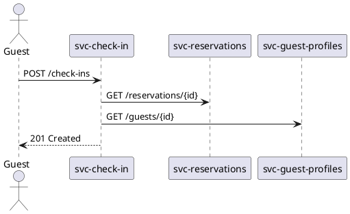

# Presentations as Code — Implementation Plan

> **BLUEPRINT — NOT AN INSTANCE.** This document is part of the EaC blueprint — a portable
> pattern designed for export to a real corporate workspace (the Instance). All NovaTrek
> Adventures content (services, tickets, ADRs, architecture decisions) is **fully synthetic
> exemplar data** created solely to validate the pattern. No corporate data, real systems,
> or organisation-specific tool choices are represented here. Organisation-specific current-
> state context belongs in the Instance, not in this blueprint.

> **Status:** Draft — v1.0 — 2026-05-14
>
> **Scope:** This document is the technical implementation plan for Presentations as Code (Pillar N).
> It covers every concrete change to this workspace and to the Azure cloud infrastructure.
> The corresponding requirements and vision document is [CAPABILITY-DEFINITION.md](CAPABILITY-DEFINITION.md).
>
> **Companion EaC reference:** [docs/everything-as-code/PRESENTATIONS-AS-CODE.md](../../docs/everything-as-code/PRESENTATIONS-AS-CODE.md)

---

## 1. Summary

Presentations as Code is implemented across four waves. Each wave delivers independently
shippable value. No wave depends on future waves to be useful.

| Wave | Maturity | Outcome |
|------|----------|---------|
| Wave 1 | L1 — Slides in Git | Manifest schema, directory structure, first governed presentation, CI validation |
| Wave 2 | L2 — Automated Rendering | Marp rendering pipeline, HTML/PDF output, portal presentations index |
| Wave 3 | L3 — Notation Compliance | Diagram pre-render integration, theme system, CSS theme files |
| Wave 4 | L4 — Governance and Archive | Cross-reference validation, archive automation, staleness detection, capability changelog integration |

The implementation targets the following existing infrastructure without requiring new Azure
resources until Wave 2:

- **Repository**: `christopherblaisdell/continuous-architecture-platform-poc-2`
- **Primary portal**: `https://architecture.novatrek.cc` (Azure SWA, `portal/` directory)
- **CI/CD**: GitHub Actions (`.github/workflows/`)
- **Build script**: `portal/scripts/generate-all.sh`
- **Infrastructure**: Bicep in `infra/` — no new Azure resources required

---

## 2. Technology Decision — Rendering Engine

### Decision: Marp CLI

**Chosen tool:** `@marp-team/marp-cli` v4.x (Node.js package, MIT license)

**Rationale:**

| Criterion | Marp | Slidev | reveal.js/reveal-md | MkDocs pages-as-slides |
|-----------|------|--------|---------------------|------------------------|
| Markdown input | Native | Native | Native | Native |
| HTML output | Yes, self-contained | Yes (but requires Vite/Node dev server) | Yes | Yes |
| PDF output | Native (via Chromium) | Via Playwright | Via Chromium | No native PDF |
| Speaker notes | Native (`^--` separator) | Native | Native | Not applicable |
| CI integration | `npx @marp-team/marp-cli --html --pdf` | Complex (server required) | Moderate | Simple |
| Custom CSS themes | Full CSS control | Vue component system | Theme JS | MkDocs CSS |
| Self-contained output | Yes (`--allow-local-files`) | No — requires assets directory | Yes | Requires MkDocs build |
| Java dependency | None | None | None | None |
| Existing workspace use | None — new | None | None | Yes (`presentations/continuous-architecture/`) |
| Blueprint `---` separator compatibility | Yes | Yes | Yes | No — `---` is an HR in MkDocs |

Marp is the clear choice. It produces fully self-contained HTML slides from standard Markdown,
supports the `---` slide separator and `^--` speaker notes separator as described in the
blueprint, and integrates with GitHub Actions via a single `npm install -g` step. It has a
3-minute CI rendering target that is achievable for a 20-slide deck.

**Coexistence with existing MkDocs presentation site:** `presentations/continuous-architecture/`
uses MkDocs pages (not Marp). It is not migrated. It remains as a standalone narrative web
presentation. Its build is independent of the Marp pipeline. See Section 11 for details.

---

## 3. Directory Structure

The following directory structure is established in Wave 1 and extended in subsequent waves.

```
presentations/
├── README.md                               # Overview of the presentations library
├── themes/                                 # Wave 3 — Marp CSS theme files
│   ├── architecture-hld.css
│   ├── architecture-adr.css
│   ├── architecture-onboarding.css
│   ├── architecture-strategy.css
│   └── architecture-review-board.css
├── archive/                                # Wave 4 — Immutable rendered output
│   └── HLD-001/
│       └── v1.0.0/
│           ├── slides.html
│           ├── slides.pdf
│           └── manifest.yaml
├── HLD-001/                                # Example: first governed presentation
│   ├── manifest.yaml
│   └── slides.md
├── ARB-001/
│   ├── manifest.yaml
│   └── slides.md
└── continuous-architecture/               # Existing — untouched MkDocs site
    ├── mkdocs.yml
    ├── docs/
    └── site/

schemas/
└── presentation-manifest.schema.json      # Wave 1 — JSON Schema for manifest validation

scripts/ci/                                # Wave 2+ — CI scripts for the presentation pipeline
├── validate-presentation-manifests.py     # Wave 1 — validate all manifests against JSON Schema
├── validate-presentation-refs.py          # Wave 4 — validate ADR/capability/ticket references
├── render-presentations.py                # Wave 2 — invoke Marp CLI for changed presentations
├── archive-delivered-presentations.py     # Wave 4 — copy delivered presentations to archive/
└── generate-presentation-index.py         # Wave 2 — generate portal/docs/presentations/index.md

portal/docs/presentations/                 # Wave 2 — portal presentations section
├── index.md                               # Generated by generate-presentation-index.py
└── ...                                    # One page per presentation (generated)

.github/workflows/
└── presentations.yml                      # Wave 1 — CI workflow for the presentation pipeline
```

**Notes:**
- `presentations/{id}/` subdirectories are the unit of a governed presentation
- Only `manifest.yaml` and `slides.md` are required in each presentation directory
- Optional: `assets/` subdirectory for presentation-specific images (subject to NFR-11 — no
  external URLs or corporate images)
- The `archive/` directory is written only by CI; manual edits to `archive/` are prohibited
  (enforced by a CI pre-flight check in Wave 4)

---

## 4. JSON Schema — Presentation Manifest

File: `schemas/presentation-manifest.schema.json`

The full manifest schema governs every `manifest.yaml` in the presentation library. The Python
validation script and any IDE YAML extension use this schema as the single source of truth.

The schema below is the complete Wave 1 definition. Wave 4 validation scripts load this schema
using `jsonschema` (Python stdlib-compatible) to validate YAML-parsed manifest data.

```json
{
  "$schema": "http://json-schema.org/draft-07/schema#",
  "$id": "https://architecture.novatrek.cc/schemas/presentation-manifest.schema.json",
  "title": "Presentation Manifest",
  "description": "Manifest for a governed architecture presentation in the Presentations as Code library.",
  "type": "object",
  "required": [
    "presentation_id",
    "title",
    "version",
    "status",
    "type",
    "audience",
    "authors",
    "source",
    "metadata"
  ],
  "additionalProperties": false,
  "properties": {
    "presentation_id": {
      "type": "string",
      "description": "Unique identifier. Must match the parent directory name.",
      "pattern": "^(HLD|ADR-WALK|OB|STR|ARB)-[0-9]{3,}$"
    },
    "title": {
      "type": "string",
      "description": "Human-readable title of the presentation.",
      "minLength": 5,
      "maxLength": 120
    },
    "version": {
      "type": "string",
      "description": "Semantic version of the presentation content.",
      "pattern": "^[0-9]+\\.[0-9]+\\.[0-9]+$"
    },
    "status": {
      "type": "string",
      "description": "Lifecycle state of the presentation.",
      "enum": ["draft", "review", "delivered", "archived"]
    },
    "type": {
      "type": "string",
      "description": "Presentation category determining theme and rendering options.",
      "enum": ["hld", "adr-walkthrough", "onboarding", "strategy", "review-board"]
    },
    "audience": {
      "type": "string",
      "description": "Target audience for this presentation.",
      "minLength": 3
    },
    "authors": {
      "type": "array",
      "description": "One or more authors of the presentation.",
      "items": { "type": "string" },
      "minItems": 1
    },
    "delivery": {
      "type": "object",
      "description": "Delivery event details. Required when status is 'delivered' or 'archived'.",
      "properties": {
        "date": {
          "type": "string",
          "format": "date",
          "description": "ISO 8601 date of the delivery event."
        },
        "venue": {
          "type": "string",
          "description": "Forum or body to which the presentation was delivered (e.g., 'Architecture Review Board Q1 2026')."
        }
      }
    },
    "source": {
      "type": "object",
      "description": "Source file references.",
      "required": ["slides"],
      "properties": {
        "slides": {
          "type": "string",
          "description": "Relative path to the Markdown slide source from the presentation root.",
          "const": "slides.md"
        },
        "theme": {
          "type": "string",
          "description": "Theme name (must match a file in presentations/themes/{theme}.css).",
          "enum": [
            "architecture-hld",
            "architecture-adr",
            "architecture-onboarding",
            "architecture-strategy",
            "architecture-review-board"
          ]
        },
        "output_formats": {
          "type": "array",
          "description": "List of output formats to render.",
          "items": { "type": "string", "enum": ["html", "pdf"] },
          "default": ["html"]
        }
      }
    },
    "references": {
      "type": "object",
      "description": "Architecture artifact cross-references. Validated by CI in Wave 4.",
      "properties": {
        "adrs": {
          "type": "array",
          "items": {
            "type": "string",
            "pattern": "^ADR-[0-9]{3,}$"
          },
          "description": "ADR IDs referenced in this presentation. Each must resolve to decisions/ADR-NNN-*.md"
        },
        "capabilities": {
          "type": "array",
          "items": {
            "type": "string",
            "pattern": "^CAP-[0-9]+\\.[0-9]+$"
          },
          "description": "Capability IDs referenced. Each must resolve to an entry in architecture/metadata/capabilities.yaml"
        },
        "tickets": {
          "type": "array",
          "items": {
            "type": "string",
            "pattern": "^NTK-[0-9]{5,}$"
          },
          "description": "Ticket IDs referenced. Each must resolve to an entry in architecture/metadata/tickets.yaml"
        },
        "solution": {
          "type": "string",
          "description": "Optional reference to the solution design this presentation supports (e.g., NTK-10005)."
        }
      }
    },
    "metadata": {
      "type": "object",
      "required": ["created", "last_updated"],
      "properties": {
        "created": {
          "type": "string",
          "format": "date",
          "description": "ISO 8601 date this presentation was first created."
        },
        "last_updated": {
          "type": "string",
          "format": "date",
          "description": "ISO 8601 date this presentation was last substantively updated."
        },
        "supersedes": {
          "type": "string",
          "description": "ID of the earlier presentation this one supersedes, if applicable."
        },
        "tags": {
          "type": "array",
          "items": { "type": "string" },
          "description": "Optional free-text tags for portal search filtering."
        }
      }
    }
  }
}
```

**VS Code integration:** Add to the workspace's `.vscode/settings.json`:

```json
{
  "yaml.schemas": {
    "schemas/presentation-manifest.schema.json": "presentations/*/manifest.yaml"
  }
}
```

This enables inline validation and auto-complete for every `manifest.yaml` in VS Code.

---

## 5. Manifest Authoring Example

A complete example `manifest.yaml` for the first governed High-Level Design presentation:

```yaml
# presentations/HLD-001/manifest.yaml
presentation_id: HLD-001
title: "Check-in Service Orchestration — High-Level Design"
version: 1.0.0
status: review
type: hld
audience: "Architecture Review Board, NovaTrek Engineering Leadership"
authors:
  - "NovaTrek Architecture Practice"
delivery:
  date: ""
  venue: ""
source:
  slides: slides.md
  theme: architecture-hld
  output_formats:
    - html
    - pdf
references:
  adrs:
    - ADR-006
    - ADR-007
    - ADR-010
    - ADR-011
  capabilities:
    - CAP-2.1
    - CAP-2.3
  tickets:
    - NTK-10005
  solution: "NTK-10005"
metadata:
  created: "2026-05-14"
  last_updated: "2026-05-14"
  tags:
    - check-in
    - orchestration
    - scheduling
```

---

## 6. Slide Source Format

Slide source files are plain Markdown. The rules are minimal but strictly enforced by CI.

### Slide Separators

```markdown
---
marp: true
theme: architecture-hld
title: "Check-in Service Orchestration — HLD"
author: "NovaTrek Architecture Practice"
date: "2026-05-14"
---

# Check-in Service Orchestration
## High-Level Design — Architecture Review Board

**Version:** 1.0.0
**Status:** For Review

---

## Agenda

1. Problem Statement
2. Proposed Architecture
3. Key Decisions (ADR-006, ADR-007, ADR-010)
4. Integration Points
5. Risk Register

^--

Speaker note: Introduce the agenda. Emphasise that ADR-006 and ADR-010 are already accepted;
ADR-011 is under proposal.

---

## Current Architecture — Check-in Flow



^--

Speaker note: This is the current state. Walk through the three service calls.
The sequence diagram is generated from the live OpenAPI spec.

---
```

### Authoring Rules (enforced by CI lint)

1. The first "slide" is always the YAML front matter (`---` block) with at minimum `marp: true` and `theme`
2. Each slide is separated by a standalone `---` line
3. Speaker notes begin with a standalone `^--` line and extend to the next `---`
4. Diagrams are fenced code blocks with language `plantuml` or `mermaid` — no `` for architecture diagrams
5. External URLs in slide content are allowed for citations; external image URLs are prohibited
6. Slide decks have no more than 30 slides (CI warns at 25, fails at 40 — configurable)

---

## 7. Wave 1 — Slides in Git

### Objective

Establish the governed structure. A maintainer can create a presentation, register it in the
manifest, and have it validated by CI — before any rendering infrastructure exists.

### Deliverables

| File | Action | Notes |
|------|--------|-------|
| `schemas/presentation-manifest.schema.json` | Create | Full schema from Section 4 |
| `presentations/README.md` | Create | Overview of the presentations library |
| `presentations/HLD-001/manifest.yaml` | Create | Synthetic exemplar, status: draft |
| `presentations/HLD-001/slides.md` | Create | Minimal synthetic slide deck (5-10 slides) |
| `scripts/ci/validate-presentation-manifests.py` | Create | Schema validation script |
| `.github/workflows/presentations.yml` | Create | Wave 1: manifest validation job only |
| `.vscode/settings.json` | Update | Add YAML schema mapping |

### validate-presentation-manifests.py

```python
#!/usr/bin/env python3
"""
Wave 1 validation: checks all presentations/*/manifest.yaml files against
schemas/presentation-manifest.schema.json.

Usage:
    python3 scripts/ci/validate-presentation-manifests.py

Exit code 0: all valid. Exit code 1: one or more validation failures.
"""
import sys
import json
import yaml
import pathlib
import jsonschema  # pip install jsonschema

REPO_ROOT = pathlib.Path(__file__).parent.parent.parent
SCHEMA_FILE = REPO_ROOT / "schemas" / "presentation-manifest.schema.json"
PRESENTATIONS_DIR = REPO_ROOT / "presentations"

def main():
    schema = json.loads(SCHEMA_FILE.read_text())
    errors = []
    manifests = sorted(PRESENTATIONS_DIR.glob("*/manifest.yaml"))
    if not manifests:
        print("WARNING: No manifest.yaml files found in presentations/")
        return 0
    for manifest_path in manifests:
        data = yaml.safe_load(manifest_path.read_text())
        try:
            jsonschema.validate(instance=data, schema=schema)
            print(f"  OK  {manifest_path.relative_to(REPO_ROOT)}")
        except jsonschema.ValidationError as e:
            errors.append(f"  FAIL {manifest_path.relative_to(REPO_ROOT)}: {e.message}")
    if errors:
        for e in errors:
            print(e, file=sys.stderr)
        return 1
    print(f"All {len(manifests)} manifest(s) valid.")
    return 0

if __name__ == "__main__":
    sys.exit(main())
```

### .github/workflows/presentations.yml (Wave 1 — validation only)

```yaml
name: Presentations Pipeline

on:
  push:
    branches: [main]
    paths:
      - 'presentations/**'
      - 'schemas/presentation-manifest.schema.json'
      - 'scripts/ci/**'
      - '.github/workflows/presentations.yml'
  pull_request:
    branches: [main]
    paths:
      - 'presentations/**'
      - 'schemas/presentation-manifest.schema.json'
      - 'scripts/ci/**'

permissions:
  contents: read

jobs:
  validate-manifests:
    runs-on: ubuntu-latest
    name: Validate Presentation Manifests
    steps:
      - name: Checkout
        uses: actions/checkout@v4

      - name: Set up Python
        uses: actions/setup-python@v5
        with:
          python-version: '3.12'

      - name: Install dependencies
        run: pip install jsonschema pyyaml

      - name: Validate manifests
        run: python3 scripts/ci/validate-presentation-manifests.py
```

### Definition of Done — Wave 1

- [ ] `schemas/presentation-manifest.schema.json` exists and is valid JSON Schema draft-07
- [ ] `presentations/HLD-001/manifest.yaml` passes schema validation locally
- [ ] `presentations.yml` workflow runs on PRs and succeeds
- [ ] VS Code shows inline YAML validation for `presentations/*/manifest.yaml` files

---

## 8. Wave 2 — Automated Rendering

### Objective

CI renders every changed presentation to self-contained HTML (and PDF where applicable) and
publishes the output to the architecture portal. The portal `Presentations` section is live.

### New Dependencies

| Dependency | Install Method | Purpose |
|-----------|---------------|---------|
| `@marp-team/marp-cli` | `npm install -g @marp-team/marp-cli` in CI | Render Markdown → HTML/PDF |
| `chromium-browser` (or `google-chrome-stable`) | `apt-get install chromium-browser` in CI | Marp PDF rendering (uses Puppeteer) |
| Marp uses the Chromium it ships with in `@marp-team/marp-cli` | No extra install for HTML; PDF may require `PUPPETEER_EXECUTABLE_PATH` env var in some environments | PDF output |

### Rendering Script: scripts/ci/render-presentations.py

```python
#!/usr/bin/env python3
"""
Wave 2: Renders all presentations with status != 'draft' using Marp CLI.
Produces self-contained HTML and PDF (where configured) in a staging output directory.

Usage:
    python3 scripts/ci/render-presentations.py [--all] [--output-dir portal/site/presentations]

Incremental: by default, only renders presentations whose slides.md or manifest.yaml has
changed since the last successful render (detected via git diff against origin/main).
Use --all to force re-render of all presentations.

Exit code 0: all renders succeeded. Exit code 1: one or more render failures.
"""
import sys
import os
import json
import yaml
import pathlib
import subprocess
import argparse

REPO_ROOT = pathlib.Path(__file__).parent.parent.parent
PRESENTATIONS_DIR = REPO_ROOT / "presentations"
THEMES_DIR = PRESENTATIONS_DIR / "themes"
DEFAULT_OUTPUT = REPO_ROOT / "portal" / "site" / "presentations"

def get_changed_presentations():
    """Return set of presentation IDs changed relative to origin/main."""
    result = subprocess.run(
        ["git", "diff", "--name-only", "origin/main...HEAD"],
        capture_output=True, text=True, cwd=REPO_ROOT
    )
    changed = set()
    for line in result.stdout.splitlines():
        parts = pathlib.Path(line).parts
        if len(parts) >= 2 and parts[0] == "presentations":
            changed.add(parts[1])
    return changed

def render_presentation(pres_id, manifest, output_dir, render_all=False):
    pres_dir = PRESENTATIONS_DIR / pres_id
    slides_src = pres_dir / "slides.md"
    theme_name = manifest.get("source", {}).get("theme", "architecture-hld")
    theme_file = THEMES_DIR / f"{theme_name}.css"
    formats = manifest.get("source", {}).get("output_formats", ["html"])
    out_dir = output_dir / pres_id
    out_dir.mkdir(parents=True, exist_ok=True)

    errors = []
    for fmt in formats:
        out_file = out_dir / f"slides.{fmt}"
        cmd = [
            "npx", "@marp-team/marp-cli",
            str(slides_src),
            "--output", str(out_file),
            "--allow-local-files",
        ]
        if theme_file.exists():
            cmd += ["--theme", str(theme_file)]
        if fmt == "html":
            cmd.append("--html")
        elif fmt == "pdf":
            cmd.append("--pdf")
        result = subprocess.run(cmd, capture_output=True, text=True)
        if result.returncode != 0:
            errors.append(f"{pres_id} [{fmt}]: {result.stderr.strip()}")
        else:
            print(f"  OK  {pres_id} -> {out_file.relative_to(REPO_ROOT)}")
    return errors

def main():
    parser = argparse.ArgumentParser()
    parser.add_argument("--all", action="store_true", help="Re-render all presentations")
    parser.add_argument("--output-dir", default=str(DEFAULT_OUTPUT))
    args = parser.parse_args()

    output_dir = pathlib.Path(args.output_dir)
    changed = None if args.all else get_changed_presentations()

    errors = []
    for manifest_path in sorted(PRESENTATIONS_DIR.glob("*/manifest.yaml")):
        pres_id = manifest_path.parent.name
        if pres_id in ("archive", "themes", "continuous-architecture"):
            continue
        if changed is not None and pres_id not in changed:
            print(f"  SKIP {pres_id} (no changes)")
            continue
        manifest = yaml.safe_load(manifest_path.read_text())
        if manifest.get("status") == "draft":
            print(f"  SKIP {pres_id} (status: draft)")
            continue
        errors.extend(render_presentation(pres_id, manifest, output_dir))

    if errors:
        for e in errors:
            print(f"ERROR: {e}", file=sys.stderr)
        return 1
    return 0

if __name__ == "__main__":
    sys.exit(main())
```

### Portal Index Generator: scripts/ci/generate-presentation-index.py

```python
#!/usr/bin/env python3
"""
Wave 2: Generates portal/docs/presentations/index.md listing all non-draft presentations.

Called by portal/scripts/generate-all.sh after validate-presentation-manifests.py succeeds.
"""
import yaml
import pathlib
from datetime import date

REPO_ROOT = pathlib.Path(__file__).parent.parent.parent
PRESENTATIONS_DIR = REPO_ROOT / "presentations"
OUTPUT_FILE = REPO_ROOT / "portal" / "docs" / "presentations" / "index.md"
OUTPUT_FILE.parent.mkdir(parents=True, exist_ok=True)

TYPE_LABELS = {
    "hld": "High-Level Design",
    "adr-walkthrough": "ADR Walkthrough",
    "onboarding": "Onboarding",
    "strategy": "Strategy",
    "review-board": "Review Board",
}

STATUS_ORDER = {"review": 0, "delivered": 1, "archived": 2}

def load_presentations():
    results = []
    for path in sorted(PRESENTATIONS_DIR.glob("*/manifest.yaml")):
        pres_id = path.parent.name
        if pres_id in ("archive", "themes", "continuous-architecture"):
            continue
        m = yaml.safe_load(path.read_text())
        if m.get("status") == "draft":
            continue
        results.append(m)
    return sorted(results, key=lambda m: (STATUS_ORDER.get(m["status"], 99), m["presentation_id"]))

def render_row(m):
    status = m["status"].title()
    ptype = TYPE_LABELS.get(m["type"], m["type"])
    delivery_date = m.get("delivery", {}).get("date", "—") or "—"
    adrs = ", ".join(m.get("references", {}).get("adrs", []) or []) or "—"
    link = f"/presentations/{m['presentation_id']}/slides.html"
    return (
        f"| [{m['presentation_id']}]({link}) "
        f"| {m['title']} "
        f"| {ptype} "
        f"| {m['version']} "
        f"| {status} "
        f"| {delivery_date} "
        f"| {m['audience']} "
        f"| {adrs} |"
    )

def main():
    presentations = load_presentations()
    lines = [
        "# Presentations Library",
        "",
        "Architecture presentations governed under [Presentations as Code](../everything-as-code/PRESENTATIONS-AS-CODE.md) (Pillar N).",
        "All presentations listed here are in `review`, `delivered`, or `archived` status.",
        "Drafts are not listed.",
        "",
        "| ID | Title | Type | Version | Status | Delivered | Audience | ADRs |",
        "|----|-------|------|---------|--------|-----------|----------|------|",
    ]
    for m in presentations:
        lines.append(render_row(m))
    if not presentations:
        lines.append("| — | No governed presentations yet. | — | — | — | — | — | — |")
    lines += ["", f"*Generated {date.today().isoformat()}*"]
    OUTPUT_FILE.write_text("\n".join(lines) + "\n")
    print(f"Generated {OUTPUT_FILE.relative_to(REPO_ROOT)}")

if __name__ == "__main__":
    main()
```

### Integration with generate-all.sh

Add two steps to `portal/scripts/generate-all.sh` after the existing step 7 (MkDocs build):

```bash
# ------------------------------------------------------------------
# Step 8: Generate presentation portal index
# ------------------------------------------------------------------
echo "[8/8] Generating presentations index..."
python3 scripts/ci/validate-presentation-manifests.py
python3 scripts/ci/generate-presentation-index.py
echo ""
```

### Portal MkDocs nav entry

Add to `portal/mkdocs.yml` under the top-level navigation:

```yaml
nav:
  # ... existing entries ...
  - Presentations:
      - Library: presentations/index.md
```

### Updated presentations.yml (Wave 2 — adds rendering job)

Extend the existing `presentations.yml` with a `render-and-publish` job:

```yaml
  render-presentations:
    runs-on: ubuntu-latest
    name: Render Presentations
    needs: validate-manifests
    steps:
      - name: Checkout
        uses: actions/checkout@v4
        with:
          fetch-depth: 0

      - name: Set up Python
        uses: actions/setup-python@v5
        with:
          python-version: '3.12'

      - name: Set up Node.js
        uses: actions/setup-node@v4
        with:
          node-version: '20'

      - name: Install Python dependencies
        run: pip install pyyaml jsonschema

      - name: Install Marp CLI
        run: npm install -g @marp-team/marp-cli

      - name: Install PlantUML (for diagram pre-render)
        run: sudo apt-get update && sudo apt-get install -y plantuml

      - name: Render changed presentations
        run: python3 scripts/ci/render-presentations.py

      - name: Generate portal presentations index
        run: python3 scripts/ci/generate-presentation-index.py

      - name: Upload rendered presentations
        uses: actions/upload-artifact@v4
        with:
          name: rendered-presentations
          path: portal/site/presentations/
          retention-days: 7
```

### Definition of Done — Wave 2

- [ ] `scripts/ci/render-presentations.py` renders `presentations/HLD-001/slides.md` to HTML
- [ ] `portal/site/presentations/HLD-001/slides.html` is a self-contained file that opens in a browser without a server
- [ ] `portal/docs/presentations/index.md` is generated and correctly lists HLD-001
- [ ] The portal `Presentations` navigation entry appears at `https://architecture.novatrek.cc/presentations/`
- [ ] PR that adds a new presentation triggers the render job in GitHub Actions

---

## 9. Wave 3 — Notation Compliance and Theme System

### Objective

All governed presentations use consistently styled themes. All diagrams in slide source are
machine-readable PlantUML or Mermaid — no screenshot images. CI enforces both constraints.

### Theme System Design

Each theme is a Marp-compatible CSS file in `presentations/themes/`. Marp applies the theme
CSS when `--theme path/to/theme.css` is passed at render time.

The five required themes map to presentation types as follows:

| Theme File | Type | Visual Characteristics |
|-----------|------|------------------------|
| `architecture-hld.css` | `hld` | Deep navy header, amber accent, Inter font, compact diagram scaling |
| `architecture-adr.css` | `adr-walkthrough` | Steel blue, tabular layout emphasis, numbered decision sections |
| `architecture-onboarding.css` | `onboarding` | Warm grey, large type, progress indicators, welcoming visual language |
| `architecture-strategy.css` | `strategy` | Deep purple (matches main portal), executive-grade whitespace, chart-first layout |
| `architecture-review-board.css` | `review-board` | High contrast, formal layout, decision-callout blocks, print-optimised |

**Starter theme template (`architecture-hld.css`):**

```css
/* Marp Custom Theme: architecture-hld */
/* @theme architecture-hld */

@import 'default';

:root {
  --color-background: #ffffff;
  --color-foreground: #1a1a2e;
  --color-header: #16213e;
  --color-accent: #e94560;
  --color-code-bg: #f4f4f8;
  font-family: 'Inter', 'Segoe UI', sans-serif;
}

section {
  background-color: var(--color-background);
  color: var(--color-foreground);
  padding: 40px 48px;
}

h1, h2 {
  color: var(--color-header);
  border-bottom: 3px solid var(--color-accent);
  padding-bottom: 8px;
}

section.lead {
  background-color: var(--color-header);
  color: #ffffff;
}

section.lead h1, section.lead h2 {
  color: #ffffff;
  border-color: var(--color-accent);
}

table {
  font-size: 0.85em;
  width: 100%;
  border-collapse: collapse;
}

th {
  background-color: var(--color-header);
  color: #ffffff;
  padding: 8px 12px;
}

td {
  border-bottom: 1px solid #e0e0e0;
  padding: 6px 12px;
}
```

### Diagram Pre-render Step

Marp renders PlantUML `plantuml` fenced code blocks using a Marp plugin or a pre-render step.
The safest, most compatible approach (no Marp plugin dependency) is pre-rendering:

1. A pre-render script scans all slide source files for `````plantuml``` and `````mermaid``` blocks
2. It extracts each diagram block, writes it to a temp file, renders it to SVG via `plantuml` (Java) or `mmdc` (Mermaid CLI)
3. It replaces the fenced code block in a working copy of `slides.md` with ``
4. The Marp render step operates on the modified working copy
5. The original `slides.md` in the repository is never modified

**Script:** `scripts/ci/prerender-slide-diagrams.py` (Wave 3 — created in this wave)

### CI Lint Step — No Screenshot Images

Add to the `presentations.yml` workflow:

```yaml
  lint-slide-sources:
    runs-on: ubuntu-latest
    name: Lint Slide Sources
    steps:
      - uses: actions/checkout@v4
      - name: Check for screenshot image references
        run: |
          # Fail if any slides.md references a local .png, .jpg, .jpeg, .gif
          # (external http/https URLs are allowed for citations)
          if grep -rn '!\[.*\](.*\.\(png\|jpg\|jpeg\|gif\))' presentations/*/slides.md; then
            echo "ERROR: Local screenshot images found in slide source."
            echo "All architecture diagrams must be PlantUML or Mermaid code blocks."
            exit 1
          fi
          echo "No prohibited image references found."
```

### Definition of Done — Wave 3

- [ ] All five theme CSS files exist in `presentations/themes/`
- [ ] The theme name in every `manifest.yaml` matches an existing CSS file (validated by CI)
- [ ] Rendered presentations use the correct theme styling (visual inspection)
- [ ] The CI lint step prevents screenshot images from being merged into `slides.md`
- [ ] PlantUML fenced code blocks in a test slide deck render to SVG in the rendered HTML

---

## 10. Wave 4 — Governance and Archive

### Objective

Full lifecycle management: cross-reference validation, automatic archiving on delivery,
staleness detection, and capability changelog integration.

### Cross-Reference Validation Script: scripts/ci/validate-presentation-refs.py

```python
#!/usr/bin/env python3
"""
Wave 4: Validates that all ADR, capability, and ticket references in presentation manifests
resolve to existing artifacts in the workspace.

Exit code 0: all references valid. Exit code 1: broken references found.
"""
import sys
import yaml
import pathlib
import re

REPO_ROOT = pathlib.Path(__file__).parent.parent.parent
PRESENTATIONS_DIR = REPO_ROOT / "presentations"
DECISIONS_DIR = REPO_ROOT / "decisions"
CAPABILITIES_FILE = REPO_ROOT / "architecture" / "metadata" / "capabilities.yaml"
TICKETS_FILE = REPO_ROOT / "architecture" / "metadata" / "tickets.yaml"

def load_capability_ids():
    data = yaml.safe_load(CAPABILITIES_FILE.read_text())
    ids = set()
    for domain in data.get("domains", []):
        for cap in domain.get("capabilities", []):
            ids.add(cap["id"])
            for sub in cap.get("sub_capabilities", []):
                ids.add(sub["id"])
    return ids

def load_ticket_ids():
    data = yaml.safe_load(TICKETS_FILE.read_text())
    return {t["id"] for t in data.get("tickets", [])}

def load_adr_ids():
    ids = set()
    for f in DECISIONS_DIR.glob("ADR-*.md"):
        m = re.match(r"ADR-(\d+)", f.name)
        if m:
            ids.add(f"ADR-{int(m.group(1)):03d}")
    return ids

def main():
    adr_ids = load_adr_ids()
    cap_ids = load_capability_ids()
    ticket_ids = load_ticket_ids()
    errors = []

    for manifest_path in sorted(PRESENTATIONS_DIR.glob("*/manifest.yaml")):
        pres_id = manifest_path.parent.name
        if pres_id in ("archive", "themes", "continuous-architecture"):
            continue
        manifest = yaml.safe_load(manifest_path.read_text())
        refs = manifest.get("references", {}) or {}

        for adr in refs.get("adrs", []) or []:
            if adr not in adr_ids:
                errors.append(f"{pres_id}: ADR reference '{adr}' does not resolve to decisions/ADR-*.md")

        for cap in refs.get("capabilities", []) or []:
            if cap not in cap_ids:
                errors.append(f"{pres_id}: Capability reference '{cap}' not found in capabilities.yaml")

        for ticket in refs.get("tickets", []) or []:
            if ticket not in ticket_ids:
                errors.append(f"{pres_id}: Ticket reference '{ticket}' not found in tickets.yaml")

    if errors:
        for e in errors:
            print(f"ERROR: {e}", file=sys.stderr)
        return 1
    print(f"All presentation references valid.")
    return 0

if __name__ == "__main__":
    sys.exit(main())
```

### Archive Script: scripts/ci/archive-delivered-presentations.py

```python
#!/usr/bin/env python3
"""
Wave 4: Copies rendered output of 'delivered' presentations to the archive.

Runs only on pushes to main (not on PRs). Checks if a delivered presentation
already has an archive entry at the current version; skips if already archived.

Usage:
    python3 scripts/ci/archive-delivered-presentations.py --rendered-dir portal/site/presentations
"""
import sys
import yaml
import shutil
import pathlib
import argparse

REPO_ROOT = pathlib.Path(__file__).parent.parent.parent
PRESENTATIONS_DIR = REPO_ROOT / "presentations"
ARCHIVE_DIR = PRESENTATIONS_DIR / "archive"

def main():
    parser = argparse.ArgumentParser()
    parser.add_argument("--rendered-dir", required=True)
    args = parser.parse_args()
    rendered_dir = pathlib.Path(args.rendered_dir)

    archived = 0
    skipped = 0
    for manifest_path in sorted(PRESENTATIONS_DIR.glob("*/manifest.yaml")):
        pres_id = manifest_path.parent.name
        if pres_id in ("archive", "themes", "continuous-architecture"):
            continue
        manifest = yaml.safe_load(manifest_path.read_text())
        if manifest.get("status") not in ("delivered", "archived"):
            continue
        version = manifest["version"]
        archive_target = ARCHIVE_DIR / pres_id / f"v{version}"
        if archive_target.exists():
            print(f"  SKIP {pres_id} v{version} (already archived)")
            skipped += 1
            continue
        source = rendered_dir / pres_id
        if not source.exists():
            print(f"  WARN {pres_id}: rendered output not found at {source}")
            continue
        archive_target.mkdir(parents=True)
        shutil.copytree(source, archive_target, dirs_exist_ok=True)
        # Copy manifest as record
        shutil.copy(manifest_path, archive_target / "manifest.yaml")
        print(f"  ARCHIVED {pres_id} v{version} -> {archive_target.relative_to(REPO_ROOT)}")
        archived += 1

    print(f"\nArchived {archived} presentation(s). Skipped {skipped} (already current).")
    return 0

if __name__ == "__main__":
    sys.exit(main())
```

### Staleness Detection Job

A scheduled GitHub Actions job runs weekly and checks whether any referenced ADR has been
superseded since the presentation was delivered.

```yaml
# .github/workflows/presentations-staleness.yml
name: Presentations Staleness Check

on:
  schedule:
    - cron: '0 6 * * 1'  # Monday 06:00 UTC
  workflow_dispatch:

jobs:
  staleness-check:
    runs-on: ubuntu-latest
    name: Check for Stale Presentation References
    permissions:
      issues: write
      contents: read
    steps:
      - uses: actions/checkout@v4
      - uses: actions/setup-python@v5
        with:
          python-version: '3.12'
      - run: pip install pyyaml
      - name: Check for superseded ADR references
        run: python3 scripts/ci/check-presentation-staleness.py
        env:
          GITHUB_TOKEN: ${{ secrets.GITHUB_TOKEN }}
```

**Script:** `scripts/ci/check-presentation-staleness.py` — reads delivered/archived presentation
manifests, checks whether any referenced ADR file has `Status: Superseded` in its front matter,
and opens a GitHub Issue summarising all stale presentations. (Implementation detail for Wave 4
execution.)

### Capability Changelog Integration

When a solution design is completed and `architecture/metadata/capability-changelog.yaml` is
updated, the entry for that solution may reference the corresponding presentation ID:

```yaml
# architecture/metadata/capability-changelog.yaml
- ticket: NTK-10005
  date: "2026-05-14"
  summary: "Check-in orchestration model formalised"
  presentation: HLD-001        # <-- PrC integration field
  capabilities:
    - id: CAP-2.1
      impact: enhanced
      description: "..."
```

The `generate-capability-pages.py` script reads the `presentation` field and generates a link to
the corresponding presentation page in the portal. This is the bidirectional link referenced in
FR-35.

### Updated presentations.yml (Wave 4 — full pipeline)

The complete Wave 4 `presentations.yml` adds the cross-reference validation and archive jobs:

```yaml
  validate-refs:
    runs-on: ubuntu-latest
    name: Validate Cross-References
    needs: validate-manifests
    steps:
      - uses: actions/checkout@v4
      - uses: actions/setup-python@v5
        with:
          python-version: '3.12'
      - run: pip install pyyaml
      - run: python3 scripts/ci/validate-presentation-refs.py

  archive-delivered:
    runs-on: ubuntu-latest
    name: Archive Delivered Presentations
    needs: render-presentations
    if: github.event_name == 'push' && github.ref == 'refs/heads/main'
    steps:
      - uses: actions/checkout@v4
      - uses: actions/setup-python@v5
        with:
          python-version: '3.12'
      - run: pip install pyyaml
      - uses: actions/download-artifact@v4
        with:
          name: rendered-presentations
          path: portal/site/presentations/
      - run: python3 scripts/ci/archive-delivered-presentations.py --rendered-dir portal/site/presentations
      - name: Commit archive to repository
        run: |
          git config user.name "github-actions[bot]"
          git config user.email "github-actions[bot]@users.noreply.github.com"
          git add presentations/archive/
          git diff --staged --quiet || git commit -m "ci: archive delivered presentations"
          git push
```

### Definition of Done — Wave 4

- [ ] `validate-presentation-refs.py` runs on every PR and catches broken ADR references
- [ ] `archive-delivered-presentations.py` runs on push to `main` and copies delivered presentations to `presentations/archive/`
- [ ] `presentations-staleness.yml` is scheduled and opens a GitHub Issue when stale references are detected
- [ ] At least one presentation has been delivered (status updated to `delivered`), archived by CI, and appears in the portal archive
- [ ] The capability changelog for at least one solution has a `presentation` field linking to the corresponding HLD

---

## 11. Azure Cloud Integration

### Current Hosting Architecture

All static sites in this workspace are hosted on Azure Static Web Apps (Free tier). The primary
portal (`portal/`) is deployed to `https://architecture.novatrek.cc` via `docs-deploy.yml`.

Presentation rendered output is hosted as a **subdirectory of the existing portal SWA**, not as
a separate Azure resource.

```
https://architecture.novatrek.cc/
  presentations/           ← portal index generated by generate-presentation-index.py
  presentations/HLD-001/   ← rendered HTML output from Marp
  presentations/HLD-001/slides.html
  presentations/HLD-001/slides.pdf
```

This approach:
- Requires zero new Azure resources
- Uses the existing SWA deployment token
- Keeps the CSP and routing configuration in `portal/staticwebapp.config.json`
- Allows the portal search to index presentation content

### docs-deploy.yml Changes

The existing `docs-deploy.yml` workflow is updated to:

1. Run `validate-presentation-manifests.py` as part of the portal build step
2. Run `render-presentations.py` to produce rendered HTML/PDF in `portal/site/presentations/`
3. Run `generate-presentation-index.py` to produce `portal/docs/presentations/index.md`
4. Include the rendered presentations in the `portal/site/` artifact that is deployed to Azure SWA

These additions are made to `portal/scripts/generate-all.sh` so they run as part of the same
pipeline that builds the rest of the portal.

### staticwebapp.config.json Changes

Add a route rule to ensure rendered presentation HTML files are served with the correct headers:

```json
{
  "routes": [
    {
      "route": "/presentations/*",
      "headers": {
        "X-Frame-Options": "SAMEORIGIN",
        "Cache-Control": "public, max-age=3600"
      }
    }
  ]
}
```

### PDF Hosting

PDF files generated by Marp are deployed alongside the HTML as static assets in the SWA.
They are linked from the portal presentations index page and from the archive entries.

No Azure Blob Storage is required for PDFs. The Free tier SWA allows up to 100 MB per deployment,
which is more than sufficient for the expected presentation library size.

### No New Bicep Changes Required for Waves 1-3

Waves 1 through 3 require no new Azure infrastructure. The existing SWA resource defined in
`infra/main.bicep` is sufficient.

**Potential Wave 4 Azure enhancement:** If the staleness detection job needs to open GitHub
Issues automatically (FR-37 / Wave 4 staleness script), it uses the `GITHUB_TOKEN` in Actions —
no Azure resource needed. If a future requirement emerges to store large PDF archives in durable
storage, Azure Blob Storage can be added to `infra/platform.bicep` at that point.

---

## 12. Coexistence with presentations/continuous-architecture/

The `presentations/continuous-architecture/` site is a standalone MkDocs Material site. It is
**not** part of the Pillar N Presentations as Code pipeline. The two systems coexist without
conflict because they serve different purposes and use different rendering approaches.

| Aspect | Pillar N (Presentations as Code) | continuous-architecture (existing) |
|--------|----------------------------------|------------------------------------|
| Purpose | Governed slide decks for ARB, HLD, strategy | Narrative web presentation about the platform |
| Rendering | Marp CLI → HTML slides | MkDocs Material → web pages |
| Manifest | Required (`manifest.yaml`) | Not applicable |
| Portal integration | Listed in `portal/docs/presentations/index.md` | Linked from portal as an external/companion site |
| Archive | Automatic on delivery | Not archived |
| AI readability | Full (slides.md is plain Markdown) | Full (MkDocs Markdown) |

The `continuous-architecture/` site may optionally be listed in the portal presentations index
as a `type: strategy` entry (resolving OQ-05) — but it would be a manually maintained entry, not
a manifest-governed one. This decision is deferred to Wave 1 scoping.

---

## 13. Full File Inventory

Every file that needs to be created or modified across all waves:

### New Files to Create

| Wave | File | Type | Notes |
|------|------|------|-------|
| 1 | `schemas/presentation-manifest.schema.json` | JSON Schema | Full schema from Section 4 |
| 1 | `presentations/README.md` | Markdown | Overview and conventions |
| 1 | `presentations/HLD-001/manifest.yaml` | Manifest | First synthetic exemplar |
| 1 | `presentations/HLD-001/slides.md` | Slide source | 10-slide synthetic HLD deck |
| 1 | `scripts/ci/validate-presentation-manifests.py` | Python | Schema validation |
| 1 | `.github/workflows/presentations.yml` | YAML | CI pipeline (extends with each wave) |
| 2 | `scripts/ci/render-presentations.py` | Python | Marp-based renderer |
| 2 | `scripts/ci/generate-presentation-index.py` | Python | Portal index generator |
| 2 | `portal/docs/presentations/index.md` | Markdown | Generated — do not edit by hand |
| 3 | `presentations/themes/architecture-hld.css` | CSS | Marp theme |
| 3 | `presentations/themes/architecture-adr.css` | CSS | Marp theme |
| 3 | `presentations/themes/architecture-onboarding.css` | CSS | Marp theme |
| 3 | `presentations/themes/architecture-strategy.css` | CSS | Marp theme |
| 3 | `presentations/themes/architecture-review-board.css` | CSS | Marp theme |
| 3 | `scripts/ci/prerender-slide-diagrams.py` | Python | PlantUML/Mermaid extraction and pre-render |
| 4 | `scripts/ci/validate-presentation-refs.py` | Python | Cross-reference validation |
| 4 | `scripts/ci/archive-delivered-presentations.py` | Python | Archive on delivery |
| 4 | `scripts/ci/check-presentation-staleness.py` | Python | Staleness detection |
| 4 | `.github/workflows/presentations-staleness.yml` | YAML | Scheduled staleness job |

### Files to Modify

| Wave | File | Change |
|------|------|--------|
| 1 | `.vscode/settings.json` | Add YAML schema mapping for `presentations/*/manifest.yaml` |
| 2 | `portal/scripts/generate-all.sh` | Add steps 8 (validate + render + index presentations) |
| 2 | `portal/mkdocs.yml` | Add `Presentations` nav section |
| 2 | `portal/staticwebapp.config.json` | Add `/presentations/*` route headers |
| 4 | `architecture/metadata/capability-changelog.yaml` | Add `presentation` field to new solution entries |
| 4 | `portal/scripts/generate-capability-pages.py` | Read `presentation` field and emit portal link |

---

## 14. Testing and Validation

### Local Testing Instructions

Before pushing to CI, verify the pipeline locally:

```bash
# 1. Install dependencies (one-time)
npm install -g @marp-team/marp-cli
pip install jsonschema pyyaml

# 2. Validate manifests
python3 scripts/ci/validate-presentation-manifests.py

# 3. Validate cross-references (Wave 4+)
python3 scripts/ci/validate-presentation-refs.py

# 4. Render a single presentation to HTML
npx @marp-team/marp-cli presentations/HLD-001/slides.md \
    --theme presentations/themes/architecture-hld.css \
    --html \
    --allow-local-files \
    --output /tmp/HLD-001-slides.html

# 5. Open rendered output
open /tmp/HLD-001-slides.html

# 6. Render to PDF
npx @marp-team/marp-cli presentations/HLD-001/slides.md \
    --theme presentations/themes/architecture-hld.css \
    --pdf \
    --allow-local-files \
    --output /tmp/HLD-001-slides.pdf

# 7. Generate portal index
python3 scripts/ci/generate-presentation-index.py
cat portal/docs/presentations/index.md
```

### CI Checks by Wave

| Wave | Job | Trigger | Failure Action |
|------|-----|---------|----------------|
| 1 | `validate-manifests` | Every PR touching `presentations/` | Block PR merge |
| 2 | `render-presentations` | Every PR touching `presentations/` | Block PR merge |
| 2 | `lint-slide-sources` | Every PR touching `presentations/*/slides.md` | Block PR merge |
| 4 | `validate-refs` | Every PR touching `presentations/` | Block PR merge |
| 4 | `archive-delivered` | Push to `main` only | Non-blocking (creates commit) |
| 4 | `staleness-check` | Schedule: Monday 06:00 UTC | Opens Issue |

---

## 15. Risk Register

| Risk | Likelihood | Impact | Mitigation |
|------|-----------|--------|------------|
| Marp PDF rendering requires Chrome/Puppeteer — may fail on CI runners without a GUI | Medium | High (PDF output broken) | Use `PUPPETEER_SKIP_CHROMIUM_DOWNLOAD=false` and verify CI runner has `chromium-browser`; fall back to HTML-only in Wave 2 if needed |
| PlantUML pre-render adds 60-90 seconds to CI for diagrams — may exceed target | Medium | Medium | Cache PlantUML SVG outputs in CI; accept HTML-only diagrams in Wave 2 and add pre-render in Wave 3 |
| The `archive-delivered-presentations.py` commit step creates a git commit in CI — may conflict with concurrent push | Low | Medium | Use a separate commit with `--allow-empty` guard; add a retry step |
| JSON Schema for manifest references (`adrs`, `capabilities`, `tickets`) does not validate actual resolution — only pattern format | Low | Low | The dedicated `validate-presentation-refs.py` covers actual resolution; JSON Schema covers format only |
| `presentations/continuous-architecture/` changes cause confusion with Pillar N governance | Low | Low | Keep clear documentation (this plan + the README) distinguishing the two systems; do not add a `manifest.yaml` to `continuous-architecture/` |
| Staleness detection false positives: an ADR superseded for unrelated reasons triggers an alert for an otherwise accurate presentation | Medium | Low | Staleness job opens an Issue (human decision required) rather than failing CI — the alert is advisory, not blocking |

---

## 16. Dependencies and Prerequisites

### System Prerequisites (local dev and CI)

| Dependency | Version | Install |
|-----------|---------|---------|
| Python | 3.12+ | Existing (same as portal build) |
| Node.js | 20+ | `apt-get install nodejs` or `nvm use 20` |
| `@marp-team/marp-cli` | 4.x | `npm install -g @marp-team/marp-cli` |
| `jsonschema` (Python) | 4.x | `pip install jsonschema` |
| `pyyaml` (Python) | 6.x | `pip install pyyaml` (already in `requirements-docs.txt`) |
| PlantUML | Latest | `apt-get install plantuml` (already installed in portal CI) |
| Java (for PlantUML) | 17+ | Already required by portal CI |
| VS Code YAML extension | Latest | `redhat.vscode-yaml` |

### Python Package Addition

Add to `requirements-docs.txt`:

```
jsonschema>=4.21.0
```

(`pyyaml` is assumed to already be present — verify and add if missing.)

---

## 17. Rollout Sequence

The four waves are sequential. Each wave is a self-contained PR (or small series of PRs) on a
feature branch named `feat/prc-wave-{N}`.

| Wave | Branch | PRs | Estimated Scope |
|------|--------|-----|-----------------|
| 1 | `feat/prc-wave-1` | 1-2 | Schema, first presentation, validation CI |
| 2 | `feat/prc-wave-2` | 2-3 | Marp renderer, portal index, generate-all integration |
| 3 | `feat/prc-wave-3` | 1-2 | Five CSS themes, diagram pre-render, lint check |
| 4 | `feat/prc-wave-4` | 2-3 | Cross-ref validation, archive script, staleness job, changelog integration |

Each wave is merged to `main` independently. Wave 4 is the only wave with a scheduled job
(`presentations-staleness.yml`); all other jobs are triggered by pushes and PRs.

---
