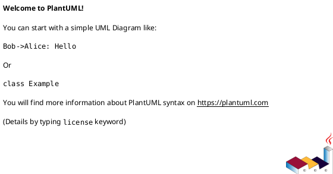

# Solution Design Template

Use this template when creating solution design documents for tickets.
Copy into `[TICKET-ID]-solution-design.md` and fill in all sections.

---

```markdown
<!-- PUBLISH -->
# [TICKET-ID] Solution Design

## Version History

| Version | Date | Author | Changes |
|---------|------|--------|---------|
| 1.0 | YYYY-MM-DD | [Author] | Initial draft |

## Problem Statement

_Describe the problem or issue that this solution addresses. Include context from the
ticket, production logs, or other evidence. Do not guess or assume behavior._

## Current State

_Describe how the system currently behaves in the affected area. Reference specific
API endpoints, services, or data flows as applicable._

## Solution Overview

_Provide a high-level summary of the proposed solution. This should be understandable
by both technical and non-technical stakeholders._

## Architecture Changes

### API Changes

_List any new, modified, or deprecated API endpoints. Include request/response
contract changes with examples where helpful._

| Method | Endpoint | Change Type | Description |
|--------|----------|-------------|-------------|
| | | | |

### Data Model Changes

_Describe any changes to database schemas, data objects, or message formats._

### Service Interaction Changes

_Describe changes to how services communicate. Include sequence diagrams
(PlantUML) for complex interaction changes._

### Configuration Changes

_List any new or modified configuration properties, feature flags, or
environment variables._

## Sequence Diagram

_Include a PlantUML sequence diagram for the proposed solution flow._



## Risks and Mitigations

| Risk | Likelihood | Impact | Mitigation |
|------|-----------|--------|------------|
| | | | |

## Acceptance Criteria

_Define clear, testable acceptance criteria for the solution._

1. GIVEN ... WHEN ... THEN ...
2. GIVEN ... WHEN ... THEN ...

## Non-Functional Requirements

_Address relevant quality attributes (reference ISO 25010):_

- **Performance**: Expected response times, throughput
- **Reliability**: Failure handling, recovery behavior
- **Security**: Authentication, authorization, data protection
- **Maintainability**: Code complexity, testability

## Dependencies

_List external dependencies or prerequisites for this solution._

## References

- Ticket: [TICKET-ID]
- Related MRs: (if applicable)
- API Specs: (link to relevant Swagger specs)
- Architecture Diagrams: (link to relevant PlantUML diagrams)
```
