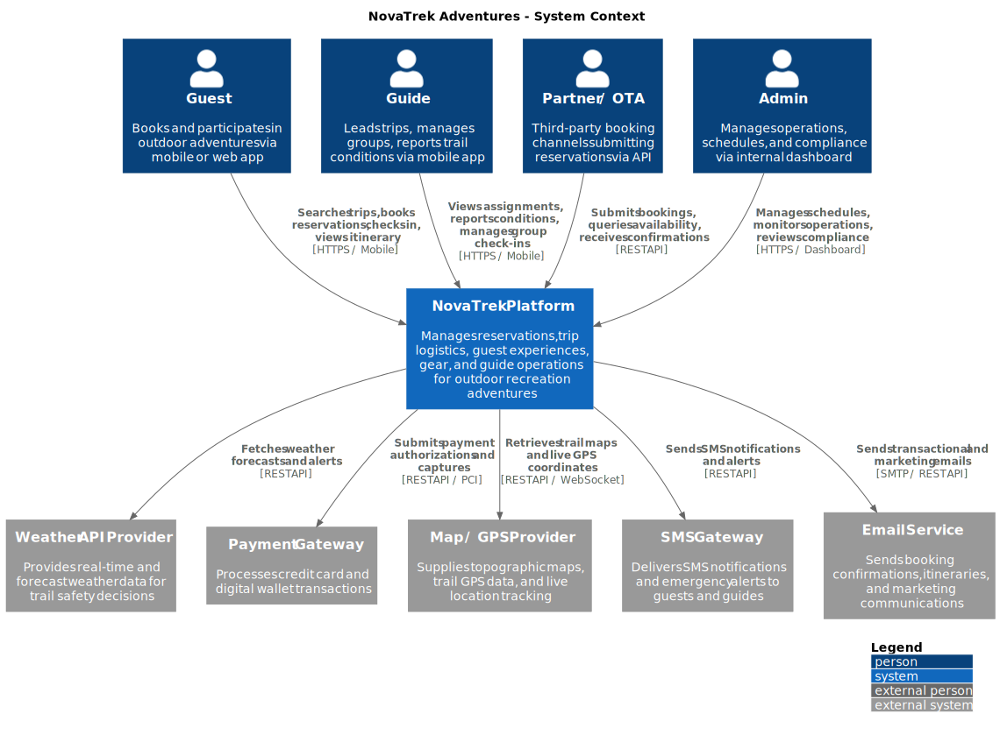
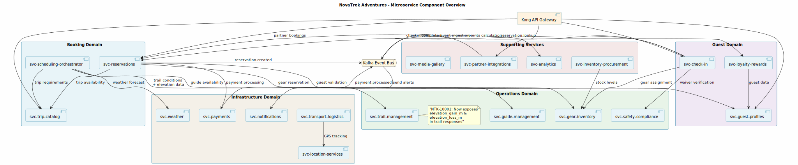

---
tags:
  - diagrams
  - architecture
---

# Architecture Diagrams

Visual documentation of NovaTrek platform architecture — system context, service components, and interaction flows

All diagrams are generated from PlantUML source files and rendered as SVG for crisp, scalable viewing. Click any diagram to view it full-size.

---

## System Context

The C4 System Context diagram shows the NovaTrek Platform and its relationships with external actors (guests, guides, partners, admins) and external systems (weather, payments, maps, notifications).

<figure markdown>
  { loading=lazy width="100%" }
  <figcaption>C4 Level 1 — System Context Diagram</figcaption>
</figure>

---

## Platform Component Overview

High-level view of all 19 NovaTrek microservices organized by domain, showing synchronous API dependencies and asynchronous Kafka event flows.

<figure markdown>
  { loading=lazy width="100%" }
  <figcaption>C4 Level 2 — All microservices by domain with dependency arrows</figcaption>
</figure>

---

## Service Architecture Pages

Each microservice page includes a description of the service's role, its integration points, relevant architecture decisions, and all associated sequence and component diagrams.

<a href="svc-check-in/" class="portal-card" markdown>
:material-qrcode-scan:

### svc-check-in

Day-of-adventure check-in orchestrator. 4 diagrams covering check-in flow, unregistered guest lookup, classification logic, and component structure.
</a>

<a href="svc-reservations/" class="portal-card" markdown>
:material-calendar-check:

### svc-reservations

Reservation lifecycle management. 2 sequence diagrams covering direct guest booking and partner/OTA booking flows.
</a>

<a href="svc-scheduling-orchestrator/" class="portal-card" markdown>
:material-calendar-clock:

### svc-scheduling-orchestrator

Schedule optimization engine. 1 sequence diagram covering multi-service orchestration for guide, trail, and weather coordination.
</a>

<a href="svc-guest-profiles/" class="portal-card" markdown>
:material-account-group:

### svc-guest-profiles

Guest identity management. 1 component diagram showing internal structure with certification validation and event publishing.
</a>

<a href="svc-trip-catalog/" class="portal-card" markdown>
:material-compass:

### svc-trip-catalog

Adventure product registry. 1 component diagram showing availability engine and integration with booking and scheduling domains.
</a>

<a href="svc-trail-management/" class="portal-card" markdown>
:material-hiking:

### svc-trail-management

Trail operations and conditions. Appears in scheduling orchestration flow providing trail data for route optimization.
</a>

---

## Diagram Types

| Type | C4 Level | Purpose | Count |
|------|----------|---------|-------|
| **System Context** | Level 1 | External actors and system boundaries | 1 |
| **Component** | Level 2 | Internal service structure and dependencies | 4 |
| **Sequence** | Runtime | Request/response flows across services | 4 |
| **Activity** | Runtime | Decision flow logic for classification | 1 |
| **Orchestration** | Runtime | Multi-service coordination with error handling | 1 |
