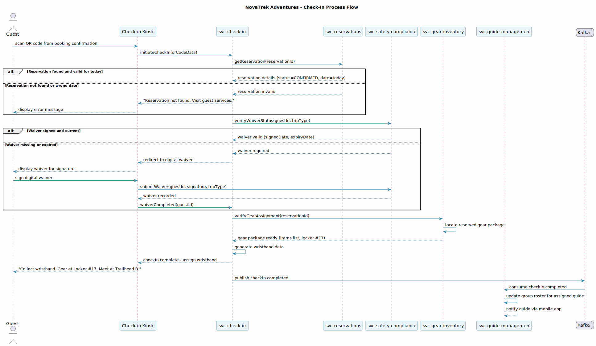
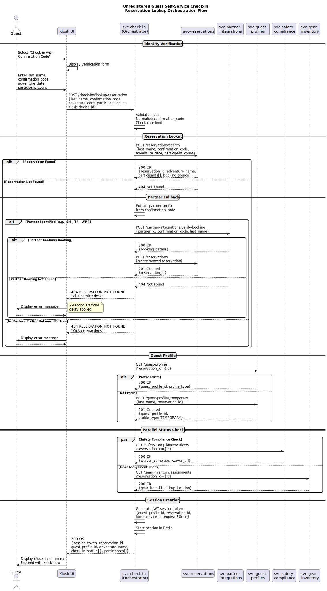
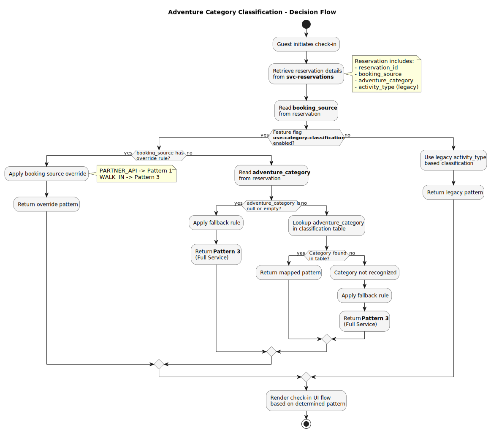
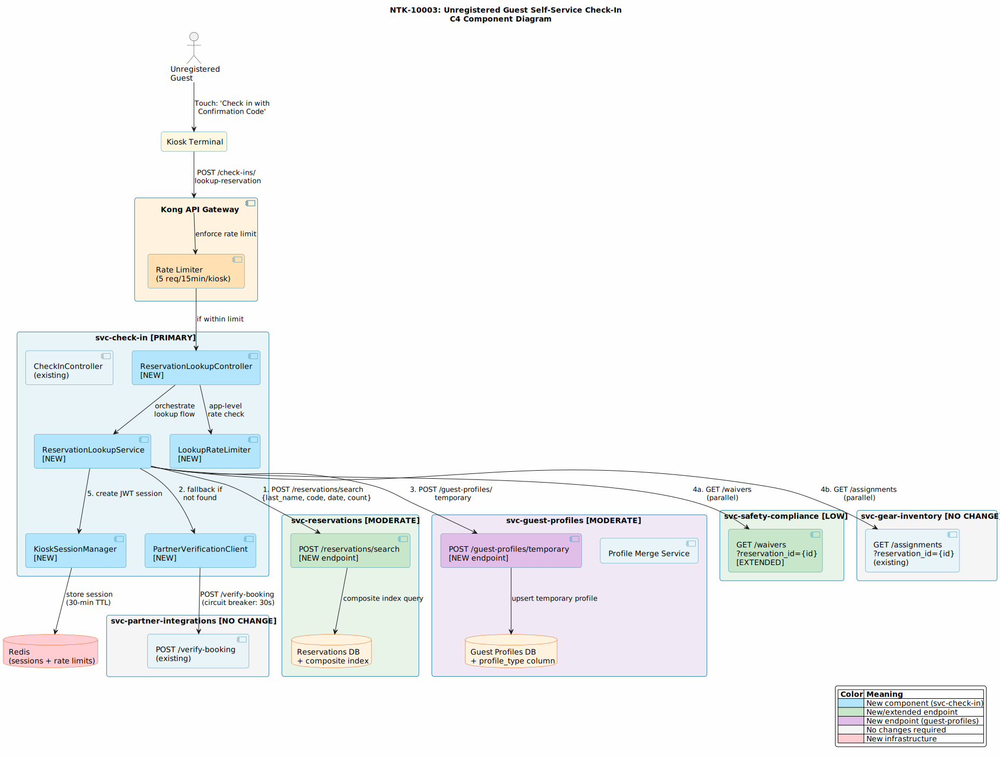
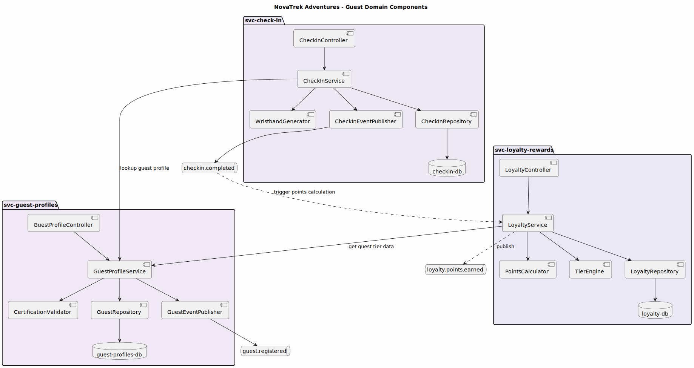

---
tags:
  - diagrams
  - svc-check-in
  - operations
---

# svc-check-in

| | |
|-----------|-------|
| **Service** | svc-check-in |
| **Domain** | Operations |
| **Team** | NovaTrek Operations Team |
| **API Version** | 1.0.0 |
| **Base URL** | `https://api.novatrek.example.com/checkin/v1` |

---

## Purpose

Handles day-of-adventure check-in workflow including wristband assignment, gear pickup verification, waiver validation, and group assembly. Coordinates with svc-reservations for booking data, svc-safety-compliance for waiver status, and svc-gear-inventory for equipment assignment. Serves as the designated orchestrator for all day-of-adventure workflows.

---

## Architecture Decisions

| ADR | Title | Status |
|-----|-------|--------|
| ADR-004 | Configuration-Driven Classification | Accepted |
| ADR-005 | Pattern 3 Default Fallback | Accepted |
| ADR-006 | Orchestrator Pattern for Check-In | Accepted |
| ADR-007 | Four-Field Identity Verification | Accepted |
| ADR-008 | Temporary Guest Profile | Accepted |
| ADR-009 | 30-Minute Kiosk Session | Accepted |

---

## Integration Points

| Direction | Service | Purpose |
|-----------|---------|---------|
| Calls | svc-reservations | Booking lookup, participant verification |
| Calls | svc-guest-profiles | Profile lookup/creation, temporary profile creation |
| Calls | svc-safety-compliance | Waiver validation |
| Calls | svc-gear-inventory | Equipment assignment and pickup verification |
| Calls | svc-partner-integrations | Fallback reservation lookup for partner bookings |
| Calls | svc-trip-catalog | Adventure category lookup for classification |
| Publishes | Kafka `checkin.completed` | Consumed by svc-guide-management, svc-analytics, svc-loyalty-rewards |

---

## Key Patterns

- **Adventure Category Classification** — Maps 25 adventure categories to 3 check-in UI patterns (Basic, Guided, Full Service) via configuration-driven YAML
- **Unregistered Guest Orchestration** — Multi-service fan-out with conditional partner fallback and parallel safety/gear checks
- **Kiosk Session Management** — JWT-based 30-minute sessions with one-active-per-device enforcement
- **Safety-First Defaults** — Unknown or unmapped adventure categories default to Pattern 3 (Full Service)

---

## Diagrams

### Check-In Process Flow

Standard day-of-adventure check-in sequence: guest scans QR code, system validates reservation, verifies waiver, confirms gear assignment, generates wristband, and notifies the assigned guide.

<figure markdown>
  { loading=lazy width="100%" }
  <figcaption>Sequence — Standard check-in with QR scan, waiver, gear, and wristband assignment</figcaption>
</figure>

---

### Unregistered Guest Lookup Orchestration (NTK-10003)

Complete orchestration flow for guests who arrive without a pre-registered account. Covers four-field identity verification, reservation search with partner fallback, temporary guest profile creation, parallel safety/gear checks, and JWT session creation.

<figure markdown>
  { loading=lazy width="100%" }
  <figcaption>Sequence — NTK-10003: Unregistered guest self-service check-in orchestration</figcaption>
</figure>

---

### Adventure Category Classification Flow (NTK-10002)

Decision flow for determining which check-in UI pattern to render. Evaluates the feature flag, booking source overrides, adventure category lookup, and fallback rules. Unknown categories always default to Pattern 3 (Full Service) for safety.

<figure markdown>
  { loading=lazy width="100%" }
  <figcaption>Activity — NTK-10002: Adventure category to check-in pattern classification logic</figcaption>
</figure>

---

### Unregistered Check-In Component View (NTK-10003)

C4 component diagram showing all new and modified components for the unregistered guest self-service check-in flow. Highlights the new `ReservationLookupService`, `KioskSessionManager`, and `PartnerVerificationClient` within svc-check-in, plus new endpoints in svc-reservations and svc-guest-profiles.

<figure markdown>
  { loading=lazy width="100%" }
  <figcaption>Component — NTK-10003: New and modified components across 5 services</figcaption>
</figure>

---

### Guest Domain Components

Internal component structure of svc-check-in alongside svc-guest-profiles and svc-loyalty-rewards. Shows controllers, services, repositories, event publishers, and inter-service communication patterns.

<figure markdown>
  { loading=lazy width="100%" }
  <figcaption>Component — Guest domain internal structure (check-in, profiles, loyalty)</figcaption>
</figure>

---

## Recent Changes

| Ticket | Change |
|--------|--------|
| NTK-10002 | Added adventure category classification system (3 UI patterns) |
| NTK-10003 | Added unregistered guest self-service check-in flow |
| NTK-10005 | Added RFID wristband field to check-in schema |

---

## Technical Debt

- Circuit breaker configuration for svc-partner-integrations fallback path needs tuning
- Classification fallback metric (`checkin.classification.fallback.count`) alert threshold needs calibration
- PUT-to-PATCH migration for any endpoints that accept full-entity updates
