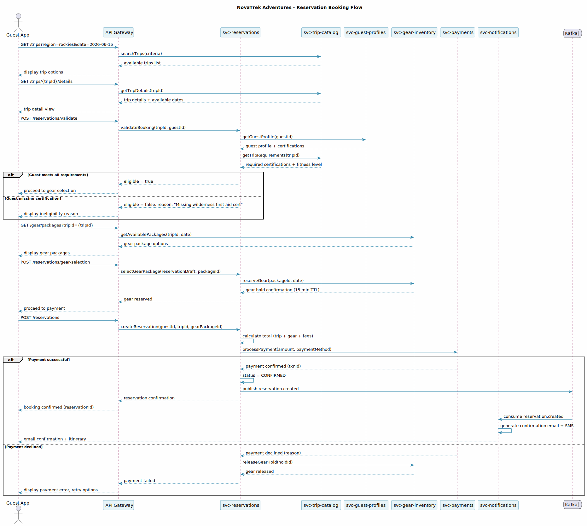
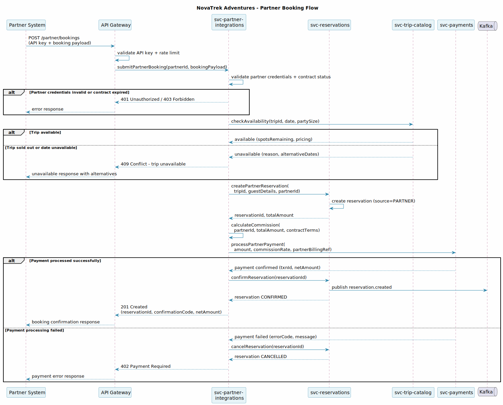
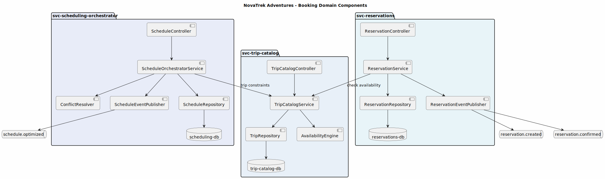

---
tags:
  - diagrams
  - svc-reservations
  - booking
---

# svc-reservations

| | |
|-----------|-------|
| **Service** | svc-reservations |
| **Domain** | Booking |
| **Team** | Booking Platform Team |
| **API Version** | 1.0.0 |
| **Base URL** | `https://api.novatrek.example.com/reservations/v1` |

---

## Purpose

Manages the full lifecycle of adventure reservations — creation, modification, cancellation, and participant management. Serves as the system of record for booking data consumed by check-in, scheduling, and guest-facing applications. Supports both direct guest bookings and partner/OTA channel bookings.

---

## Architecture Decisions

| ADR | Title | Status |
|-----|-------|--------|
| ADR-006 | Orchestrator Pattern | Accepted |
| ADR-007 | Four-Field Identity Verification | Accepted |

---

## Integration Points

| Direction | Service | Purpose |
|-----------|---------|---------|
| Called by | svc-check-in | Reservation and participant lookup for check-in |
| Called by | svc-scheduling-orchestrator | Trip scheduling and capacity data |
| Called by | svc-partner-integrations | Partner reservation creation |
| Calls | svc-guest-profiles | Guest identity validation on booking |
| Calls | svc-trip-catalog | Trip availability for booking creation |
| Calls | svc-gear-inventory | Gear package reservation |
| Calls | svc-payments | Payment processing |
| Publishes | Kafka `reservation.created`, `reservation.confirmed` | Consumed by svc-notifications, svc-analytics |

---

## Key Patterns

- **Multi-Source Bookings** — Reservations originate from direct bookings, partner integrations, and gift card redemptions. All sources populate the four verification fields required for kiosk check-in
- **Participant Count Accuracy** — Participant count is a verification field; changes after booking must be reflected accurately to prevent kiosk verification failures
- **Gear Hold TTL** — Gear packages are held for 15 minutes during booking flow; released automatically if payment fails

---

## Diagrams

### Reservation Booking Flow

Full guest booking sequence from trip search through payment confirmation. Shows the complete lifecycle: trip search, guest eligibility validation, gear package selection with temporary hold, payment processing, and confirmation notification.

<figure markdown>
  { loading=lazy width="100%" }
  <figcaption>Sequence — Direct guest booking: search, validate, select gear, pay, confirm</figcaption>
</figure>

---

### Partner Booking Flow

External partner (OTA) booking sequence through the integration API. Covers partner authentication, trip availability check, reservation creation with partner source tracking, commission calculation, and payment processing with rollback on failure.

<figure markdown>
  { loading=lazy width="100%" }
  <figcaption>Sequence — Partner/OTA booking: authenticate, check availability, create, pay</figcaption>
</figure>

---

### Booking Domain Components

Internal component structure of the booking domain showing svc-reservations alongside svc-trip-catalog and svc-scheduling-orchestrator. Illustrates controllers, services, repositories, event publishers, and the inter-service availability check flow.

<figure markdown>
  { loading=lazy width="100%" }
  <figcaption>Component — Booking domain internal structure (reservations, trip catalog, scheduling)</figcaption>
</figure>

---

## Recent Changes

| Ticket | Change |
|--------|--------|
| NTK-10002 | Adventure category field used by check-in classification system |
| NTK-10003 | Reservation lookup endpoint consumed by unregistered guest flow |

---

## Technical Debt

- Participant count change propagation should be verified end-to-end with kiosk verification flow
