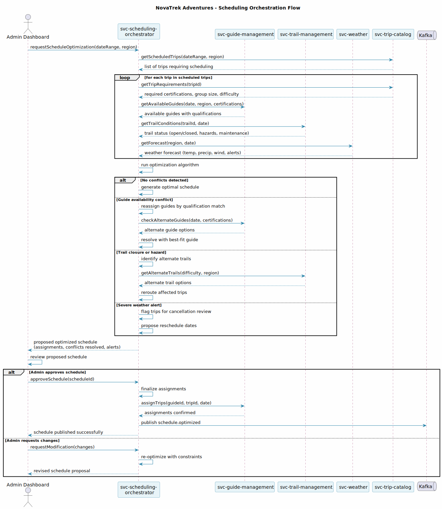

---
tags:
  - diagrams
  - svc-trail-management
  - operations
---

# svc-trail-management

| | |
|-----------|-------|
| **Service** | svc-trail-management |
| **Domain** | Trail Operations |
| **Team** | NovaTrek Platform Team |
| **API Version** | 1.0.0 |
| **Base URL** | `https://api.novatrek.example.com/trails/v1` |

---

## Purpose

Manages trail definitions, waypoints, difficulty ratings, closures, and real-time condition status for all NovaTrek Adventures trail networks. Serves as the system of record for trail geography and operational state. Provides trail condition data to the scheduling orchestrator for route optimization and safety decisions.

---

## Architecture Decisions

| ADR | Title | Status |
|-----|-------|--------|
| ADR-003 | Nullable Elevation Fields | Accepted |

---

## Integration Points

| Direction | Service | Purpose |
|-----------|---------|---------|
| Called by | svc-scheduling-orchestrator | Trail conditions, closures, elevation data for schedule optimization |
| Called by | svc-trip-catalog | Trail data for trip definitions |
| Called by | svc-safety-compliance | Trail hazard data for safety assessments |

---

## Key Patterns

- **Nullable Data Fields** — New data fields (e.g., `elevation_gain_meters`, `elevation_loss_meters`) use nullable semantics to avoid blocking deployment on data backfill. `null` means no data available, `0` means flat terrain. Consumers must handle `null` explicitly
- **Incremental Data Population** — Trail elevation data is populated incrementally as surveys complete. No big-bang backfill required
- **Trail Condition Reporting** — Real-time updates for trail status (open, closed, hazard) consumed by the scheduling orchestrator for conflict resolution

---

## Diagrams

### Scheduling Orchestration Flow

svc-trail-management appears in the scheduling orchestration flow as a data provider. The scheduling orchestrator queries trail conditions, closures, and alternate trails during the optimization process. When a trail closure or hazard is detected, the orchestrator requests alternate trail options.

<figure markdown>
  { loading=lazy width="100%" }
  <figcaption>Sequence — svc-trail-management provides trail conditions and alternate routes to the scheduling orchestrator</figcaption>
</figure>

---

## Recent Changes

| Ticket | Change |
|--------|--------|
| NTK-10001 | Added `elevation_gain_meters` and `elevation_loss_meters` nullable fields to trail response |

---

## Technical Debt

- No source code in the workspace for this service (API spec only) — source code location TBD
- Elevation data population status: unknown percentage of trails have elevation data populated
