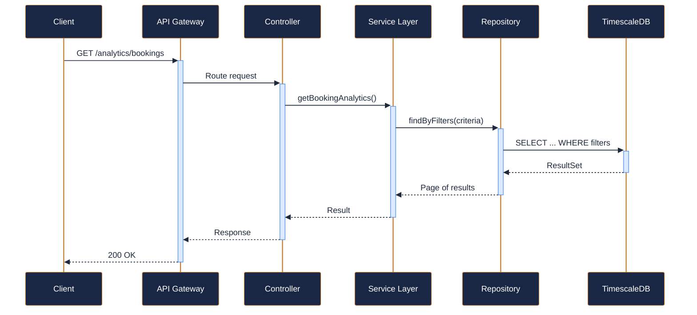
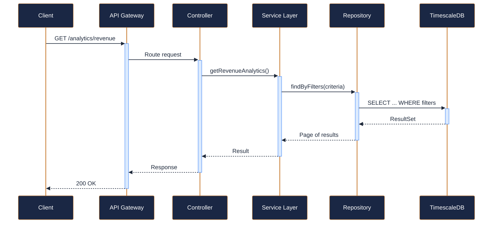
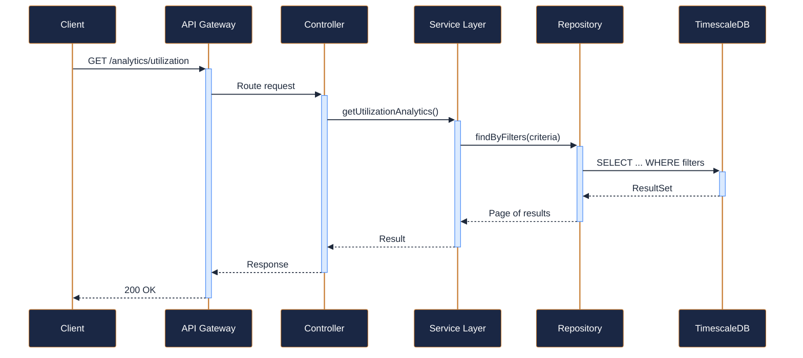
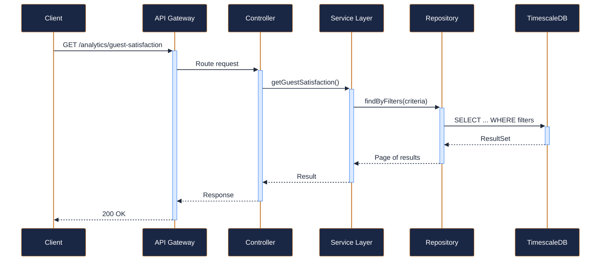
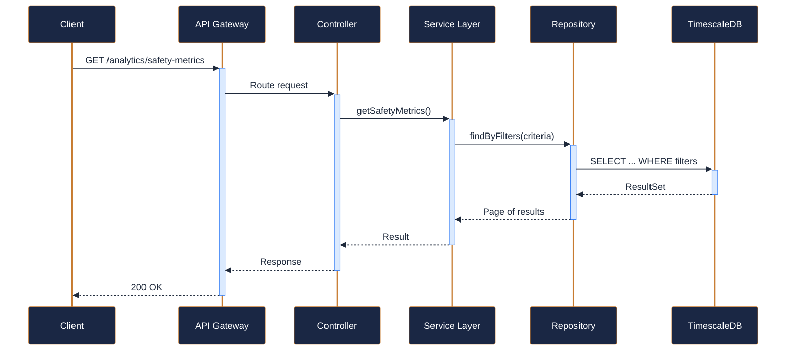
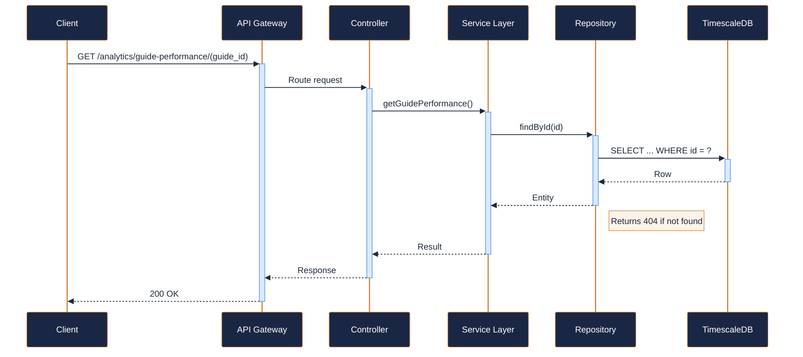

---
tags:
  - microservice
  - svc-analytics
  - support
---

# svc-analytics

**NovaTrek Analytics Service** &nbsp;|&nbsp; Support &nbsp;|&nbsp; `v1.3.0` &nbsp;|&nbsp; *NovaTrek Data & Insights Team*

> Provides operational analytics, reporting dashboards, and key performance

[:material-api: Swagger UI](../services/api/svc-analytics.html){ .md-button .md-button--primary }
[:material-file-download: Download OpenAPI Spec](../specs/svc-analytics.yaml){ .md-button }

---

## :material-database: Data Store

| Property | Detail |
|----------|--------|
| **Engine** | TimescaleDB (PostgreSQL 15) |
| **Schema** | `analytics` |
| **Primary Tables** | `booking_metrics`, `revenue_metrics`, `utilization_metrics`, `satisfaction_scores`, `safety_metrics`, `guide_performance` |
| **Key Features** | TimescaleDB hypertables for time-series aggregation · Continuous aggregates for real-time dashboards · 30-day raw retention, 2-year aggregate retention |
| **Estimated Volume** | ~50K metric inserts/day (event-driven) |

---

## :material-api: Endpoints (6 total)

---

### GET `/analytics/bookings` — Get booking analytics for a period { .endpoint-get }

[:material-open-in-new: View in Swagger UI](../services/api/svc-analytics.html#/Bookings/getBookingAnalytics){ .md-button }

---

### GET `/analytics/revenue` — Get revenue analytics for a period { .endpoint-get }

[:material-open-in-new: View in Swagger UI](../services/api/svc-analytics.html#/Revenue/getRevenueAnalytics){ .md-button }

---

### GET `/analytics/utilization` — Get resource utilization analytics { .endpoint-get }

[:material-open-in-new: View in Swagger UI](../services/api/svc-analytics.html#/Utilization/getUtilizationAnalytics){ .md-button }

---

### GET `/analytics/guest-satisfaction` — Get guest satisfaction metrics { .endpoint-get }

[:material-open-in-new: View in Swagger UI](../services/api/svc-analytics.html#/Guest%20Experience/getGuestSatisfaction){ .md-button }

---

### GET `/analytics/safety-metrics` — Get safety and incident metrics { .endpoint-get }

> Aggregates data from svc-safety-compliance incident reports.

[:material-open-in-new: View in Swagger UI](../services/api/svc-analytics.html#/Safety/getSafetyMetrics){ .md-button }

---

### GET `/analytics/guide-performance/{guide_id}` — Get performance metrics for a specific guide { .endpoint-get }

[:material-open-in-new: View in Swagger UI](../services/api/svc-analytics.html#/Staff/getGuidePerformance){ .md-button }

