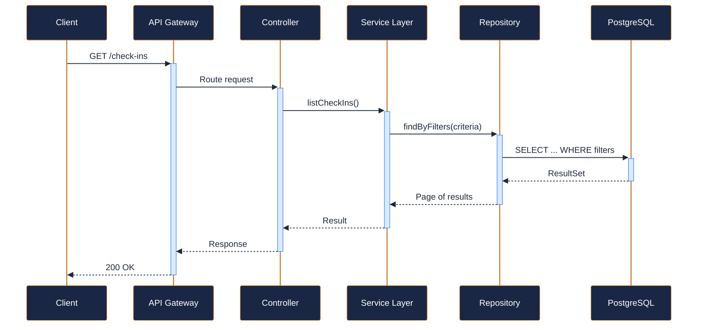
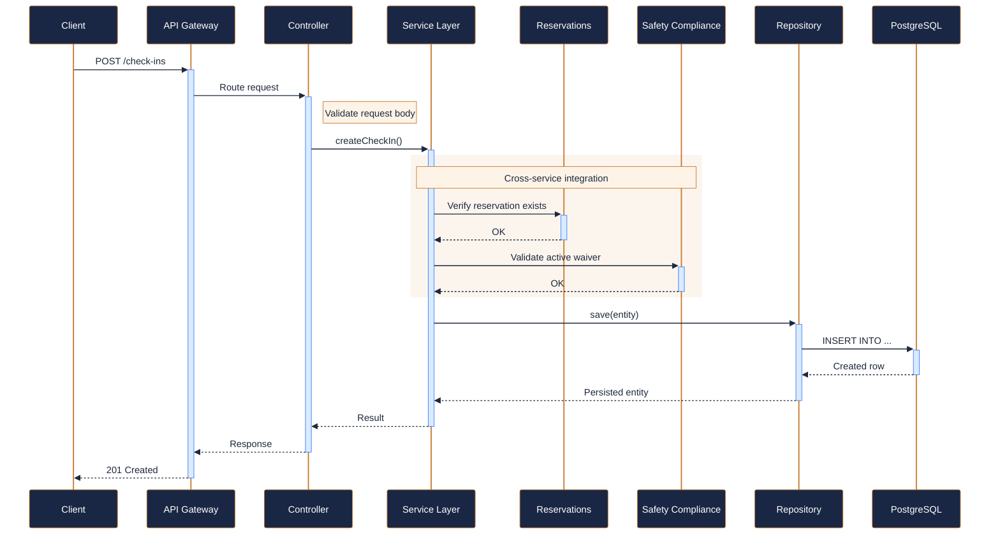
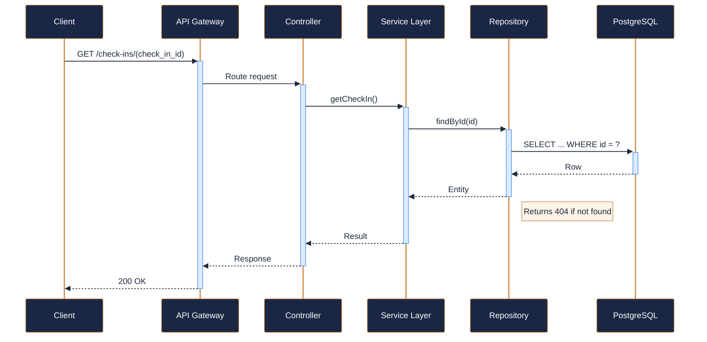
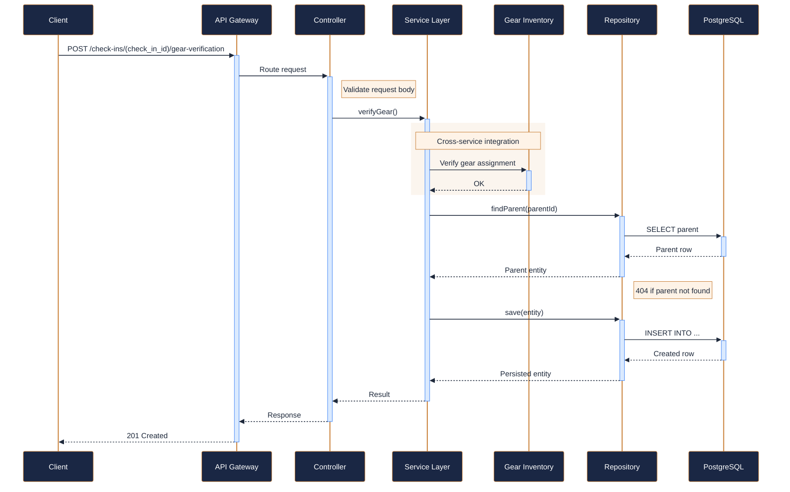
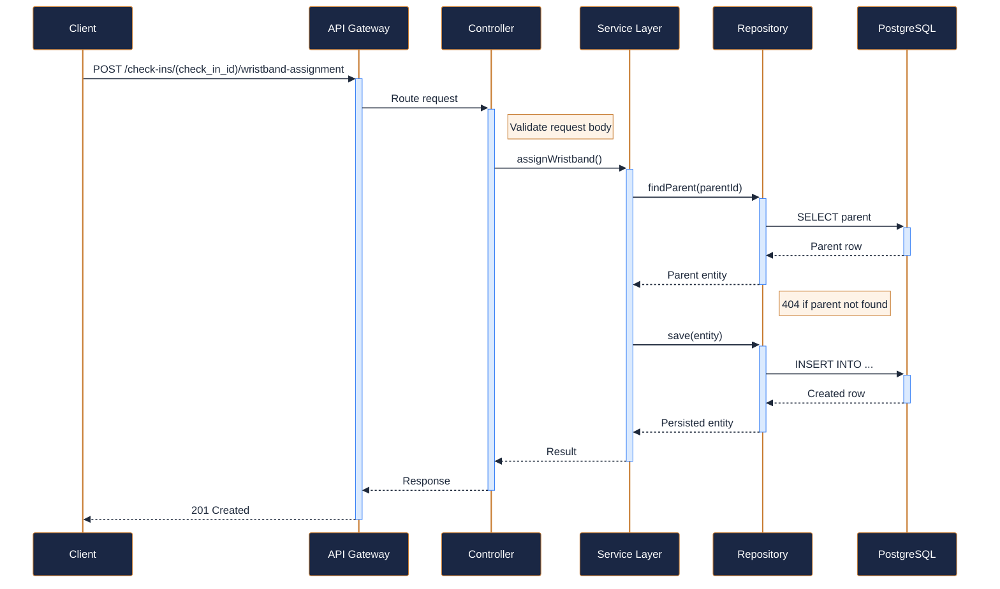

---
tags:
  - microservice
  - svc-check-in
  - operations
---

# svc-check-in

**NovaTrek Check-In Service** &nbsp;|&nbsp; Operations &nbsp;|&nbsp; `v1.0.0` &nbsp;|&nbsp; *NovaTrek Operations Team*

> Handles day-of-adventure check-in workflow including wristband assignment,

[:material-api: Swagger UI](../services/api/svc-check-in.html){ .md-button .md-button--primary }
[:material-file-download: Download OpenAPI Spec](../specs/svc-check-in.yaml){ .md-button }

---

## :material-database: Data Store

| Property | Detail |
|----------|--------|
| **Engine** | PostgreSQL 15 |
| **Schema** | `checkin` |
| **Primary Tables** | `check_ins`, `gear_verifications`, `wristband_assignments` |
| **Key Features** | Indexes on reservation_id and check_in_date · TTL-based cleanup of stale check-ins (older than 24h) · Composite unique constraint on (reservation_id, participant_id) |
| **Estimated Volume** | ~5,000 check-ins/day peak season |

---

## :material-api: Endpoints (5 total)

---

### GET `/check-ins` — List check-ins by reservation { .endpoint-get }

[:material-open-in-new: View in Swagger UI](../services/api/svc-check-in.html#/Check-Ins/listCheckIns){ .md-button }

---

### POST `/check-ins` — Initiate check-in for a participant { .endpoint-post }

> Begins the check-in process for a reservation participant. Validates that

[:material-open-in-new: View in Swagger UI](../services/api/svc-check-in.html#/Check-Ins/createCheckIn){ .md-button }

---

### GET `/check-ins/{check_in_id}` — Get check-in details { .endpoint-get }

[:material-open-in-new: View in Swagger UI](../services/api/svc-check-in.html#/Check-Ins/getCheckIn){ .md-button }

---

### POST `/check-ins/{check_in_id}/gear-verification` — Verify gear has been picked up and fitted { .endpoint-post }

> Records that the participant has received and been fitted with required

[:material-open-in-new: View in Swagger UI](../services/api/svc-check-in.html#/Check-Ins/verifyGear){ .md-button }

---

### POST `/check-ins/{check_in_id}/wristband-assignment` — Assign RFID wristband to checked-in participant { .endpoint-post }

> Assigns a color-coded RFID wristband for tracking and access control

[:material-open-in-new: View in Swagger UI](../services/api/svc-check-in.html#/Check-Ins/assignWristband){ .md-button }

