---
tags:
  - microservice
  - svc-gear-inventory
  - logistics
---

# svc-gear-inventory

**NovaTrek Adventures - Gear Inventory Service** &nbsp;|&nbsp; Logistics &nbsp;|&nbsp; `v2.4.0` &nbsp;|&nbsp; *NovaTrek Platform Engineering*

> Manages rental equipment inventory, gear packages, guest assignments,

[:material-api: Swagger UI](../services/api/svc-gear-inventory.html){ .md-button .md-button--primary }
[:material-file-download: Download OpenAPI Spec](../specs/svc-gear-inventory.yaml){ .md-button }

---

## :material-database: Data Store

| Property | Detail |
|----------|--------|
| **Engine** | PostgreSQL 15 |
| **Schema** | `gear` |
| **Primary Tables** | `gear_items`, `gear_packages`, `gear_assignments`, `maintenance_records`, `inventory_levels` |
| **Key Features** | RFID tag tracking via unique identifiers · Scheduled maintenance alerts with cron triggers · Location-based inventory partitioning |
| **Estimated Volume** | ~1,500 assignments/day peak season |

---

## :material-api: Endpoints (12 total)

---

### GET `/gear-items` — Search gear inventory { .endpoint-get }

> Returns a paginated list of gear items matching the provided filters.

[:material-open-in-new: View in Swagger UI](../services/api/svc-gear-inventory.html#/Gear%20Items/searchGearItems){ .md-button }

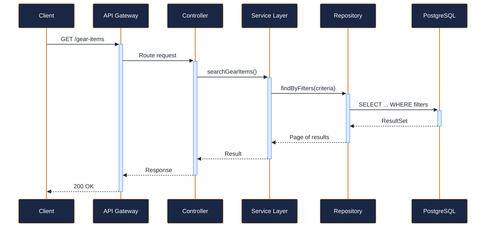

---

### POST `/gear-items` — Add new inventory item { .endpoint-post }

> Registers a new piece of gear in the inventory system.

[:material-open-in-new: View in Swagger UI](../services/api/svc-gear-inventory.html#/Gear%20Items/addGearItem){ .md-button }

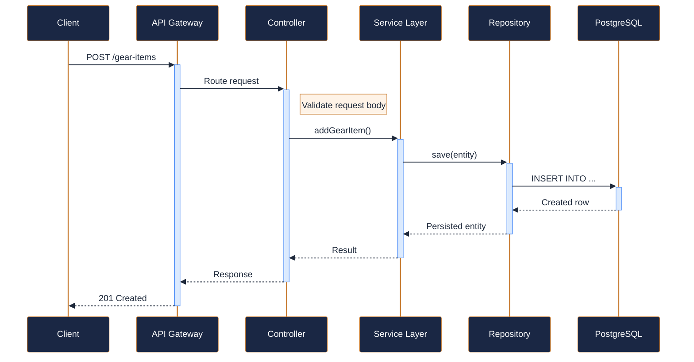

---

### GET `/gear-items/{item_id}` — Get gear item details { .endpoint-get }

> Returns full details for a single gear item including current status and maintenance schedule.

[:material-open-in-new: View in Swagger UI](../services/api/svc-gear-inventory.html#/Gear%20Items/getGearItem){ .md-button }

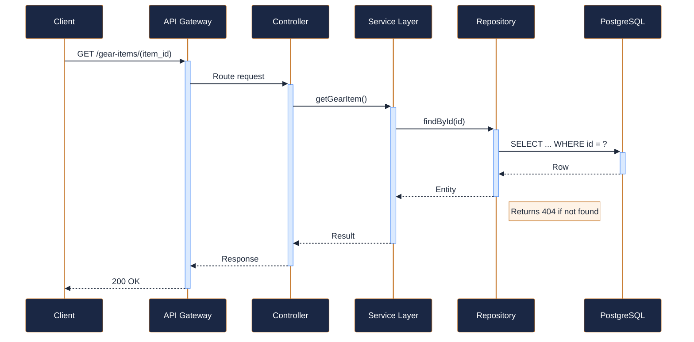

---

### PATCH `/gear-items/{item_id}` — Update gear item { .endpoint-patch }

> Partially updates a gear item record. Only provided fields are modified.

[:material-open-in-new: View in Swagger UI](../services/api/svc-gear-inventory.html#/Gear%20Items/updateGearItem){ .md-button }

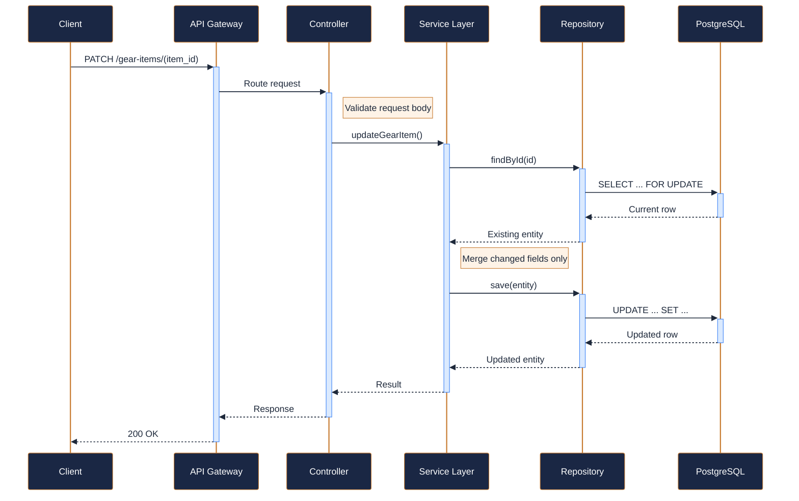

---

### GET `/gear-packages` — List gear packages { .endpoint-get }

> Returns all predefined gear bundles, optionally filtered by activity type.

[:material-open-in-new: View in Swagger UI](../services/api/svc-gear-inventory.html#/Gear%20Packages/listGearPackages){ .md-button }

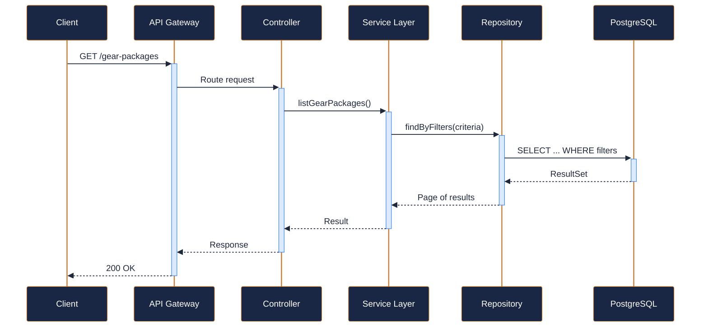

---

### GET `/gear-packages/{package_id}` — Get gear package details { .endpoint-get }

> Returns full details for a gear package including the list of included items and pricing.

[:material-open-in-new: View in Swagger UI](../services/api/svc-gear-inventory.html#/Gear%20Packages/getGearPackage){ .md-button }

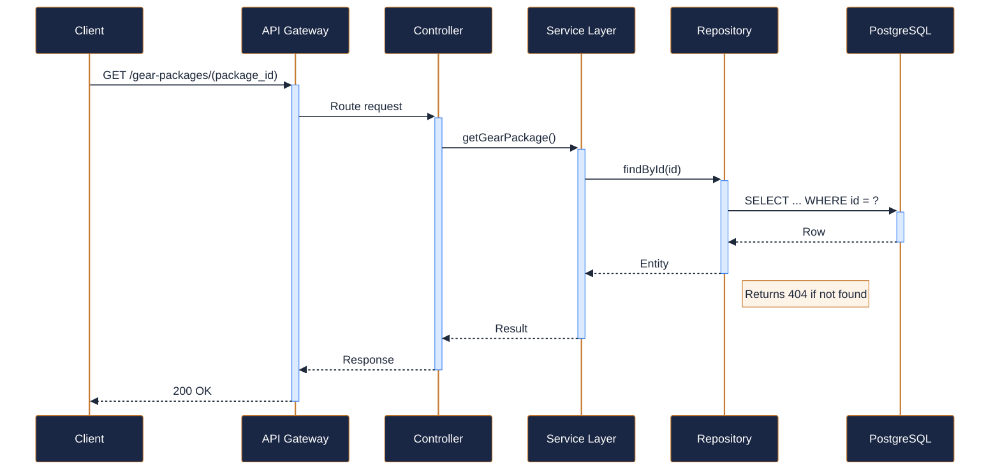

---

### POST `/gear-assignments` — Assign gear to a participant { .endpoint-post }

> Creates a gear assignment linking inventory items to a trip participant.

[:material-open-in-new: View in Swagger UI](../services/api/svc-gear-inventory.html#/Gear%20Assignments/createGearAssignment){ .md-button }

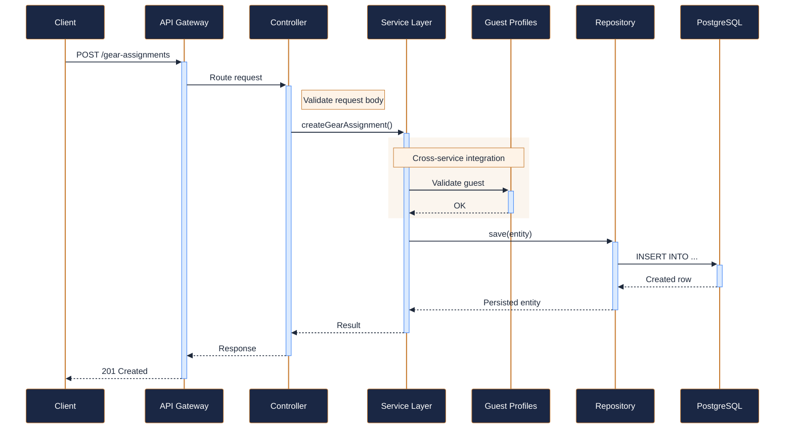

---

### GET `/gear-assignments/{assignment_id}` — Get gear assignment details { .endpoint-get }

> Returns full details of a gear assignment including item list and return status.

[:material-open-in-new: View in Swagger UI](../services/api/svc-gear-inventory.html#/Gear%20Assignments/getGearAssignment){ .md-button }

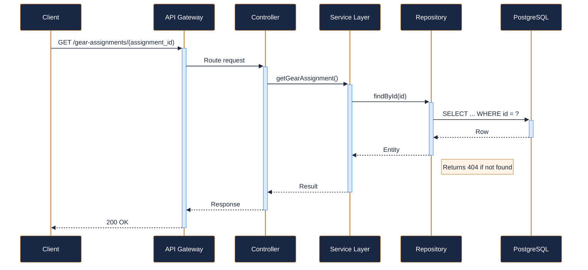

---

### DELETE `/gear-assignments/{assignment_id}` — Return gear (close assignment) { .endpoint-delete }

> Marks gear as returned and closes the assignment. Accepts optional

[:material-open-in-new: View in Swagger UI](../services/api/svc-gear-inventory.html#/Gear%20Assignments/returnGearAssignment){ .md-button }

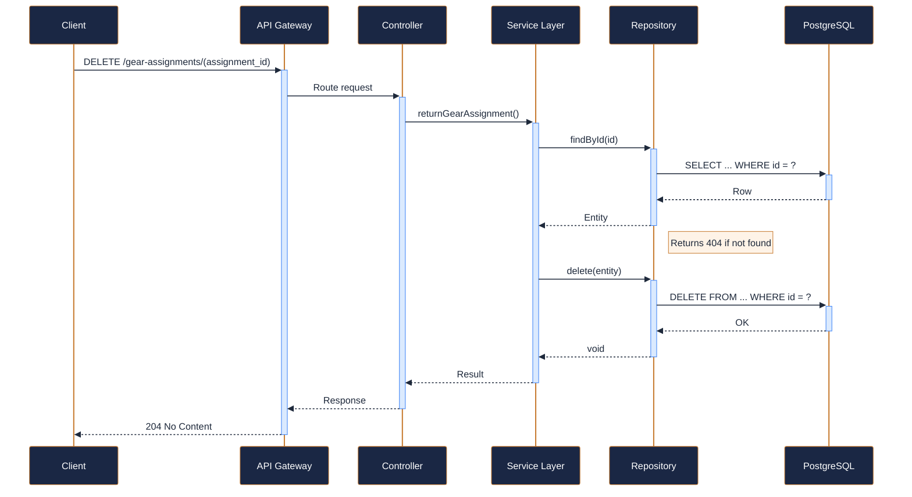

---

### PUT `/gear-items/{item_id}/maintenance` — Log a maintenance event { .endpoint-put }

> Records a maintenance event (inspection, repair, or part replacement) for a gear item and updates its condition and next-due date.

[:material-open-in-new: View in Swagger UI](../services/api/svc-gear-inventory.html#/Maintenance/logMaintenanceEvent){ .md-button }

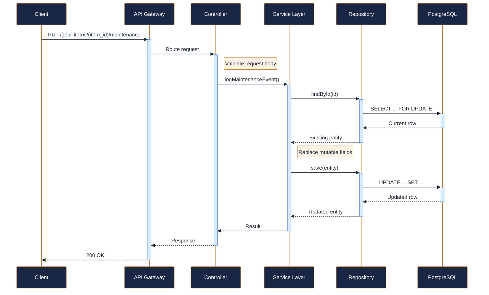

---

### GET `/gear-items/{item_id}/maintenance-history` — Get maintenance history { .endpoint-get }

> Returns the chronological maintenance history for a specific gear item.

[:material-open-in-new: View in Swagger UI](../services/api/svc-gear-inventory.html#/Maintenance/getMaintenanceHistory){ .md-button }

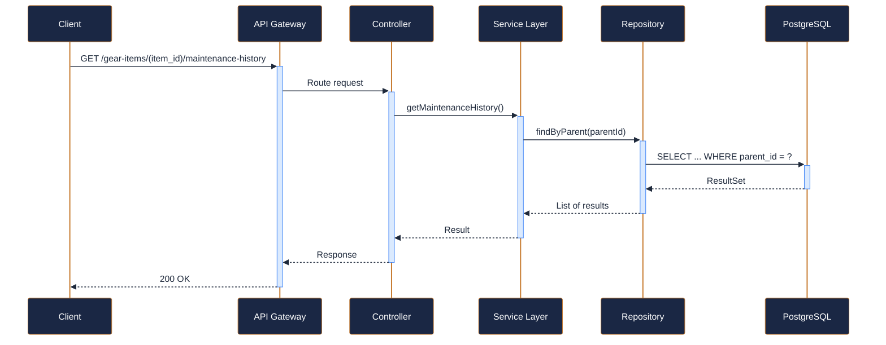

---

### GET `/inventory-levels` — Get stock levels by location and category { .endpoint-get }

> Returns current inventory counts broken down by location and gear category, including available, assigned, and in-maintenance tallies.

[:material-open-in-new: View in Swagger UI](../services/api/svc-gear-inventory.html#/Inventory%20Levels/getInventoryLevels){ .md-button }

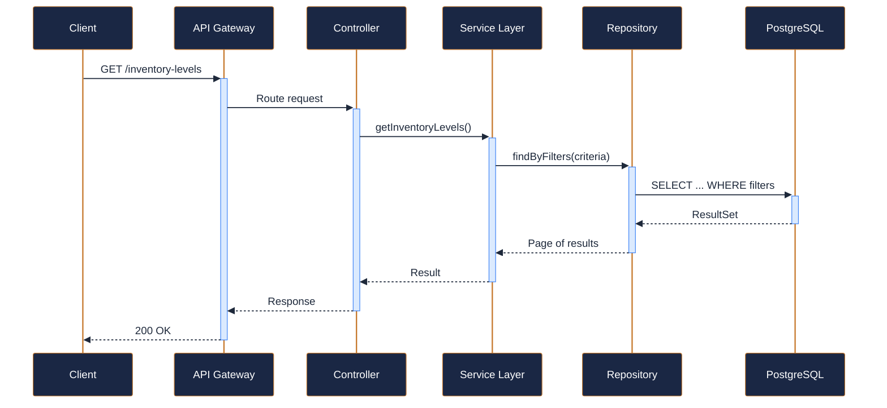
