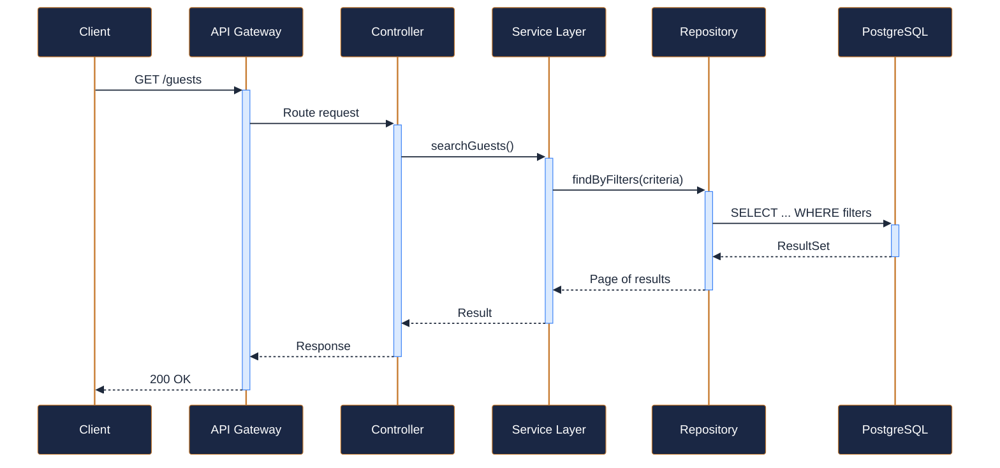
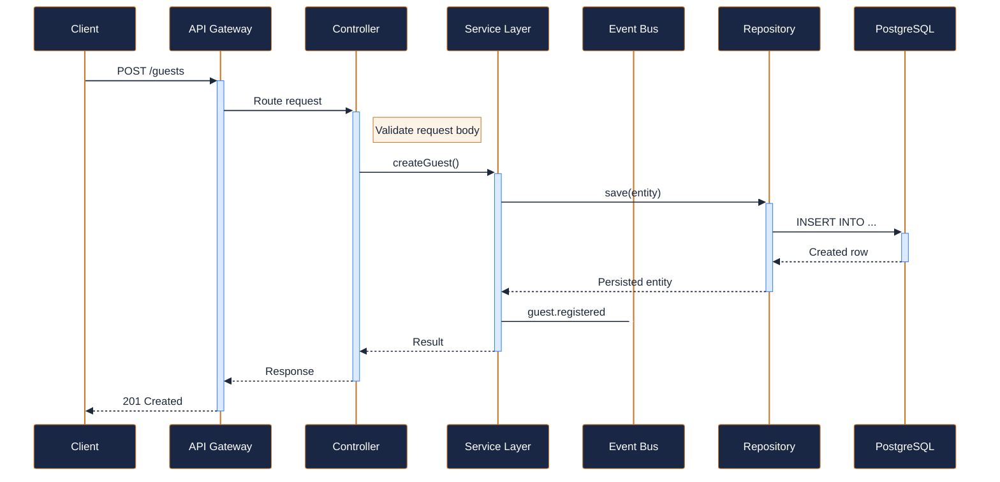
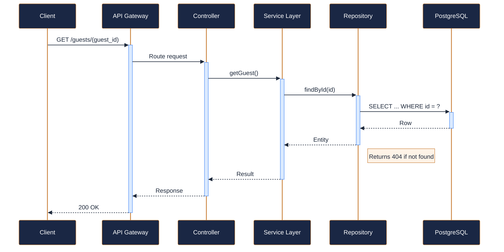
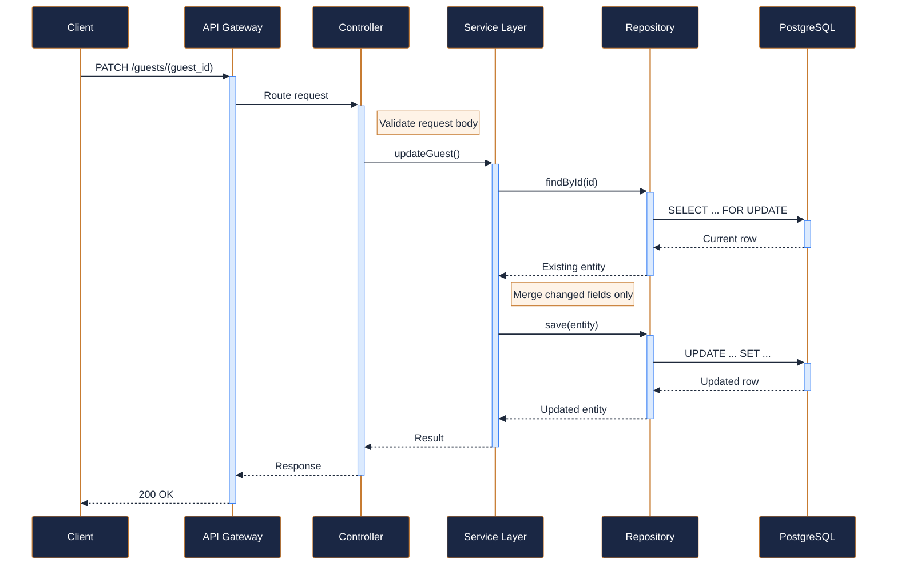
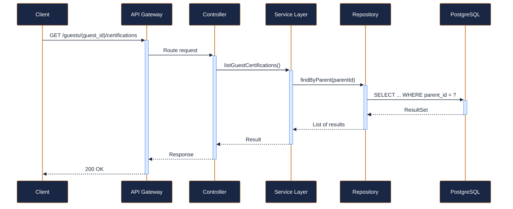
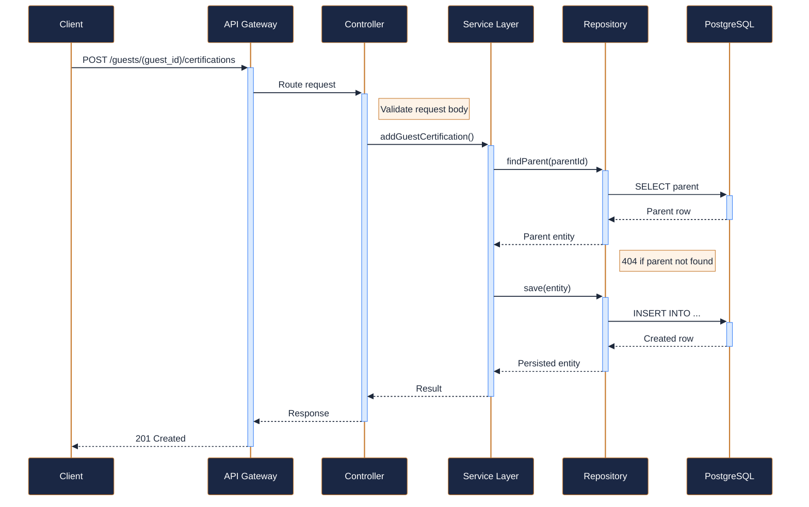
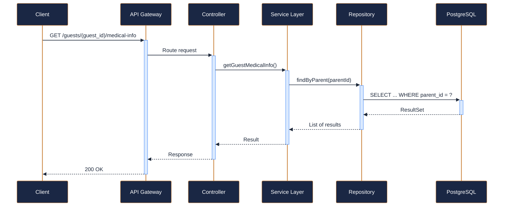
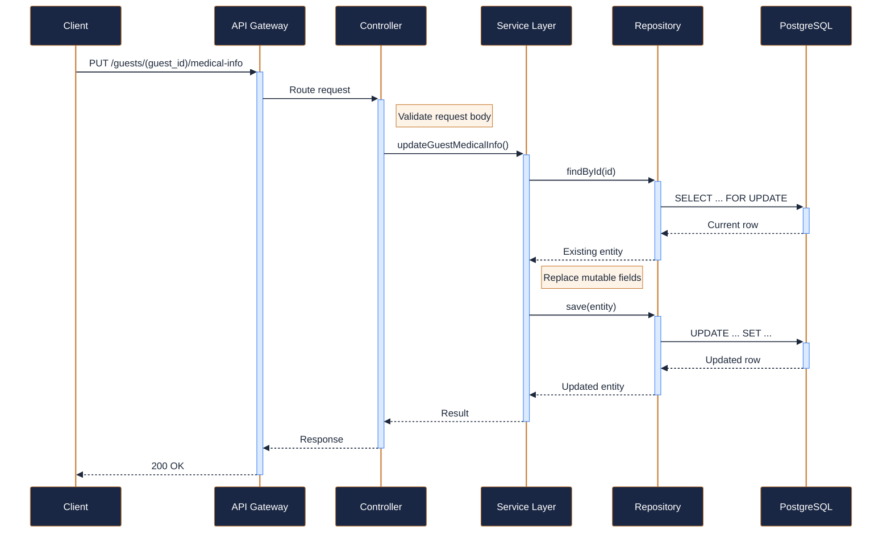
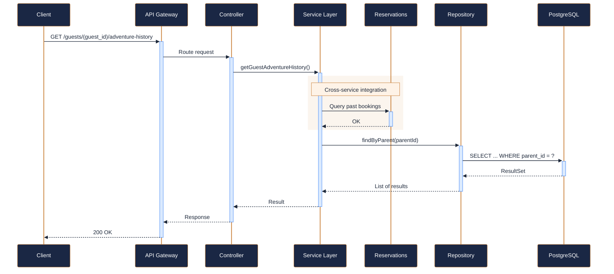

---
tags:
  - microservice
  - svc-guest-profiles
  - guest-identity
---

# svc-guest-profiles

**NovaTrek Adventures - Guest Profiles Service** &nbsp;|&nbsp; Guest Identity &nbsp;|&nbsp; `v2.4.0` &nbsp;|&nbsp; *NovaTrek Platform Engineering*

> Manages guest registration, profile management, preferences, medical

[:material-api: Swagger UI](../services/api/svc-guest-profiles.html){ .md-button .md-button--primary }
[:material-file-download: Download OpenAPI Spec](../specs/svc-guest-profiles.yaml){ .md-button }

---

## :material-database: Data Store

| Property | Detail |
|----------|--------|
| **Engine** | PostgreSQL 15 |
| **Schema** | `guests` |
| **Primary Tables** | `guest_profiles`, `certifications`, `medical_info`, `emergency_contacts`, `adventure_history` |
| **Key Features** | PII encrypted at rest (AES-256) · Composite index on (last_name, date_of_birth) · Soft delete with GDPR data retention policy |
| **Estimated Volume** | ~800 new profiles/day peak season |

---

## :material-api: Endpoints (9 total)

---

### GET `/guests` — Search guests { .endpoint-get }

> Search and filter the guest registry. Supports partial name matching,

[:material-open-in-new: View in Swagger UI](../services/api/svc-guest-profiles.html#/Guests/searchGuests){ .md-button }

---

### POST `/guests` — Register a new guest { .endpoint-post }

> Create a new guest profile. The email address must be unique across

[:material-open-in-new: View in Swagger UI](../services/api/svc-guest-profiles.html#/Guests/createGuest){ .md-button }

---

### GET `/guests/{guest_id}` — Get guest profile { .endpoint-get }

> Retrieve the full profile for a specific guest by ID.

[:material-open-in-new: View in Swagger UI](../services/api/svc-guest-profiles.html#/Guests/getGuest){ .md-button }

---

### PATCH `/guests/{guest_id}` — Update guest profile { .endpoint-patch }

> Partially update a guest profile. Only the fields provided in the

[:material-open-in-new: View in Swagger UI](../services/api/svc-guest-profiles.html#/Guests/updateGuest){ .md-button }

---

### GET `/guests/{guest_id}/certifications` — List guest certifications { .endpoint-get }

> Retrieve all certifications on file for a guest, including expired

[:material-open-in-new: View in Swagger UI](../services/api/svc-guest-profiles.html#/Certifications/listGuestCertifications){ .md-button }

---

### POST `/guests/{guest_id}/certifications` — Add a certification { .endpoint-post }

> Record a new certification for a guest. Certification documents

[:material-open-in-new: View in Swagger UI](../services/api/svc-guest-profiles.html#/Certifications/addGuestCertification){ .md-button }

---

### GET `/guests/{guest_id}/medical-info` — Get guest medical information { .endpoint-get }

> Retrieve the medical information on file for a guest. Access to this

[:material-open-in-new: View in Swagger UI](../services/api/svc-guest-profiles.html#/Medical/getGuestMedicalInfo){ .md-button }

---

### PUT `/guests/{guest_id}/medical-info` — Update guest medical information { .endpoint-put }

> Replace the medical information record for a guest. This is a full

[:material-open-in-new: View in Swagger UI](../services/api/svc-guest-profiles.html#/Medical/updateGuestMedicalInfo){ .md-button }

---

### GET `/guests/{guest_id}/adventure-history` — Get guest adventure history { .endpoint-get }

> Retrieve the adventure participation history for a guest. Each entry

[:material-open-in-new: View in Swagger UI](../services/api/svc-guest-profiles.html#/History/getGuestAdventureHistory){ .md-button }

