---
tags:
  - microservice
  - svc-guide-management
  - guide-management
---

# svc-guide-management

**NovaTrek Guide Management Service** &nbsp;|&nbsp; Guide Management &nbsp;|&nbsp; `v2.4.0` &nbsp;|&nbsp; *NovaTrek Platform Engineering*

> Manages adventure guides for NovaTrek Adventures, including guide profiles,

[:material-api: Swagger UI](../services/api/svc-guide-management.html){ .md-button .md-button--primary }
[:material-file-download: Download OpenAPI Spec](../specs/svc-guide-management.yaml){ .md-button }

---

## :material-database: Data Store

| Property | Detail |
|----------|--------|
| **Engine** | PostgreSQL 15 |
| **Schema** | `guides` |
| **Primary Tables** | `guides`, `certifications`, `guide_schedules`, `availability_windows`, `ratings` |
| **Key Features** | Certification expiry tracking with automated alerts · Availability window overlap detection constraints · Weighted rating aggregation with recency bias |
| **Estimated Volume** | ~100 schedule updates/day, ~500 availability queries/day |

---

## :material-api: Endpoints (12 total)

---

### GET `/guides` — Search guides with filters { .endpoint-get }

> Returns a paginated list of guides matching the specified filter criteria.

[:material-open-in-new: View in Swagger UI](../services/api/svc-guide-management.html#/Guides/searchGuides){ .md-button }

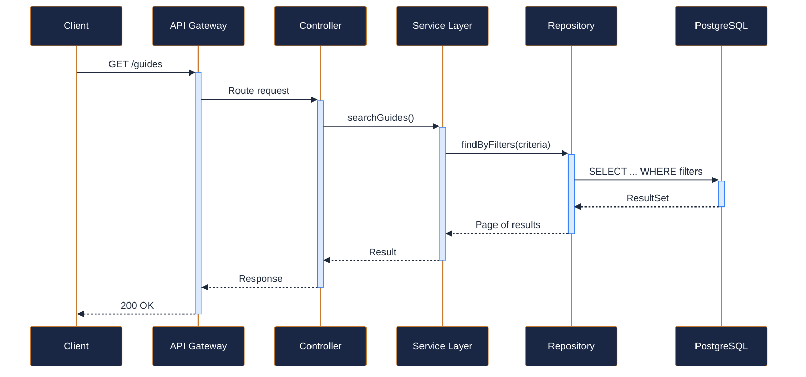

---

### POST `/guides` — Create a new guide profile { .endpoint-post }

> Registers a new adventure guide in the system.

[:material-open-in-new: View in Swagger UI](../services/api/svc-guide-management.html#/Guides/createGuide){ .md-button }

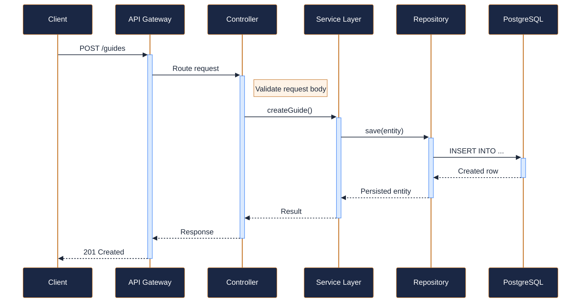

---

### GET `/guides/{guide_id}` — Get guide by ID { .endpoint-get }

> Retrieves the full profile for a specific guide.

[:material-open-in-new: View in Swagger UI](../services/api/svc-guide-management.html#/Guides/getGuide){ .md-button }

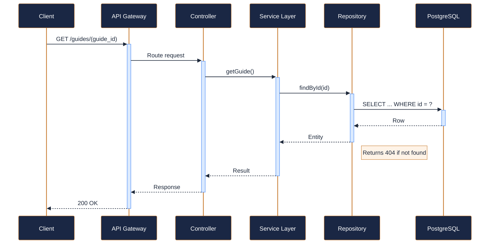

---

### PATCH `/guides/{guide_id}` — Update guide profile { .endpoint-patch }

> Partially updates a guide profile. Only provided fields are modified.

[:material-open-in-new: View in Swagger UI](../services/api/svc-guide-management.html#/Guides/updateGuide){ .md-button }

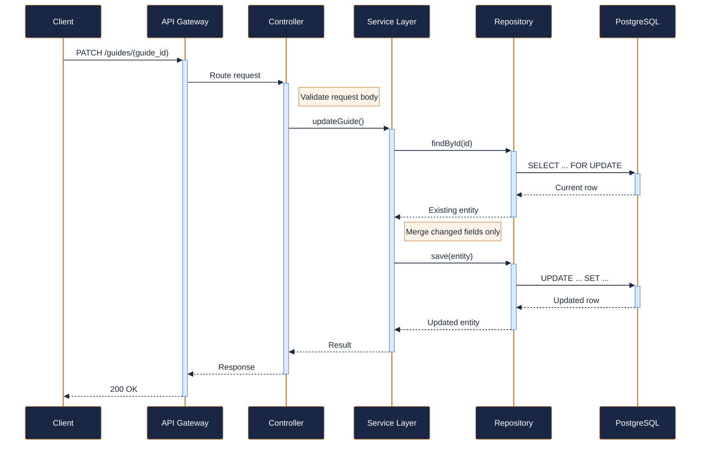

---

### GET `/guides/{guide_id}/certifications` — List guide certifications { .endpoint-get }

> Returns all certifications held by the specified guide.

[:material-open-in-new: View in Swagger UI](../services/api/svc-guide-management.html#/Certifications/getGuideCertifications){ .md-button }

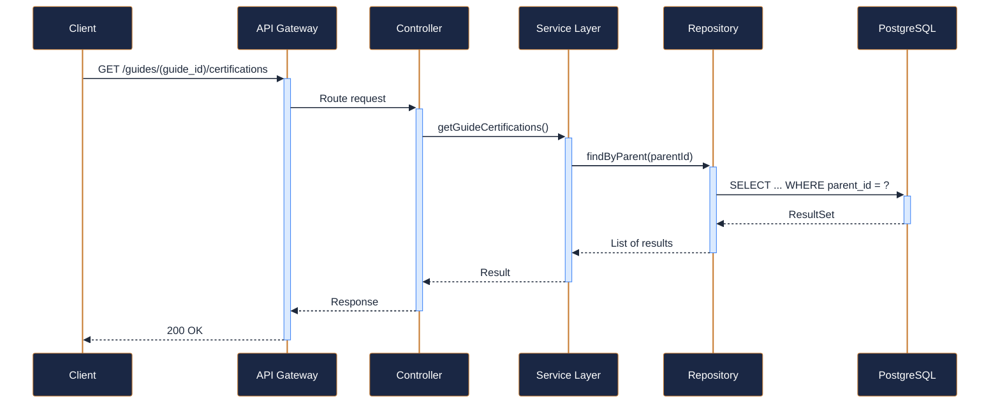

---

### POST `/guides/{guide_id}/certifications` — Add a certification to a guide { .endpoint-post }

> Records a new certification for the specified guide.

[:material-open-in-new: View in Swagger UI](../services/api/svc-guide-management.html#/Certifications/addGuideCertification){ .md-button }

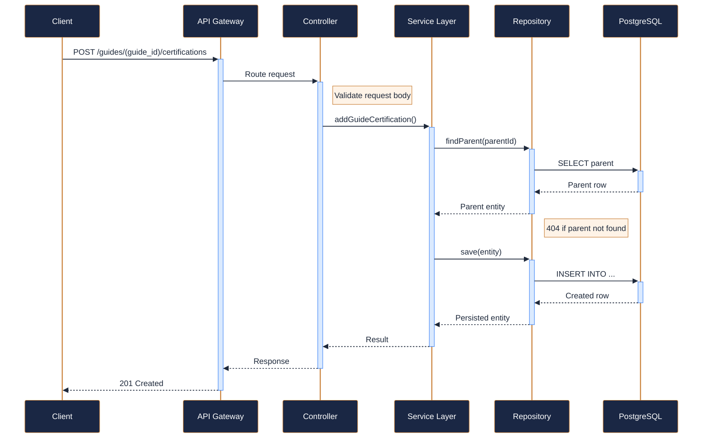

---

### GET `/guides/{guide_id}/schedule` — Get upcoming trip assignments { .endpoint-get }

> Returns the guide's upcoming scheduled trip assignments.

[:material-open-in-new: View in Swagger UI](../services/api/svc-guide-management.html#/Scheduling/getGuideSchedule){ .md-button }

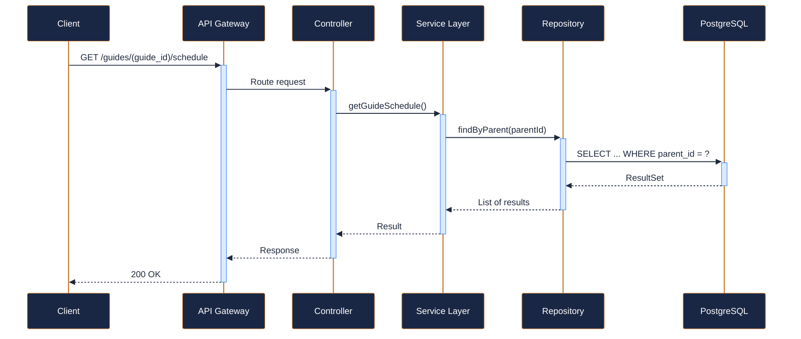

---

### GET `/guides/{guide_id}/availability` — Get guide availability windows { .endpoint-get }

> Returns the availability windows configured for this guide.

[:material-open-in-new: View in Swagger UI](../services/api/svc-guide-management.html#/Availability/getGuideAvailability){ .md-button }

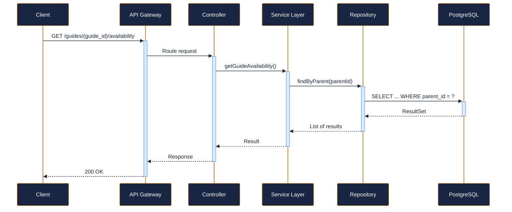

---

### POST `/guides/{guide_id}/availability` — Set availability windows { .endpoint-post }

> Creates or updates availability windows for the guide.

[:material-open-in-new: View in Swagger UI](../services/api/svc-guide-management.html#/Availability/setGuideAvailability){ .md-button }

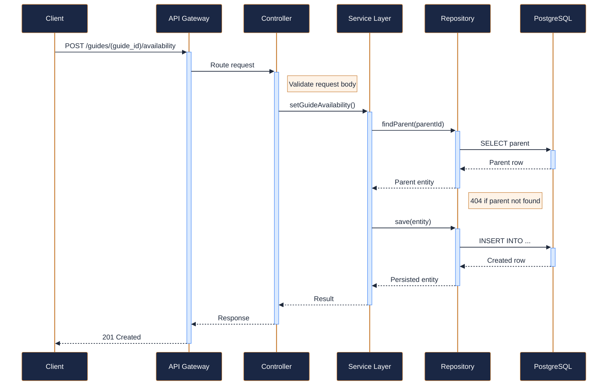

---

### GET `/guides/{guide_id}/ratings` — Get guest ratings and reviews { .endpoint-get }

> Returns paginated guest ratings and reviews for the specified guide.

[:material-open-in-new: View in Swagger UI](../services/api/svc-guide-management.html#/Ratings/getGuideRatings){ .md-button }

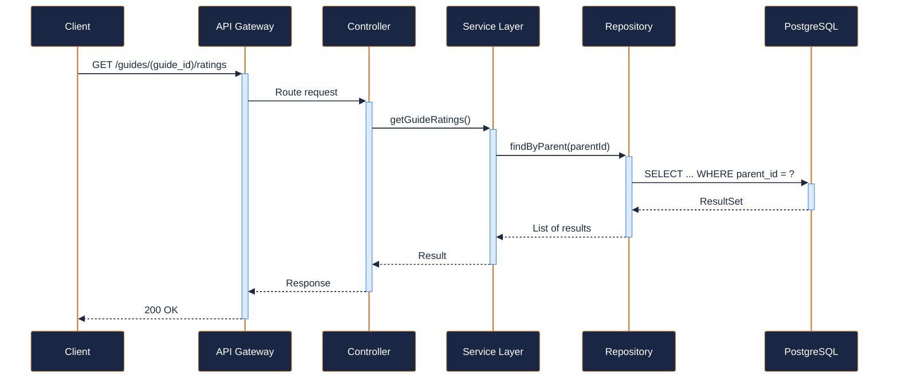

---

### POST `/guides/{guide_id}/ratings` — Submit a guest rating { .endpoint-post }

> Records a guest rating and optional review for a guide.

[:material-open-in-new: View in Swagger UI](../services/api/svc-guide-management.html#/Ratings/submitGuideRating){ .md-button }

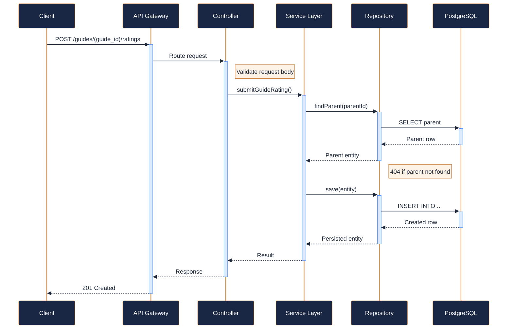

---

### GET `/guides/available` — Find available guides for a date, activity, and region { .endpoint-get }

> Searches for guides who are available on the specified date, hold relevant

[:material-open-in-new: View in Swagger UI](../services/api/svc-guide-management.html#/Availability/findAvailableGuides){ .md-button }

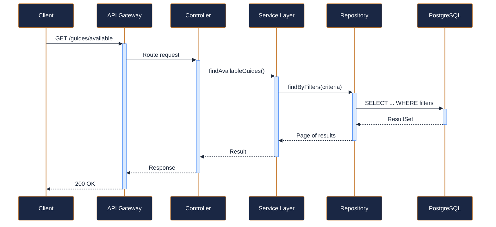
