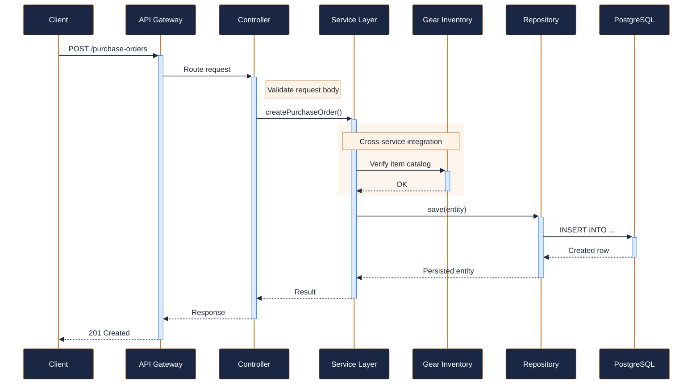
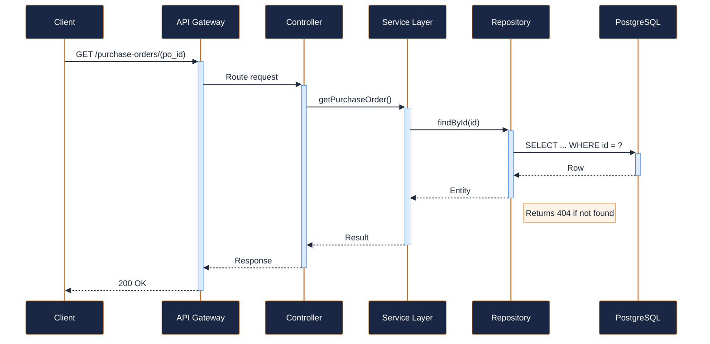
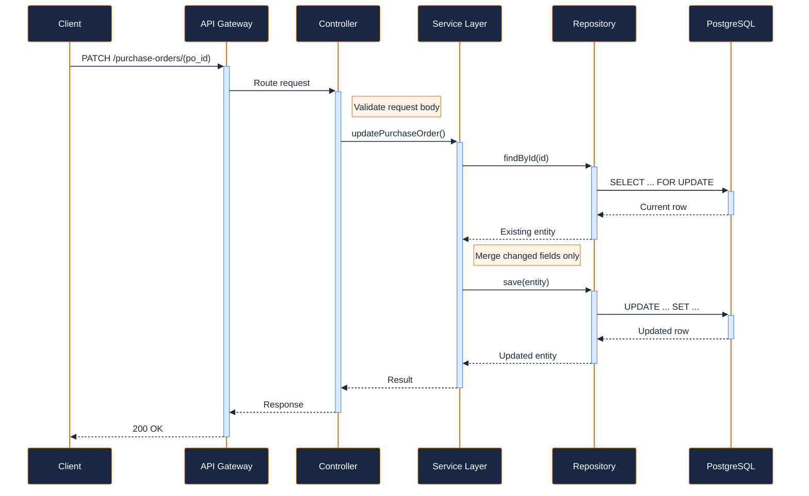
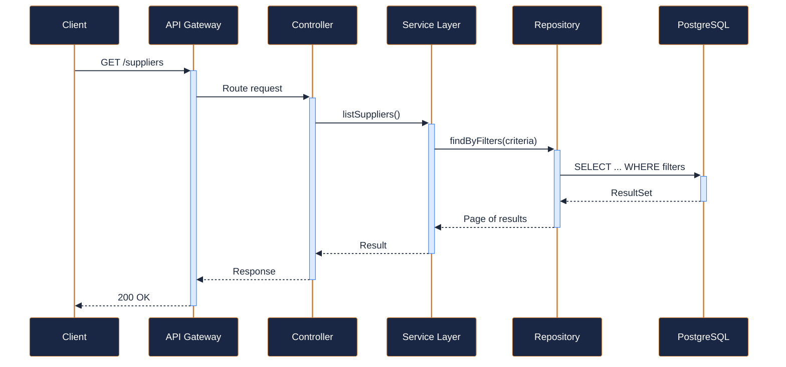
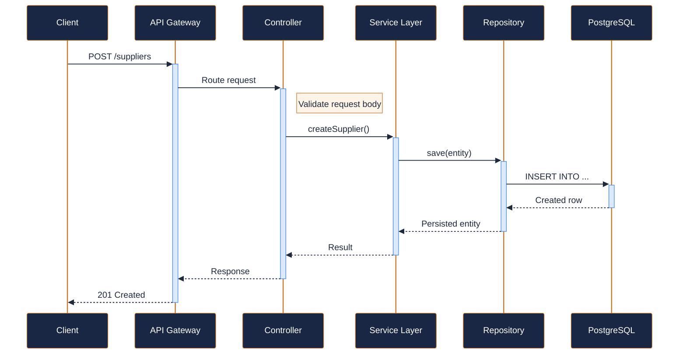
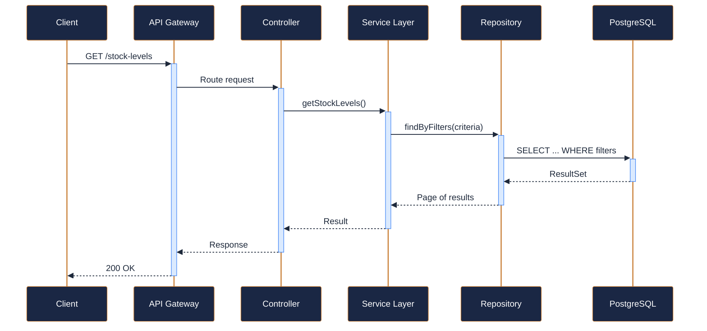
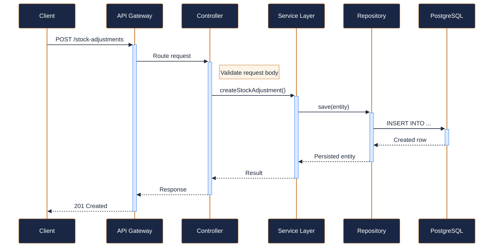

---
tags:
  - microservice
  - svc-inventory-procurement
  - support
---

# svc-inventory-procurement

**NovaTrek Inventory Procurement API** &nbsp;|&nbsp; Support &nbsp;|&nbsp; `v2.1.0` &nbsp;|&nbsp; *NovaTrek Platform Engineering*

> Manages purchasing workflows, supplier relationships, and stock replenishment

[:material-api: Swagger UI](../services/api/svc-inventory-procurement.html){ .md-button .md-button--primary }
[:material-file-download: Download OpenAPI Spec](../specs/svc-inventory-procurement.yaml){ .md-button }

---

## :material-database: Data Store

| Property | Detail |
|----------|--------|
| **Engine** | PostgreSQL 15 |
| **Schema** | `procurement` |
| **Primary Tables** | `purchase_orders`, `po_line_items`, `suppliers`, `stock_levels`, `stock_adjustments`, `reorder_alerts` |
| **Key Features** | Purchase order approval workflow with state machine · Automatic reorder point calculation based on consumption · Supplier lead time tracking for delivery estimates |
| **Estimated Volume** | ~50 POs/day, ~200 stock adjustments/day |

---

## :material-api: Endpoints (8 total)

---

### POST `/purchase-orders` — Create a new purchase order { .endpoint-post }

> Initiates a purchase order in DRAFT status. Items reference gear categories from svc-gear-inventory.

[:material-open-in-new: View in Swagger UI](../services/api/svc-inventory-procurement.html){ .md-button }

---

### GET `/purchase-orders/{po_id}` — Get purchase order details { .endpoint-get }

[:material-open-in-new: View in Swagger UI](../services/api/svc-inventory-procurement.html){ .md-button }

---

### PATCH `/purchase-orders/{po_id}` — Update purchase order status or line items { .endpoint-patch }

> Supports status transitions: DRAFT->SUBMITTED->APPROVED->SHIPPED->RECEIVED.

[:material-open-in-new: View in Swagger UI](../services/api/svc-inventory-procurement.html){ .md-button }

---

### GET `/suppliers` — List all suppliers { .endpoint-get }

[:material-open-in-new: View in Swagger UI](../services/api/svc-inventory-procurement.html){ .md-button }

---

### POST `/suppliers` — Register a new supplier { .endpoint-post }

[:material-open-in-new: View in Swagger UI](../services/api/svc-inventory-procurement.html){ .md-button }

---

### GET `/stock-levels` — Query current stock levels { .endpoint-get }

> Returns stock levels filtered by location and/or item category.

[:material-open-in-new: View in Swagger UI](../services/api/svc-inventory-procurement.html){ .md-button }

---

### POST `/stock-adjustments` — Record a stock adjustment { .endpoint-post }

> Used for manual corrections, damage write-offs, or receiving shipments outside PO flow.

[:material-open-in-new: View in Swagger UI](../services/api/svc-inventory-procurement.html){ .md-button }

---

### GET `/reorder-alerts` — Get active reorder alerts { .endpoint-get }

> Returns items that have fallen below their configured reorder point and need replenishment.

[:material-open-in-new: View in Swagger UI](../services/api/svc-inventory-procurement.html){ .md-button }

