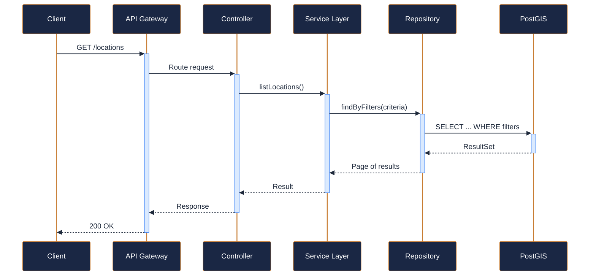
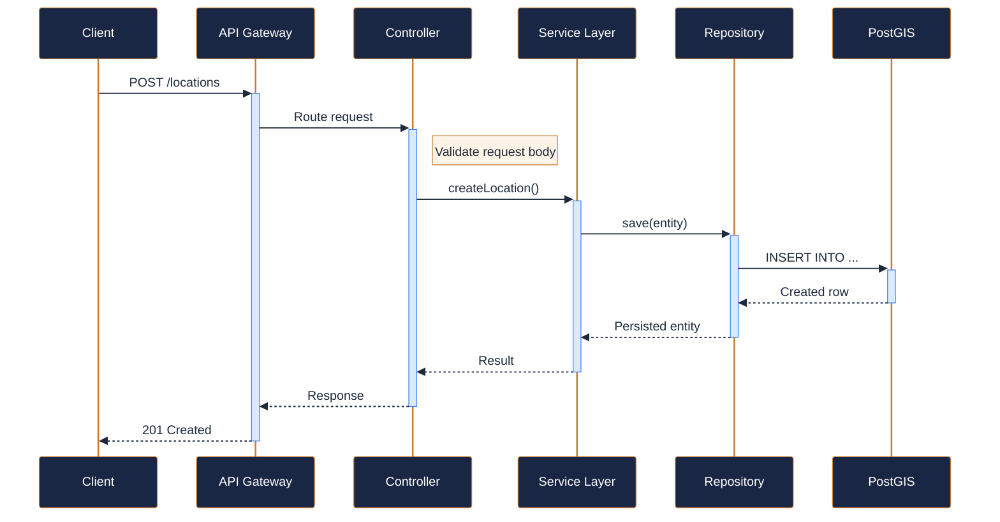
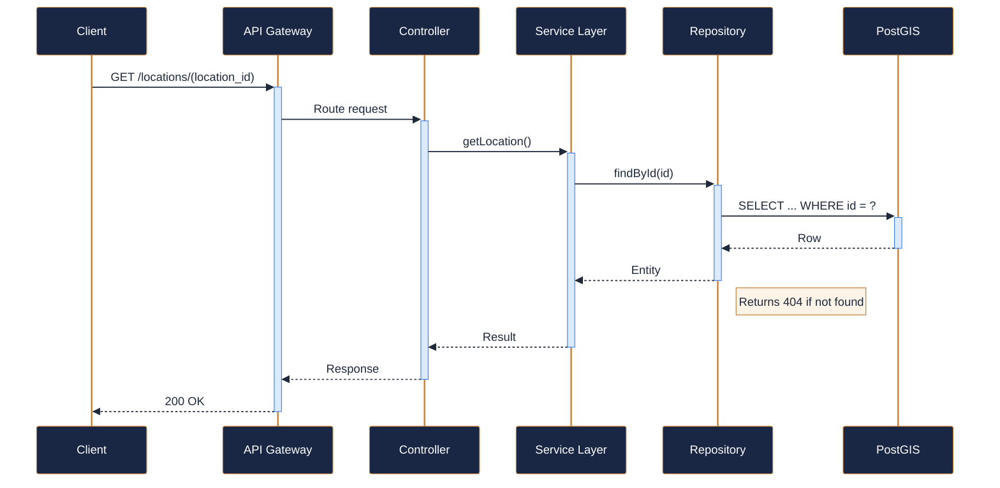
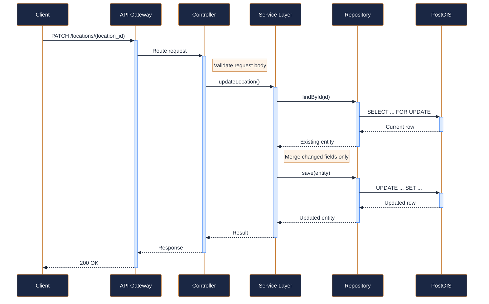
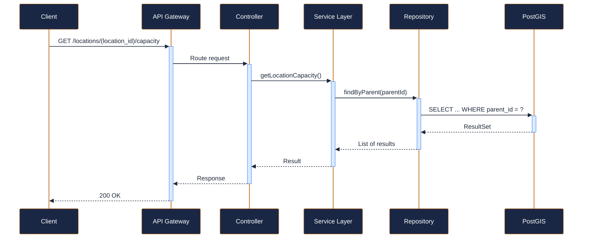
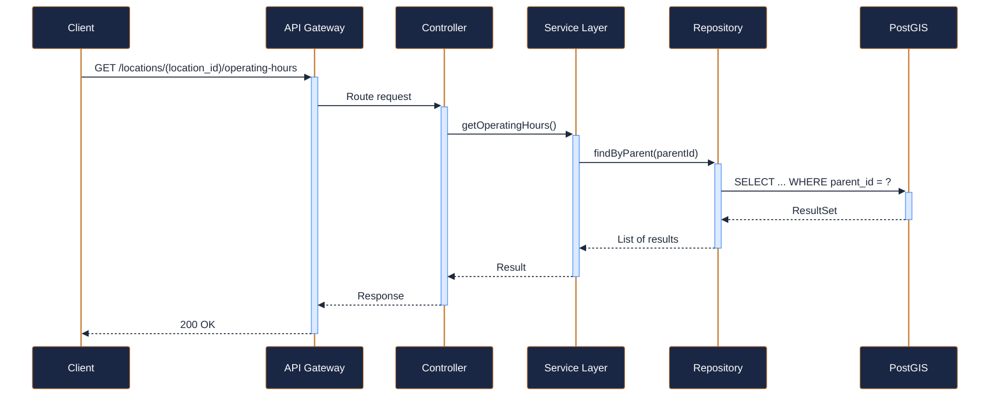

---
tags:
  - microservice
  - svc-location-services
  - support
---

# svc-location-services

**NovaTrek Location Services API** &nbsp;|&nbsp; Support &nbsp;|&nbsp; `v1.2.0` &nbsp;|&nbsp; *NovaTrek Platform Engineering*

> Manages physical locations across the NovaTrek network including base camps,

[:material-api: Swagger UI](../services/api/svc-location-services.html){ .md-button .md-button--primary }
[:material-file-download: Download OpenAPI Spec](../specs/svc-location-services.yaml){ .md-button }

---

## :material-database: Data Store

| Property | Detail |
|----------|--------|
| **Engine** | PostGIS (PostgreSQL 15) |
| **Schema** | `locations` |
| **Primary Tables** | `locations`, `capacity_records`, `operating_hours` |
| **Key Features** | PostGIS geometry for geofencing and proximity queries · Real-time capacity tracking with threshold alerts · Timezone-aware operating hours management |
| **Estimated Volume** | ~100 updates/day, ~2K reads/day |

---

## :material-api: Endpoints (6 total)

---

### GET `/locations` — List all locations { .endpoint-get }

> Returns a paginated list of NovaTrek locations with optional filtering by type, region, or status.

[:material-open-in-new: View in Swagger UI](../services/api/svc-location-services.html){ .md-button }

---

### POST `/locations` — Create a new location { .endpoint-post }

[:material-open-in-new: View in Swagger UI](../services/api/svc-location-services.html){ .md-button }

---

### GET `/locations/{location_id}` — Get location details { .endpoint-get }

[:material-open-in-new: View in Swagger UI](../services/api/svc-location-services.html){ .md-button }

---

### PATCH `/locations/{location_id}` — Update location details { .endpoint-patch }

[:material-open-in-new: View in Swagger UI](../services/api/svc-location-services.html){ .md-button }

---

### GET `/locations/{location_id}/capacity` — Get current capacity utilization { .endpoint-get }

[:material-open-in-new: View in Swagger UI](../services/api/svc-location-services.html){ .md-button }

---

### GET `/locations/{location_id}/operating-hours` — Get operating hours for a location { .endpoint-get }

[:material-open-in-new: View in Swagger UI](../services/api/svc-location-services.html){ .md-button }

