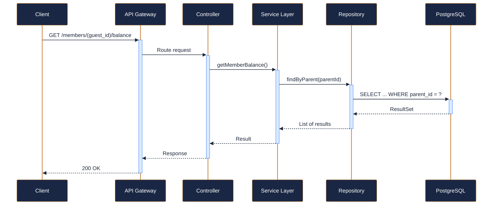
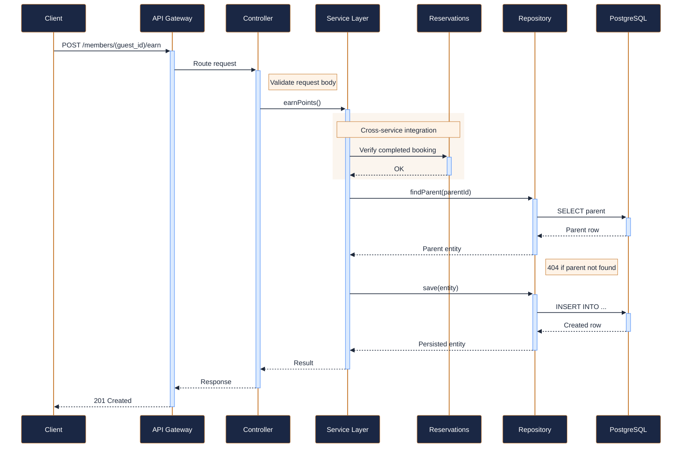
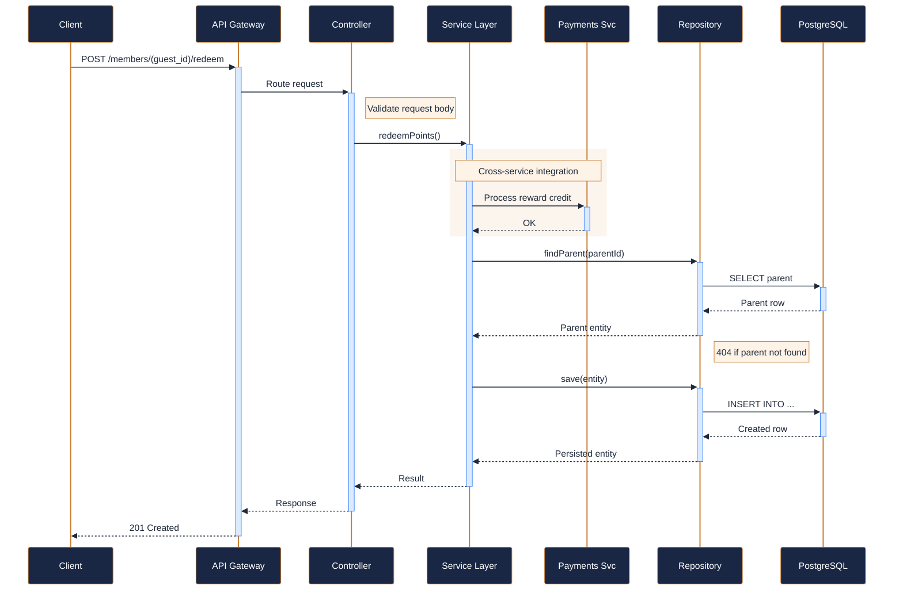
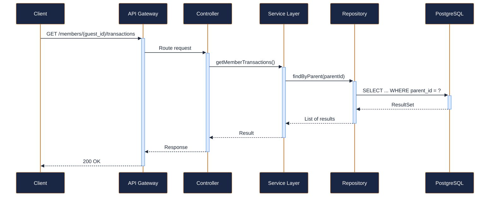
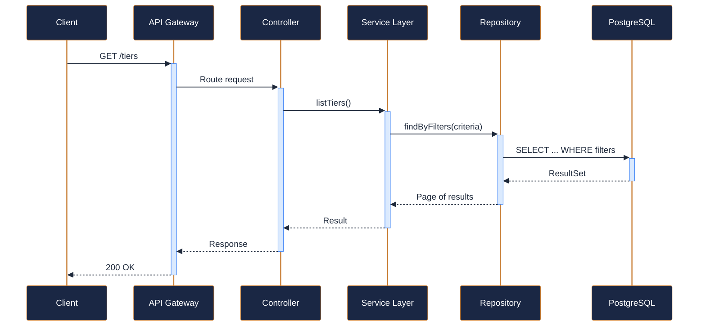

---
tags:
  - microservice
  - svc-loyalty-rewards
  - support
---

# svc-loyalty-rewards

**NovaTrek Loyalty Rewards Service** &nbsp;|&nbsp; Support &nbsp;|&nbsp; `v1.0.0` &nbsp;|&nbsp; *NovaTrek Platform Team*

> Manages the NovaTrek Adventures loyalty program including points accrual,

[:material-api: Swagger UI](../services/api/svc-loyalty-rewards.html){ .md-button .md-button--primary }
[:material-file-download: Download OpenAPI Spec](../specs/svc-loyalty-rewards.yaml){ .md-button }

---

## :material-database: Data Store

| Property | Detail |
|----------|--------|
| **Engine** | PostgreSQL 15 |
| **Schema** | `loyalty` |
| **Primary Tables** | `members`, `point_transactions`, `tiers`, `redemptions` |
| **Key Features** | Points balance with optimistic locking for concurrency · Tier recalculation triggers on point thresholds · Point expiry date tracking and automated cleanup |
| **Estimated Volume** | ~1,000 transactions/day |

---

## :material-api: Endpoints (5 total)

---

### GET `/members/{guest_id}/balance` — Get loyalty member balance and tier info { .endpoint-get }

[:material-open-in-new: View in Swagger UI](../services/api/svc-loyalty-rewards.html#/Members/getMemberBalance){ .md-button }

---

### POST `/members/{guest_id}/earn` — Award points to a member { .endpoint-post }

[:material-open-in-new: View in Swagger UI](../services/api/svc-loyalty-rewards.html#/Transactions/earnPoints){ .md-button }

---

### POST `/members/{guest_id}/redeem` — Redeem points for a reward { .endpoint-post }

[:material-open-in-new: View in Swagger UI](../services/api/svc-loyalty-rewards.html#/Transactions/redeemPoints){ .md-button }

---

### GET `/members/{guest_id}/transactions` — List point transactions for a member { .endpoint-get }

[:material-open-in-new: View in Swagger UI](../services/api/svc-loyalty-rewards.html#/Transactions/getMemberTransactions){ .md-button }

---

### GET `/tiers` — List all loyalty tiers and their thresholds { .endpoint-get }

[:material-open-in-new: View in Swagger UI](../services/api/svc-loyalty-rewards.html#/Tiers/listTiers){ .md-button }

