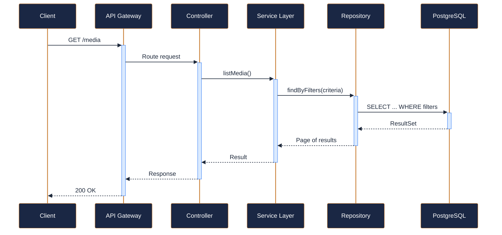
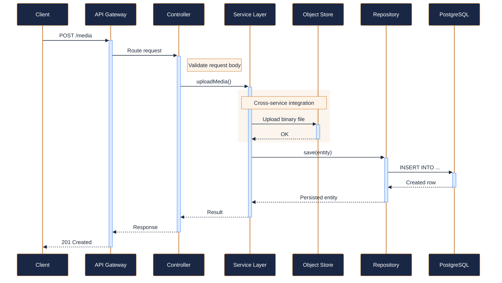
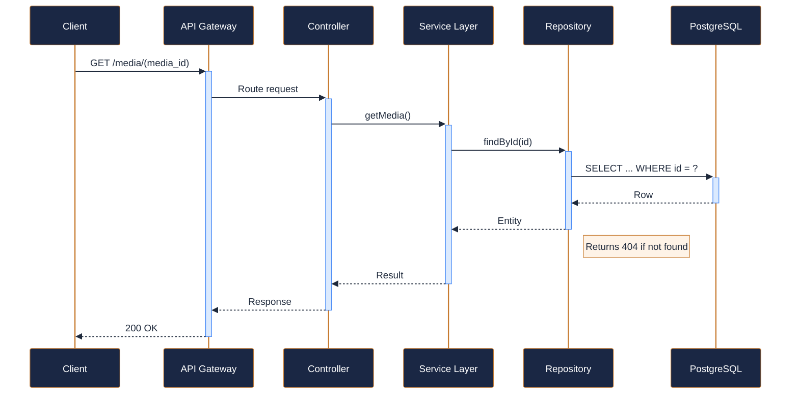
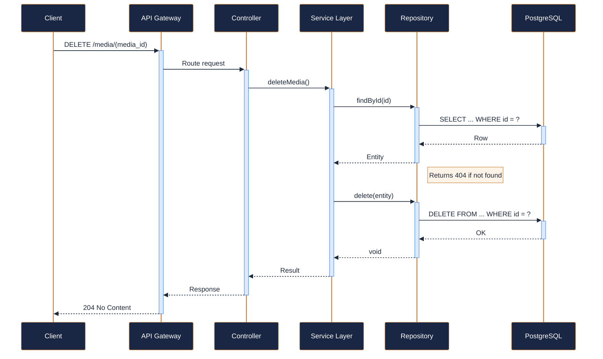
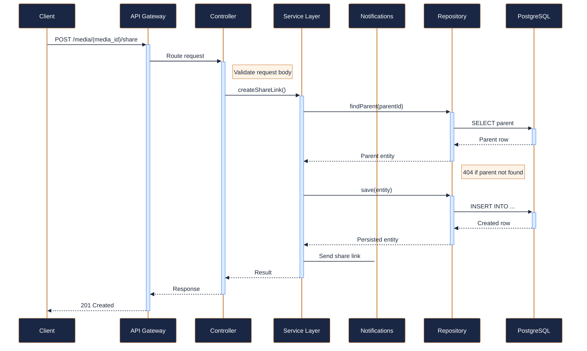

---
tags:
  - microservice
  - svc-media-gallery
  - support
---

# svc-media-gallery

**NovaTrek Media Gallery Service** &nbsp;|&nbsp; Support &nbsp;|&nbsp; `v1.0.2` &nbsp;|&nbsp; *NovaTrek Digital Experience Team*

> Manages trip photos, videos, and media content captured during NovaTrek adventures.

[:material-api: Swagger UI](../services/api/svc-media-gallery.html){ .md-button .md-button--primary }
[:material-file-download: Download OpenAPI Spec](../specs/svc-media-gallery.yaml){ .md-button }

---

## :material-database: Data Store

| Property | Detail |
|----------|--------|
| **Engine** | PostgreSQL 15 + S3-Compatible Object Store |
| **Schema** | `media` |
| **Primary Tables** | `media_items`, `share_links`, `albums` |
| **Key Features** | S3-compatible storage for photos and videos · Presigned URLs for secure direct upload and download · Automatic thumbnail generation on upload |
| **Estimated Volume** | ~500 uploads/day peak season |

---

## :material-api: Endpoints (5 total)

---

### GET `/media` — List media by reservation or trip { .endpoint-get }

[:material-open-in-new: View in Swagger UI](../services/api/svc-media-gallery.html#/Media/listMedia){ .md-button }

---

### POST `/media` — Upload a media item { .endpoint-post }

> Uploads a new photo, video, or panorama. The media is associated with a

[:material-open-in-new: View in Swagger UI](../services/api/svc-media-gallery.html#/Media/uploadMedia){ .md-button }

---

### GET `/media/{media_id}` — Get media item details { .endpoint-get }

[:material-open-in-new: View in Swagger UI](../services/api/svc-media-gallery.html#/Media/getMedia){ .md-button }

---

### DELETE `/media/{media_id}` — Delete a media item { .endpoint-delete }

> Soft-deletes the media item. Underlying storage is purged after 30 days.

[:material-open-in-new: View in Swagger UI](../services/api/svc-media-gallery.html#/Media/deleteMedia){ .md-button }

---

### POST `/media/{media_id}/share` — Create a shareable link for a media item { .endpoint-post }

> Generates a time-limited, tokenized URL for sharing with non-authenticated users.

[:material-open-in-new: View in Swagger UI](../services/api/svc-media-gallery.html#/Sharing/createShareLink){ .md-button }

