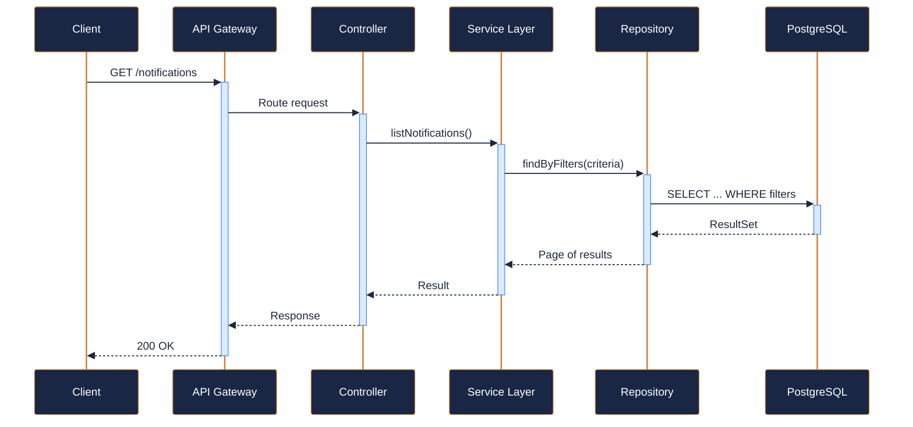
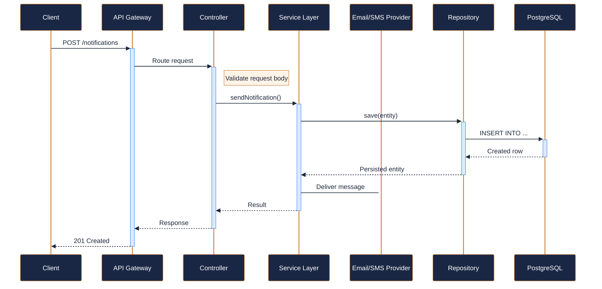
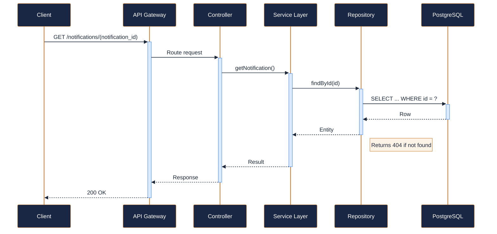
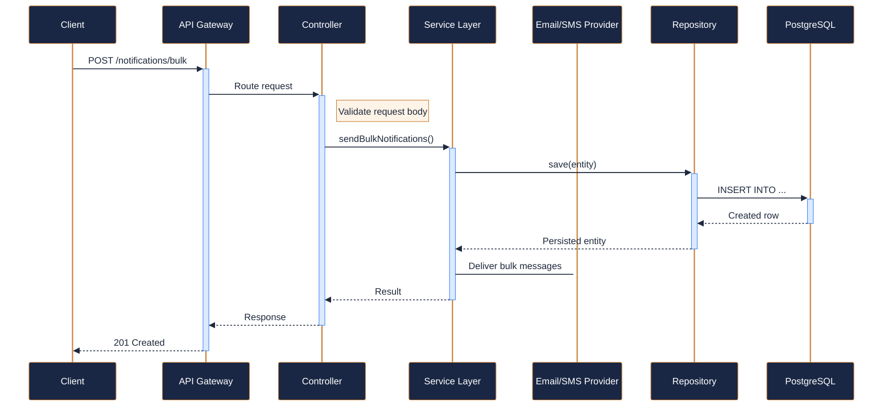
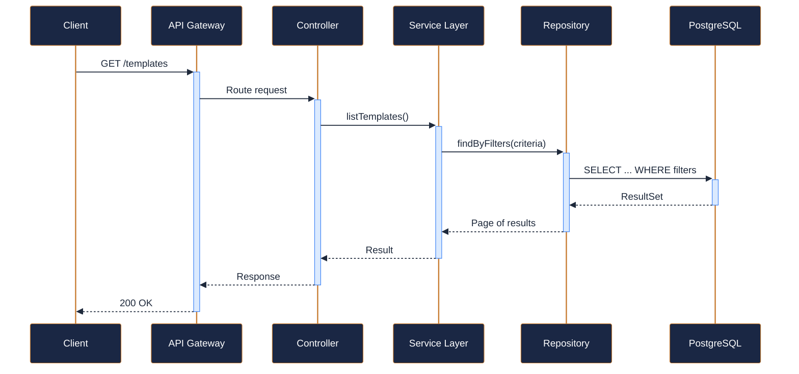
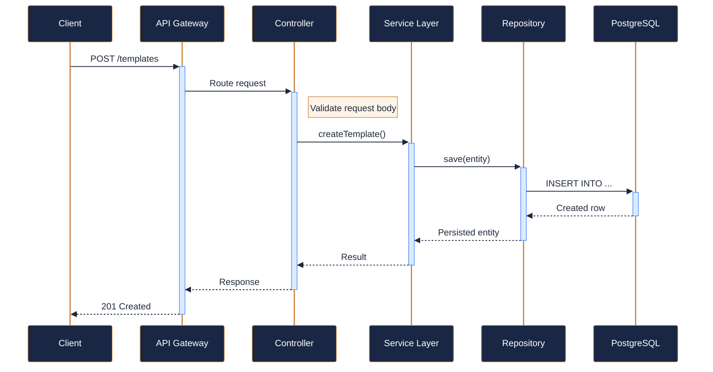

---
tags:
  - microservice
  - svc-notifications
  - support
---

# svc-notifications

**NovaTrek Notifications Service** &nbsp;|&nbsp; Support &nbsp;|&nbsp; `v1.0.0` &nbsp;|&nbsp; *NovaTrek Platform Team*

> Sends notifications to guests and guides via email, SMS, push, and in-app channels.

[:material-api: Swagger UI](../services/api/svc-notifications.html){ .md-button .md-button--primary }
[:material-file-download: Download OpenAPI Spec](../specs/svc-notifications.yaml){ .md-button }

---

## :material-database: Data Store

| Property | Detail |
|----------|--------|
| **Engine** | PostgreSQL 15 + Redis 7 |
| **Schema** | `notifications` |
| **Primary Tables** | `notifications`, `templates`, `delivery_log`, `channel_preferences` |
| **Key Features** | Redis queue for async delivery processing · Template versioning with rollback support · Multi-channel delivery: email, SMS, push, in-app |
| **Estimated Volume** | ~15,000 notifications/day |

---

## :material-api: Endpoints (6 total)

---

### GET `/notifications` — List notifications { .endpoint-get }

> Returns notifications filtered by recipient and/or channel, ordered most-recent first.

[:material-open-in-new: View in Swagger UI](../services/api/svc-notifications.html#/Notifications/listNotifications){ .md-button }

---

### POST `/notifications` — Send a notification { .endpoint-post }

> Queues a notification for delivery via the specified channel.

[:material-open-in-new: View in Swagger UI](../services/api/svc-notifications.html#/Notifications/sendNotification){ .md-button }

---

### GET `/notifications/{notification_id}` — Retrieve notification details { .endpoint-get }

> Returns full details and delivery status of a single notification.

[:material-open-in-new: View in Swagger UI](../services/api/svc-notifications.html#/Notifications/getNotification){ .md-button }

---

### POST `/notifications/bulk` — Send bulk notifications { .endpoint-post }

> Sends the same templated notification to multiple recipients.

[:material-open-in-new: View in Swagger UI](../services/api/svc-notifications.html#/Notifications/sendBulkNotifications){ .md-button }

---

### GET `/templates` — List notification templates { .endpoint-get }

> Returns all available notification templates, optionally filtered by channel.

[:material-open-in-new: View in Swagger UI](../services/api/svc-notifications.html#/Templates/listTemplates){ .md-button }

---

### POST `/templates` — Create a notification template { .endpoint-post }

> Registers a new notification template with variable placeholders for dynamic content.

[:material-open-in-new: View in Swagger UI](../services/api/svc-notifications.html#/Templates/createTemplate){ .md-button }

