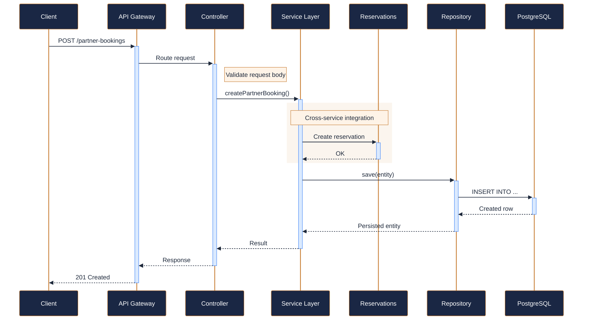
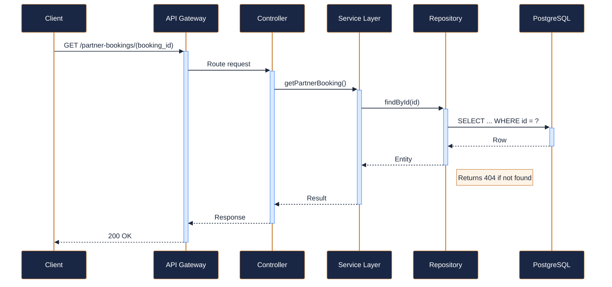
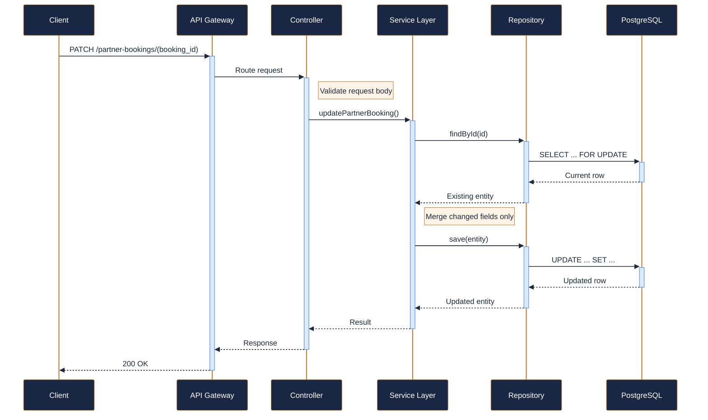
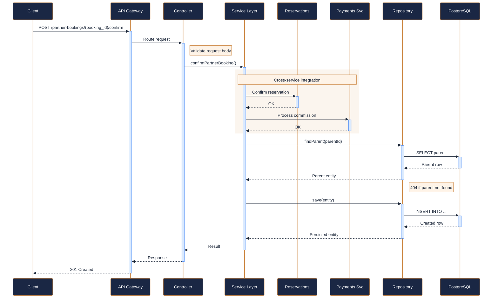
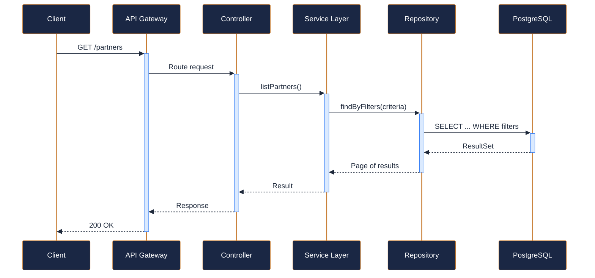
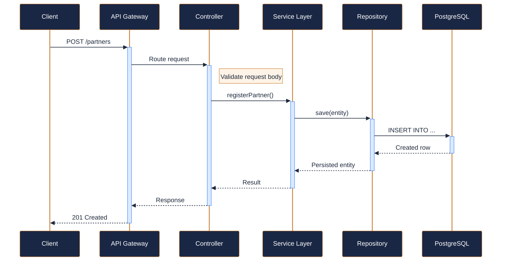
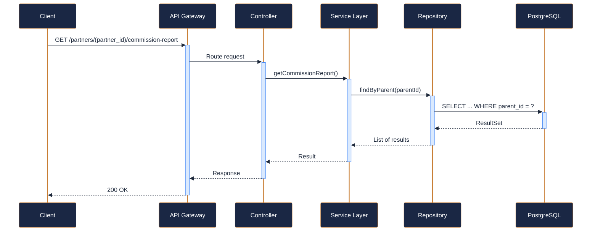

---
tags:
  - microservice
  - svc-partner-integrations
  - external
---

# svc-partner-integrations

**NovaTrek Partner Integrations Service** &nbsp;|&nbsp; External &nbsp;|&nbsp; `v1.0.0` &nbsp;|&nbsp; *NovaTrek Partnerships Team*

> Manages third-party partner relationships and bookings from travel agents,

[:material-api: Swagger UI](../services/api/svc-partner-integrations.html){ .md-button .md-button--primary }
[:material-file-download: Download OpenAPI Spec](../specs/svc-partner-integrations.yaml){ .md-button }

---

## :material-database: Data Store

| Property | Detail |
|----------|--------|
| **Engine** | PostgreSQL 15 |
| **Schema** | `partners` |
| **Primary Tables** | `partners`, `partner_bookings`, `commission_records`, `reconciliation_log` |
| **Key Features** | Partner API key management with rotation policy · Commission calculation engine with tiered rates · Idempotency keys for booking creation |
| **Estimated Volume** | ~400 partner bookings/day |

---

## :material-api: Endpoints (7 total)

---

### POST `/partner-bookings` — External partner creates a booking { .endpoint-post }

> Allows an authenticated partner to submit a booking request. Creates

[:material-open-in-new: View in Swagger UI](../services/api/svc-partner-integrations.html#/Partner%20Bookings/createPartnerBooking){ .md-button }

---

### GET `/partner-bookings/{booking_id}` — Get partner booking details { .endpoint-get }

[:material-open-in-new: View in Swagger UI](../services/api/svc-partner-integrations.html#/Partner%20Bookings/getPartnerBooking){ .md-button }

---

### PATCH `/partner-bookings/{booking_id}` — Update a partner booking { .endpoint-patch }

[:material-open-in-new: View in Swagger UI](../services/api/svc-partner-integrations.html#/Partner%20Bookings/updatePartnerBooking){ .md-button }

---

### POST `/partner-bookings/{booking_id}/confirm` — Confirm a pending partner booking { .endpoint-post }

> Confirms availability and finalizes the partner booking. Triggers

[:material-open-in-new: View in Swagger UI](../services/api/svc-partner-integrations.html#/Partner%20Bookings/confirmPartnerBooking){ .md-button }

---

### GET `/partners` — List registered partners { .endpoint-get }

[:material-open-in-new: View in Swagger UI](../services/api/svc-partner-integrations.html#/Partners/listPartners){ .md-button }

---

### POST `/partners` — Register a new partner { .endpoint-post }

[:material-open-in-new: View in Swagger UI](../services/api/svc-partner-integrations.html#/Partners/registerPartner){ .md-button }

---

### GET `/partners/{partner_id}/commission-report` — Get commission report for a partner { .endpoint-get }

[:material-open-in-new: View in Swagger UI](../services/api/svc-partner-integrations.html#/Partners/getCommissionReport){ .md-button }

