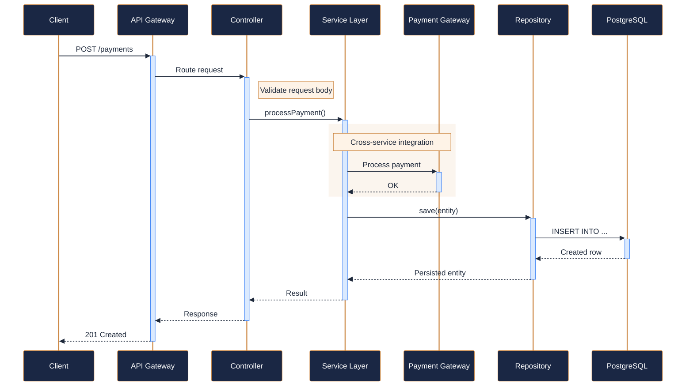
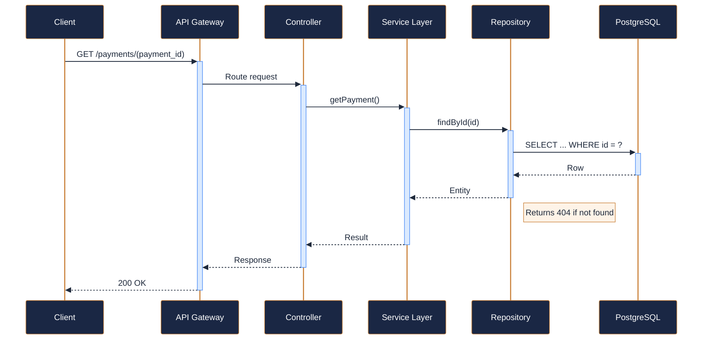
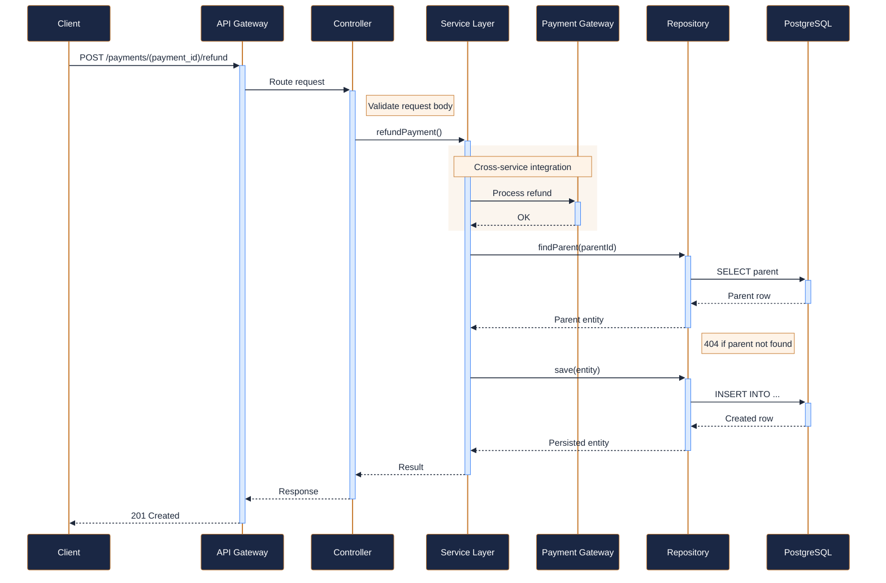
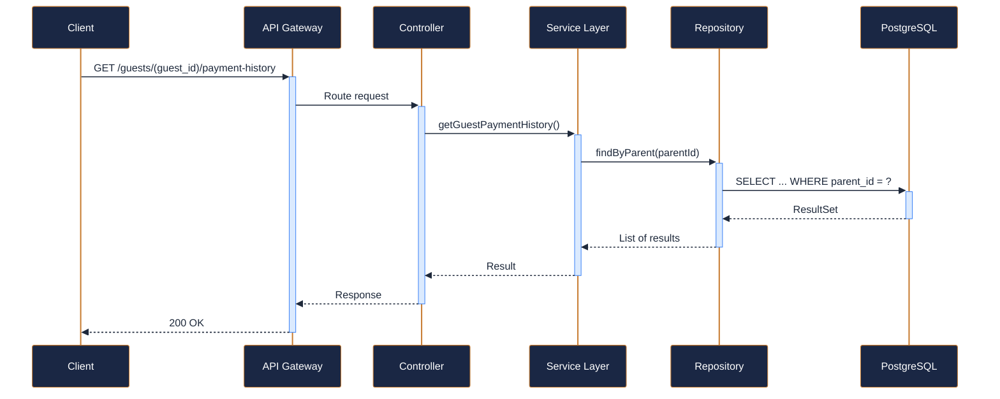
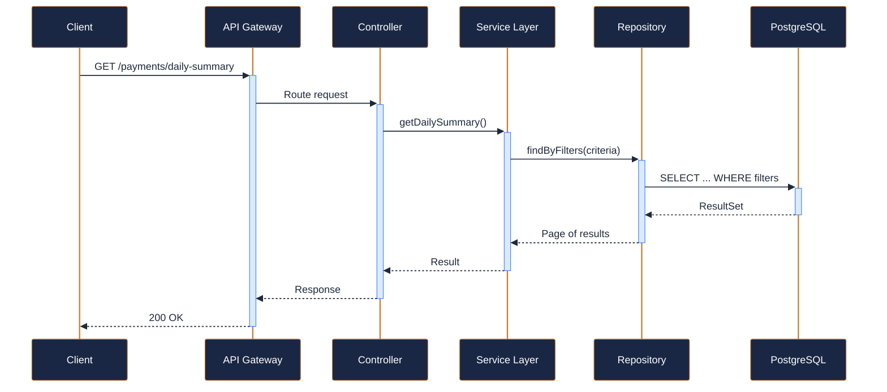

---
tags:
  - microservice
  - svc-payments
  - support
---

# svc-payments

**NovaTrek Payments Service** &nbsp;|&nbsp; Support &nbsp;|&nbsp; `v1.0.0` &nbsp;|&nbsp; *NovaTrek Platform Team*

> Manages payments, refunds, and billing for adventure bookings at NovaTrek Adventures.

[:material-api: Swagger UI](../services/api/svc-payments.html){ .md-button .md-button--primary }
[:material-file-download: Download OpenAPI Spec](../specs/svc-payments.yaml){ .md-button }

---

## :material-database: Data Store

| Property | Detail |
|----------|--------|
| **Engine** | PostgreSQL 15 |
| **Schema** | `payments` |
| **Primary Tables** | `payments`, `refunds`, `payment_methods`, `daily_summaries` |
| **Key Features** | PCI-DSS compliant token storage (no raw card data) · Idempotent payment processing via request keys · Double-entry ledger for financial reconciliation |
| **Estimated Volume** | ~2,500 transactions/day |

---

## :material-api: Endpoints (5 total)

---

### POST `/payments` — Process a payment { .endpoint-post }

> Initiates payment processing for a reservation. The payment is authorized and captured based on the selected method.

[:material-open-in-new: View in Swagger UI](../services/api/svc-payments.html#/Payments/processPayment){ .md-button }

---

### GET `/payments/{payment_id}` — Retrieve payment details { .endpoint-get }

> Returns full details of a specific payment including processor reference and status history.

[:material-open-in-new: View in Swagger UI](../services/api/svc-payments.html#/Payments/getPayment){ .md-button }

---

### POST `/payments/{payment_id}/refund` — Initiate a refund { .endpoint-post }

> Creates a refund for the specified payment. Supports full or partial refunds.

[:material-open-in-new: View in Swagger UI](../services/api/svc-payments.html#/Refunds/refundPayment){ .md-button }

---

### GET `/guests/{guest_id}/payment-history` — Retrieve payment history for a guest { .endpoint-get }

> Returns paginated payment history for a specific guest, ordered by most recent first.

[:material-open-in-new: View in Swagger UI](../services/api/svc-payments.html#/Payments/getGuestPaymentHistory){ .md-button }

---

### GET `/payments/daily-summary` — Get daily payment summary { .endpoint-get }

> Returns an aggregated summary of payments processed on a given date, broken down by method and status.

[:material-open-in-new: View in Swagger UI](../services/api/svc-payments.html#/Reporting/getDailySummary){ .md-button }

