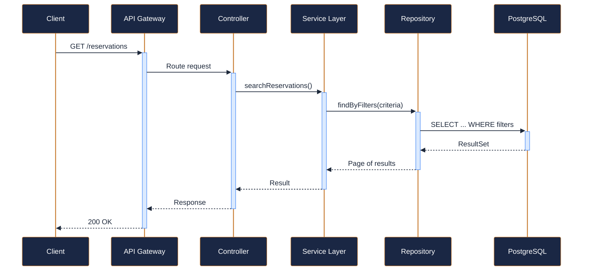
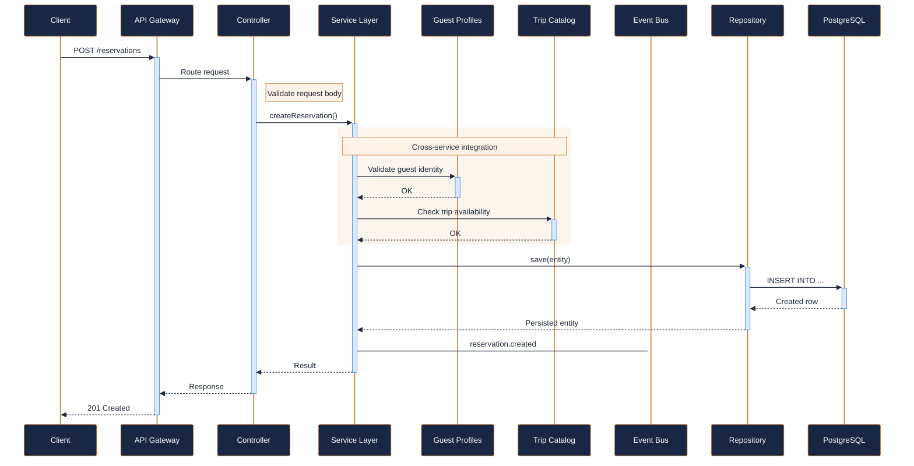
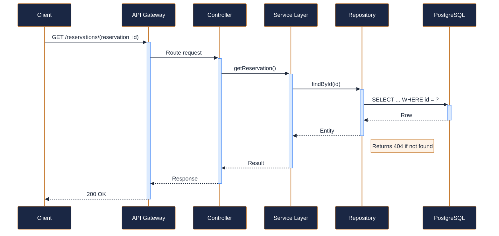
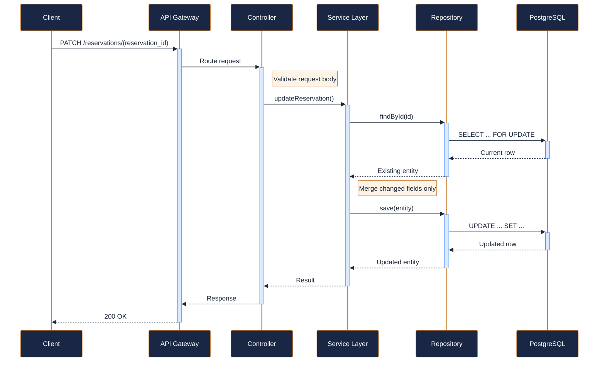
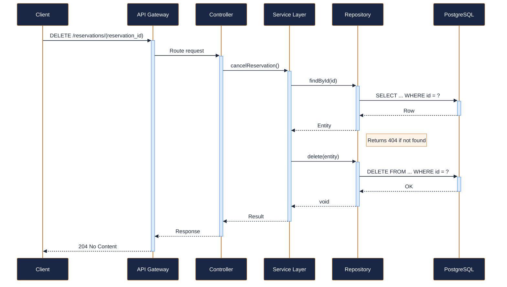
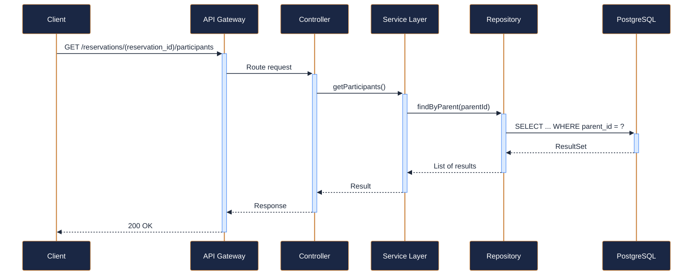
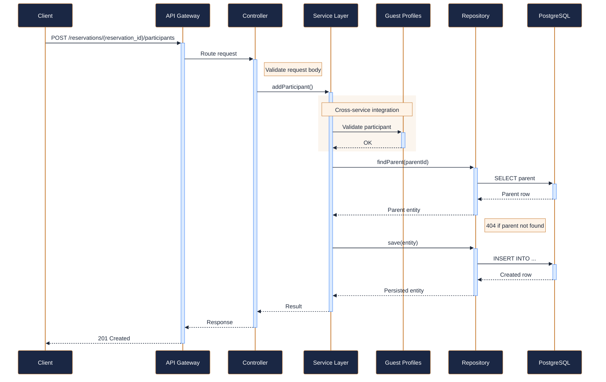
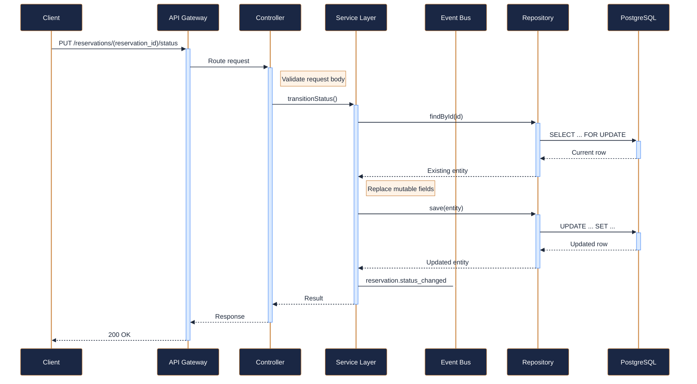

---
tags:
  - microservice
  - svc-reservations
  - booking
---

# svc-reservations

**Reservations Service** &nbsp;|&nbsp; Booking &nbsp;|&nbsp; `v2.4.1` &nbsp;|&nbsp; *NovaTrek Platform Team*

> Manages adventure trip reservations for NovaTrek Adventures.

[:material-api: Swagger UI](../services/api/svc-reservations.html){ .md-button .md-button--primary }
[:material-file-download: Download OpenAPI Spec](../specs/svc-reservations.yaml){ .md-button }

---

## :material-database: Data Store

| Property | Detail |
|----------|--------|
| **Engine** | PostgreSQL 15 |
| **Schema** | `reservations` |
| **Primary Tables** | `reservations`, `participants`, `status_history` |
| **Key Features** | Optimistic locking via _rev field · Composite index on (guest_id, trip_date) · Monthly partitioning by reservation_date |
| **Estimated Volume** | ~2,000 new reservations/day |

---

## :material-api: Endpoints (8 total)

---

### GET `/reservations` — Search reservations { .endpoint-get }

> Returns a paginated list of reservations matching the given criteria.

[:material-open-in-new: View in Swagger UI](../services/api/svc-reservations.html#/Reservation%20Search/searchReservations){ .md-button }

---

### POST `/reservations` — Create a new reservation { .endpoint-post }

> Creates a new adventure reservation. Validates guest eligibility,

[:material-open-in-new: View in Swagger UI](../services/api/svc-reservations.html#/Reservations/createReservation){ .md-button }

---

### GET `/reservations/{reservation_id}` — Get reservation details { .endpoint-get }

[:material-open-in-new: View in Swagger UI](../services/api/svc-reservations.html#/Reservations/getReservation){ .md-button }

---

### PATCH `/reservations/{reservation_id}` — Update a reservation { .endpoint-patch }

> Partially updates a reservation. Only modifiable fields can be changed.

[:material-open-in-new: View in Swagger UI](../services/api/svc-reservations.html#/Reservations/updateReservation){ .md-button }

---

### DELETE `/reservations/{reservation_id}` — Cancel a reservation { .endpoint-delete }

[:material-open-in-new: View in Swagger UI](../services/api/svc-reservations.html#/Reservations/cancelReservation){ .md-button }

---

### GET `/reservations/{reservation_id}/participants` — Get reservation participants { .endpoint-get }

[:material-open-in-new: View in Swagger UI](../services/api/svc-reservations.html#/Reservations/getParticipants){ .md-button }

---

### POST `/reservations/{reservation_id}/participants` — Add a participant to a reservation { .endpoint-post }

[:material-open-in-new: View in Swagger UI](../services/api/svc-reservations.html#/Reservations/addParticipant){ .md-button }

---

### PUT `/reservations/{reservation_id}/status` — Transition reservation status { .endpoint-put }

> Explicitly transitions a reservation to a new status.

[:material-open-in-new: View in Swagger UI](../services/api/svc-reservations.html#/Reservation%20Status/transitionStatus){ .md-button }

