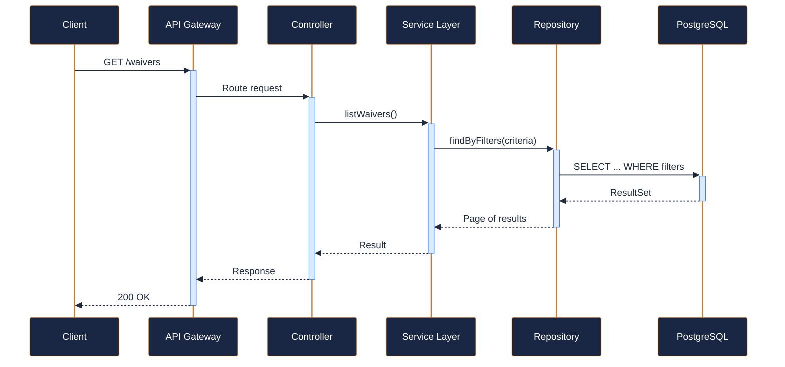
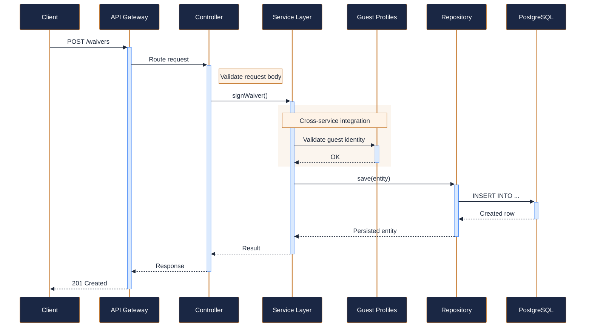
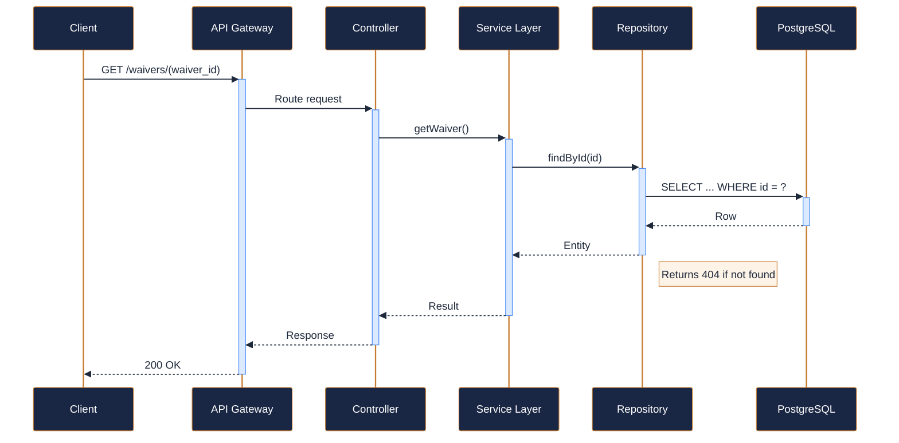
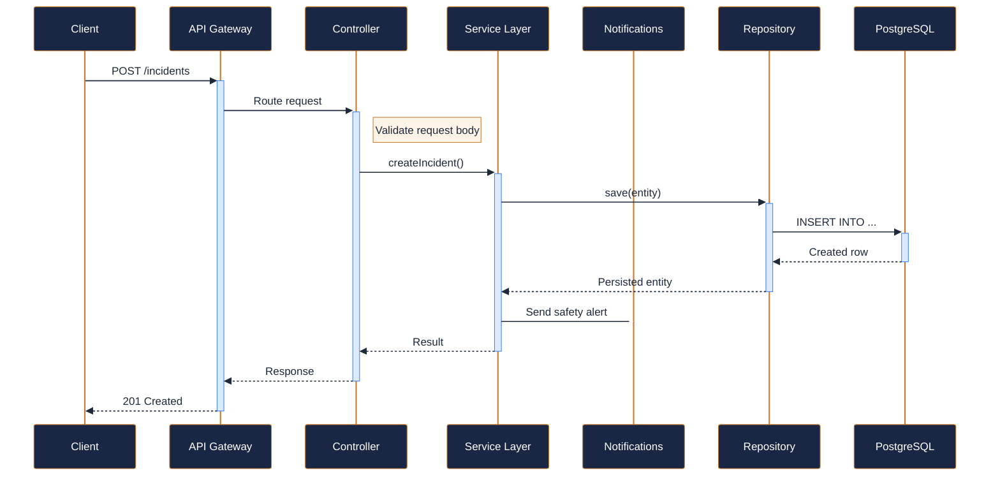
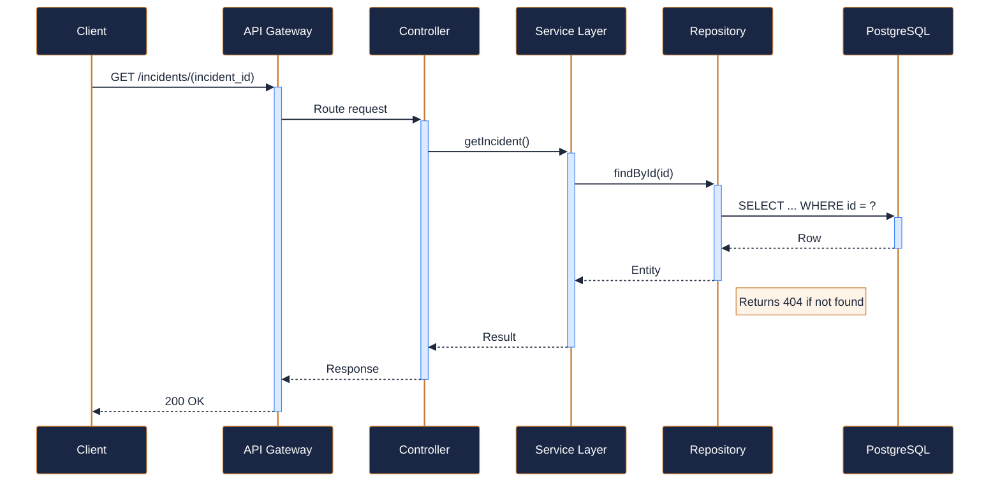
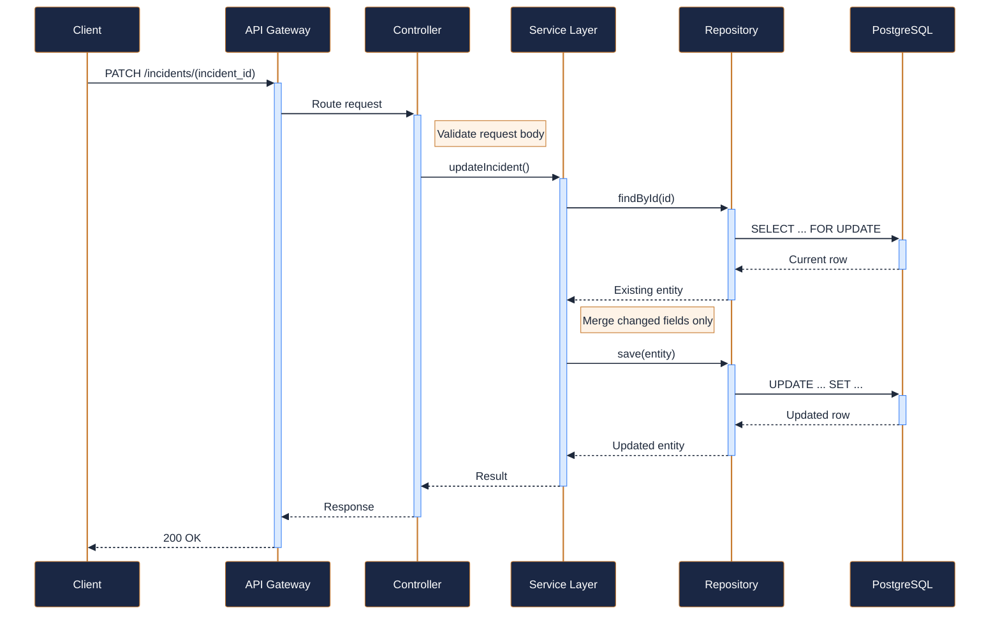
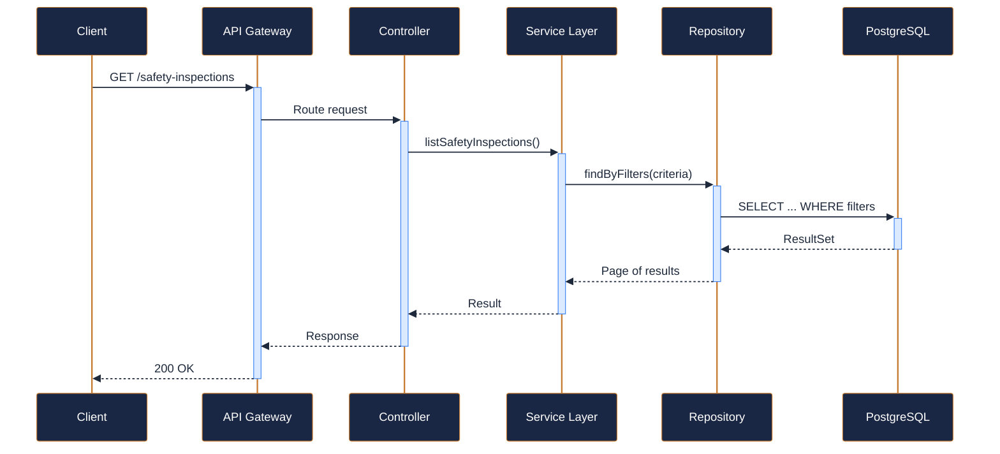
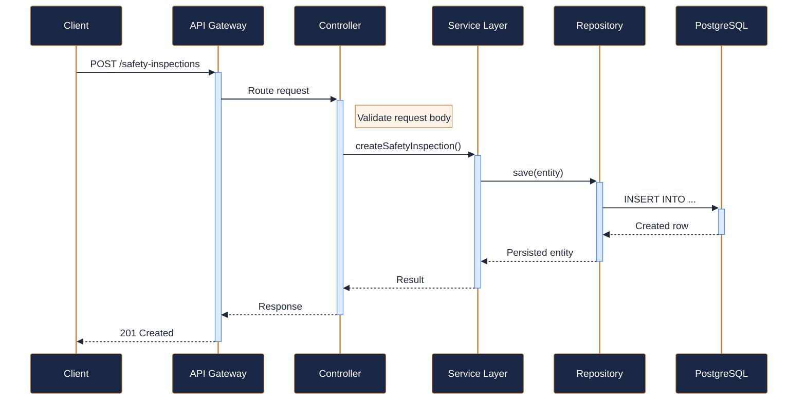

---
tags:
  - microservice
  - svc-safety-compliance
  - safety
---

# svc-safety-compliance

**NovaTrek Safety and Compliance Service** &nbsp;|&nbsp; Safety &nbsp;|&nbsp; `v1.0.0` &nbsp;|&nbsp; *NovaTrek Safety Operations*

> Manages guest safety waivers, incident reporting, safety inspections, and

[:material-api: Swagger UI](../services/api/svc-safety-compliance.html){ .md-button .md-button--primary }
[:material-file-download: Download OpenAPI Spec](../specs/svc-safety-compliance.yaml){ .md-button }

---

## :material-database: Data Store

| Property | Detail |
|----------|--------|
| **Engine** | PostgreSQL 15 |
| **Schema** | `safety` |
| **Primary Tables** | `waivers`, `incidents`, `safety_inspections`, `audit_log` |
| **Key Features** | Immutable audit log (append-only) · Digital signature verification for waivers · Regulatory compliance retention (7 years) |
| **Estimated Volume** | ~3,000 waiver checks/day |

---

## :material-api: Endpoints (8 total)

---

### GET `/waivers` — List waivers by guest { .endpoint-get }

[:material-open-in-new: View in Swagger UI](../services/api/svc-safety-compliance.html#/Waivers/listWaivers){ .md-button }

---

### POST `/waivers` — Guest signs a safety waiver { .endpoint-post }

[:material-open-in-new: View in Swagger UI](../services/api/svc-safety-compliance.html#/Waivers/signWaiver){ .md-button }

---

### GET `/waivers/{waiver_id}` — Get a specific waiver { .endpoint-get }

[:material-open-in-new: View in Swagger UI](../services/api/svc-safety-compliance.html#/Waivers/getWaiver){ .md-button }

---

### POST `/incidents` — File an incident report { .endpoint-post }

[:material-open-in-new: View in Swagger UI](../services/api/svc-safety-compliance.html#/Incidents/createIncident){ .md-button }

---

### GET `/incidents/{incident_id}` — Get an incident report { .endpoint-get }

[:material-open-in-new: View in Swagger UI](../services/api/svc-safety-compliance.html#/Incidents/getIncident){ .md-button }

---

### PATCH `/incidents/{incident_id}` — Update an incident report (add follow-up, change status) { .endpoint-patch }

[:material-open-in-new: View in Swagger UI](../services/api/svc-safety-compliance.html#/Incidents/updateIncident){ .md-button }

---

### GET `/safety-inspections` — List safety inspections for a location { .endpoint-get }

[:material-open-in-new: View in Swagger UI](../services/api/svc-safety-compliance.html#/Inspections/listSafetyInspections){ .md-button }

---

### POST `/safety-inspections` — Record a safety inspection { .endpoint-post }

[:material-open-in-new: View in Swagger UI](../services/api/svc-safety-compliance.html#/Inspections/createSafetyInspection){ .md-button }

