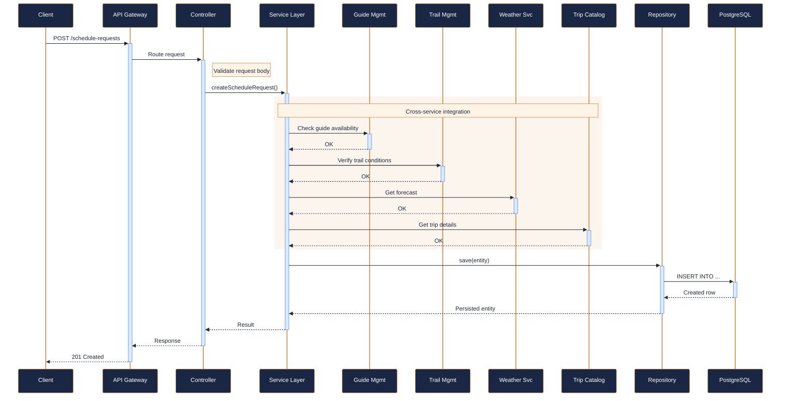
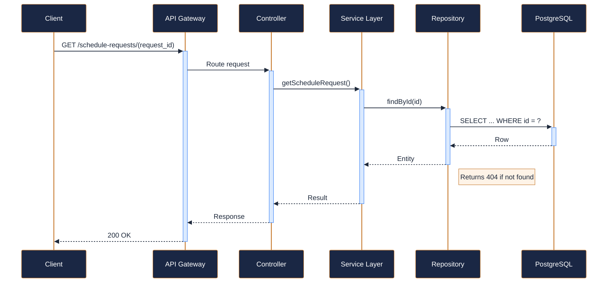
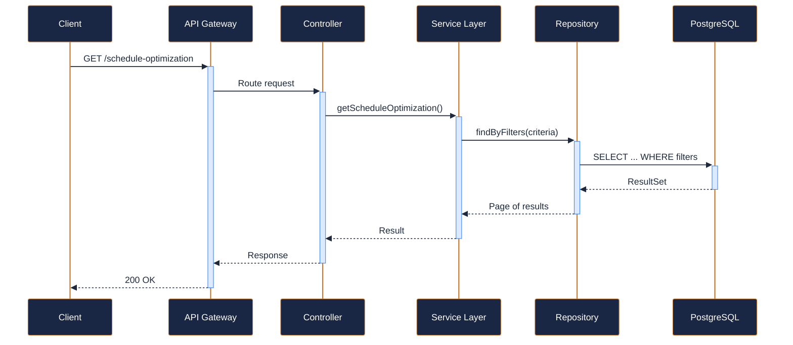
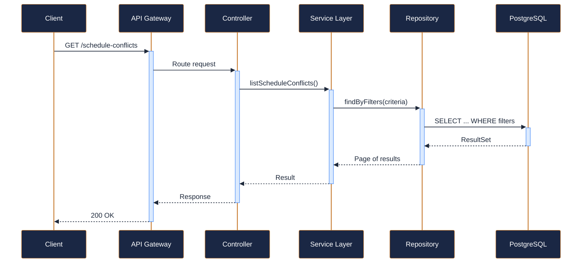
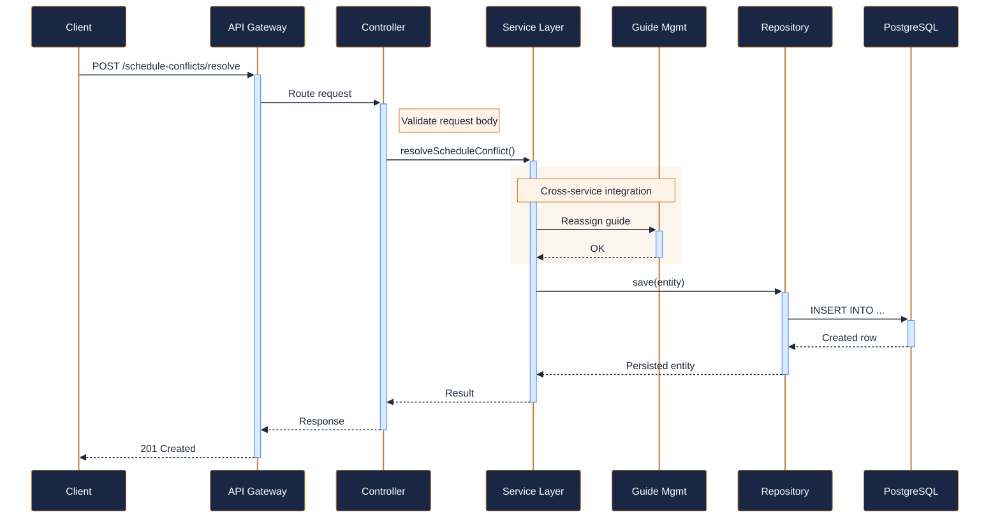

---
tags:
  - microservice
  - svc-scheduling-orchestrator
  - operations
---

# svc-scheduling-orchestrator

**NovaTrek Scheduling Orchestrator API** &nbsp;|&nbsp; Operations &nbsp;|&nbsp; `v3.0.1` &nbsp;|&nbsp; *NovaTrek Platform Engineering*

> Central orchestration service for NovaTrek trip scheduling. Coordinates guide

[:material-api: Swagger UI](../services/api/svc-scheduling-orchestrator.html){ .md-button .md-button--primary }
[:material-file-download: Download OpenAPI Spec](../specs/svc-scheduling-orchestrator.yaml){ .md-button }

---

## :material-database: Data Store

| Property | Detail |
|----------|--------|
| **Engine** | PostgreSQL 15 + Redis 7 |
| **Schema** | `scheduling` |
| **Primary Tables** | `schedule_requests`, `daily_schedules`, `schedule_conflicts`, `optimization_runs` |
| **Key Features** | Optimistic locking per ADR-011 · Redis for schedule lock cache and optimization queue · JSONB columns for constraint parameters |
| **Estimated Volume** | ~500 schedule requests/day |

---

## :material-api: Endpoints (5 total)

---

### POST `/schedule-requests` — Request optimal schedule for a trip { .endpoint-post }

> Submits a scheduling request that evaluates preferred dates against

[:material-open-in-new: View in Swagger UI](../services/api/svc-scheduling-orchestrator.html){ .md-button }

---

### GET `/schedule-requests/{request_id}` — Get schedule request status and result { .endpoint-get }

> Poll this endpoint to retrieve the status and, once complete, the

[:material-open-in-new: View in Swagger UI](../services/api/svc-scheduling-orchestrator.html){ .md-button }

---

### GET `/schedule-optimization` — Run synchronous schedule optimization { .endpoint-get }

> Performs a real-time scheduling optimization for a specific trip and

[:material-open-in-new: View in Swagger UI](../services/api/svc-scheduling-orchestrator.html){ .md-button }

---

### GET `/schedule-conflicts` — List scheduling conflicts { .endpoint-get }

> Returns active scheduling conflicts for a given date and/or region.

[:material-open-in-new: View in Swagger UI](../services/api/svc-scheduling-orchestrator.html){ .md-button }

---

### POST `/schedule-conflicts/resolve` — Resolve a scheduling conflict { .endpoint-post }

> Applies a resolution to an identified scheduling conflict. The resolution

[:material-open-in-new: View in Swagger UI](../services/api/svc-scheduling-orchestrator.html){ .md-button }

