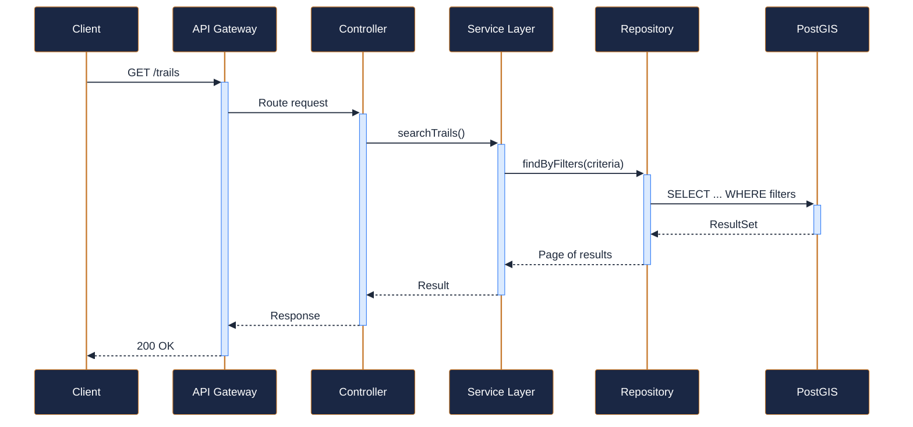
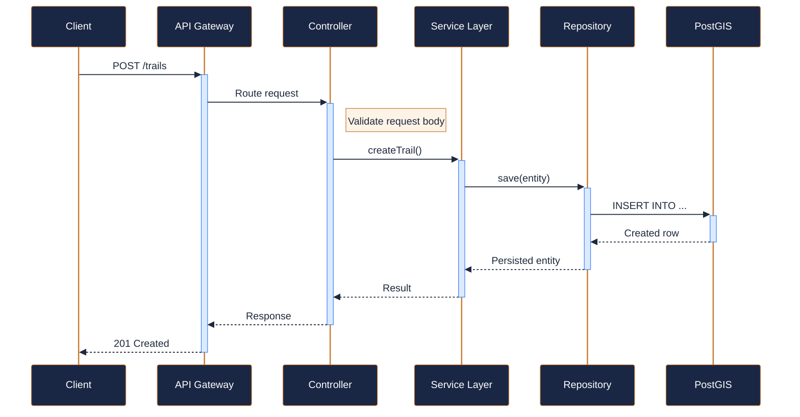
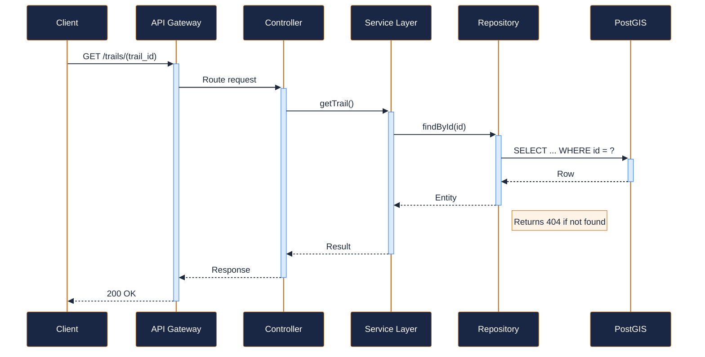
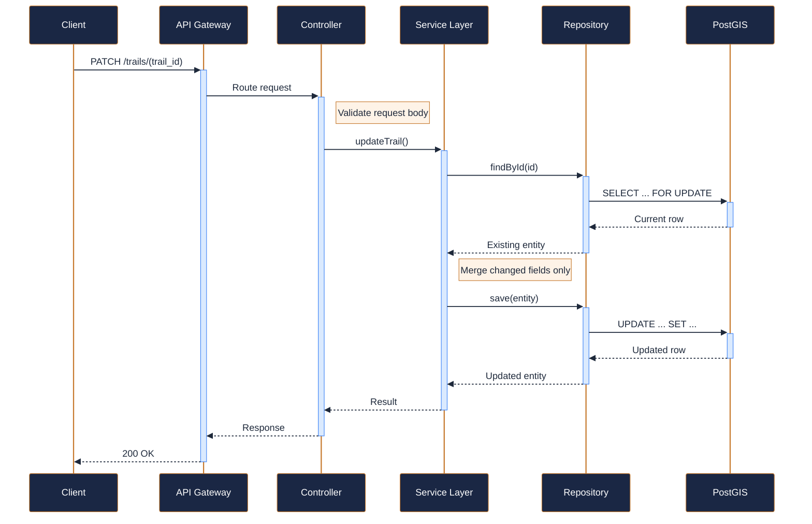
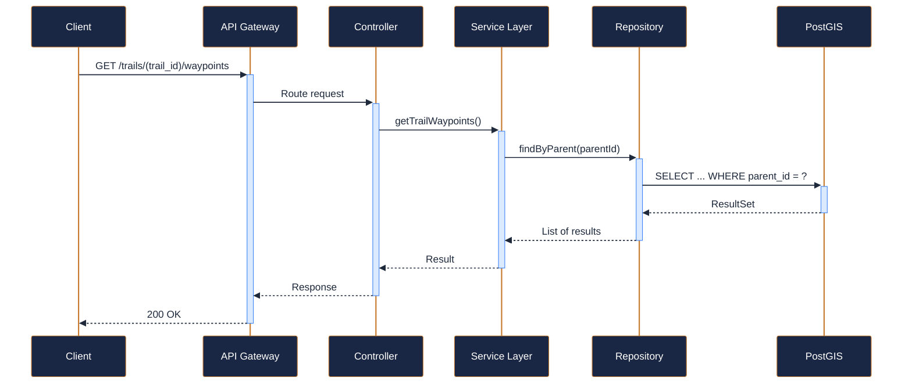
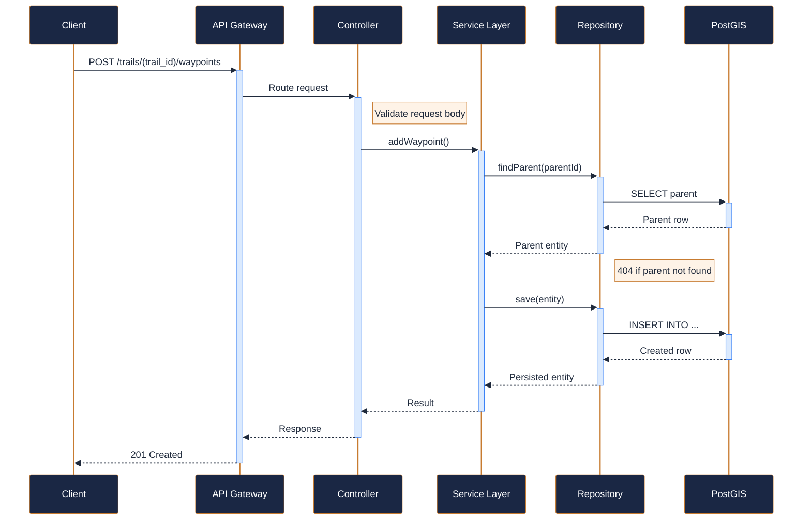
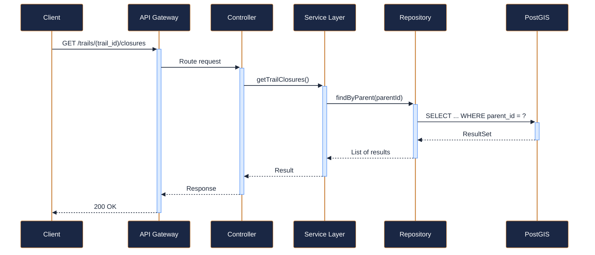
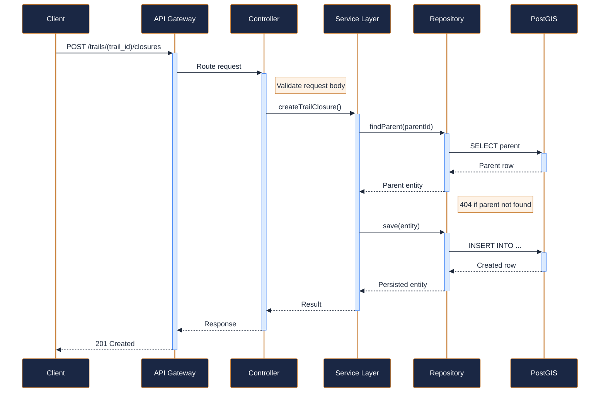
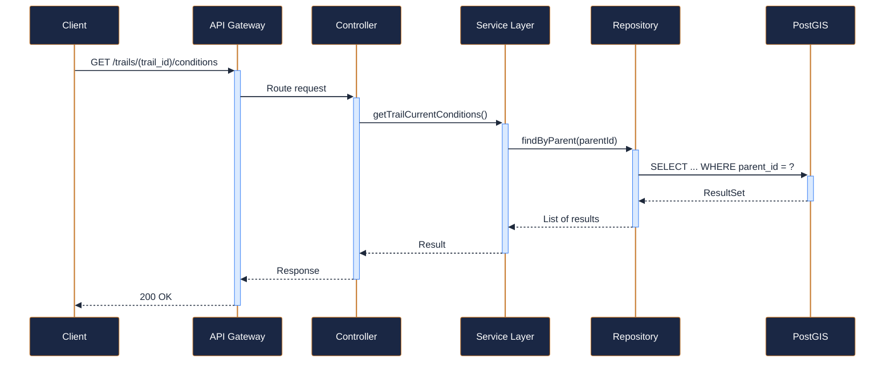

---
tags:
  - microservice
  - svc-trail-management
  - product-catalog
---

# svc-trail-management

**NovaTrek Trail Management Service** &nbsp;|&nbsp; Product Catalog &nbsp;|&nbsp; `v1.1.0` &nbsp;|&nbsp; *NovaTrek Platform Team*

> Manages trail definitions, waypoints, difficulty ratings, closures, and real-time

[:material-api: Swagger UI](../services/api/svc-trail-management.html){ .md-button .md-button--primary }
[:material-file-download: Download OpenAPI Spec](../specs/svc-trail-management.yaml){ .md-button }

---

## :material-database: Data Store

| Property | Detail |
|----------|--------|
| **Engine** | PostGIS (PostgreSQL 15) |
| **Schema** | `trails` |
| **Primary Tables** | `trails`, `waypoints`, `closures`, `condition_reports` |
| **Key Features** | PostGIS geometry columns for trail routes and waypoints · Spatial indexes (GiST) for proximity queries · Time-series condition data with hypertable extension |
| **Estimated Volume** | ~200 condition updates/day, ~5K trail reads/day |

---

## :material-api: Endpoints (9 total)

---

### GET `/trails` — Search trails { .endpoint-get }

> Search and filter trails by region, difficulty, activity type, and status.

[:material-open-in-new: View in Swagger UI](../services/api/svc-trail-management.html#/Trails/searchTrails){ .md-button }

---

### POST `/trails` — Create a new trail { .endpoint-post }

> Registers a new trail in the system. Requires operations or admin role.

[:material-open-in-new: View in Swagger UI](../services/api/svc-trail-management.html#/Trails/createTrail){ .md-button }

---

### GET `/trails/{trail_id}` — Get trail details { .endpoint-get }

> Returns complete trail information including metadata, geography, and current status.

[:material-open-in-new: View in Swagger UI](../services/api/svc-trail-management.html#/Trails/getTrail){ .md-button }

---

### PATCH `/trails/{trail_id}` — Update trail details { .endpoint-patch }

> Partially updates trail metadata. Does not modify waypoints or closures.

[:material-open-in-new: View in Swagger UI](../services/api/svc-trail-management.html#/Trails/updateTrail){ .md-button }

---

### GET `/trails/{trail_id}/waypoints` — List waypoints for a trail { .endpoint-get }

> Returns all waypoints along the trail in sequence order.

[:material-open-in-new: View in Swagger UI](../services/api/svc-trail-management.html#/Waypoints/getTrailWaypoints){ .md-button }

---

### POST `/trails/{trail_id}/waypoints` — Add a waypoint to a trail { .endpoint-post }

> Appends a new waypoint to the trail. Position in sequence can be specified.

[:material-open-in-new: View in Swagger UI](../services/api/svc-trail-management.html#/Waypoints/addWaypoint){ .md-button }

---

### GET `/trails/{trail_id}/closures` — List closures for a trail { .endpoint-get }

> Returns all current and scheduled closures for the specified trail.

[:material-open-in-new: View in Swagger UI](../services/api/svc-trail-management.html#/Closures/getTrailClosures){ .md-button }

---

### POST `/trails/{trail_id}/closures` — Create a trail closure { .endpoint-post }

> Records a closure for the trail. Automatically updates trail status to

[:material-open-in-new: View in Swagger UI](../services/api/svc-trail-management.html#/Closures/createTrailClosure){ .md-button }

---

### GET `/trails/{trail_id}/conditions` — Get current trail conditions { .endpoint-get }

> Returns the latest condition assessment for the trail, combining data from

[:material-open-in-new: View in Swagger UI](../services/api/svc-trail-management.html#/Conditions/getTrailCurrentConditions){ .md-button }

