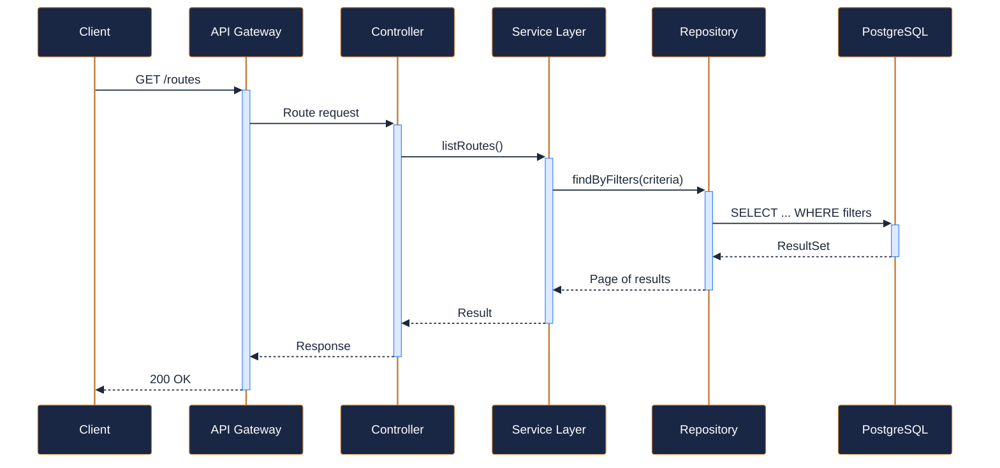
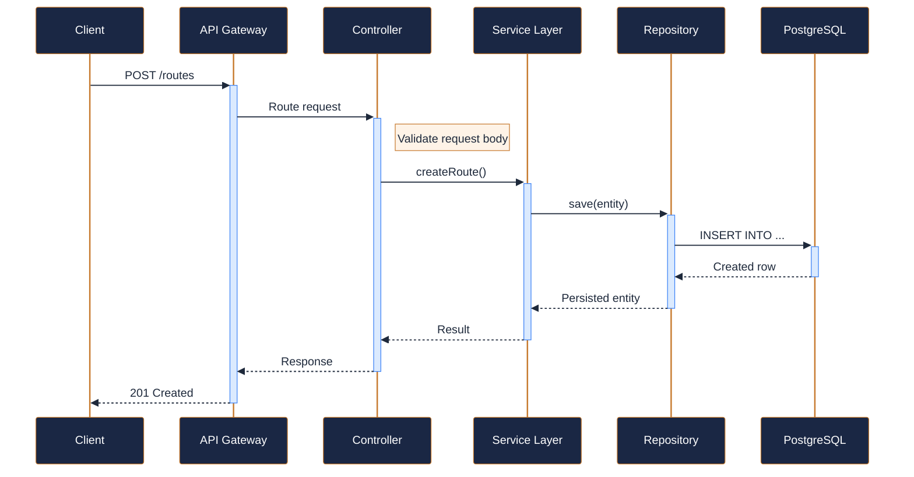
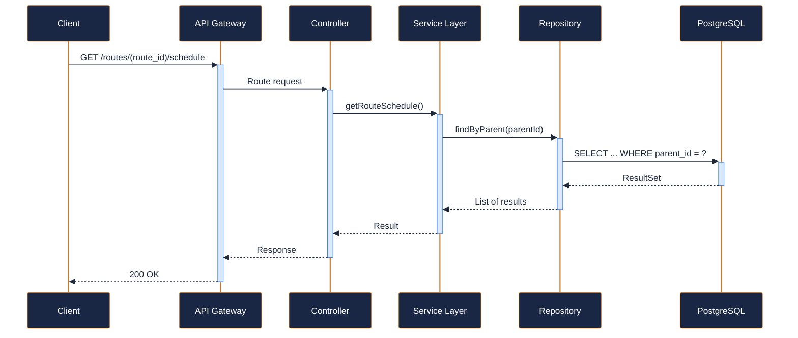
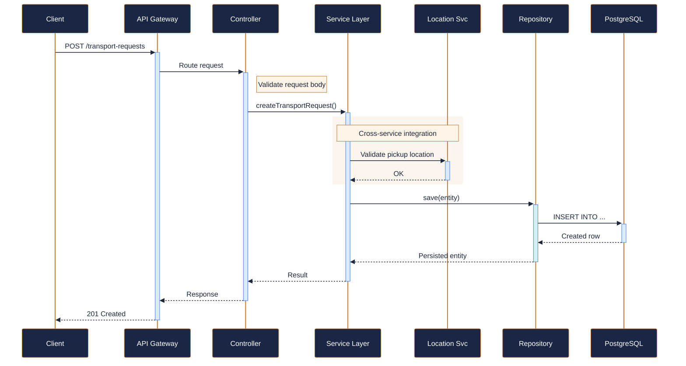
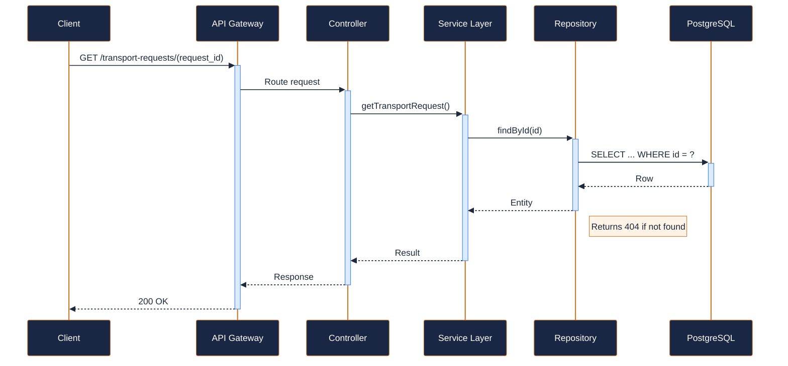
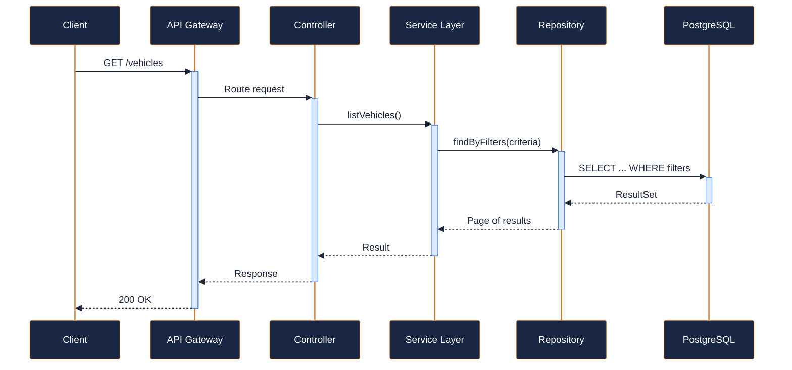
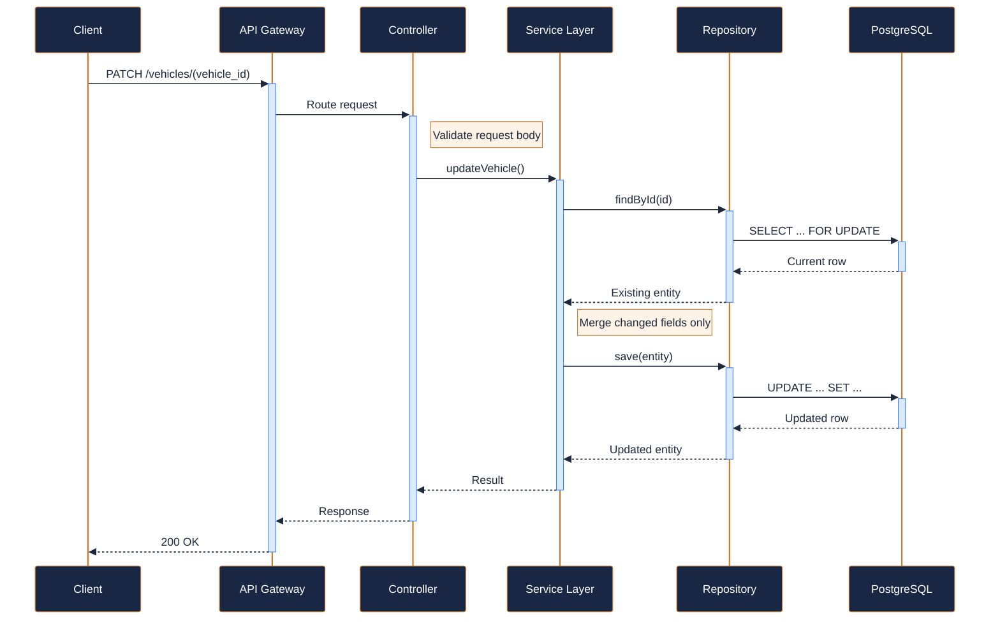

---
tags:
  - microservice
  - svc-transport-logistics
  - logistics
---

# svc-transport-logistics

**NovaTrek Transport Logistics API** &nbsp;|&nbsp; Logistics &nbsp;|&nbsp; `v1.4.0` &nbsp;|&nbsp; *NovaTrek Platform Engineering*

> Manages shuttle buses, van pickups, and transport coordination between NovaTrek

[:material-api: Swagger UI](../services/api/svc-transport-logistics.html){ .md-button .md-button--primary }
[:material-file-download: Download OpenAPI Spec](../specs/svc-transport-logistics.yaml){ .md-button }

---

## :material-database: Data Store

| Property | Detail |
|----------|--------|
| **Engine** | PostgreSQL 15 |
| **Schema** | `transport` |
| **Primary Tables** | `routes`, `route_schedules`, `transport_requests`, `vehicles` |
| **Key Features** | Time-window optimization for route scheduling · Vehicle capacity tracking with overbooking prevention · GPS coordinate storage for pickup and dropoff points |
| **Estimated Volume** | ~300 transport requests/day |

---

## :material-api: Endpoints (7 total)

---

### GET `/routes` — List transport routes { .endpoint-get }

> Returns available transport routes with optional filtering by origin, destination, or active status.

[:material-open-in-new: View in Swagger UI](../services/api/svc-transport-logistics.html){ .md-button }

---

### POST `/routes` — Create a new transport route { .endpoint-post }

[:material-open-in-new: View in Swagger UI](../services/api/svc-transport-logistics.html){ .md-button }

---

### GET `/routes/{route_id}/schedule` — Get schedule for a transport route { .endpoint-get }

> Returns the daily schedule of departures for a given route, optionally filtered by date range.

[:material-open-in-new: View in Swagger UI](../services/api/svc-transport-logistics.html){ .md-button }

---

### POST `/transport-requests` — Request transport for a reservation { .endpoint-post }

> Creates a transport request linked to an existing reservation

[:material-open-in-new: View in Swagger UI](../services/api/svc-transport-logistics.html){ .md-button }

---

### GET `/transport-requests/{request_id}` — Get transport request details { .endpoint-get }

[:material-open-in-new: View in Swagger UI](../services/api/svc-transport-logistics.html){ .md-button }

---

### GET `/vehicles` — List fleet vehicles { .endpoint-get }

[:material-open-in-new: View in Swagger UI](../services/api/svc-transport-logistics.html){ .md-button }

---

### PATCH `/vehicles/{vehicle_id}` — Update vehicle information { .endpoint-patch }

[:material-open-in-new: View in Swagger UI](../services/api/svc-transport-logistics.html){ .md-button }

