---
tags:
  - microservice
  - svc-trip-catalog
  - product-catalog
---

# svc-trip-catalog

**NovaTrek Adventures - Trip Catalog Service** &nbsp;|&nbsp; Product Catalog &nbsp;|&nbsp; `v2.4.0` &nbsp;|&nbsp; *NovaTrek Platform Engineering*

> Manages adventure trip definitions, scheduling, pricing, and availability

[:material-api: Swagger UI](../services/api/svc-trip-catalog.html){ .md-button .md-button--primary }
[:material-file-download: Download OpenAPI Spec](../specs/svc-trip-catalog.yaml){ .md-button }

---

## :material-database: Data Store

| Property | Detail |
|----------|--------|
| **Engine** | PostgreSQL 15 |
| **Schema** | `catalog` |
| **Primary Tables** | `trips`, `trip_schedules`, `pricing_tiers`, `requirements`, `regions`, `activity_types` |
| **Key Features** | Full-text search index on trip name and description · Materialized view for availability calendar · JSONB columns for flexible requirement definitions |
| **Estimated Volume** | ~50 catalog updates/day, ~10K availability reads/day |

---

## :material-api: Endpoints (11 total)

---

### GET `/trips` — Search trips with filters { .endpoint-get }

> Returns a paginated list of trips matching the specified filter criteria.

[:material-open-in-new: View in Swagger UI](../services/api/svc-trip-catalog.html#/Trips/searchTrips){ .md-button }

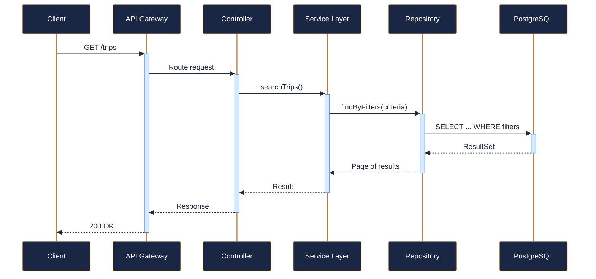

---

### POST `/trips` — Create a new trip definition { .endpoint-post }

> Creates a new trip in DRAFT status. The trip must be explicitly

[:material-open-in-new: View in Swagger UI](../services/api/svc-trip-catalog.html#/Trips/createTrip){ .md-button }

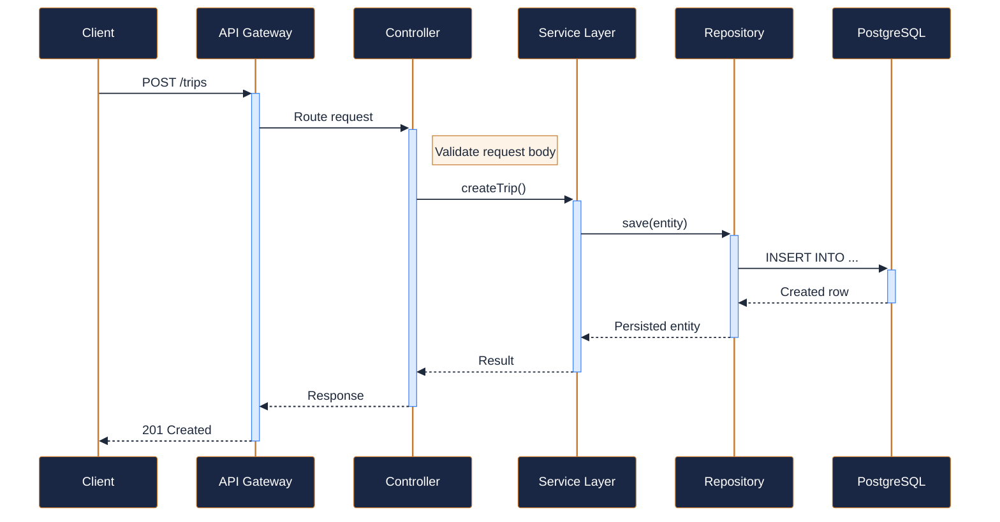

---

### GET `/trips/{trip_id}` — Get trip details { .endpoint-get }

> Returns the full trip definition including all metadata.

[:material-open-in-new: View in Swagger UI](../services/api/svc-trip-catalog.html#/Trips/getTripById){ .md-button }

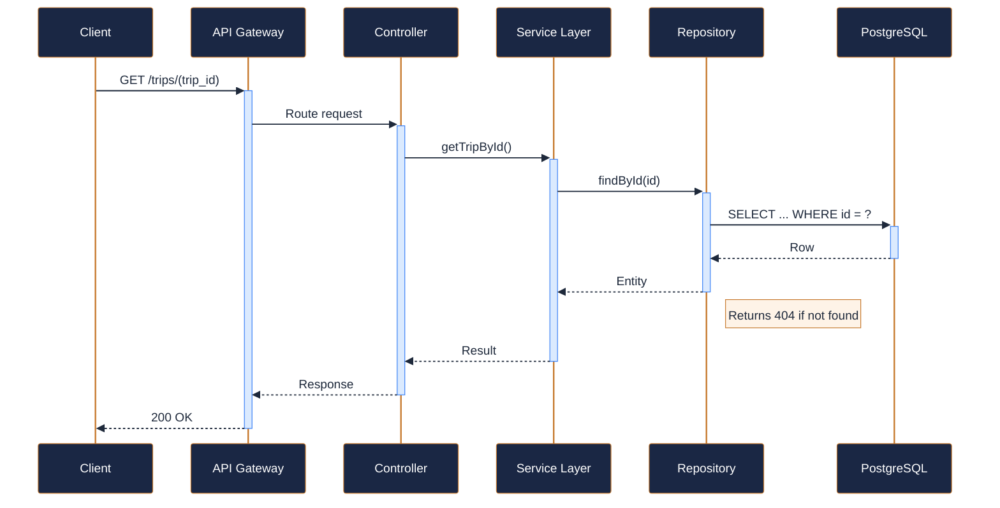

---

### PATCH `/trips/{trip_id}` — Update trip details { .endpoint-patch }

> Partially updates a trip definition. Only provided fields are modified.

[:material-open-in-new: View in Swagger UI](../services/api/svc-trip-catalog.html#/Trips/updateTrip){ .md-button }

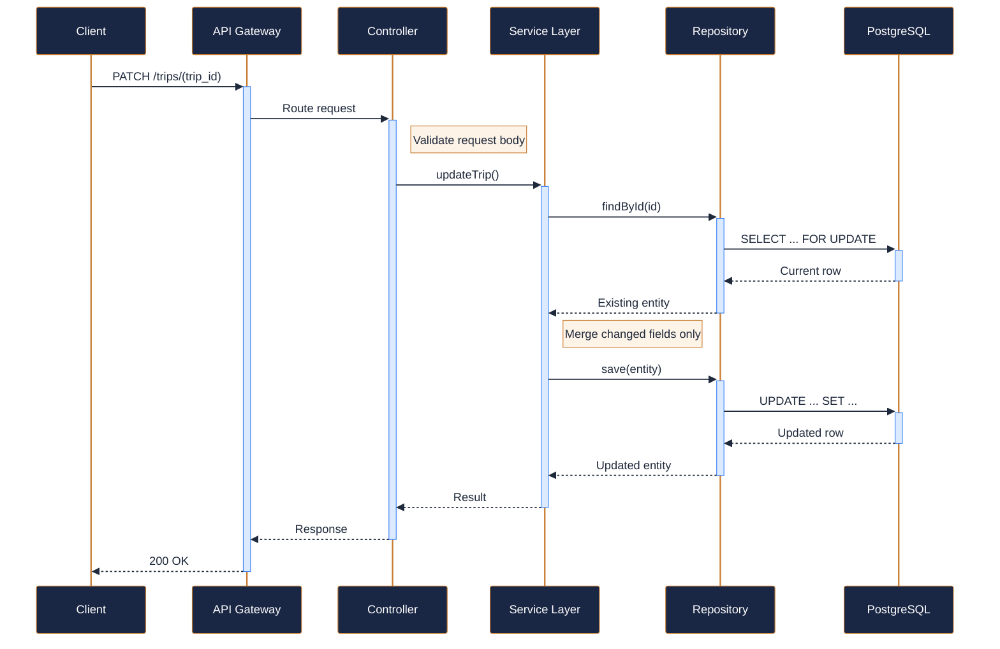

---

### GET `/trips/{trip_id}/schedule` — Get scheduled departures { .endpoint-get }

> Returns all scheduled departures for a trip, optionally filtered

[:material-open-in-new: View in Swagger UI](../services/api/svc-trip-catalog.html#/Schedule/getTripSchedule){ .md-button }

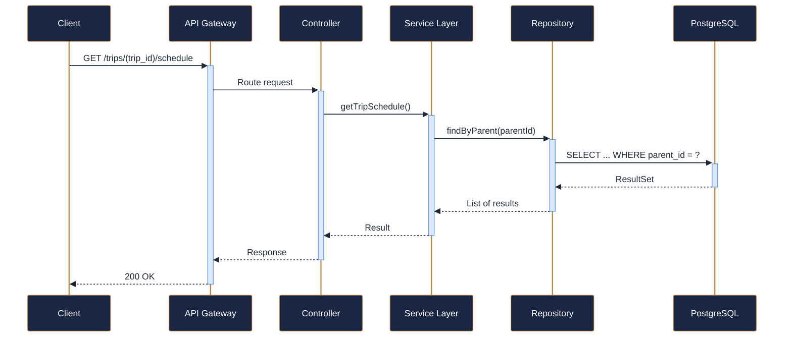

---

### POST `/trips/{trip_id}/schedule` — Add a scheduled departure { .endpoint-post }

> Adds a new departure date and time for this trip. The trip must be

[:material-open-in-new: View in Swagger UI](../services/api/svc-trip-catalog.html#/Schedule/addScheduledDeparture){ .md-button }

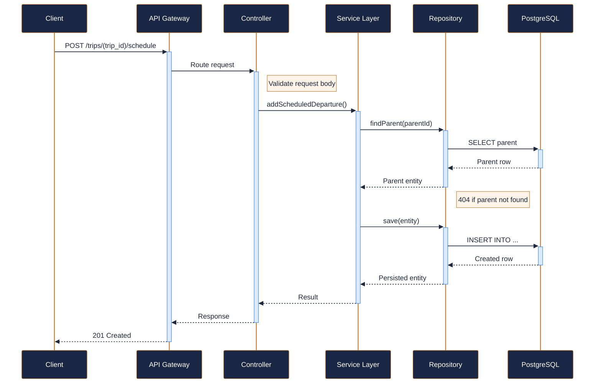

---

### GET `/trips/{trip_id}/pricing` — Get pricing tiers { .endpoint-get }

> Returns all pricing tiers configured for the specified trip.

[:material-open-in-new: View in Swagger UI](../services/api/svc-trip-catalog.html#/Pricing/getTripPricing){ .md-button }

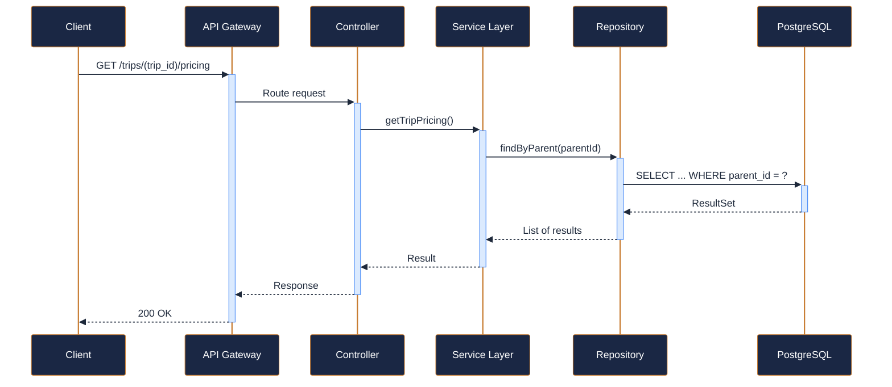

---

### PUT `/trips/{trip_id}/pricing` — Replace pricing tiers { .endpoint-put }

> Replaces all pricing tiers for the trip. At minimum, a STANDARD tier

[:material-open-in-new: View in Swagger UI](../services/api/svc-trip-catalog.html#/Pricing/updateTripPricing){ .md-button }

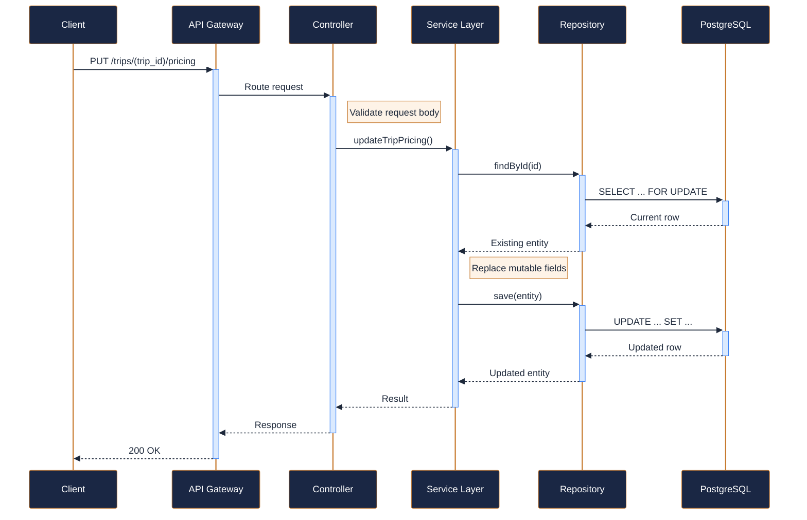

---

### GET `/trips/{trip_id}/requirements` — Get trip requirements { .endpoint-get }

> Returns gear, certification, and fitness requirements for the trip.

[:material-open-in-new: View in Swagger UI](../services/api/svc-trip-catalog.html#/Requirements/getTripRequirements){ .md-button }

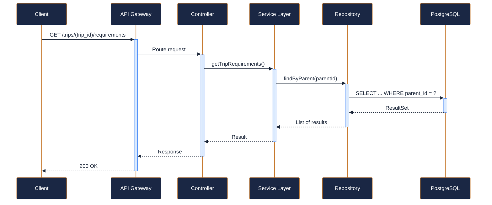

---

### GET `/regions` — List operating regions { .endpoint-get }

> Returns all regions where NovaTrek operates adventure trips.

[:material-open-in-new: View in Swagger UI](../services/api/svc-trip-catalog.html#/Reference%20Data/listRegions){ .md-button }

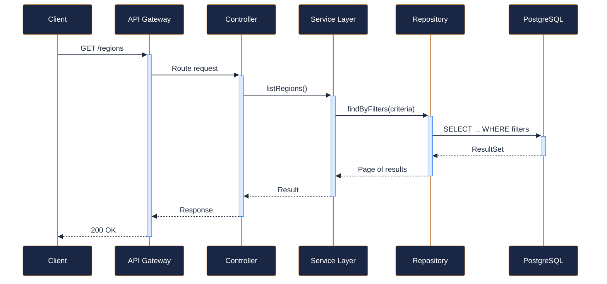

---

### GET `/activity-types` — List available activity types { .endpoint-get }

> Returns the enumerated list of supported activity types with

[:material-open-in-new: View in Swagger UI](../services/api/svc-trip-catalog.html#/Reference%20Data/listActivityTypes){ .md-button }

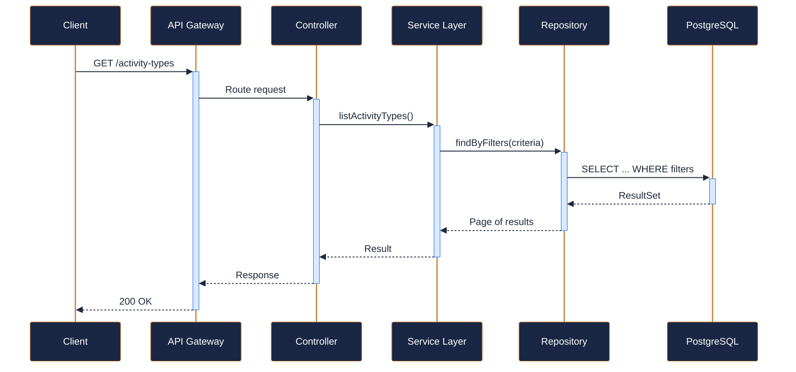
