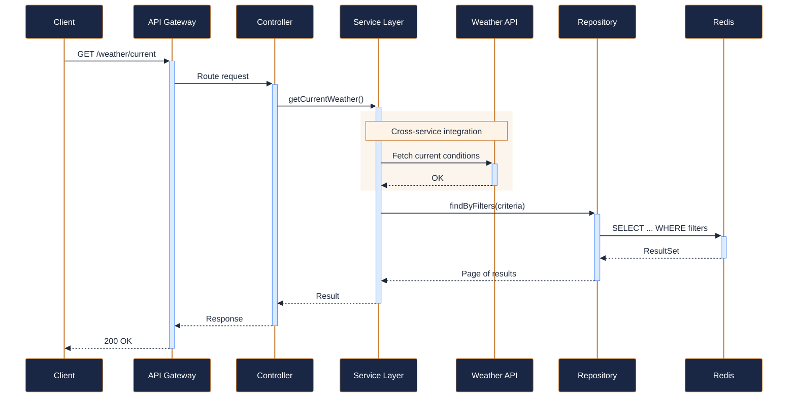
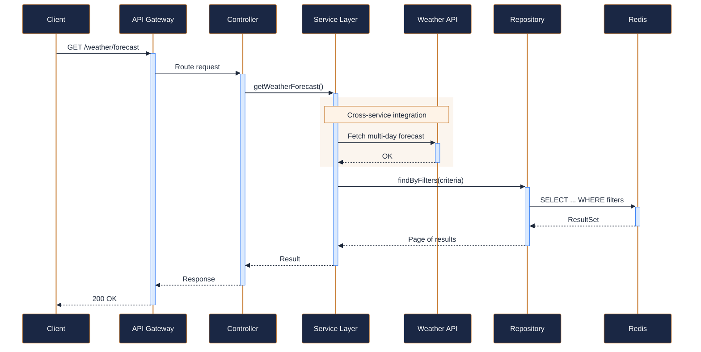
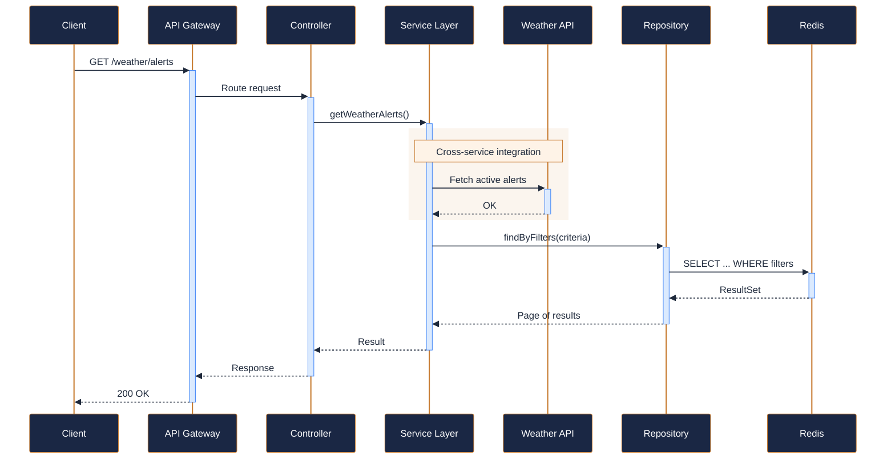
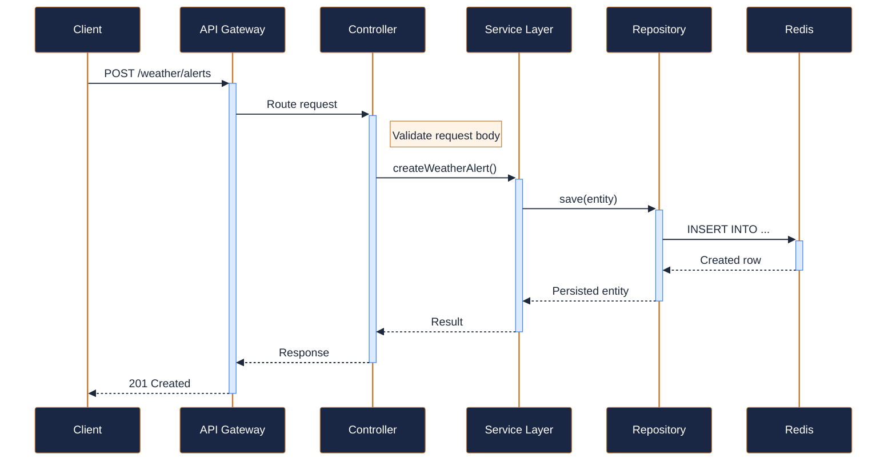
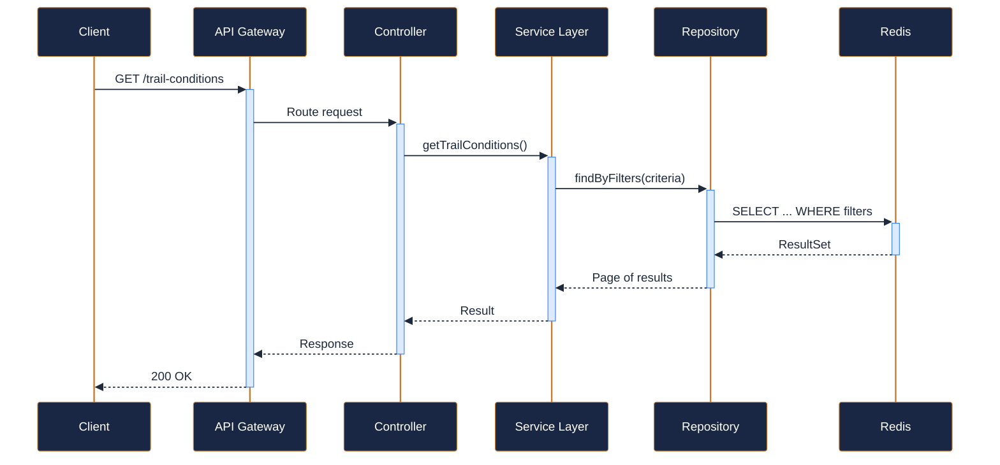

---
tags:
  - microservice
  - svc-weather
  - support
---

# svc-weather

**NovaTrek Weather Service** &nbsp;|&nbsp; Support &nbsp;|&nbsp; `v1.0.0` &nbsp;|&nbsp; *NovaTrek Platform Team*

> Integrates with on-site weather stations and third-party providers to deliver

[:material-api: Swagger UI](../services/api/svc-weather.html){ .md-button .md-button--primary }
[:material-file-download: Download OpenAPI Spec](../specs/svc-weather.yaml){ .md-button }

---

## :material-database: Data Store

| Property | Detail |
|----------|--------|
| **Engine** | Redis 7 + PostgreSQL 15 |
| **Schema** | `weather` |
| **Primary Tables** | `weather_stations`, `forecast_cache`, `alert_history` |
| **Key Features** | Redis TTL cache for current conditions (5-min TTL) · External weather API response caching and aggregation · Severe weather alert deduplication |
| **Estimated Volume** | ~10K weather reads/day, ~100 external API fetches/day |

---

## :material-api: Endpoints (5 total)

---

### GET `/weather/current` — Get current weather conditions { .endpoint-get }

> Returns the latest weather data from the specified station, typically updated every 15 minutes.

[:material-open-in-new: View in Swagger UI](../services/api/svc-weather.html#/Weather/getCurrentWeather){ .md-button }

---

### GET `/weather/forecast` — Get weather forecast { .endpoint-get }

> Returns a multi-day forecast for the area covered by the specified weather station. Maximum 10-day lookahead.

[:material-open-in-new: View in Swagger UI](../services/api/svc-weather.html#/Weather/getWeatherForecast){ .md-button }

---

### GET `/weather/alerts` — Get active weather alerts for a region { .endpoint-get }

> Returns all active weather alerts for the specified region.

[:material-open-in-new: View in Swagger UI](../services/api/svc-weather.html#/Alerts/getWeatherAlerts){ .md-button }

---

### POST `/weather/alerts` — Create a weather alert (internal) { .endpoint-post }

> Internal endpoint used by automated monitoring systems or operations staff

[:material-open-in-new: View in Swagger UI](../services/api/svc-weather.html#/Alerts/createWeatherAlert){ .md-button }

---

### GET `/trail-conditions` — Get current trail conditions { .endpoint-get }

> Returns real-time condition data for the specified trail, combining weather station

[:material-open-in-new: View in Swagger UI](../services/api/svc-weather.html#/Trail%20Conditions/getTrailConditions){ .md-button }

