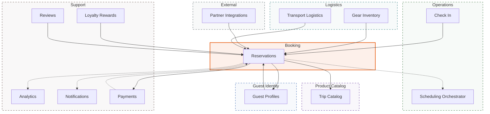
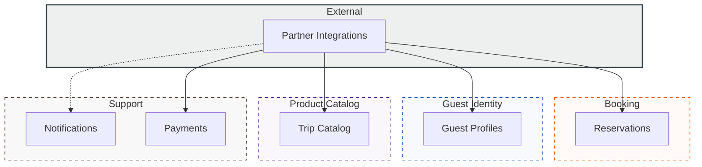
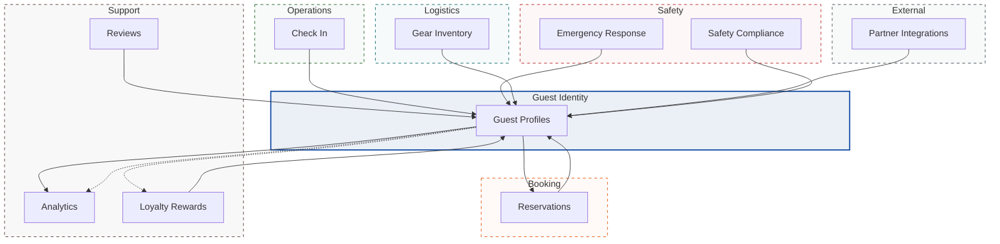
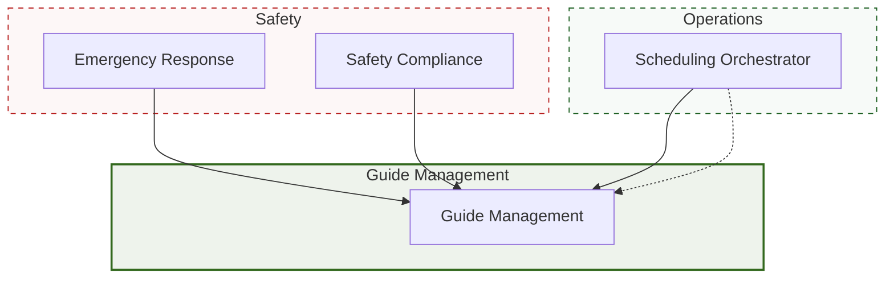
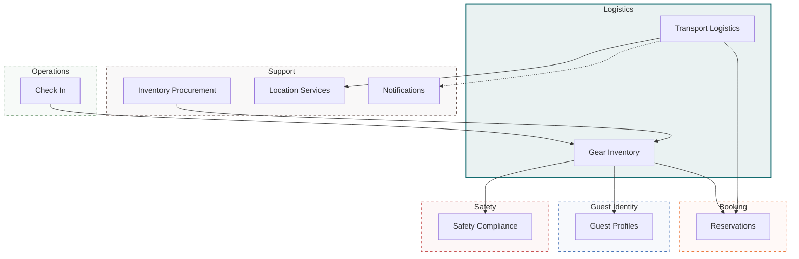
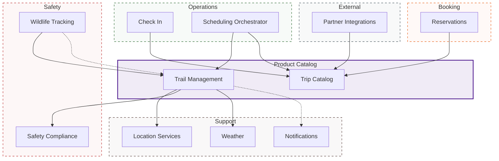

```mermaid
flowchart TB

    subgraph Operations["Operations"]
        svc-check-in["Check In"]
        svc-scheduling-orchestrator["Scheduling Orchestrator"]
    end

    subgraph Booking["Booking"]
        svc-reservations["Reservations"]
    end

    subgraph Guest_Identity["Guest Identity"]
        svc-guest-profiles["Guest Profiles"]
    end

    subgraph Guide_Management["Guide Management"]
        svc-guide-management["Guide Management"]
    end

    subgraph Logistics["Logistics"]
        svc-gear-inventory["Gear Inventory"]
    end

    subgraph Product_Catalog["Product Catalog"]
        svc-trail-management["Trail Management"]
        svc-trip-catalog["Trip Catalog"]
    end

    subgraph Safety["Safety"]
        svc-emergency-response["Emergency Response"]
        svc-safety-compliance["Safety Compliance"]
        svc-wildlife-tracking["Wildlife Tracking"]
    end

    subgraph Support["Support"]
        svc-analytics["Analytics"]
        svc-location-services["Location Services"]
        svc-notifications["Notifications"]
        svc-weather["Weather"]
    end

    %% REST calls
    svc-check-in --> svc-gear-inventory
    svc-check-in --> svc-guest-profiles
    svc-check-in --> svc-reservations
    svc-check-in --> svc-safety-compliance
    svc-check-in --> svc-trip-catalog
    svc-scheduling-orchestrator --> svc-guide-management
    svc-scheduling-orchestrator --> svc-location-services
    svc-scheduling-orchestrator --> svc-trail-management
    svc-scheduling-orchestrator --> svc-trip-catalog
    svc-scheduling-orchestrator --> svc-weather
    svc-wildlife-tracking --> svc-scheduling-orchestrator

    %% Event flows
    svc-check-in -.-> svc-analytics
    svc-check-in -.-> svc-notifications
    svc-emergency-response -.-> svc-scheduling-orchestrator
    svc-reservations -.-> svc-scheduling-orchestrator
    svc-scheduling-orchestrator -.-> svc-analytics
    svc-scheduling-orchestrator -.-> svc-guide-management
    svc-scheduling-orchestrator -.-> svc-notifications
    svc-wildlife-tracking -.-> svc-scheduling-orchestrator

    %% Styling
    style Operations fill:#1B5E2015,stroke:#1B5E20,stroke-width:2px
    style Support fill:#4E342E08,stroke:#4E342E,stroke-width:1px,stroke-dasharray: 5 5
    style Booking fill:#E6510008,stroke:#E65100,stroke-width:1px,stroke-dasharray: 5 5
    style Safety fill:#B71C1C08,stroke:#B71C1C,stroke-width:1px,stroke-dasharray: 5 5
    style Product_Catalog fill:#4A148C08,stroke:#4A148C,stroke-width:1px,stroke-dasharray: 5 5
    style Logistics fill:#00606408,stroke:#006064,stroke-width:1px,stroke-dasharray: 5 5
    style Guest_Identity fill:#0D47A108,stroke:#0D47A1,stroke-width:1px,stroke-dasharray: 5 5
    style Guide_Management fill:#33691E08,stroke:#33691E,stroke-width:1px,stroke-dasharray: 5 5
```

```mermaid
flowchart TB

    subgraph Safety["Safety"]
        svc-emergency-response["Emergency Response"]
        svc-safety-compliance["Safety Compliance"]
        svc-wildlife-tracking["Wildlife Tracking"]
    end

    subgraph Guest_Identity["Guest Identity"]
        svc-guest-profiles["Guest Profiles"]
    end

    subgraph Guide_Management["Guide Management"]
        svc-guide-management["Guide Management"]
    end

    subgraph Logistics["Logistics"]
        svc-gear-inventory["Gear Inventory"]
    end

    subgraph Operations["Operations"]
        svc-check-in["Check In"]
        svc-scheduling-orchestrator["Scheduling Orchestrator"]
    end

    subgraph Product_Catalog["Product Catalog"]
        svc-trail-management["Trail Management"]
    end

    subgraph Support["Support"]
        svc-analytics["Analytics"]
        svc-location-services["Location Services"]
        svc-notifications["Notifications"]
        svc-weather["Weather"]
    end

    %% REST calls
    svc-check-in --> svc-safety-compliance
    svc-emergency-response --> svc-guest-profiles
    svc-emergency-response --> svc-guide-management
    svc-emergency-response --> svc-location-services
    svc-gear-inventory --> svc-safety-compliance
    svc-safety-compliance --> svc-guest-profiles
    svc-safety-compliance --> svc-guide-management
    svc-trail-management --> svc-safety-compliance
    svc-wildlife-tracking --> svc-scheduling-orchestrator
    svc-wildlife-tracking --> svc-trail-management
    svc-wildlife-tracking --> svc-weather

    %% Event flows
    svc-emergency-response -.-> svc-analytics
    svc-emergency-response -.-> svc-notifications
    svc-emergency-response -.-> svc-safety-compliance
    svc-emergency-response -.-> svc-scheduling-orchestrator
    svc-safety-compliance -.-> svc-analytics
    svc-safety-compliance -.-> svc-notifications
    svc-wildlife-tracking -.-> svc-analytics
    svc-wildlife-tracking -.-> svc-notifications
    svc-wildlife-tracking -.-> svc-safety-compliance
    svc-wildlife-tracking -.-> svc-scheduling-orchestrator
    svc-wildlife-tracking -.-> svc-trail-management

    %% Styling
    style Safety fill:#B71C1C15,stroke:#B71C1C,stroke-width:2px
    style Support fill:#4E342E08,stroke:#4E342E,stroke-width:1px,stroke-dasharray: 5 5
    style Logistics fill:#00606408,stroke:#006064,stroke-width:1px,stroke-dasharray: 5 5
    style Guest_Identity fill:#0D47A108,stroke:#0D47A1,stroke-width:1px,stroke-dasharray: 5 5
    style Operations fill:#1B5E2008,stroke:#1B5E20,stroke-width:1px,stroke-dasharray: 5 5
    style Guide_Management fill:#33691E08,stroke:#33691E,stroke-width:1px,stroke-dasharray: 5 5
    style Product_Catalog fill:#4A148C08,stroke:#4A148C,stroke-width:1px,stroke-dasharray: 5 5
```

```mermaid
flowchart TB

    subgraph Support["Support"]
        svc-analytics["Analytics"]
        svc-inventory-procurement["Inventory Procurement"]
        svc-location-services["Location Services"]
        svc-loyalty-rewards["Loyalty Rewards"]
        svc-media-gallery["Media Gallery"]
        svc-notifications["Notifications"]
        svc-payments["Payments"]
        svc-reviews["Reviews"]
        svc-weather["Weather"]
    end

    subgraph Booking["Booking"]
        svc-reservations["Reservations"]
    end

    subgraph External["External"]
        svc-partner-integrations["Partner Integrations"]
    end

    subgraph Guest_Identity["Guest Identity"]
        svc-guest-profiles["Guest Profiles"]
    end

    subgraph Logistics["Logistics"]
        svc-gear-inventory["Gear Inventory"]
        svc-transport-logistics["Transport Logistics"]
    end

    subgraph Operations["Operations"]
        svc-check-in["Check In"]
        svc-scheduling-orchestrator["Scheduling Orchestrator"]
    end

    subgraph Product_Catalog["Product Catalog"]
        svc-trail-management["Trail Management"]
    end

    subgraph Safety["Safety"]
        svc-emergency-response["Emergency Response"]
        svc-safety-compliance["Safety Compliance"]
        svc-wildlife-tracking["Wildlife Tracking"]
    end

    %% REST calls
    svc-emergency-response --> svc-location-services
    svc-guest-profiles --> svc-analytics
    svc-inventory-procurement --> svc-gear-inventory
    svc-inventory-procurement --> svc-payments
    svc-loyalty-rewards --> svc-guest-profiles
    svc-loyalty-rewards --> svc-payments
    svc-loyalty-rewards --> svc-reservations
    svc-partner-integrations --> svc-payments
    svc-reservations --> svc-payments
    svc-reviews --> svc-guest-profiles
    svc-reviews --> svc-reservations
    svc-scheduling-orchestrator --> svc-location-services
    svc-scheduling-orchestrator --> svc-weather
    svc-trail-management --> svc-location-services
    svc-trail-management --> svc-weather
    svc-transport-logistics --> svc-location-services
    svc-wildlife-tracking --> svc-weather

    %% Event flows
    svc-check-in -.-> svc-analytics
    svc-check-in -.-> svc-notifications
    svc-emergency-response -.-> svc-analytics
    svc-emergency-response -.-> svc-notifications
    svc-guest-profiles -.-> svc-analytics
    svc-guest-profiles -.-> svc-loyalty-rewards
    svc-inventory-procurement -.-> svc-notifications
    svc-loyalty-rewards -.-> svc-notifications
    svc-media-gallery -.-> svc-notifications
    svc-partner-integrations -.-> svc-notifications
    svc-payments -.-> svc-notifications
    svc-payments -.-> svc-reservations
    svc-reservations -.-> svc-analytics
    svc-reservations -.-> svc-notifications
    svc-safety-compliance -.-> svc-analytics
    svc-safety-compliance -.-> svc-notifications
    svc-scheduling-orchestrator -.-> svc-analytics
    svc-scheduling-orchestrator -.-> svc-notifications
    svc-trail-management -.-> svc-notifications
    svc-transport-logistics -.-> svc-notifications
    svc-weather -.-> svc-notifications
    svc-wildlife-tracking -.-> svc-analytics
    svc-wildlife-tracking -.-> svc-notifications

    %% Styling
    style Support fill:#4E342E15,stroke:#4E342E,stroke-width:2px
    style Logistics fill:#00606408,stroke:#006064,stroke-width:1px,stroke-dasharray: 5 5
    style Booking fill:#E6510008,stroke:#E65100,stroke-width:1px,stroke-dasharray: 5 5
    style Safety fill:#B71C1C08,stroke:#B71C1C,stroke-width:1px,stroke-dasharray: 5 5
    style External fill:#37474F08,stroke:#37474F,stroke-width:1px,stroke-dasharray: 5 5
    style Guest_Identity fill:#0D47A108,stroke:#0D47A1,stroke-width:1px,stroke-dasharray: 5 5
    style Operations fill:#1B5E2008,stroke:#1B5E20,stroke-width:1px,stroke-dasharray: 5 5
    style Product_Catalog fill:#4A148C08,stroke:#4A148C,stroke-width:1px,stroke-dasharray: 5 5
```

# Domain Views

Per-domain topology breakdown showing services, databases, and integration patterns for each bounded context.

!!! info "Everything on this portal is entirely fictional"
    NovaTrek Adventures is a completely fictitious company used as a synthetic workspace for the Continuous Architecture Platform proof of concept.

---

## Booking

**Team:** Booking Platform Team

### Topology

**Solid arrows** = REST calls  |  **Dashed arrows** = Kafka events  |  Dashed border = external domain

<a class="diagram-source" href="https://github.com/christopherblaisdell/continuous-architecture-platform-poc/blob/main/architecture/calm/novatrek-topology.json" title="View data source">&#x2699; Generated from architecture/calm/novatrek-topology.json</a>

### Services

| Service | Interfaces | Database | REST Out | REST In | Events Out | Events In |
|---------|------------|----------|----------|---------|------------|----------|
| [svc-reservations](../microservices/svc-reservations.md) | 10 | PostgreSQL 15 | 3 | 7 | 3 | 1 |

### Cross-Domain Integration

**Outbound (this domain calls):**

| Source | Target | Action |
|--------|--------|--------|
| [svc-reservations](../microservices/svc-reservations.md) | [svc-guest-profiles](../microservices/svc-guest-profiles.md) | Validate guest identity |
| [svc-reservations](../microservices/svc-reservations.md) | [svc-trip-catalog](../microservices/svc-trip-catalog.md) | Check trip availability |
| [svc-reservations](../microservices/svc-reservations.md) | [svc-payments](../microservices/svc-payments.md) | Process deposit payment |

**Inbound (called by other domains):**

| Source | Target | Action |
|--------|--------|--------|
| [svc-check-in](../microservices/svc-check-in.md) | [svc-reservations](../microservices/svc-reservations.md) | Verify reservation exists |
| [svc-partner-integrations](../microservices/svc-partner-integrations.md) | [svc-reservations](../microservices/svc-reservations.md) | Create reservation |
| [svc-guest-profiles](../microservices/svc-guest-profiles.md) | [svc-reservations](../microservices/svc-reservations.md) | Query past bookings |
| [svc-gear-inventory](../microservices/svc-gear-inventory.md) | [svc-reservations](../microservices/svc-reservations.md) | Verify booking |
| [svc-transport-logistics](../microservices/svc-transport-logistics.md) | [svc-reservations](../microservices/svc-reservations.md) | Get booking details |
| [svc-loyalty-rewards](../microservices/svc-loyalty-rewards.md) | [svc-reservations](../microservices/svc-reservations.md) | Verify completed booking |
| [svc-reviews](../microservices/svc-reviews.md) | [svc-reservations](../microservices/svc-reservations.md) | Validate reservation exists and is COMPLETED |

---

## External

**Team:** Integration Team

### Topology

**Solid arrows** = REST calls  |  **Dashed arrows** = Kafka events  |  Dashed border = external domain

<a class="diagram-source" href="https://github.com/christopherblaisdell/continuous-architecture-platform-poc/blob/main/architecture/calm/novatrek-topology.json" title="View data source">&#x2699; Generated from architecture/calm/novatrek-topology.json</a>

### Services

| Service | Interfaces | Database | REST Out | REST In | Events Out | Events In |
|---------|------------|----------|----------|---------|------------|----------|
| [svc-partner-integrations](../microservices/svc-partner-integrations.md) | 7 | PostgreSQL 15 | 4 | 0 | 1 | 0 |

### Cross-Domain Integration

**Outbound (this domain calls):**

| Source | Target | Action |
|--------|--------|--------|
| [svc-partner-integrations](../microservices/svc-partner-integrations.md) | [svc-guest-profiles](../microservices/svc-guest-profiles.md) | Validate guest identity |
| [svc-partner-integrations](../microservices/svc-partner-integrations.md) | [svc-trip-catalog](../microservices/svc-trip-catalog.md) | Check trip availability |
| [svc-partner-integrations](../microservices/svc-partner-integrations.md) | [svc-reservations](../microservices/svc-reservations.md) | Create reservation |
| [svc-partner-integrations](../microservices/svc-partner-integrations.md) | [svc-payments](../microservices/svc-payments.md) | Process commission |

---

## Guest Identity

**Team:** Guest Experience Team

### Topology

**Solid arrows** = REST calls  |  **Dashed arrows** = Kafka events  |  Dashed border = external domain

<a class="diagram-source" href="https://github.com/christopherblaisdell/continuous-architecture-platform-poc/blob/main/architecture/calm/novatrek-topology.json" title="View data source">&#x2699; Generated from architecture/calm/novatrek-topology.json</a>

### Services

| Service | Interfaces | Database | REST Out | REST In | Events Out | Events In |
|---------|------------|----------|----------|---------|------------|----------|
| [svc-guest-profiles](../microservices/svc-guest-profiles.md) | 10 | PostgreSQL 15 | 2 | 8 | 2 | 0 |

### Cross-Domain Integration

**Outbound (this domain calls):**

| Source | Target | Action |
|--------|--------|--------|
| [svc-guest-profiles](../microservices/svc-guest-profiles.md) | [svc-reservations](../microservices/svc-reservations.md) | Query past bookings |
| [svc-guest-profiles](../microservices/svc-guest-profiles.md) | [svc-analytics](../microservices/svc-analytics.md) | Get satisfaction scores |

**Inbound (called by other domains):**

| Source | Target | Action |
|--------|--------|--------|
| [svc-check-in](../microservices/svc-check-in.md) | [svc-guest-profiles](../microservices/svc-guest-profiles.md) | Validate guest identity |
| [svc-reservations](../microservices/svc-reservations.md) | [svc-guest-profiles](../microservices/svc-guest-profiles.md) | Validate guest identity |
| [svc-partner-integrations](../microservices/svc-partner-integrations.md) | [svc-guest-profiles](../microservices/svc-guest-profiles.md) | Validate guest identity |
| [svc-safety-compliance](../microservices/svc-safety-compliance.md) | [svc-guest-profiles](../microservices/svc-guest-profiles.md) | Validate guest identity |
| [svc-gear-inventory](../microservices/svc-gear-inventory.md) | [svc-guest-profiles](../microservices/svc-guest-profiles.md) | Validate guest |
| [svc-loyalty-rewards](../microservices/svc-loyalty-rewards.md) | [svc-guest-profiles](../microservices/svc-guest-profiles.md) | Get member profile |
| [svc-emergency-response](../microservices/svc-emergency-response.md) | [svc-guest-profiles](../microservices/svc-guest-profiles.md) | Retrieve guest medical info and emergency contacts |
| [svc-reviews](../microservices/svc-reviews.md) | [svc-guest-profiles](../microservices/svc-guest-profiles.md) | Validate guest identity |

---

## Guide Management

**Team:** Guide Operations Team

### Topology

**Solid arrows** = REST calls  |  **Dashed arrows** = Kafka events  |  Dashed border = external domain

<a class="diagram-source" href="https://github.com/christopherblaisdell/continuous-architecture-platform-poc/blob/main/architecture/calm/novatrek-topology.json" title="View data source">&#x2699; Generated from architecture/calm/novatrek-topology.json</a>

### Services

| Service | Interfaces | Database | REST Out | REST In | Events Out | Events In |
|---------|------------|----------|----------|---------|------------|----------|
| [svc-guide-management](../microservices/svc-guide-management.md) | 12 | PostgreSQL 15 | 0 | 3 | 0 | 1 |

### Cross-Domain Integration

**Inbound (called by other domains):**

| Source | Target | Action |
|--------|--------|--------|
| [svc-scheduling-orchestrator](../microservices/svc-scheduling-orchestrator.md) | [svc-guide-management](../microservices/svc-guide-management.md) | Check guide availability |
| [svc-safety-compliance](../microservices/svc-safety-compliance.md) | [svc-guide-management](../microservices/svc-guide-management.md) | Get assigned guide |
| [svc-emergency-response](../microservices/svc-emergency-response.md) | [svc-guide-management](../microservices/svc-guide-management.md) | Identify nearest on-duty guide |

---

## Logistics

**Team:** Logistics Team

### Topology

**Solid arrows** = REST calls  |  **Dashed arrows** = Kafka events  |  Dashed border = external domain

<a class="diagram-source" href="https://github.com/christopherblaisdell/continuous-architecture-platform-poc/blob/main/architecture/calm/novatrek-topology.json" title="View data source">&#x2699; Generated from architecture/calm/novatrek-topology.json</a>

### Services

| Service | Interfaces | Database | REST Out | REST In | Events Out | Events In |
|---------|------------|----------|----------|---------|------------|----------|
| [svc-gear-inventory](../microservices/svc-gear-inventory.md) | 12 | PostgreSQL 15 | 3 | 2 | 0 | 0 |
| [svc-transport-logistics](../microservices/svc-transport-logistics.md) | 7 | PostgreSQL 15 | 2 | 0 | 1 | 0 |

### Cross-Domain Integration

**Outbound (this domain calls):**

| Source | Target | Action |
|--------|--------|--------|
| [svc-gear-inventory](../microservices/svc-gear-inventory.md) | [svc-guest-profiles](../microservices/svc-guest-profiles.md) | Validate guest |
| [svc-gear-inventory](../microservices/svc-gear-inventory.md) | [svc-reservations](../microservices/svc-reservations.md) | Verify booking |
| [svc-gear-inventory](../microservices/svc-gear-inventory.md) | [svc-safety-compliance](../microservices/svc-safety-compliance.md) | Check waiver status |
| [svc-transport-logistics](../microservices/svc-transport-logistics.md) | [svc-reservations](../microservices/svc-reservations.md) | Get booking details |
| [svc-transport-logistics](../microservices/svc-transport-logistics.md) | [svc-location-services](../microservices/svc-location-services.md) | Validate pickup location |

**Inbound (called by other domains):**

| Source | Target | Action |
|--------|--------|--------|
| [svc-check-in](../microservices/svc-check-in.md) | [svc-gear-inventory](../microservices/svc-gear-inventory.md) | Verify gear assignment |
| [svc-inventory-procurement](../microservices/svc-inventory-procurement.md) | [svc-gear-inventory](../microservices/svc-gear-inventory.md) | Verify item catalog |

---

## Operations

**Team:** NovaTrek Operations Team

### Topology

**Solid arrows** = REST calls  |  **Dashed arrows** = Kafka events  |  Dashed border = external domain

<a class="diagram-source" href="https://github.com/christopherblaisdell/continuous-architecture-platform-poc/blob/main/architecture/calm/novatrek-topology.json" title="View data source">&#x2699; Generated from architecture/calm/novatrek-topology.json</a>

### Services

| Service | Interfaces | Database | REST Out | REST In | Events Out | Events In |
|---------|------------|----------|----------|---------|------------|----------|
| [svc-check-in](../microservices/svc-check-in.md) | 6 | PostgreSQL 15 | 5 | 0 | 2 | 0 |
| [svc-scheduling-orchestrator](../microservices/svc-scheduling-orchestrator.md) | 6 | PostgreSQL 15 + Valkey 8 | 5 | 1 | 3 | 3 |

### Cross-Domain Integration

**Outbound (this domain calls):**

| Source | Target | Action |
|--------|--------|--------|
| [svc-check-in](../microservices/svc-check-in.md) | [svc-reservations](../microservices/svc-reservations.md) | Verify reservation exists |
| [svc-check-in](../microservices/svc-check-in.md) | [svc-guest-profiles](../microservices/svc-guest-profiles.md) | Validate guest identity |
| [svc-check-in](../microservices/svc-check-in.md) | [svc-trip-catalog](../microservices/svc-trip-catalog.md) | Get adventure category |
| [svc-check-in](../microservices/svc-check-in.md) | [svc-safety-compliance](../microservices/svc-safety-compliance.md) | Validate active waiver |
| [svc-check-in](../microservices/svc-check-in.md) | [svc-gear-inventory](../microservices/svc-gear-inventory.md) | Verify gear assignment |
| [svc-scheduling-orchestrator](../microservices/svc-scheduling-orchestrator.md) | [svc-guide-management](../microservices/svc-guide-management.md) | Check guide availability |
| [svc-scheduling-orchestrator](../microservices/svc-scheduling-orchestrator.md) | [svc-trail-management](../microservices/svc-trail-management.md) | Verify trail conditions |
| [svc-scheduling-orchestrator](../microservices/svc-scheduling-orchestrator.md) | [svc-weather](../microservices/svc-weather.md) | Get forecast |
| [svc-scheduling-orchestrator](../microservices/svc-scheduling-orchestrator.md) | [svc-trip-catalog](../microservices/svc-trip-catalog.md) | Get trip details |
| [svc-scheduling-orchestrator](../microservices/svc-scheduling-orchestrator.md) | [svc-location-services](../microservices/svc-location-services.md) | Check location capacity |

**Inbound (called by other domains):**

| Source | Target | Action |
|--------|--------|--------|
| [svc-wildlife-tracking](../microservices/svc-wildlife-tracking.md) | [svc-scheduling-orchestrator](../microservices/svc-scheduling-orchestrator.md) | Check for affected scheduled trips |

---

## Product Catalog

**Team:** Product Team

### Topology

**Solid arrows** = REST calls  |  **Dashed arrows** = Kafka events  |  Dashed border = external domain

<a class="diagram-source" href="https://github.com/christopherblaisdell/continuous-architecture-platform-poc/blob/main/architecture/calm/novatrek-topology.json" title="View data source">&#x2699; Generated from architecture/calm/novatrek-topology.json</a>

### Services

| Service | Interfaces | Database | REST Out | REST In | Events Out | Events In |
|---------|------------|----------|----------|---------|------------|----------|
| [svc-trail-management](../microservices/svc-trail-management.md) | 9 | PostGIS (PostgreSQL 15) | 3 | 2 | 1 | 1 |
| [svc-trip-catalog](../microservices/svc-trip-catalog.md) | 11 | PostgreSQL 15 | 0 | 4 | 0 | 0 |

### Cross-Domain Integration

**Outbound (this domain calls):**

| Source | Target | Action |
|--------|--------|--------|
| [svc-trail-management](../microservices/svc-trail-management.md) | [svc-weather](../microservices/svc-weather.md) | Correlate weather data |
| [svc-trail-management](../microservices/svc-trail-management.md) | [svc-location-services](../microservices/svc-location-services.md) | Get trail coordinates |
| [svc-trail-management](../microservices/svc-trail-management.md) | [svc-safety-compliance](../microservices/svc-safety-compliance.md) | Update trail safety assessment |

**Inbound (called by other domains):**

| Source | Target | Action |
|--------|--------|--------|
| [svc-scheduling-orchestrator](../microservices/svc-scheduling-orchestrator.md) | [svc-trail-management](../microservices/svc-trail-management.md) | Verify trail conditions |
| [svc-wildlife-tracking](../microservices/svc-wildlife-tracking.md) | [svc-trail-management](../microservices/svc-trail-management.md) | Identify nearest trails to sighting location |
| [svc-check-in](../microservices/svc-check-in.md) | [svc-trip-catalog](../microservices/svc-trip-catalog.md) | Get adventure category |
| [svc-reservations](../microservices/svc-reservations.md) | [svc-trip-catalog](../microservices/svc-trip-catalog.md) | Check trip availability |
| [svc-scheduling-orchestrator](../microservices/svc-scheduling-orchestrator.md) | [svc-trip-catalog](../microservices/svc-trip-catalog.md) | Get trip details |
| [svc-partner-integrations](../microservices/svc-partner-integrations.md) | [svc-trip-catalog](../microservices/svc-trip-catalog.md) | Check trip availability |

---

## Safety

**Team:** Safety and Compliance Team

### Topology

**Solid arrows** = REST calls  |  **Dashed arrows** = Kafka events  |  Dashed border = external domain

<a class="diagram-source" href="https://github.com/christopherblaisdell/continuous-architecture-platform-poc/blob/main/architecture/calm/novatrek-topology.json" title="View data source">&#x2699; Generated from architecture/calm/novatrek-topology.json</a>

### Services

| Service | Interfaces | Database | REST Out | REST In | Events Out | Events In |
|---------|------------|----------|----------|---------|------------|----------|
| [svc-emergency-response](../microservices/svc-emergency-response.md) | 11 | PostgreSQL 15 | 3 | 0 | 4 | 0 |
| [svc-safety-compliance](../microservices/svc-safety-compliance.md) | 9 | PostgreSQL 15 | 2 | 3 | 2 | 2 |
| [svc-wildlife-tracking](../microservices/svc-wildlife-tracking.md) | 11 | PostgreSQL 15 | 3 | 0 | 5 | 0 |

### Cross-Domain Integration

**Outbound (this domain calls):**

| Source | Target | Action |
|--------|--------|--------|
| [svc-emergency-response](../microservices/svc-emergency-response.md) | [svc-guest-profiles](../microservices/svc-guest-profiles.md) | Retrieve guest medical info and emergency contacts |
| [svc-emergency-response](../microservices/svc-emergency-response.md) | [svc-location-services](../microservices/svc-location-services.md) | Get last known guest GPS position |
| [svc-emergency-response](../microservices/svc-emergency-response.md) | [svc-guide-management](../microservices/svc-guide-management.md) | Identify nearest on-duty guide |
| [svc-safety-compliance](../microservices/svc-safety-compliance.md) | [svc-guest-profiles](../microservices/svc-guest-profiles.md) | Validate guest identity |
| [svc-safety-compliance](../microservices/svc-safety-compliance.md) | [svc-guide-management](../microservices/svc-guide-management.md) | Get assigned guide |
| [svc-wildlife-tracking](../microservices/svc-wildlife-tracking.md) | [svc-trail-management](../microservices/svc-trail-management.md) | Identify nearest trails to sighting location |
| [svc-wildlife-tracking](../microservices/svc-wildlife-tracking.md) | [svc-weather](../microservices/svc-weather.md) | Get current conditions at sighting location |
| [svc-wildlife-tracking](../microservices/svc-wildlife-tracking.md) | [svc-scheduling-orchestrator](../microservices/svc-scheduling-orchestrator.md) | Check for affected scheduled trips |

**Inbound (called by other domains):**

| Source | Target | Action |
|--------|--------|--------|
| [svc-check-in](../microservices/svc-check-in.md) | [svc-safety-compliance](../microservices/svc-safety-compliance.md) | Validate active waiver |
| [svc-gear-inventory](../microservices/svc-gear-inventory.md) | [svc-safety-compliance](../microservices/svc-safety-compliance.md) | Check waiver status |
| [svc-trail-management](../microservices/svc-trail-management.md) | [svc-safety-compliance](../microservices/svc-safety-compliance.md) | Update trail safety assessment |

---

## Support

**Team:** Support Services Team

### Topology

**Solid arrows** = REST calls  |  **Dashed arrows** = Kafka events  |  Dashed border = external domain

<a class="diagram-source" href="https://github.com/christopherblaisdell/continuous-architecture-platform-poc/blob/main/architecture/calm/novatrek-topology.json" title="View data source">&#x2699; Generated from architecture/calm/novatrek-topology.json</a>

### Services

| Service | Interfaces | Database | REST Out | REST In | Events Out | Events In |
|---------|------------|----------|----------|---------|------------|----------|
| [svc-analytics](../microservices/svc-analytics.md) | 6 | Oracle Database 19c | 0 | 1 | 0 | 7 |
| [svc-inventory-procurement](../microservices/svc-inventory-procurement.md) | 8 | PostgreSQL 15 | 2 | 0 | 1 | 0 |
| [svc-location-services](../microservices/svc-location-services.md) | 6 | PostGIS (PostgreSQL 15) | 0 | 4 | 0 | 0 |
| [svc-loyalty-rewards](../microservices/svc-loyalty-rewards.md) | 5 | Couchbase 7 | 3 | 0 | 1 | 1 |
| [svc-media-gallery](../microservices/svc-media-gallery.md) | 5 | PostgreSQL 15 + S3-Compatible Object Store | 0 | 0 | 1 | 0 |
| [svc-notifications](../microservices/svc-notifications.md) | 6 | PostgreSQL 15 + Valkey 8 | 0 | 0 | 0 | 14 |
| [svc-payments](../microservices/svc-payments.md) | 13 | PostgreSQL 15 | 0 | 4 | 2 | 0 |
| [svc-reviews](../microservices/svc-reviews.md) | 10 | PostgreSQL 15 | 2 | 0 | 0 | 0 |
| [svc-weather](../microservices/svc-weather.md) | 5 | Valkey 8 + PostgreSQL 15 | 0 | 3 | 1 | 0 |

### Cross-Domain Integration

**Outbound (this domain calls):**

| Source | Target | Action |
|--------|--------|--------|
| [svc-inventory-procurement](../microservices/svc-inventory-procurement.md) | [svc-gear-inventory](../microservices/svc-gear-inventory.md) | Verify item catalog |
| [svc-loyalty-rewards](../microservices/svc-loyalty-rewards.md) | [svc-reservations](../microservices/svc-reservations.md) | Verify completed booking |
| [svc-loyalty-rewards](../microservices/svc-loyalty-rewards.md) | [svc-guest-profiles](../microservices/svc-guest-profiles.md) | Get member profile |
| [svc-reviews](../microservices/svc-reviews.md) | [svc-reservations](../microservices/svc-reservations.md) | Validate reservation exists and is COMPLETED |
| [svc-reviews](../microservices/svc-reviews.md) | [svc-guest-profiles](../microservices/svc-guest-profiles.md) | Validate guest identity |

**Inbound (called by other domains):**

| Source | Target | Action |
|--------|--------|--------|
| [svc-guest-profiles](../microservices/svc-guest-profiles.md) | [svc-analytics](../microservices/svc-analytics.md) | Get satisfaction scores |
| [svc-scheduling-orchestrator](../microservices/svc-scheduling-orchestrator.md) | [svc-location-services](../microservices/svc-location-services.md) | Check location capacity |
| [svc-transport-logistics](../microservices/svc-transport-logistics.md) | [svc-location-services](../microservices/svc-location-services.md) | Validate pickup location |
| [svc-trail-management](../microservices/svc-trail-management.md) | [svc-location-services](../microservices/svc-location-services.md) | Get trail coordinates |
| [svc-emergency-response](../microservices/svc-emergency-response.md) | [svc-location-services](../microservices/svc-location-services.md) | Get last known guest GPS position |
| [svc-reservations](../microservices/svc-reservations.md) | [svc-payments](../microservices/svc-payments.md) | Process deposit payment |
| [svc-partner-integrations](../microservices/svc-partner-integrations.md) | [svc-payments](../microservices/svc-payments.md) | Process commission |
| [svc-scheduling-orchestrator](../microservices/svc-scheduling-orchestrator.md) | [svc-weather](../microservices/svc-weather.md) | Get forecast |
| [svc-trail-management](../microservices/svc-trail-management.md) | [svc-weather](../microservices/svc-weather.md) | Correlate weather data |
| [svc-wildlife-tracking](../microservices/svc-wildlife-tracking.md) | [svc-weather](../microservices/svc-weather.md) | Get current conditions at sighting location |

---

## Data Source

Generated from `architecture/calm/novatrek-topology.json` by `portal/scripts/generate-topology-pages.py`.
