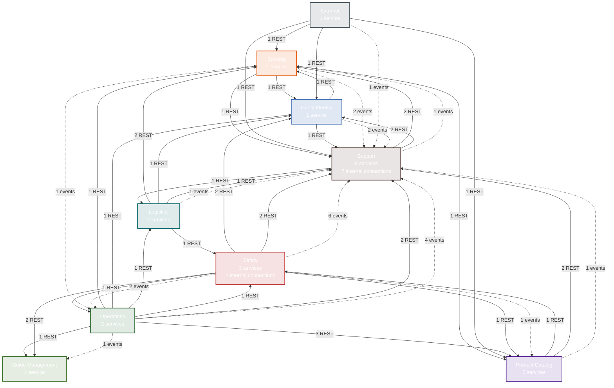

# System Map

Domain-level topology for NovaTrek Adventures — 22 services across 9 domains.

!!! info "Everything on this portal is entirely fictional"
    NovaTrek Adventures is a completely fictitious company used as a synthetic workspace for the Continuous Architecture Platform proof of concept.

---

## Domain Overview

Each node represents a domain (bounded context) containing one or more microservices. Arrows show **cross-domain** communication — internal connections within a domain are noted on each node.

**Solid arrows** = synchronous REST calls (HTTPS)
**Dashed arrows** = asynchronous event flows (Kafka)

<a class="diagram-source" href="https://github.com/christopherblaisdell/continuous-architecture-platform-poc/blob/main/architecture/calm/novatrek-topology.json" title="View data source">&#x2699; Generated from architecture/calm/novatrek-topology.json</a>

---

## Domains

Click a domain to see its service-level topology diagram with individual service connections.

| Domain | Services | REST Out | Events Out |
|--------|----------|----------|------------|
| [Booking](domain-views.md#booking) | 1 | 3 | 3 |
| [External](domain-views.md#external) | 1 | 4 | 1 |
| [Guest Identity](domain-views.md#guest-identity) | 1 | 2 | 2 |
| [Guide Management](domain-views.md#guide-management) | 1 | 0 | 0 |
| [Logistics](domain-views.md#logistics) | 2 | 5 | 1 |
| [Operations](domain-views.md#operations) | 2 | 10 | 5 |
| [Product Catalog](domain-views.md#product-catalog) | 2 | 3 | 1 |
| [Safety](domain-views.md#safety) | 3 | 8 | 9 |
| [Support](domain-views.md#support) | 9 | 5 | 1 |

---

## Legend

| Element | Meaning |
|---------|---------|
| Domain node | Bounded context containing one or more services |
| Solid arrow with count | Cross-domain synchronous REST calls |
| Dashed arrow with count | Cross-domain asynchronous Kafka events |
| Internal connections note | Intra-domain service-to-service calls |

## How to Read This Diagram

1. **Each box is a domain** — a bounded context owning a group of related microservices
2. **Arrows between domains** show cross-boundary communication with the number of distinct service-to-service connections
3. **High fan-in domains** (many arrows pointing in) provide shared platform capabilities — Guest Identity, Support
4. **Dashed lines** indicate event-driven decoupling — the source domain publishes events without knowing the consumers
5. **Drill down** into any domain via the [Domain Views](domain-views.md) page to see individual service connections

## Data Source

Generated from `architecture/calm/novatrek-topology.json` by `portal/scripts/generate-topology-pages.py`.
