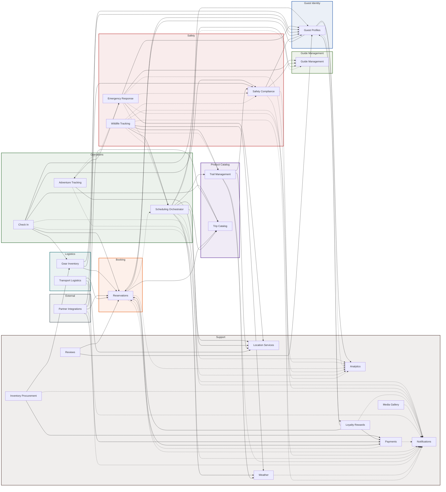

# System Map

Interactive service topology for NovaTrek Adventures — 23 services across 9 domains.

!!! info "Everything on this portal is entirely fictional"
    NovaTrek Adventures is a completely fictitious company used as a synthetic workspace for the Continuous Architecture Platform proof of concept.

---

## Full System Topology

**Solid arrows** = synchronous REST calls (HTTPS)
**Dashed arrows** = asynchronous event flows (Kafka)

---

## Legend

| Element | Meaning |
|---------|---------|
| Solid box | Microservice |
| Colored subgraph | Domain boundary |
| Solid arrow (-->) | Synchronous REST call |
| Dashed arrow (-.->) | Asynchronous Kafka event |

## How to Read This Diagram

1. **Domains** are grouped as colored subgraphs — services within the same subgraph belong to the same bounded context
2. **High fan-in services** (many arrows pointing in) are shared platform services — `Guest Profiles`, `Notifications`, `Reservations`
3. **High fan-out services** (many arrows pointing out) are orchestrators — `Check In`, `Scheduling Orchestrator`, `Emergency Response`
4. **Dashed lines** indicate event-driven decoupling — the source publishes an event without knowing the consumer

## Data Source

Generated from `architecture/calm/novatrek-topology.json` by `portal/scripts/generate-topology-pages.py`.
