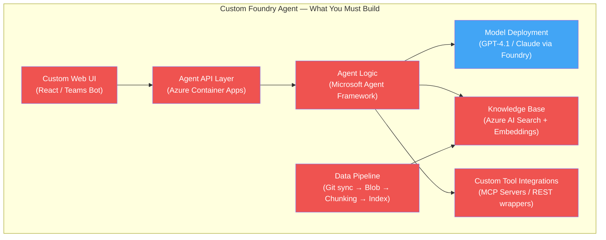
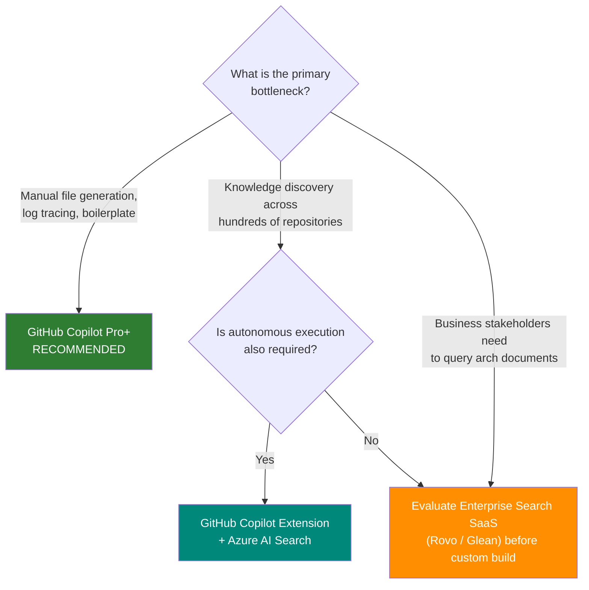

# Microsoft Foundry: The "Build Your Own Agent" Option

## What If We Built a Custom Architecture Agent Instead?

A third option was evaluated alongside GitHub Copilot Pro+ and Roo Code + OpenRouter: building a **custom, centralized architecture agent** on Microsoft Foundry (formerly Azure AI Foundry). The hypothesis — that a custom agent could democratize access to architectural knowledge for the entire organization, not just developers with IDE access.

!!! warning "Synthetic Demonstration Environment"
    This analysis evaluates Microsoft Foundry as a platform. All architectural references use the fictional NovaTrek Adventures domain. No corporate systems, data, or infrastructure are represented.

!!! info "Deep Research Source"
    This analysis is based on a comprehensive deep research report: [Should We Build a Custom Foundry Agent?](https://docs.google.com/document/d/1uj7ryZVJ4PjCqEA5rBFvGaS7GeRX9Nx4VEXph0Vmq6Y/edit?usp=sharing)

---

## The Hypothesis

> "We should build our own agent that knows about our architecture practice — hosted centrally, accessible to everyone via web or Teams."

This is an appealing idea. Product owners could query architectural standards. Security auditors could search decision records. Executives could ask about service dependencies. No IDE required.

**The question is whether the engineering cost of building this is justified — or whether a shared workspace with Copilot already provides these capabilities natively, with no MCP servers, no custom infrastructure, and no engineering project.**

---

## What "Building an Agent" Actually Requires

Microsoft Foundry is not a turnkey solution. It is a **code-first PaaS** requiring dedicated engineering to assemble, secure, and deploy:

Every red box is custom engineering. The model deployment (blue) is the only managed component. Industry benchmarks indicate **3 to 6 months of dedicated engineering effort** to reach production readiness — compared to the near-immediate deployment of commercial IDE tools.

### The Engineering Stack

| Layer | What You Must Build | Skills Required |
|-------|-------------------|-----------------|
| **UI** | React web app or Teams Bot Framework integration | Frontend, UX |
| **API** | Containerized backend on Azure Container Apps | Backend, DevOps |
| **Agent Logic** | State management, conversation threads, tool execution | Python/C# SDK, MLOps |
| **Knowledge Base** | Azure AI Search with automated ingestion pipelines | Data engineering |
| **Tool Integrations** | MCP servers or REST wrappers for every external system (Copilot needs none — it indexes the workspace automatically) | API development |
| **Data Pipeline** | Git sync, document chunking, embedding generation | Data engineering |

---

## The 5-Tool-Call Hard Limit

IDE agents like GitHub Copilot execute continuous ReAct loops — read a log, run a script, observe the error, rewrite the file, validate the fix. A typical architecture session executes **35 to 80 autonomous tool calls**.

Microsoft Foundry Agent Service imposes a **hard cap of 5 nested tool calls per run**. There is no configuration option to increase this limit — Microsoft support confirms it is a platform constraint.

| | Copilot Pro+ | Roo Code | Foundry Agent |
|---|:---:|:---:|:---:|
| **Autonomous tool calls** | 35–80+ continuous | 35–80+ continuous | **5 per run (hard limit)** |
| **Workaround** | N/A | N/A | Multi-agent graph orchestration |
| **Workaround risk** | N/A | N/A | Error amplification up to 17.2x |

To achieve multi-step autonomy, engineers must build **multi-agent graph workflows** — a Manager Agent that delegates to specialized Sub-Agents with explicit state handoffs. Research demonstrates that this approach amplifies reasoning errors by up to **17.2x** compared to a single-agent baseline, as hallucinations cascade across the workflow graph.

---

## The RAG Problem: YAML and PlantUML Don't Chunk

A centralized agent requires a knowledge base. Azure AI Search handles this — but the **chunking process is fundamentally hostile to architectural file formats**.

### What Happens When You Chunk an OpenAPI Spec

Standard text-splitting algorithms chunk by paragraph or heading. This severs the hierarchical parent-child relationships in YAML:

| Content Type | Standard Chunking | Result |
|-------------|:---:|:---:|
| **Markdown prose** | Works well | Accurate retrieval |
| **OpenAPI YAML** | Severs schema hierarchies | Hallucinated API contracts |
| **PlantUML diagrams** | Breaks relationship graphs | Incomplete diagrams |
| **MADR decision records** | Splits options from context | Decisions without rationale |

Engineers must bypass semantic chunking and upload entire files as **"single chunks"** — flooding the context window and driving up inference costs.

### The Synchronization Gap

A centralized RAG index only knows the state of architecture **at the last Git commit**. It is blind to uncommitted local drafts.

| | IDE Agent | RAG-based Agent |
|---|:---:|:---:|
| **Reads uncommitted files** | YES | NO |
| **Context freshness** | Real-time (disk buffer) | Last pipeline run |
| **Impact** | Drafts are immediately available | Architects work on stale data |

IDE agents read files directly from the local disk buffer — providing instantaneous, accurate context during the drafting phase. A centralized agent always lags behind.

---

## 12-Month Total Cost of Ownership

The TCO model assumes 10 solution architects running 38 architecture sessions per month (380 total monthly runs), using GPT-4.1 on the Foundry agent.

| Cost Category | Custom Foundry Agent | GitHub Copilot Pro+ | Roo Code + OpenRouter |
| :---- | :---- | :---- | :---- |
| **Initial Build CapEx** | $72,000 | $0 | $0 |
| **Monthly Inference** | $54.15 | Included in license | ~$507.00 |
| **Monthly Infrastructure** | $400.00 | Included | $0 |
| **Monthly Maintenance** | $3,000.00 | $0 | $50.00 |
| **Total Monthly OpEx** | $3,454.15 | $390.00 | $5,070.00 |
| **Year 1 Total Cost** | **$113,449.80** | **$4,680.00** | **$60,840.00** |

$4,680

GitHub Copilot Pro+ — Year 1

$60,840

Roo Code + OpenRouter — Year 1

$113,450

Custom Foundry Agent — Year 1

The Foundry agent's monthly token costs ($54/month) are deceptively low. The **engineering labor** ($72k build + $3k/month maintenance) dominates the TCO by 97%. Gartner estimates enterprise cost projections for custom AI builds are off by **500% to 1,000%** because teams budget for API tokens but ignore data transfer, log analytics, vector storage, and continuous maintenance.

---

## What Foundry Does Better

The analysis is not one-sided. A centralized Foundry agent genuinely excels at two things IDE agents cannot do:

### 1. Broad Audience Access

| | IDE Agents | Foundry Agent |
|---|:---:|:---:|
| **Solution Architects** | Primary users | Usable (but degraded workflow) |
| **Product Owners** | Cannot access | Full web/Teams access |
| **Security Auditors** | Cannot access | Full web/Teams access |
| **Executives** | Cannot access | Full web/Teams access |

### 2. Cross-Repository Knowledge

An IDE agent sees only the active workspace. A Foundry agent backed by Azure AI Search can index **hundreds of repositories** simultaneously, enabling cross-repo trend analysis — e.g., "Which services still use the deprecated auth library?"

---

## The Simpler Answer: Include Institutional Knowledge in the Workspace

The Foundry hypothesis assumes institutional knowledge must be imported via a custom RAG pipeline. It doesn't.

**Include the knowledge directly in the shared workspace.** Architecture standards, domain models, anti-patterns, decision history — these are plain text files in a Git repo. Copilot automatically indexes the entire workspace into a vector database. Every architect who opens the workspace gets full AI-powered context immediately.

This is not a novel approach. It is the **standard pattern used by over 22 million engineers and architects** on GitHub Copilot today. Instruction files, style guides, architecture standards, and domain knowledge files live in the workspace and are indexed automatically. No MCP servers. No custom Copilot Extensions. No Azure AI Search pipelines. No engineering project.

Building a custom agent to import institutional knowledge makes sense for a **core-competency application** — a product your organization sells. For an operational enablement tool like architecture governance, the standard pattern is sufficient.

For non-technical stakeholders who need to query architecture documents, the automated portal (published via `git push`) and optional Confluence sync provide browsable access without any custom agent.

---

## The Build vs. Buy Framework

Strategic analyst frameworks (Turing, Aisera, Gartner) are clear on when to build vs. buy:

| Condition | Recommendation |
|-----------|:---:|
| Agent logic is core competitive differentiator | **Build** |
| Goal is utility productivity acceleration | **Buy** |
| Elite AI engineering team available long-term | **Build** |
| Time-to-market is critical (weeks vs months) | **Buy** |
| Organization wants to offload MLOps debt | **Buy** |

Generating MADR records, C4 diagrams, and API contracts is an **operational enablement task** — it is not the company's core product. The framework overwhelmingly favors using a commercial solution. Building custom AI infrastructure is justified when the application is your organization's competitive differentiator — not when the goal is helping architects write compliant documents.

!!! note "Industry Signal"
    Gartner predicts that over **40% of enterprise agentic AI projects** will be completely canceled by end of 2027 — driven not by model intelligence failures but by escalating MLOps costs, inadequate risk controls, and failure to deliver measurable P&L impact.

---

## Three-Platform Capability Matrix

| Capability | Copilot Pro+ | Roo Code + OpenRouter | Foundry Custom Agent |
| :---- | :---- | :---- | :---- |
| **Local file read** | YES | YES | NO |
| **Terminal execution** | YES | YES | NO |
| **File creation/editing** | YES | YES | NO (copy/paste) |
| **Multi-step autonomy** | 35–80+ calls | 35–80+ calls | 5-call hard limit |
| **Standards compliance** | 96.1% | Fabrication issues | Centrally governed |
| **Broad audience access** | NO | NO | YES |
| **Cross-repo knowledge** | NO | NO | YES |
| **Real-time workspace context** | YES | YES | NO (index lag) |
| **Monthly cost per seat** | $39 | ~$507 | ~$345 (amortized) |
| **Build effort** | Zero | Near-zero | 3–6 months |
| **Maintenance effort** | Zero | Low | High (MLOps) |

---

## The Decision Tree

**Bottom line:** A custom Foundry agent solves a knowledge _discovery_ problem for non-developers, but actively harms the productivity of Solution Architects by breaking their execution loop. The 5-tool-call limit, RAG chunking corruption, and $113k Year 1 cost make it the wrong tool for architecture _generation_. If cross-repository knowledge is needed, a Copilot Extension backed by Azure AI Search achieves both goals without the engineering debt.

### What is the phased delivery plan?

[Roadmap: Six Phases to August 2026](roadmap.md)

