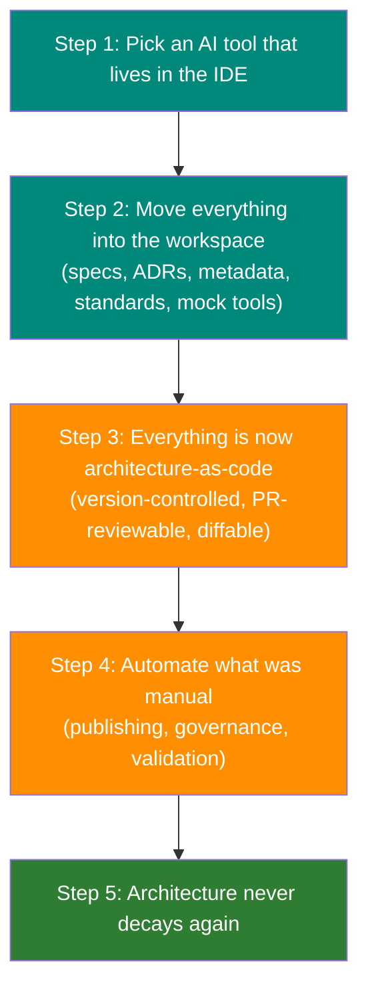
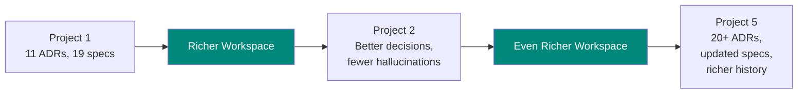

# The Insight

## To Make the AI Effective, We Moved Everything Into VS Code. That Changed Everything.

We started with a simple question: *Can an AI assistant produce compliant architecture designs?*

To answer it, we had to give the AI access to our architecture artifacts. Not summaries. Not descriptions. The actual specs, standards, decisions, and source code — all in one workspace.

**That seemingly tactical decision — move everything into the IDE — turned out to be the most consequential architectural choice in this proof of concept.**

---

## The Causal Chain

What happened next was not planned. Each step forced the next:

We didn't set out to achieve "architecture-as-code." We achieved it as a side effect of making the AI useful.

---

## Step 1: The AI Needs Context

An AI model generates text. The difference between generic boilerplate and an accurate architecture design is **context** — the actual artifacts that define your system.

Without context, the AI guesses. With context, it cites.

| Without Context | With Context |
|----------------|-------------|
| "Consider using a microservice architecture" | "svc-check-in calls svc-guest-profiles via GET /guests/{id} (line 47 of CheckInController.java)" |
| "You should add authentication" | "ADR-009 established session-scoped kiosk access — the check-in flow must not require full guest authentication" |
| "Create an API endpoint" | "The existing POST /check-ins endpoint in svc-check-in.yaml returns CheckInResponse but lacks the confirmation_code field required by svc-notifications" |

The second column is what happened in our POC — because the AI could read the actual files.

---

## Step 2: Move Everything Into the Workspace

To give the AI context, we assembled a shared workspace containing everything an architect needs:

| What We Moved In | Count | Why |
|-----------------|:-----:|-----|
| OpenAPI specs | 19 | So the AI reads actual API contracts, not guesses |
| Architecture Decision Records | 11 | So past decisions constrain future ones |
| Java source code | 8 files | So the AI can trace bugs to specific lines |
| Mock tool scripts | 3 | So the AI can query JIRA, Elastic, GitLab locally |
| Architecture standards | 4 | MADR, arc42, C4, ISO 25010 — loaded every session |
| Domain knowledge file | 500+ lines | Service domains, data ownership, anti-patterns, formatting rules |

The domain knowledge file (`copilot-instructions.md`) is loaded automatically into every AI session. It encodes:

- The role definition (Solution Architect, not developer)
- 19 services across 9 bounded domains
- Data ownership rules (which service owns which entity)
- Anti-pattern checklist (8 patterns to flag automatically)
- Document standards (MADR format, no emojis, no placeholders)

!!! info "This is not a database. It's a Git repo."
    Every artifact listed above is a plain text file in version control. No special infrastructure. No vector database. No embedding pipeline. Just files in a folder that the AI reads directly.

---

## Step 3: That's Architecture-as-Code

Once everything lives in the workspace, something shifts. The architecture practice is now operating on version-controlled, plain-text artifacts:

| Capability | Before | After |
|-----------|--------|-------|
| API contracts | YAML in Git (already existed) | Same — no change |
| Architecture decisions | Buried in JIRA ticket branches | Markdown in Git, globally searchable |
| Solution designs | PowerPoint or Confluence | Markdown in Git, PR-reviewable |
| Service documentation | Manual Confluence pages | Auto-generated from specs |
| Impact assessments | Email or meeting notes | Markdown in Git, auditable |
| Domain knowledge | Tribal knowledge | Codified in instructions file |

The left column is what most architecture practices do. The right column is what happens when you move everything into the workspace for the AI. **You get architecture-as-code without setting out to build it.**

---

## Step 4: Once It's Code, Automate Everything

When architecture artifacts are plain text in version control, the same automation patterns that work for source code work for architecture:

| Pattern | Source Code | Architecture |
|---------|------------|--------------|
| **Push to publish** | CI builds and deploys app | `git push` publishes architecture portal |
| **Pull request review** | Code review before merge | Architecture decision review before merge |
| **CI validation** | Linting, tests | Schema validation, governance checks |
| **Automated generation** | API client stubs | Service pages, sequence diagrams, C4 diagrams |
| **Diff and history** | `git log` for code changes | `git log` for architecture evolution |

None of this is new technology. It's applying existing DevOps patterns to architecture artifacts — which is only possible because those artifacts are now code.

---

## The Flywheel

Every project enriches the workspace. Every enrichment makes the next project better:

Under fixed-price AI ($39/month), richer context costs nothing extra. The AI reads more files, cross-references more decisions, and produces more accurate output — with zero incremental cost.

Under per-token pricing, every additional file the AI reads costs more. **The flywheel works against you.**

---

## Evidence: 39 Files, Zero Fabrication

Across 5 architecture scenarios using NovaTrek Adventures as a synthetic case study:

39

Architecture files produced

96.1%

Standards compliance (MADR/arc42/C4)

0

Fabricated fields (Copilot)

The AI cited specific OpenAPI fields, Java source lines, Elasticsearch log entries, and GitLab merge requests — because it could read them directly from the workspace. The competing toolchain, using the same AI model but without workspace indexing, fabricated 4 OpenAPI schema elements that were not in the approved design.

**The model didn't matter. The context did.** Both toolchains used Claude Opus 4.6. The one with full workspace access produced zero fabrications. The one relying on manual file selection fabricated API fields. Context quality determines output quality.

### What does this enable?

[What This Enables: Publishing, Governance, and PROMOTE](what-this-enables.md)

