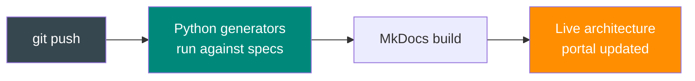
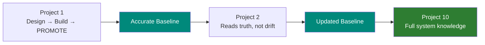

# What This Enables

## Three Capabilities That Were Not Possible Before

Once architecture artifacts live as code in version control, three automation capabilities emerge — each building on the one before it.

---

## 1. Automated Publishing: Push to Publish

Today, updating documentation after checking specs into version control is a voluntary manual step. It gets skipped. The platform replaces that step with an automated pipeline:



**What gets published from a single push:**

| Content Type | Count | Generated From |
|-------------|:-----:|----------------|
| Microservice deep-dive pages | 19 | OpenAPI specs |
| Endpoint sequence diagrams (SVG) | 139 | OpenAPI endpoints |
| C4 context diagrams (SVG) | 20 | Service dependency graph |
| Swagger UI pages (interactive) | 19 | OpenAPI specs |
| **Total artifacts** | **301** | |

<div class="hero-grid" markdown>

<div class="hero-card accent" markdown>
<div class="metric">30 seconds</div>
<div class="label">Push to portal live</div>
</div>

<div class="hero-card dark" markdown>
<div class="metric">$0 / month</div>
<div class="label">Platform hosting cost</div>
</div>

</div>

MkDocs Material (open source), Azure Static Web Apps (free tier), PlantUML (open source), GitHub Actions (included). No infrastructure cost.

For organizations that require wiki as the canonical platform, the same pipeline syncs to Confluence via REST API — one source, two outputs.

---

## 2. CALM Governance: Architecture Topology as Code

[CALM](https://www.architectureascode.org/) (Common Architecture Language Model) is a FINOS specification for describing system topology — nodes, relationships, and interfaces — in machine-readable JSON.

NovaTrek already maintains structured YAML metadata: domain classifications, cross-service call maps, data store registries. Rather than writing CALM by hand (creating a second source of truth that drifts), the platform **auto-generates** CALM from existing metadata:

| Metric | Value |
|--------|:-----:|
| Total nodes | 74 |
| Total relationships | 146 |
| Domain topologies | 9 |

### Manual vs. Automated Governance

| Architecture Rule | Manual Review | With CALM |
|-------------------|--------------|-----------|
| No shared databases | PR reviewer reads YAML diffs | CI rejects PRs that connect a DB to multiple services |
| API-only cross-service access | Convention enforced in review | CI validates no direct JDBC relationships |
| Impact analysis | Architect reads metadata manually | Graph traversal shows all dependencies |
| Architecture drift | Undetected until something breaks | Topology compared against running system |

CALM is a **derived artifact** — architects maintain the same YAML they already maintain. The generator transforms it into a topology format that enables automated governance.

---

## 3. PROMOTE: Closing the Design-to-Reality Gap

This is the innovation that makes architecture **continuous**.

Most architecture workflows have a missing step. Designs describe *intent*. Developers sometimes deviate during implementation. After deployment, nobody checks. Nobody updates the specs to reflect what was actually built.

<div class="big-number red">0%</div>

**of architecture knowledge is reconciled against reality after deployment.** This is not a discipline failure — it is a structural one. There is no step in the workflow for it.

### The Fix

The platform adds a PROMOTE step after deployment:

```
INTAKE → INVESTIGATE → DESIGN → BUILD → DEPLOY → PROMOTE → DONE
```

| PROMOTE Action | What It Does |
|---------------|-------------|
| Reconcile specs | Compare designed API contracts with actual implementation |
| Update OpenAPI specs | Record what was *actually built*, not just what was designed |
| Promote ADRs | Copy ticket-level decisions to the global decision log |
| Refresh service pages | Update baselines with current integration points |
| Trigger portal rebuild | `git push` publishes the updated baselines |

### Why AI Makes This Possible

The PROMOTE step was not practical before because it requires reading the solution design, comparing against implementation, cross-referencing specs, and updating multiple files consistently. This is exactly what the AI excels at — and under Copilot's fixed pricing, it adds **zero marginal cost**.

| | Without PROMOTE | With PROMOTE |
|---|:---:|:---:|
| Monthly runs | 26 | 38 |
| Copilot Pro+ cost | $39 | **$39** |
| OpenRouter cost | ~$347 | ~$507 |

### The Compounding Effect

Without PROMOTE, each project adds design-vs-reality drift. After 10 projects, specs describe intent from a year ago — not what exists in production.

With PROMOTE, each project records what was actually built. After 10 projects, the workspace contains an accurate, comprehensive picture of the real system. Every AI session benefits from this accumulated truth.



---

## The Combined Effect

These three capabilities are not independent features. They are layers of the same idea — architecture artifacts as code, processed by automation:

| Layer | Mechanism | Result |
|-------|-----------|--------|
| Publishing | Generators read specs, produce portal | Documentation is always current |
| Governance | CALM validates topology in CI | Architecture rules enforced automatically |
| PROMOTE | AI reconciles design vs reality | Specs reflect what was actually built |

Each layer depends on the preceding one. Publishing requires artifacts in Git. Governance requires machine-readable topology. PROMOTE requires an AI that can read and update the workspace. And all of it traces back to the insight: **we moved everything into the IDE to make the AI effective, and that gave us architecture-as-code.**

<div class="cta-box" markdown>

### See it running

[Live Portal: 301 Artifacts, Auto-Published](live-demo.md)

</div>
