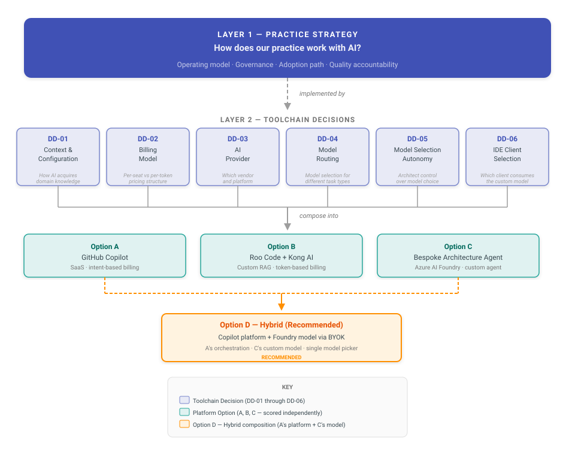

<!-- CONFLUENCE-PUBLISH -->
<!-- CONFLUENCE-URL: https://nbcu-ot.atlassian.net/wiki/spaces/UPA/pages/2606630902/Solution+Architecture+Practice+Comparative+Evaluation+of+Agentic+AI -->

# AI Toolchain Evaluation

## Purpose

The Solution Architecture practice is adopting AI-assisted workflows for architecture analysis, solution design, and documentation. This evaluation compares three platform options to determine which best supports architecture work — balancing output quality, cost, operational complexity, and strategic fit.

### Options Under Evaluation

- **Option A — GitHub Copilot**: SaaS platform with intent-based billing, native workspace indexing, and declarative customization via instruction files. Testable immediately with zero infrastructure.
- **Option B — Roo Code + Kong AI Gateway**: Open-source IDE extension with token-based billing through a self-managed API gateway. Testable with moderate setup, requires API key provisioning and gateway configuration.
- **Option C — Bespoke Architecture Agent**: Custom-built agent on Azure AI Foundry. Requires weeks of engineering investment before testing can begin.

### Evaluation Principles

This evaluation follows a phased approach: test reversible, low-cost options empirically before committing to irreversible, high-cost alternatives. Options A and B can be compared head-to-head using real architecture scenarios. Option C requires significant engineering investment before it can be tested — see [Evaluation Approach](framework/evaluation-approach.md) for why this shapes the evaluation sequence.

### The Architecture Practice Pilot

Rather than evaluating options theoretically, this evaluation is grounded in a working pilot. A solution architect configured GitHub Copilot (Option A) with declarative instruction files, scoped rules, and mock enterprise tool integrations — then executed real architecture scenarios against a synthetic 19-microservice domain. The pilot produced 4 complete solution designs, 14 architecture decision records, 139 generated sequence diagrams, and a live documentation portal. All configuration is version-controlled markdown — zero custom engineering, zero infrastructure. The pilot's outputs and configuration serve as the primary evidence base for this evaluation.

## Two-Layer Decision Hierarchy

The diagram below shows the evaluation structure. Layer 1 defines how the architecture practice works with AI. Layer 2 decomposes the toolchain selection into four independent decisions that compose into the three platform options.

## Page Index

### Evaluation Methodology

| Page | Purpose | Key Question Answered |
|------|---------|----------------------|
| [Scoring Results](framework/scoring-results.md) | Weighted scoring matrix with sensitivity analysis | **Which option wins and by how much?** |
| [Evaluation Approach](framework/evaluation-approach.md) | Phased testing strategy and decision sequencing | Why test A and B before investing in C? |
| [Evaluation Methodology](framework/evaluation-methodology.md) | 13-factor weighted scoring framework | How do we score and compare the three options objectively? |

### Toolchain Decisions

| Page | Purpose | Key Question Answered |
|------|---------|----------------------|
| [DD-01: Context and Configuration](decisions/dd-01-context-configuration.md) | How each option injects domain knowledge | Do we need custom RAG or does native configuration suffice? |
| [DD-02: Billing Model](decisions/dd-02-billing-model.md) | Per-seat vs per-token vs hybrid billing | Which billing model supports sustained architecture work without perverse incentives? |
| [DD-03: AI Provider](decisions/dd-03-ai-provider.md) | Provider selection across three options | Which vendor best combines output quality, workflow integration, and governance? |
| [DD-04: Model Routing](decisions/dd-04-model-routing.md) | Model selection and routing strategy | Does model routing require custom infrastructure or is it built into the platform? |
| [DD-05: Model Selection Autonomy](decisions/dd-05-model-selection-autonomy.md) | Architect control over model choice | Should architects choose their model, or should it be locked down by a central team? |

### Comparative Analysis (A, B, C)

| Page | Purpose | Key Question Answered |
|------|---------|----------------------|
| [File-Type Handling: A vs C](evidence/filetype-handling-a-vs-c.md) | Side-by-side comparison of how Options A and C handle each architecture file type | Does Azure AI Search chunk architecture files better than Copilot? |
| [Build vs Leverage](evidence/build-vs-leverage.md) | Custom RAG vs native platform capabilities | When is building a custom pipeline justified vs leveraging what exists? |
| [Model Quality at Budget](evidence/model-quality-at-budget.md) | Model tier analysis by price point | What model quality does each option actually deliver at its operating cost? |
| [Platform Landscape](evidence/platform-landscape.md) | Five-platform head-to-head comparison | Why is GitHub Copilot the strongest choice among all AI coding platforms? |

### Option A (GitHub Copilot)

| Page | Purpose | Key Question Answered |
|------|---------|----------------------|
| [File-Type Chunking Strategy](framework/filetype-chunking-strategy.md) | Per-file-type optimization plan for Copilot context delivery | How do we ensure each architecture artifact type is chunked and retrieved correctly? |
| [Copilot Rollout Roadmap](framework/copilot-rollout-roadmap.md) | Practical deployment plan for the architecture team | How do we actually roll out Copilot and get architecture content into AI? |
| [Architecture Is Not Just Coding](evidence/architecture-not-just-coding.md) | Evidence that AI coding platforms handle architecture work | Can general-purpose AI coding platforms do architecture, or do we need something bespoke? |
| [Controlling What Copilot Sees](evidence/context-injection-controls.md) | Context injection pipeline — what controls exist and how to optimize | How does Copilot decide what enters the LLM's context window, and what can we control? |

### Option C (Foundry IQ Integration)

| Page | Purpose | Key Question Answered |
|------|---------|----------------------|
| [What Does Foundry IQ Actually Require?](evidence/foundry-iq-comparison.md) | Operational requirements for a Foundry IQ-based agent | Is Foundry IQ a turnkey product or a build-it-yourself platform? |

### Appendix

| Page | Purpose | Key Question Answered |
|------|---------|----------------------|
| [Deep Research Reports](research/index.md) | Raw deep research results across 8 research rounds | What did the AI find when researching specific technical questions? |
| [AI Glossary](reference/glossary.md) | Terminology definitions for the evaluation | What do terms like "agentic retrieval" and "integrated vectorization" mean? |
