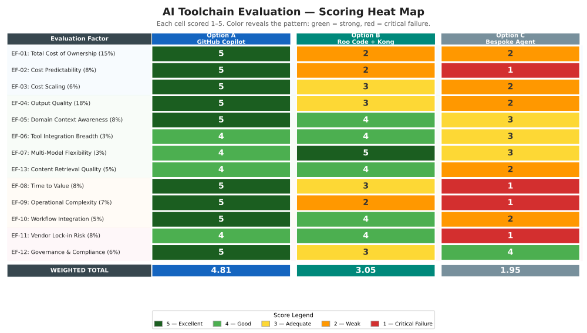
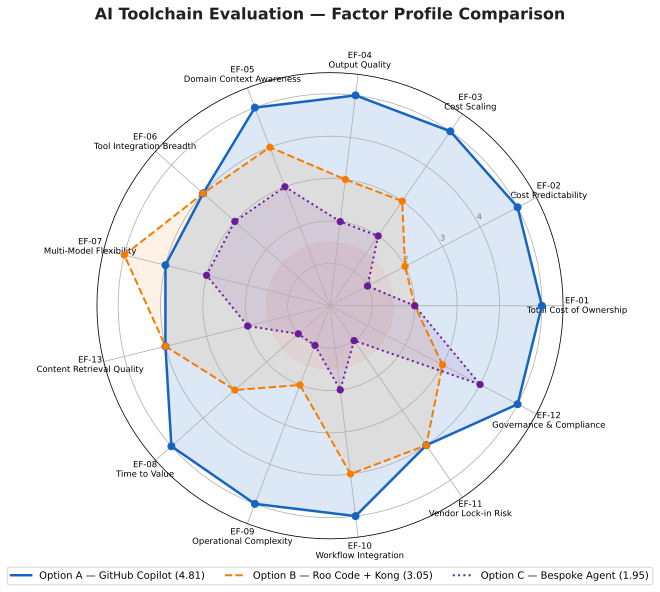

<!-- CONFLUENCE-PUBLISH -->
<!-- CONFLUENCE-URL: https://nbcu-ot.atlassian.net/wiki/spaces/UPA/pages/2606630902/Solution+Architecture+Practice+Comparative+Evaluation+of+Agentic+AI -->

# AI Toolchain Evaluation

## Recommendation: Platform + Practice

Deploy **GitHub Copilot** as the AI platform and integrate the Foundry team's custom model via BYOK — giving architects built-in frontier models, domain-specialized models, and declarative customization in a single tool, with zero custom infrastructure.

### How Does Our Practice Work with AI?


**Layer 1 — Practice Strategy** asks which AI engagement model fits architecture work: use a managed platform, build a bespoke agent, or combine both. **Layer 2 — Toolchain Selection** decomposes the platform choice into six independent decisions (context injection, billing, provider, routing, model autonomy, IDE client) that compose into four options.

| Option | Score | Rank |
|--------|-------|------|
| **Option A — GitHub Copilot** | **4.84** | 1st |
| **Option D — Hybrid (A+C via BYOK)** | **4.40** | 2nd |
| Option B — Roo Code + Kong | 3.05 | 3rd |
| Option C — Bespoke Agent | 1.95 | 4th |

Option D is recommended over Option A alone because it preserves the Foundry team's model investment. Copilot provides the platform; the custom model provides domain specialization. The 0.44-point gap between A and D reflects the small operational cost of maintaining one Azure endpoint — not a quality difference.

---

## Why This Wins



The heatmap tells the story: Option A (Copilot) is green across every row. Option C (Bespoke Agent) shows four critical failures (red) — Time to Value, Operational Complexity, Vendor Lock-in, and Cost Predictability. Option D inherits A's strengths while adding the custom model capability.

Three factors drove the result:

- **$39/month vs months of engineering.** Copilot is a managed SaaS product. The bespoke agent requires building and maintaining a custom retrieval pipeline, knowledge base, and IDE integration. The architecture practice should be doing architecture, not platform engineering.
- **Customizations stay portable.** Instruction files, skills, and agent definitions are version-controlled Markdown that architects own and can transfer between platforms. The bespoke agent embeds customizations in Azure Foundry's control plane — switching means rebuilding.
- **Same-day value.** The evaluation pilot produced 4 solution designs, 14 ADRs, and 139 sequence diagrams using Copilot with declarative configuration. No infrastructure was provisioned. No engineering sprints were needed.

---

## Factor Profile



Option A (blue) dominates the outer ring across nearly every factor. Option D (amber) tracks close behind. Option C (purple) collapses inward. See [Scoring Results](framework/scoring-results.md) for the full breakdown with sensitivity analysis.

---

## Platform Lock-In: A Cross-Cutting Concern

Any AI toolchain investment creates vendor dependency. But the *kind* of lock-in varies:

| Layer | What It Contains | Portability |
|-------|-----------------|-------------|
| **Content** | Architecture artifacts — ADRs, specs, diagrams | Always portable (files in git) |
| **Behavioral customization** | Instruction files, skills, agent definitions | Portable when Markdown; locked in when embedded in platform config |
| **Retrieval infrastructure** | Knowledge bases, search indexes, embedding pipelines | Platform-specific — switching means rebuilding |

Options A, B, and D store customizations as version-controlled Markdown. Option C embeds them in Azure Foundry's control plane. This matters because customizations are where practice-specific knowledge accumulates — if that knowledge is portable, the organization retains flexibility as the market evolves.

See [Customization Portability: Option D + OpenSpec](evidence/customization-lock-in-foundry-vs-portable.md) for the detailed analysis.

---

## Where to Go Next

| Interest | Start Here |
|----------|------------|
| **The numbers** | [Scoring Results](framework/scoring-results.md) — full matrix with sensitivity analysis |
| **The recommendation** | [Option D — Hybrid Architecture](evidence/option-d-hybrid-architecture.md) — how BYOK integration works |
| **The rollout plan** | [Copilot Rollout Roadmap](framework/copilot-rollout-roadmap.md) — phased deployment |
| **How we scored** | [Evaluation Methodology](framework/evaluation-methodology.md) — 13-factor framework |
| **All options and evidence** | [Options and Evidence Guide](framework/options-and-evidence-guide.md) — complete page index |
| **The lock-in story** | [Customization Portability](evidence/customization-lock-in-foundry-vs-portable.md) — layer-by-layer analysis |

---

## Site Map

```
Solution Architecture Practice Comparative Evaluation of Agentic AI
│
├── AI Toolchain Evaluation (this page)
│
├── The Recommendation
│   ├── Scoring Results
│   ├── Option D — Hybrid Architecture
│   ├── Option D POC Validation
│   ├── Cost Offset — Free Tier Subsidy
│   ├── Customization Portability: Option D + OpenSpec
│   └── Copilot Rollout Roadmap
│
├── How We Got Here
│   ├── Evaluation Methodology
│   ├── Evaluation Approach
│   ├── Options and Evidence Guide
│   │
│   ├── Toolchain Decisions
│   │   ├── DD-01 Context and Configuration
│   │   ├── DD-02 Billing Model
│   │   ├── DD-03 AI Provider
│   │   ├── DD-04 Model Routing
│   │   ├── DD-05 Model Selection Autonomy
│   │   └── DD-06 IDE Client Selection
│   │
│   ├── Comparative Evidence
│   │   ├── Platform Landscape
│   │   ├── Model Quality at Budget
│   │   ├── Build vs Leverage
│   │   ├── What Does Foundry IQ Actually Require?
│   │   ├── Controlling What Copilot Sees
│   │   ├── File-Type Handling: A vs C
│   │   └── Architecture Is Not Just Coding
│   │
│   └── Customization and Governance
│       ├── Customization Extensibility and Governance
│       └── File-Type Chunking Strategy
│
└── Reference
    ├── Glossary
    ├── Technical Review: Claim Validation
    ├── Fact-Check Report
    ├── Embeddings Analysis
    └── Foundry vs IDE Agents
```
