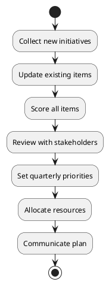

# Architecture Backlog Management

**Applicable Modes**: Solution Architect, Orchestrator

## Overview

The Architecture Backlog is a strategic tool for managing technical initiatives, architectural improvements, and technical debt. It ensures architectural evolution aligns with business objectives while maintaining system health.

## Backlog Structure

### Initiative Categories

#### 1. Strategic Initiatives
**Definition**: Major architectural changes that enable business capabilities
**Timeline**: 3-12 months
**Examples**:
- Microservices migration
- Cloud transformation
- Platform modernization
- API-first architecture

#### 2. Technical Debt Reduction
**Definition**: Improvements to existing systems to reduce maintenance burden
**Timeline**: 1-6 months
**Examples**:
- Legacy system refactoring
- Database optimization
- Dependency updates
- Code consolidation

#### 3. Innovation Enablers
**Definition**: New capabilities that unlock future opportunities
**Timeline**: 2-6 months
**Examples**:
- AI/ML platform setup
- Real-time data pipeline
- Edge computing capability
- Blockchain integration

#### 4. Operational Excellence
**Definition**: Improvements to reliability, performance, and efficiency
**Timeline**: 1-3 months
**Examples**:
- Monitoring enhancement
- Automation implementation
- Performance optimization
- Security hardening

## Backlog Item Template

```markdown
# Initiative: [Name]

## Overview
Brief description of the initiative and its purpose.

## Business Value
- Primary benefit: [Description]
- Secondary benefits: [List]
- Affected stakeholders: [List]

## Technical Scope
- Systems impacted: [List]
- Technologies involved: [List]
- Integration points: [List]

## Success Criteria
- [ ] Measurable outcome 1
- [ ] Measurable outcome 2
- [ ] Measurable outcome 3

## Effort Estimate
- Development: X sprints
- Testing: Y sprints
- Deployment: Z sprints
- Total: N sprints

## Dependencies
- Prerequisite initiatives: [List]
- Required resources: [List]
- External dependencies: [List]

## Risks
| Risk | Impact | Likelihood | Mitigation |
|------|--------|------------|------------|
| Risk 1 | High | Medium | Mitigation strategy |

## Priority Score
- Business Impact: [1-5]
- Technical Impact: [1-5]
- Risk Reduction: [1-5]
- Cost of Delay: [1-5]
- Total Score: [Sum]
```

## Prioritization Framework

### Scoring Dimensions

#### 1. Business Impact (1-5)
- 5: Enables major revenue opportunity or critical capability
- 4: Significant business process improvement
- 3: Moderate efficiency gains
- 2: Minor improvements
- 1: Minimal business impact

#### 2. Technical Impact (1-5)
- 5: Foundational architecture change
- 4: Major system improvement
- 3: Significant technical enhancement
- 2: Moderate technical benefit
- 1: Minor technical improvement

#### 3. Risk Reduction (1-5)
- 5: Eliminates critical system risk
- 4: Significantly reduces operational risk
- 3: Moderate risk mitigation
- 2: Minor risk reduction
- 1: Minimal risk impact

#### 4. Cost of Delay (1-5)
- 5: Every month costs significant opportunity
- 4: Delay has mounting negative impact
- 3: Moderate urgency
- 2: Can be deferred with minimal impact
- 1: No urgency

### Priority Matrix

| Total Score | Priority Level | Action |
|------------|----------------|--------|
| 16-20 | Critical | Immediate start |
| 12-15 | High | Next quarter |
| 8-11 | Medium | Within 6 months |
| 4-7 | Low | As capacity allows |

## Backlog Management Process

### 1. Quarterly Review Cycle



### 2. Monthly Check-ins
- Review progress on active initiatives
- Adjust priorities based on new information
- Address blockers and dependencies
- Update effort estimates

### 3. Weekly Updates
- Track sprint progress
- Update completion percentages
- Log decisions and changes
- Communicate status

## Integration with Development Process

### 1. Sprint Planning
```markdown
## Sprint Planning Checklist
- [ ] Review architecture backlog items
- [ ] Select items aligned with sprint capacity
- [ ] Ensure dependencies are met
- [ ] Balance feature work with architecture work
- [ ] Assign architecture champions
```

### 2. Architecture Allocation
- **Recommended**: 20-30% of sprint capacity for architecture work
- **Minimum**: 10% to prevent debt accumulation
- **Maximum**: 40% during major transformations

### 3. Definition of Done
Architecture items must meet:
- [ ] Design documented
- [ ] Code implemented and reviewed
- [ ] Tests written and passing
- [ ] Security review completed
- [ ] Performance validated
- [ ] Documentation updated
- [ ] Knowledge transferred

## Tracking and Metrics

### 1. Backlog Health Metrics
```yaml
Backlog Metrics:
  Total Items: 45
  By Category:
    Strategic: 8
    Technical Debt: 15
    Innovation: 10
    Operational: 12
  By Priority:
    Critical: 3
    High: 12
    Medium: 20
    Low: 10
  Age Distribution:
    < 3 months: 20
    3-6 months: 15
    6-12 months: 8
    > 12 months: 2
```

### 2. Progress Tracking
```markdown
## Q1 2024 Architecture Progress

### Completed (3 items)
- ✅ API Gateway Implementation
- ✅ Database Connection Pooling
- ✅ Monitoring Dashboard v2

### In Progress (5 items)
- 🔄 Microservices Migration (60%)
- 🔄 OAuth2 Implementation (40%)
- 🔄 Cache Layer Optimization (80%)
- 🔄 Event Bus Setup (30%)
- 🔄 CI/CD Pipeline Upgrade (50%)

### Blocked (1 item)
- 🔴 Multi-region Setup (Awaiting budget approval)
```

### 3. Value Delivered
Track and communicate value:
- Performance improvements (response time, throughput)
- Reliability gains (uptime, error rates)
- Developer productivity (deployment time, debug time)
- Cost optimization (resource utilization, operational costs)

## Common Anti-Patterns

### 1. The Ever-Growing Backlog
**Problem**: Backlog grows faster than completion rate
**Solution**: Regular pruning, realistic capacity planning

### 2. Technical Debt Ignorance
**Problem**: Always prioritizing features over debt
**Solution**: Mandatory debt allocation percentage

### 3. Big Bang Initiatives
**Problem**: Multi-quarter initiatives with no incremental value
**Solution**: Break into smaller, valuable increments

### 4. Ivory Tower Architecture
**Problem**: Architecture disconnected from development
**Solution**: Embedded architects, collaborative planning

## Tools and Templates

### 1. Backlog Tracking Options
- **JIRA**: Epic hierarchy for initiatives
- **Azure DevOps**: Feature/Epic structure
- **Confluence**: Living documentation
- **GitHub Projects**: Integrated with code

### 2. Reporting Templates

#### Executive Summary
```markdown
# Architecture Backlog Executive Summary - Q1 2024

## Key Achievements
- Completed 3 critical initiatives
- Reduced technical debt by 15%
- Improved system reliability to 99.95%

## Current Focus (Top 5)
1. Microservices Migration - 60% complete
2. Security Hardening - Starting
3. Performance Optimization - Planning
4. Cloud Migration - Design phase
5. API Standardization - 40% complete

## Upcoming Priorities
- Q2: Complete microservices, start ML platform
- Q3: Multi-region expansion
- Q4: Next-gen architecture planning

## Resource Needs
- 2 additional architects for Q2
- Cloud expertise for migration
- Security specialist for hardening
```

### 3. Communication Patterns

#### For Developers
- Focus on technical benefits
- Provide clear implementation guidance
- Show productivity improvements

#### For Management
- Emphasize business value
- Show risk reduction
- Demonstrate ROI

#### For Stakeholders
- Connect to business objectives
- Show timeline and progress
- Highlight delivered value

## Best Practices

### Do's ✅
1. Keep items actionable and specific
2. Regular review and pruning
3. Balance all categories
4. Celebrate completions
5. Learn from retrospectives

### Don'ts ❌
1. Let backlog become a wishlist
2. Ignore technical debt
3. Over-commit resources
4. Work in isolation
5. Forget to communicate value

## Success Indicators

### Healthy Backlog Signs
- Steady completion rate
- Balanced categories
- Clear priorities
- Stakeholder alignment
- Measurable value delivery

### Warning Signs
- Growing faster than completing
- Only reactive items
- No strategic initiatives
- Unclear priorities
- Low completion rate

---

The Architecture Backlog is a living system that guides technical evolution. Manage it actively, communicate its value, and use it to bridge business needs with technical excellence.