# Sequence Diagram Methodology

**Applicable Modes**: Solution Architect, Orchestrator

## Overview

Sequence diagrams are essential for visualizing system interactions over time. They help communicate complex flows, identify integration points, and validate architectural designs. All sequence diagrams must be created using PlantUML per UDX standards and must pass the UDX PlantUML linter validation.

## Diagram Location Convention

Sequence diagrams live in two distinct locations based on scope:

| Location | Scope | Example |
|----------|-------|---------|
| `diagrams/Service/[service-name].puml` | Interactions **INSIDE** a single microservice — internal logic, data store access, 3rd-party API calls | `diagrams/Service/ms-ohip-reservations.puml` |
| `diagrams/Solution/[Domain]/[domain]-sequence.puml` | Interactions **BETWEEN** microservices — cross-service orchestration and data flow | `diagrams/Solution/Hotels/hotels-sequence.puml` |

**Rule**: If a diagram shows how multiple microservices coordinate to accomplish a workflow, it belongs in `Solution/`. If it shows what happens inside one microservice when an endpoint is called, it belongs in `Service/`.

## UDX PlantUML Linter Requirements

Our organization uses a PlantUML linter to ensure diagram quality and compliance. The linter enforces:
- Participant declaration requirements
- Message flow validation
- Naming convention compliance
- Stereotype usage standards
- Structural integrity rules

## PlantUML Basics for Sequence Diagrams

### Basic Syntax
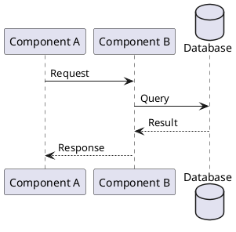

### Participant Types and Declaration

All participants MUST be declared before use. The linter enforces strict participant declaration:

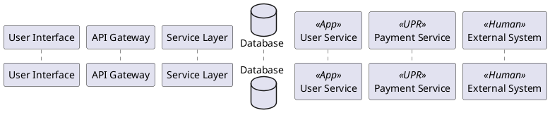

#### Participant Declaration Formats
```plantuml
' Format 1: Simple alias
participant ServiceName as SN

' Format 2: With display name
participant "Service Name" as SN

' Format 3: With stereotype
participant ServiceName as SN <<App>>

' Format 4: Full declaration with display name and stereotype
participant "Service Name" as SN <<App>>
```

## Sequence Diagram Standards

### 1. Naming Conventions (Linter Enforced)
- All participants MUST have aliases
- Names must be registered in the configuration
- Stereotypes must be from approved list: `<<Human>>`, `<<App>>`, `<<UPR>>`
- Use consistent naming across diagrams
- No special characters in aliases (only alphanumeric and underscore)

#### Naming Examples
```plantuml
' ✅ CORRECT - Proper declaration with alias
participant "Order Service" as OS
participant "Payment Gateway" as PG <<UPR>>

' ❌ INCORRECT - Missing alias (linter violation)
participant "Order Service"

' ❌ INCORRECT - Unregistered stereotype (linter violation)
participant "Service" as S <<Custom>>
```

### 2. Message Types and Formatting

The linter validates message formats and requires proper participant references:

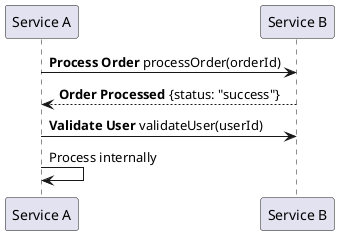

#### Message Label Standards
```plantuml
' Format 1: Bold with asterisks
A -> B: **Label Text** methodSignature()

' Format 2: HTML bold tags
A -> B: <b>Label Text</b> methodSignature()

' Format 3: Simple text (less preferred)
A -> B: methodCall()
```

### 3. Flow Control
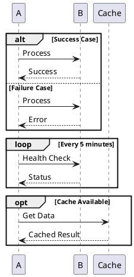

## Common Patterns

### 1. API Request Flow
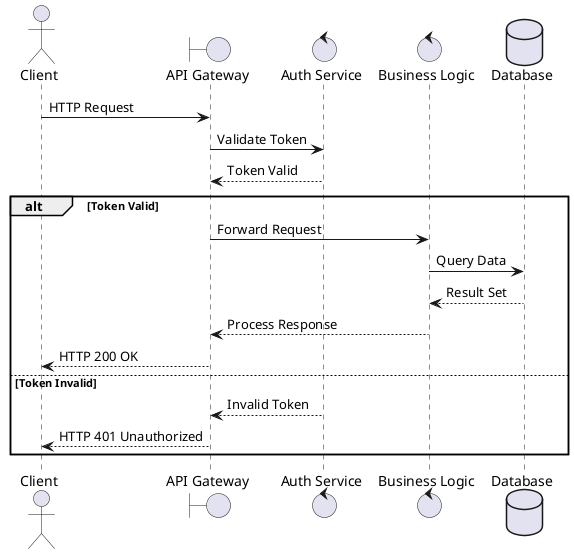

### 2. Event-Driven Flow
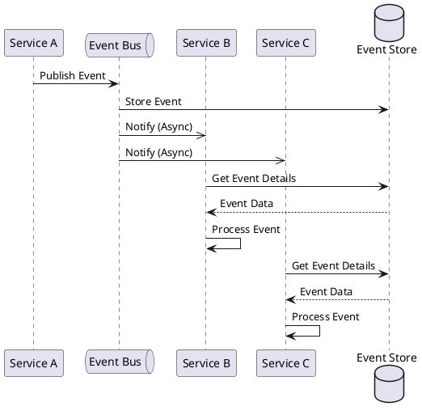

### 3. Microservices Communication
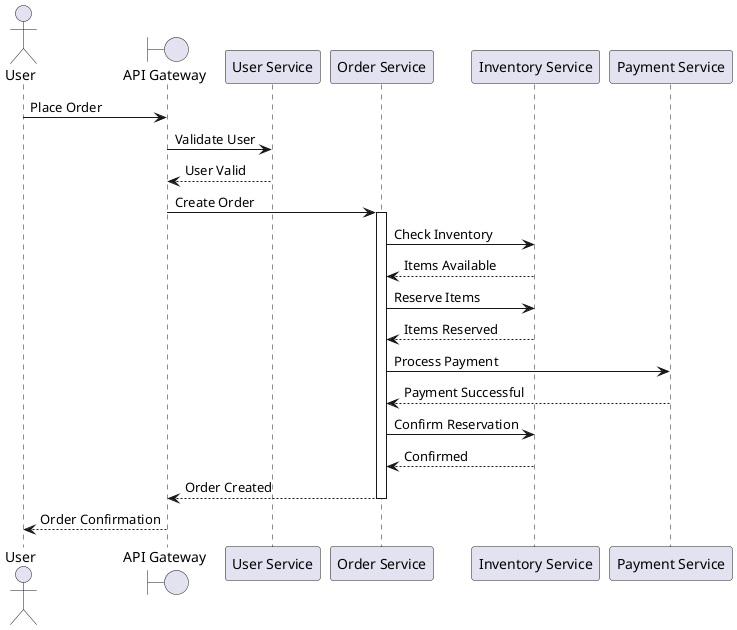

## Best Practices

### 1. Three-Column Comparison Table (Required in Solution Designs)

When presenting sequence diagrams in a solution design, ALWAYS use a 3-column markdown table to show Current State, Highlighted Target State, and Target State side by side. This provides immediate visual comparison of before/after and makes changes obvious.

**Table structure** (4 rows):

| Row | Purpose |
|-----|---------|
| 1 — Summary | Brief description of what each column represents |
| 2 — Diagram | Embedded SVG image (``) |
| 3 — Description | Detailed caption describing the flow shown |
| 4 — Source | PlantUML source file reference |

**Template**:

```markdown
| Current State | Target State — Changes Highlighted | Target State |
|:---:|:---:|:---:|
| [Brief current summary] | Same target-state with green highlighting on changed steps | [Brief target summary] |
|  |  |  |
| [Current flow description] | [What changed — reference green groups] | [Target flow description] |
| *Source: `diagrams/Service/[name].puml`* | *Ticket workspace only* | *Source: `diagrams/Service/[name].puml`* |
```

**Rules**:
- All three columns are center-aligned (`:---:`)
- The highlighted column is always the middle column
- The highlighted diagram exists only in the ticket workspace (not in the corporate repo)
- Current and target diagrams reference their corporate repo PlantUML source
- Keep descriptions concise — 1-2 sentences per cell

### 2. Diagram Organization (Linter Compliance)
- Declare ALL participants before first use
- One primary flow per diagram
- Include error handling paths
- Show security checkpoints
- Use proper stereotypes for participant types
- Maintain registered component names

### Linter Validation Rules

#### Strict Rules (Must Fix)
1. **Participant Declaration**: All participants in messages must be declared
2. **Valid Types**: Only approved participant types allowed
3. **Registered Names**: Component names must be in registry
4. **Stereotype Compliance**: Only approved stereotypes permitted

#### Guidance Rules (Should Fix)
1. **Minimum Participants**: At least 2 participants recommended
2. **Message Clarity**: Use labeled messages for better documentation
3. **Consistent Formatting**: Follow enterprise styling standards

### 2. Level of Detail
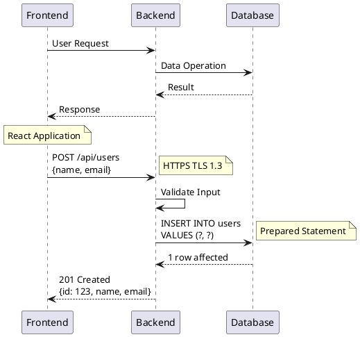

### 3. Error Handling
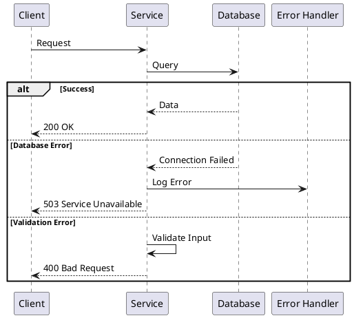

## Diagram Types by Use Case

### 1. Authentication Flow
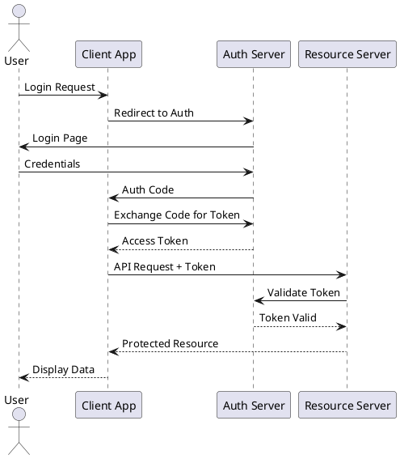

### 2. Transaction Processing
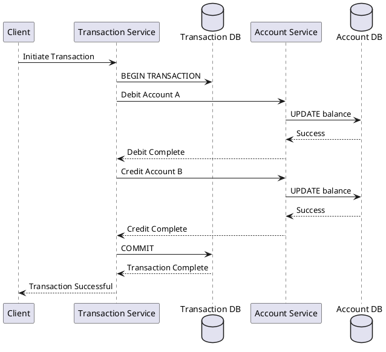

### 3. Async Processing
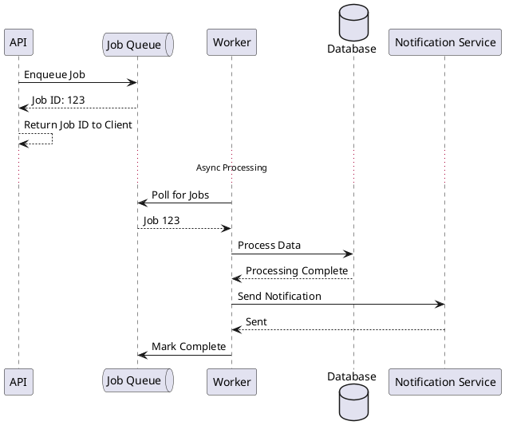

## Security Considerations in Diagrams

### Always Include:
1. Authentication steps
2. Authorization checks
3. Encryption indicators
4. Security boundaries
5. Token/credential handling

### Example with Security:
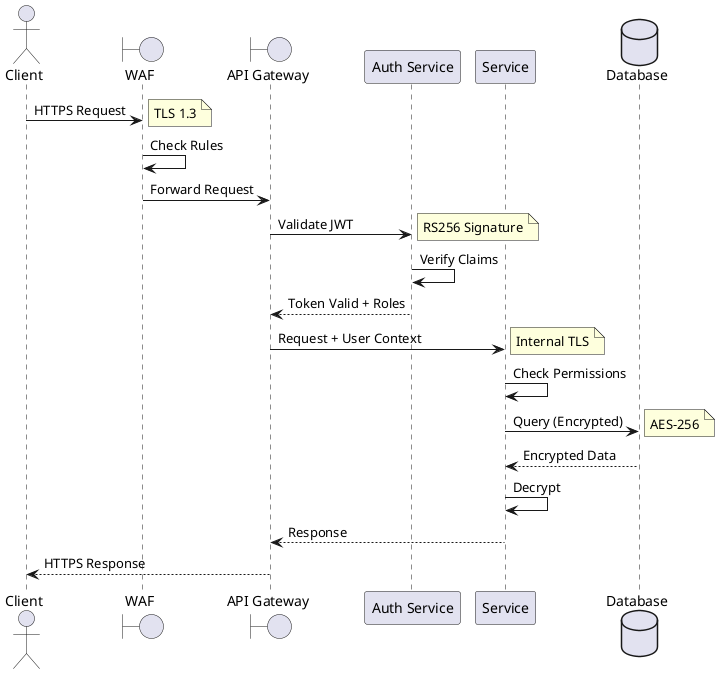

## Common Mistakes to Avoid

1. **Too Much Detail** - Keep diagrams focused
2. **Missing Error Paths** - Always show failure scenarios
3. **Unclear Timing** - Use activation bars for long operations
4. **No Return Messages** - Show both request and response
5. **Mixing Concerns** - Separate different flows

## Integration with Architecture Documentation

### Diagram Placement
```
docs/
└── architecture/
    ├── overview.md
    ├── sequence-diagrams/
    │   ├── authentication-flow.puml
    │   ├── order-processing.puml
    │   ├── payment-flow.puml
    │   └── README.md
    └── images/
        └── generated/  # PlantUML output
```

### Linking in Documents
```markdown
## Order Processing Flow

The order processing involves multiple services working together:


See [order-processing.puml](./sequence-diagrams/order-processing.puml) for source.
```

## Tools and Generation

### PlantUML Generation Commands
```bash
# Generate PNG
java -jar plantuml.jar sequence-diagram.puml

# Generate SVG (preferred for documentation)
java -jar plantuml.jar -tsvg sequence-diagram.puml

# Batch generation
java -jar plantuml.jar "sequence-diagrams/*.puml"
```

### VS Code Integration
- Install PlantUML extension
- Preview diagrams while editing
- Auto-generate on save
- Export to multiple formats

## Checklist for Sequence Diagrams

Before finalizing any sequence diagram:
- [ ] All participants declared with proper aliases
- [ ] Participant names are registered in configuration
- [ ] Stereotypes are from approved list
- [ ] No undeclared participants in messages
- [ ] Message types (sync/async) indicated
- [ ] Error paths included
- [ ] Security checkpoints shown
- [ ] Timing/activation bars used appropriately
- [ ] Notes explain complex logic
- [ ] Diagram has a clear title
- [ ] Source file uses .puml extension
- [ ] **Diagram passes PlantUML linter validation**
- [ ] Generated images in correct location
- [ ] Diagram referenced in documentation

## Running the PlantUML Linter

### Command Line Usage
```bash
# Basic linting
java -jar pumlint.jar rules.json relationships.csv lint-results.csv diagram.puml

# Lint entire directory
java -jar pumlint.jar rules.json relationships.csv lint-results.csv /path/to/diagrams/
```

### Integration with Development
1. Run linter before committing diagrams
2. Fix all "strict" violations
3. Address "guidance" violations when possible
4. Include linter reports in documentation

### Common Linter Violations and Fixes

#### Undeclared Participant
```plantuml
' ❌ VIOLATION: 'API' not declared
User -> API: Request

' ✅ FIX: Declare all participants
participant "User" as User
participant "API Gateway" as API
User -> API: Request
```

#### Invalid Stereotype
```plantuml
' ❌ VIOLATION: '<<Service>>' not in approved list
participant "OrderSvc" as OS <<Service>>

' ✅ FIX: Use approved stereotype
participant "OrderSvc" as OS <<App>>
```

#### Unregistered Name
```plantuml
' ❌ VIOLATION: 'CustomService' not in registry
participant "CustomService" as CS

' ✅ FIX: Use registered name or add to registry
participant "OrderService" as OS
```

---

Remember: Sequence diagrams are communication tools. They should clarify, not complicate. Keep them focused, accurate, and up-to-date with implementation.