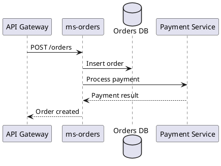
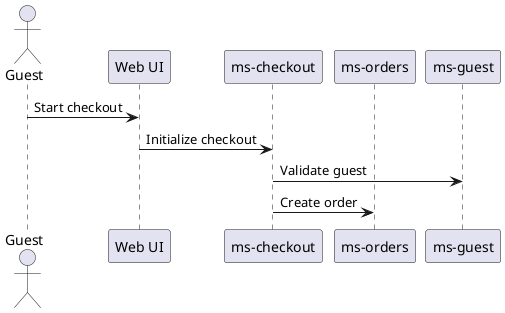

# PlantUML Diagram Locations for UDX Architecture

## Primary Location for UDX Architecture Diagrams

### Official Corporate Repository
**Base Location**: `external-repos/architecture/udx-architecture-artifacts/diagrams/`

All UDX corporate architecture diagrams are written in PlantUML (.puml) format and organized by type:

## Diagram Categories and Locations

### 1. Service Diagrams
**Location**: `external-repos/architecture/udx-architecture-artifacts/diagrams/Service/`

**Characteristics**:
- Begin with a call to a corporate microservice
- Show complete flow down to data stores and 3rd party calls
- Named by service: `[service-name].puml` (e.g., `ms-orders.puml`)
- Include all layers: API → Service → Database → External Systems

**Example Structure**:


### 2. Solution Diagrams
**Location**: `external-repos/architecture/udx-architecture-artifacts/diagrams/Solution/`

**Characteristics**:
- Begin with an actor (user) or UI component
- Show interactions between multiple microservices for specific solutions
- Named by solution: `[solution-name].puml` (e.g., `guest-checkout-flow.puml`)
- Focus on business flows across services

**Example Structure**:


### 3. Component Library
**Location**: `external-repos/architecture/udx-architecture-artifacts/diagrams/Components/`

**Characteristics**:
- Reusable PlantUML components
- Can be composed into larger diagrams
- Import using `!include` directive
- Includes common participants, styling, and patterns

**Example Component File**:
```plantuml
' Common participants for all diagrams
participant "API Gateway" as api_gateway
participant "Service Bus" as service_bus
database "Common DB" as common_db

' Common styling
skinparam backgroundColor #FAFAFA
skinparam participant {
    BackgroundColor #E0E0E0
    BorderColor #808080
}
```

## Usage Guidelines

### 1. Before Creating New Diagrams
- **Always check existing diagrams first** in the appropriate directory
- Look for similar flows or patterns you can reuse
- Check the Components library for reusable elements

### 2. Creating New Diagrams
- Place in the correct directory based on diagram type
- Follow naming conventions strictly
- Import common components using: `!include ../Components/common-participants.puml`
- Ensure compliance with PlantUML linter standards

### 3. Diagram Standards
- All diagrams must pass PlantUML linter validation
- Use registered participant names (from `rules.json`)
- Follow UDX styling guidelines
- Include proper error handling flows
- Document assumptions in diagram comments

### 4. Separation of Concerns in Diagrams
Sequence diagrams must show **behavioral flow only** — the interactions between participants and the messages they exchange. Operational concerns such as rate limiting, throttling, monitoring, alerting, and infrastructure configuration belong exclusively in the solution design document (e.g., in a Rate Limiting table or Security Considerations section), **not** in sequence diagram notes or comments. This keeps diagrams focused on what the system does, while the solution design captures how it is governed.

### 5. Diagram Version Suffix Convention (a / b / c)

Solution design diagrams use a **letter suffix** to indicate the diagram's role in the design lifecycle:

| Suffix | Role | Description |
|--------|------|-------------|
| **(a)** | **Developer-verified current state** | The baseline diagram representing how the system works today. Created and validated against the actual codebase during the analysis phase. This is the starting point for identifying what needs to change. |
| **(b)** | **Working target state (annotated)** | The proposed target state used during solution design review. Contains change annotations: green shading on modified sections, colored notes explaining what changed and why, legends, and other point-in-time review aids. This version is optimized for communicating changes to reviewers. |
| **(c)** | **Clean target state (new baseline)** | The final target state with **all** shading, legends, point-in-time annotations, and review aids removed. This is the diagram the next architect starts with — it becomes the new **(a)** baseline once the changes are implemented and verified. |

**Lifecycle flow**: `(a) current state` → `(b) annotated target` → `(c) clean target` → becomes the next ticket's `(a)`

**Rules**:
- The **(b)** version is the only version that should contain green shading, colored notes, legends, or any annotations that highlight differences from the **(a)** version.
- The **(c)** version must be visually indistinguishable from a baseline diagram — no change indicators, no "CHANGED FROM" notes, no shading.
- When a **(c)** version exists, the solution design document figures should reference the **(b)** version (annotated) for review, while the **(c)** version is archived as the clean forward-looking baseline.
- File naming follows the pattern: `NNx-description.puml` where `NN` is the diagram number and `x` is the suffix letter (e.g., `01a-...`, `01b-...`, `01c-...`).

### 6. Current-State and Target-State Diagram Changes

When a solution design modifies an existing sequence diagram (e.g., replacing a data source, changing a participant, altering a step), the target-state diagram must be a **near-copy** of the current-state diagram with only the changed lines modified.

**Rules**:
- Copy the entire current-state diagram verbatim as the starting point for the target-state
- Change only the lines that are actually different (e.g., data source, participant, API call)
- Do not abbreviate, collapse, or use `ref` blocks to hand-wave unchanged sections
- Do not rewrite the diagram from scratch — the two diagrams must be visually comparable
- The line count difference between current and target should be minimal (typically < 10% of the diagram)
- Use green-tinted notes (`#DAF7A6`) to annotate what changed in the target-state diagram

**Rationale**: Reviewers compare current and target side by side. If the target is structurally different, it is impossible to visually confirm that only the intended change was made.

### 7. Side-by-Side Embedding in Solution Designs

When a solution design includes both current-state and target-state sequence diagrams, embed them in a **markdown comparison table** with current state on the left and target state on the right.

**Template**:
```markdown
| Current State — [Label] | Target State — [Label] |
|---|---|
|  |  |
| `operationId: current_operation` | `operationId: target_operation` |
| Source: [puml-file.puml (L###)](relative/path) | Source: [puml-file.puml (L###)](relative/path) |
```

**Rules**:
- Always use a two-column table — left = current, right = target
- Include `operationId` row so reviewers can trace to Swagger
- Include source links with line numbers pointing to the PUML file
- A brief introductory sentence above the table should state what changed and confirm that downstream processing is identical

### 8. Integration with Solution Design
When creating solution designs:
1. Reference existing Service diagrams for detailed flows
2. Create new Solution diagrams for end-to-end business processes
3. Reuse components from the library for consistency
4. Link diagrams in your solution design document

## Directory Structure Example

```
external-repos/
└── architecture/
    └── udx-architecture-artifacts/
        └── diagrams/
            ├── Service/
            │   ├── ms-orders.puml
            │   ├── ms-guest.puml
            │   ├── ms-checkout.puml
            │   ├── ms-hotels.puml
            │   └── ms-presence.puml
            ├── Solution/
            │   ├── guest-checkout-flow.puml
            │   ├── hotel-booking-process.puml
            │   ├── mobile-app-login.puml
            │   └── park-entry-flow.puml
            └── Components/
                ├── common-participants.puml
                ├── error-handling.puml
                ├── security-patterns.puml
                └── styling.puml
```

## Best Practices

1. **Reusability**: Always check for existing diagrams and components
2. **Consistency**: Use the same participant names across all diagrams
3. **Completeness**: Show error flows and edge cases
4. **Clarity**: Add notes and comments for complex flows
5. **Maintenance**: Update diagrams when services change

## Integration with Roo

When working in Solution Architect mode:
- Roo knows to look in these locations for existing diagrams
- Roo will suggest reusing existing components
- Roo will follow PlantUML linter standards when creating new diagrams
- Roo will maintain consistency with existing architectural patterns

## Version Control

- All diagrams are version controlled in the udx-architecture-artifacts repository
- Changes should be reviewed by architecture team
- Maintain backward compatibility when updating shared components
- Document breaking changes in commit messages