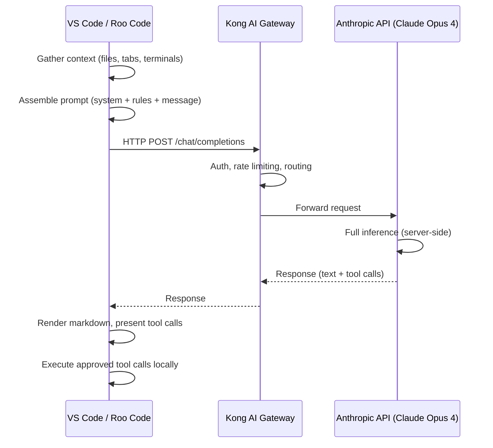

# Client-Side Thinking — Roo Code vs GitHub Copilot

<!-- UNPUBLISHED — incorporate into platform-landscape.md or a new evidence page -->

**Date**: 2026-04-08
**Prompt**: How does Claude do thinking on the client side? Does it do any thinking on the client side in the same way that GitHub Copilot does?
**Model**: `global.anthropic.claude-opus-4-6-v1` (Claude Opus 4)
**Context**: Roo Code in VS Code, calling Kong AI Gateway

---

## Model Identity Clarification

The model identifier shown in Roo Code config is `global.anthropic.claude-opus-4-6-v1` — that is Anthropic's versioning scheme, not "Claude Opus 4.6." The model is Claude Opus 4, running server-side on Anthropic's infrastructure.

## How Claude Processes — Entirely Server-Side

All inference happens server-side on Anthropic's infrastructure. When a prompt is submitted through Roo Code:

1. Roo Code assembles the full prompt (system instructions, conversation history, tool definitions, user message)
2. It sends that payload to the Kong AI Gateway
3. Kong proxies the request to Anthropic's API
4. Claude processes the entire prompt server-side and returns a response
5. Roo Code renders the response and handles any tool calls

There is no client-side inference, no local model execution, and no on-device neural network computation happening for Claude responses.

## Comparison with GitHub Copilot Client-Side Processing

GitHub Copilot performs certain operations client-side that Roo Code does not:

| Capability | GitHub Copilot | Roo Code + Claude |
|---|---|---|
| Local model inference | Yes — Copilot uses small, distilled models running locally for autocomplete | No — all inference is server-side |
| Client-side context gathering | Yes — indexes local files, builds embeddings, assembles context | Yes — Roo Code also gathers context (file listings, open tabs, terminal state) |
| Client-side ranking/filtering | Yes — filters and ranks autocomplete suggestions locally | No — Roo Code displays responses as-received |
| On-device embeddings | Yes — computes local embeddings for workspace indexing | No — Roo Code does not run local embedding models |

The key distinction: GitHub Copilot ships small neural network models (often distilled from larger models) that run directly in the VS Code process for low-latency autocomplete. These local models handle the inline code suggestions seen while typing. Larger requests (Copilot Chat, agent mode) still go server-side.

Roo Code, by contrast, is purely a **client orchestrator**. It:

- Gathers context from the workspace
- Constructs prompts according to mode-specific rules
- Sends everything to the remote API (Kong → Anthropic)
- Processes the response (rendering markdown, executing tool calls with user approval)

No neural network inference runs locally in the VS Code process when using Roo Code.

## Architecture

## Summary

Claude does zero client-side thinking. All computation happens on Anthropic's servers. Roo Code is a prompt orchestration and tool execution layer, not an inference engine. The only "client-side intelligence" in Roo Code is deterministic logic — assembling context, parsing responses, and managing tool call workflows. This is fundamentally different from Copilot's approach of running small ML models locally for inline completions.

## Incorporation Plan

This finding strengthens several existing arguments:

1. **platform-landscape.md** — Add a row or section on "Client-Side Intelligence" to the platform comparison. Copilot's local models for autocomplete and workspace indexing are a differentiator that no token-based client (Roo Code, Cline) can replicate because they don't ship local models.

2. **build-vs-leverage.md** — Reinforces the "platform bundles capabilities" argument. Copilot's local embedding and autocomplete models are included in the $39/seat — replicating this with Roo Code would require shipping and maintaining local models, which is not feasible for a client orchestrator.

3. **model-quality-at-budget.md** — Relevant to the "what you get for $39" framing. The local models for autocomplete and indexing are invisible infrastructure that would be expensive to replicate.

4. **dd-03-ai-provider.md** — The provider comparison should note that Copilot is the only option that includes client-side ML models (autocomplete inference + local embeddings), while Roo Code/Cline are pure orchestrators.
