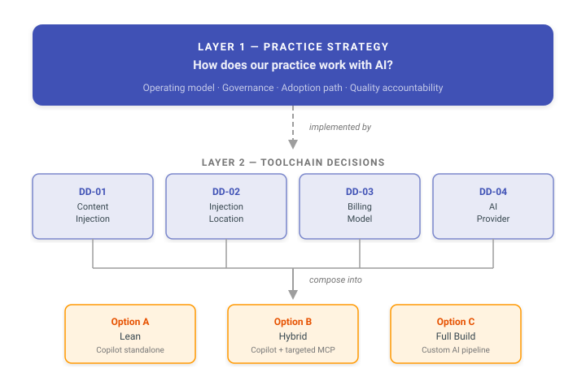

<!-- CONFLUENCE-PUBLISH -->
<!-- CONFLUENCE-URL: https://nbcu-ot.atlassian.net/wiki/spaces/UPA/pages/2606630902/Solution+Architecture+Practice+Comparative+Evaluation+of+Agentic+AI -->

# Solution Architecture Practice — Comparative Evaluation of Agentic AI

## Overview

This site evaluates three agentic AI toolchains for incorporation into our solution architecture practice. The goal: select the platform that adheres to our patterns, practices, and standards while remaining context-aware of our architecture and systems.

---

## Two-Layer Decision Hierarchy

This evaluation separates two questions that are often conflated:

1. **How should our practice work with AI?** — the operating model, governance, and adoption path (Layer 1)
2. **What technology implements that?** — the toolchain, billing model, and infrastructure (Layer 2)

<figure markdown="span">
  { width="100%" }
</figure>

### Layer 1: Practice Strategy — How Do We Work with AI?

The practice strategy defines the operating model for AI-augmented architecture: how architects interact with agents, where AI output enters governance, how we measure quality, and the adoption path from pilot to organization.

[Practice Strategy (PSD-01)](ai-evaluation/practice-strategy.md){ .md-button .md-button--primary }

| Aspect | What It Covers |
|--------|---------------|
| Interaction model | Architect directs, agent executes research and drafting autonomously |
| Governance | Human sign-off on all decisions; automated standards validation |
| Quality accountability | AI-generated artifacts are the architect's responsibility |
| Adoption roadmap | Phase 1 (pilot, 1 architect) → Phase 2 (team, 3-5) → Phase 3 (org, 10+) |
| Success metrics | Quality >90%, cost <$2/run, time-to-draft <45 min |

### Layer 2: Toolchain Decisions — What Do We Buy?

Four independent architectural decisions determine the technology substrate. Each can be evaluated on its own merits, then composed into platform options.

| Decision | Question | Status |
|----------|----------|--------|
| [DD-01: Content Injection](ai-evaluation/decisions/dd-01-content-injection.md) | Do we need custom MCP servers, or does native toolchain context management suffice? | Under Evaluation |
| [DD-02: Injection Location](ai-evaluation/decisions/dd-02-injection-location.md) | Should content injection happen on the developer workstation or on a server? | Under Evaluation |
| [DD-03: Billing Model](ai-evaluation/decisions/dd-03-billing-model.md) | Intent-based billing vs token-based billing — what economic model fits? | Under Evaluation |
| [DD-04: AI Provider](ai-evaluation/decisions/dd-04-ai-provider.md) | GitHub, Anthropic, Azure AI Foundry, or Kong/OpenRouter — who do we buy AI from? | Under Evaluation |

These decisions compose into two [Platform Options](ai-evaluation/platform-options.md) — GitHub Copilot (SaaS) and Roo Code + Kong AI + Custom RAG — each scored against 12 evaluation factors.

[Decision Framework](ai-evaluation/decisions/decision-framework.md){ .md-button .md-button--primary } [Platform Options](ai-evaluation/platform-options.md){ .md-button }

### How the Layers Relate

| Aspect | Layer 1 (Practice Strategy) | Layer 2 (Toolchain Decisions) |
|--------|---------------------------|-------------------------------|
| Question | How does our team work with AI? | What technology implements that? |
| Audience | Practice leads, architects, leadership | Platform engineers, procurement |
| Changes when | Team structure, new use cases | Vendor pricing, new tools emerge |
| Reversibility | Methodology changes take months | Swap tools in weeks |

---

## Start Here — By Role

| If you are a... | Start with | Then read |
|----------------|-----------|-----------|
| **Practice lead or director** | [Practice Strategy (PSD-01)](ai-evaluation/practice-strategy.md) — the operating model, governance, and adoption roadmap | [Key Findings](#key-findings) below for the cost and quality headline |
| **Solution architect** | [Key Findings](#key-findings) — cost, quality, and capability comparison | [Platform Options](ai-evaluation/platform-options.md) — the two composed platform choices |
| **Platform engineer** | [Decision Framework](ai-evaluation/decisions/decision-framework.md) — four decomposed toolchain decisions | Individual DDs ([DD-01](ai-evaluation/decisions/dd-01-content-injection.md), [DD-02](ai-evaluation/decisions/dd-02-injection-location.md), [DD-03](ai-evaluation/decisions/dd-03-billing-model.md), [DD-04](ai-evaluation/decisions/dd-04-ai-provider.md)) |
| **Skeptic or reviewer** | [Evaluation Framework](ai-evaluation/evaluation-framework.md) — methodology, controlled variables, scoring rubrics | [Comparisons](ai-evaluation/comparisons/copilot-vs-roocode.md) and [Research](ai-evaluation/research/copilot-billing.md) for raw evidence |

---

## Key Findings

| | GitHub Copilot Pro+ | Roo Code + OpenRouter | Claude Code |
|---|:---:|:---:|:---:|
| **Cost per run** | **$0.48** | ~$100 | Spike pending |
| **Monthly cost (38 runs)** | **$39** (fixed) | ~$507 (variable) | TBD |
| **Quality score** | **149/155 (96.1%)** | TBD (scoring pending) | TBD |
| **Per-run cost ratio** | **1x** | ~208x | TBD |
| **Infrastructure required** | None (SaaS) | Kong Gateway + vector DB | Terminal only |
| **Pricing model** | Fixed subscription | Pay-per-token | Pay-per-token |

!!! note "208x Cost Advantage"
    Using the same underlying AI model (Claude Opus 4.6), GitHub Copilot costs $0.48 per architecture run compared to ~$100 via OpenRouter. This difference is architectural, not promotional -- it stems from intent-based billing vs. token-based billing and server-side workspace indexing vs. client-side context accumulation.

---

## Evaluation Approach

Three toolchains were evaluated using controlled variables: the same model (Claude Opus 4.6), the same synthetic workspace (19 microservices, OpenAPI specs, Java source, mock tools), and the same scoring rubrics. Five representative architecture scenarios tested progressively complex tasks:

| Scenario | What It Tests |
|----------|---------------|
| SC-01: Ticket Triage | Parse a ticket, classify architectural relevance, scaffold workspace |
| SC-02: Solution Design | Produce arc42-compliant designs with impacts, decisions, and diagrams |
| SC-03: Investigation | Analyze specs, source code, and logs to identify root causes |
| SC-04: Architecture Update | Modify OpenAPI specs and PlantUML diagrams per approved design |
| SC-05: Publishing Prep | Validate cross-references, formatting, and standards compliance |

Both Copilot and Roo Code completed all 5 scenarios, producing 37 files each with comparable structure. The critical differences emerged in cost, quality, and architectural reliability.

### GitHub Copilot Pro+

VS Code-integrated AI assistant with agent mode, workspace indexing, and flat-rate subscription billing. Deep GitHub ecosystem integration. Intent-based billing charges per user prompt only — autonomous tool calls are free.

[GitHub Copilot Profile](ai-evaluation/tools/github-copilot.md){ .md-button }

### Roo Code + Kong AI Gateway

Open-source VS Code extension routing through Kong API Gateway to OpenRouter/AWS Bedrock. Pay-per-token billing with full cost transparency but exponential context accumulation costs. Three architectural limitations identified during evaluation.

[Roo Code + Kong Profile](ai-evaluation/tools/roo-code-kong.md){ .md-button }

### Claude Code (Spike Pending)

Anthropic's official CLI-based coding agent. Terminal-native with direct Anthropic API access. Evaluated as a potential complement or alternative based on the Everything Claude Code (ECC) community harness. A limited 1-2 scenario spike is planned to gather real cost and quality data.

[Claude Code Profile](ai-evaluation/tools/claude-code.md){ .md-button }

---

## Site Map

| Section | What You Will Find |
|---------|-------------------|
| [Practice Strategy](ai-evaluation/practice-strategy.md) | Layer 1: Operating model for AI-augmented architecture practice |
| [Decision Framework](ai-evaluation/decisions/decision-framework.md) | Layer 2: Four decomposed toolchain decisions |
| [Platform Options](ai-evaluation/platform-options.md) | Composed side-by-side comparison of Copilot vs Roo Code + Kong AI + Custom RAG |
| [Evaluation Framework](ai-evaluation/evaluation-framework.md) | Methodology, scoring rubrics, scenario definitions |
| [Tools](ai-evaluation/tools/github-copilot.md) | Per-tool profiles with architecture, pricing, strengths, and limitations |
| [Comparisons](ai-evaluation/comparisons/copilot-vs-roocode.md) | Head-to-head results with evidence from actual runs |
| [Research](ai-evaluation/research/copilot-billing.md) | Deep research findings on billing mechanics, gateway failures, context management |
| [Decision Log](ai-evaluation/decision-log.md) | ADR-001: the original architecture decision record |

---

## Data Isolation Statement

This evaluation contains **zero corporate data**. The entire NovaTrek Adventures domain is fictional. All JIRA, Elasticsearch, and GitLab integrations are local mock Python scripts reading JSON files from disk -- no network calls, no credentials, no corporate system access.
